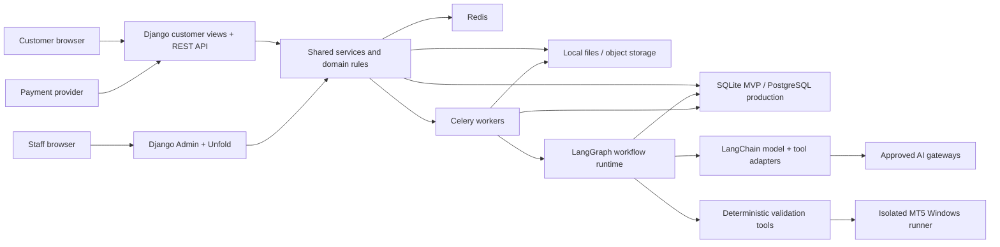

# AAA EAs Builder — Product and Technical Plan

## 1. Product vision

AAA EAs Builder will be a SaaS platform where traders can:

- Generate MetaTrader 5 Expert Advisors (MQL5), indicators, and TradingView Pine Script strategies/indicators with AI.
- Start from a free-text prompt, a guided form, or a reusable prompt template.
- Review, edit, version, validate, and download generated source code.
- Browse and purchase pre-made EAs and indicators from a marketplace.
- Inspect credible product evidence before buying, including backtest settings, win rate, profit factor, drawdown, trade count, monthly returns, and an equity curve.
- Access purchased products and licenses from a personal dashboard.

The initial goal is a focused, trustworthy MVP—not a complete trading platform. The product must clearly state that generated code and backtests are not financial advice and do not guarantee future performance.

## 2. MVP scope

### Included in the first release

1. User registration, login, email verification, password reset, profile, and basic account settings.
2. AI code generation for:
   - MT5 Expert Advisors.
   - MT5 custom indicators.
   - Pine Script strategies.
   - Pine Script indicators.
3. Three ways to begin a generation:
   - Free-text prompt.
   - Guided strategy builder.
   - Pre-made prompt template.
4. Project workspace with generated code, generation history, versions, explanations, and downloads.
5. AI-assisted revision, such as “add a trailing stop” or “make risk percentage configurable.”
6. Basic automated checks and a validation report for generated code.
7. Admin-managed marketplace of pre-made EAs and indicators.
8. Product pages with descriptions, supported symbols/timeframes, settings, version history, test evidence, metrics, and equity chart.
9. Checkout, order history, purchased-product downloads, and simple license records.
10. Staff-only Django Admin, styled and extended with Unfold, for users, templates, products, product versions, orders, uploaded reports, moderation, and generation usage.
11. Admin-managed AI gateways, model definitions, prompt versions, agent roles, tool permissions, and published multi-agent workflows.
12. Docker-based and normal local-development workflows.

### Deferred until after the MVP

- Public third-party seller onboarding and payouts.
- Social/community features, reviews, affiliate programs, and copy trading.
- Full browser-based IDE or visual no-code strategy designer.
- Multi-terminal live trading or access to users’ brokerage accounts.
- Guaranteed server-side Pine Script compilation/backtesting; TradingView integration constraints must be evaluated separately.
- Large-scale optimization farms and tick-data management.
- Mobile apps.

## 3. Primary users and roles

### Trader

- Generates and revises code.
- Saves projects and downloads code.
- Uses guided or pre-made prompts.
- Purchases products and views licenses/downloads.

### Marketplace seller (future phase)

- Creates product listings and submits releases and test evidence.
- Views sales and payout information.
- Cannot publish without review.

### Administrator/reviewer

- Uses the Unfold-powered Django Admin to manage users, prompts, generation limits, products, prices, orders, and licenses.
- Configures approved AI gateways, encrypted credentials, models, agent roles, workflow versions, budgets, and fallback policies.
- Reviews product code, uploaded reports, and performance claims.
- Publishes, rejects, pauses, or retires marketplace products and versions.

## 4. Key user journeys

### Generate a custom bot or indicator

1. User selects MT5 EA, MT5 indicator, Pine strategy, or Pine indicator.
2. User enters a prompt, selects a template, or completes the guided builder.
3. The application converts the request into a structured strategy specification.
4. The user reviews important assumptions: entry, exit, risk, symbol, timeframe, sessions, position limits, and platform version.
5. A background job generates code and an explanation.
6. Validation runs and returns errors, warnings, assumptions, and a risk checklist.
7. If validation fails, a limited automatic repair loop is attempted.
8. The user can request revisions, compare versions, and download the source file.

### Buy a pre-made product

1. User searches or filters the marketplace.
2. User opens a listing and reviews its description, settings, test methodology, verified metrics, limitations, releases, and equity curve.
3. User purchases the product.
4. A completed payment creates an order, entitlement, and license record.
5. User downloads the entitled version from the dashboard.

### Publish a marketplace product

For the MVP, only an administrator performs this workflow. Seller self-service is added later.

1. Create the product and product version.
2. Upload source/compiled files and documentation.
3. Upload a supported backtest report and its metadata.
4. Parse metrics and equity points, then flag inconsistencies.
5. Review and approve the claims.
6. Publish the immutable release and listing.

## 5. Guided strategy specification

Before asking an LLM to write code, normalize the user’s intent into a versioned JSON strategy specification. This reduces ambiguity and makes regeneration and testing repeatable.

Suggested fields:

- Target platform and language version.
- Artifact type: EA, strategy, or indicator.
- Symbols, timeframe, and price source.
- Long and short entry rules.
- Exit, stop-loss, take-profit, trailing-stop, and break-even rules.
- Risk model: fixed lot, account percentage, or other sizing rule.
- Maximum open positions and pyramiding rules.
- Trading sessions, weekdays, spread filter, slippage, and news filter.
- Indicator parameters and user-configurable inputs.
- Alert, comment, and chart-display requirements.
- Backtest assumptions.
- Explicit exclusions and unresolved assumptions.

The structured specification should be saved separately from the raw prompt and sent back to the user for confirmation when an assumption could materially change trading behavior.

## 6. AI generation design

### LangChain and LangGraph

Use LangChain for model integrations, messages, structured output, tool definitions, and a consistent invocation layer across approved providers. Use LangGraph for the explicit multi-agent workflow: nodes, shared typed state, conditional routing, bounded repair loops, checkpointing, and human approval steps.

Celery and LangGraph have different responsibilities:

- Celery queues a generation, resumes it after an external event, applies operational retries, and runs heavy work outside the web request.
- LangGraph controls the steps inside one generation workflow and records which agent or deterministic node acts next.
- A durable checkpointer stores graph state so a worker restart or human-review pause does not require starting the entire generation again.
- Each graph run receives its own thread/run identifier. User projects do not share agent memory unless an explicit, privacy-reviewed feature is added later.

Do not make every step an autonomous agent. Parsing, permission checks, schema validation, compilation, metric calculations, and file operations should be deterministic code. Use an LLM agent only where language reasoning or code generation adds value.

### Admin-managed model gateways

Create provider adapters behind LangChain and manage their allowed configuration through Unfold. Initial gateway types can include OpenAI, Anthropic, Google, and explicitly supported OpenAI-compatible endpoints. A generic gateway must still use a reviewed adapter; administrators cannot upload arbitrary provider code.

Each `AI gateway` configuration should include:

- Internal name, slug/key, provider type, enabled state, environment, and priority.
- API base URL when the provider supports it, API version, organization/project/region fields where relevant, and connection timeout.
- Encrypted credential reference for API keys or tokens.
- Provider-specific settings in validated JSON, based on a server-defined schema and allowlist.
- Optional safe custom headers stored as encrypted secret values; block dangerous or reserved headers.
- Rate and concurrency limits, daily/monthly spending limits, health status, last connection test, and staff notes.

Each `AI model` configuration should include:

- Display name and stable internal key.
- Gateway and exact provider model identifier.
- Capability flags: text, structured output, tool calling, image input, streaming, and other features actually verified by the application.
- Allowed/default generation settings such as temperature, maximum output tokens, timeout, retries, and provider-specific reasoning options.
- Input/output cost metadata, context/output limits when known, active state, and deprecation/replacement notes.
- Fallback model and routing priority, with compatibility checks so a fallback supports the workflow’s required capabilities.

Provider-specific options must be validated by the selected adapter. The admin UI may render dynamic fields from the adapter’s schema, but it must not send an uncontrolled JSON object directly to an external API.

### Secret handling

- API keys entered in the admin are write-only: show a short fingerprint or “configured” state after saving, never the full value.
- Encrypt credentials before database storage with an application encryption key supplied through the environment or production secret manager. The master encryption key must never be stored in the same database.
- Restrict secret creation, replacement, connection tests, and gateway activation to a small dedicated Django permission group.
- Exclude credentials from Django Admin history, error messages, Celery arguments, task results, traces, routine admin exports, fixtures, and logs.
- Audit who created, replaced, tested, enabled, or disabled a credential without recording the credential itself.
- Support credential rotation and key re-encryption. Prefer secret-manager references over database-stored ciphertext in a mature production deployment.
- Back up the master key securely and separately from encrypted database backups; losing the key makes stored credentials unrecoverable.
- Provide an admin “test connection” action that runs a minimal low-cost request through a worker and returns a sanitized result.

### Admin-managed agents and workflows

An `Agent definition` should contain:

- Name, stable key, purpose/role, enabled state, and version.
- Published system-prompt version and optional platform instructions.
- Primary model, compatible fallback model, and required capabilities.
- Allowlisted tools only.
- Typed input/output schema.
- Maximum iterations, token budget, monetary budget, timeout, retry policy, and maximum tool calls.
- Whether the agent may run in parallel and whether its output requires human approval.

An `Agent workflow` should contain a draft/published version, supported artifact types, approved node types, nodes, edges, routing conditions, entry/exit nodes, global budgets, repair-loop limit, and failure policy. Initial Unfold screens can use inlines and validated forms; a visual graph editor is optional later.

Workflow publication must:

1. Validate that every model and tool exists and is enabled.
2. Reject missing entry/exit nodes, unreachable nodes, unrestricted cycles, incompatible schemas, and invalid fallbacks.
3. Calculate worst-case iteration/tool-call limits and require explicit budgets.
4. Save an immutable published snapshot.
5. Run a small evaluation suite before the workflow becomes selectable.

Active generations pin their gateway/model, prompts, agent definitions, tools, workflow version, and relevant parameters. Changing an admin setting affects new runs only and never changes the provenance of an existing code version.

### Initial multi-agent workflow

Use a controlled graph rather than an open-ended “agent swarm”:

1. `Request analyst` — extracts requirements and unresolved assumptions into the strategy specification.
2. `Strategy architect` — converts confirmed requirements into platform-neutral trading logic and test cases.
3. `Platform code generator` — produces MQL5 or Pine source using the relevant coding prompt and approved reference context.
4. `Code reviewer` — checks correctness, platform conventions, parameter handling, edge cases, and maintainability.
5. `Risk reviewer` — independently checks position sizing, stop behavior, unsafe features, and misleading assumptions; it cannot approve performance claims.
6. `Static validator/compiler` — deterministic tools perform schema checks and, when available, isolated compilation.
7. `Repair agent` — receives structured diagnostics and may revise the code within a small fixed loop.
8. `Finalizer` — packages code, explanation, assumptions, test checklist, warnings, and provenance.

The reviewer and risk reviewer may run in parallel after code generation. Compilation and safety gates must pass according to the configured release policy before an artifact can be labeled compiled or validated.

### Generation output contract

Every successful workflow should return typed output containing:

- Source code, file name, language, and platform version.
- Explanation and mapping back to the confirmed strategy specification.
- Assumptions, unresolved questions, and risk warnings.
- Suggested test cases and safe testing instructions.
- Validation/compilation diagnostics.
- Gateway, model, workflow, agent, prompt, tool, token, latency, and estimated-cost provenance.

### Generation pipeline

1. Moderate and size-limit user input.
2. Select the active published workflow for the requested artifact type.
3. Pin its complete configuration and create a workflow run/checkpoint.
4. Build and validate the strategy specification; pause for user confirmation when needed.
5. Execute the approved LangGraph nodes through a Celery worker.
6. Generate typed code output and run deterministic safety checks.
7. Compile when a compatible isolated compiler worker is available.
8. Attempt only the workflow’s bounded compiler-guided repair loop.
9. Run final review gates and save all artifacts, steps, diagnostics, costs, and provenance as an immutable version.

### Validation levels

- Level 1: schema, size, forbidden patterns, required functions, and basic source inspection.
- Level 2: syntax/lint checks where tooling exists.
- Level 3: real MQL5 compilation on a controlled Windows worker with MetaEditor installed.
- Level 4: controlled backtest with declared data, terminal build, symbol, timeframe, spread, dates, and settings.

Pine Script can initially receive structural checks and a user-facing TradingView test checklist. Automatic compilation/backtesting must not be promised until a stable, permitted integration is confirmed.

### Safety boundaries

- Never execute generated code directly inside the API process or Celery worker host without isolation.
- Use dedicated workers/containers or a controlled Windows VM for MetaTrader compilation and testing.
- Deny or flag file access, shell execution, DLL imports, arbitrary network calls, credential handling, and other unsafe capabilities unless intentionally reviewed.
- Clearly label output as generated, validated, compiled, or backtested; these states must not be conflated.
- Keep prompt and code versions for reproducibility and dispute investigation.

## 7. Marketplace and performance evidence

### Product types

- MT5 EA.
- MT5 indicator.
- Pine Script strategy.
- Pine Script indicator.
- Prompt/template pack (later).

### Listing information

- Name, slug, summary, detailed description, category, tags, screenshots, price, currency, status, and risk notice.
- Platform/build requirements, supported instruments/timeframes, installation guide, parameters, known limitations, and changelog.
- Current release plus previous entitled releases.
- License type, activation/download rules, support policy, and refund policy.

### Test evidence

Every displayed result must be tied to a specific product version and immutable test run. Store:

- Test type: backtest, forward test, or live verified result.
- Source and verification status.
- Terminal/platform build, broker/data source, symbol, timeframe, date range, modeling/tick mode, spread/commission/slippage, deposit, leverage, currency, and parameter set.
- Net profit, return percentage, gross profit/loss, profit factor, win rate, total trades, maximum balance/equity drawdown, recovery factor, expected payoff, Sharpe-like metric when valid, average win/loss, largest win/loss, and consecutive wins/losses.
- Time-series equity/balance points for charting.
- Original uploaded report, checksum, parser version, review status, and reviewer notes.

The UI must distinguish seller-reported, platform-parsed, platform-compiled, platform-backtested, and independently verified evidence. Never show a metric without its period, test assumptions, and verification label.

## 8. Proposed technology stack

### Backend

- Python 3.12 or a currently supported project-pinned version.
- Django as the main web framework.
- Django ORM and Django migrations for database access and schema changes.
- Django authentication, sessions, permissions, forms, and security middleware.
- Django Admin with the Unfold package for the internal staff interface.
- Django REST Framework for versioned JSON endpoints, payment webhooks, and asynchronous job-status APIs.
- LangChain for approved model/provider integrations, typed outputs, and tool interfaces.
- LangGraph for explicit, stateful multi-agent workflows, bounded loops, checkpointing, and approval pauses.
- `uv` for Python version/dependency management, lockfile, virtual environment, and command execution.
- Environment-backed Django settings split into base, development, test, and production configurations.
- Celery for long-running or retryable work.
- Redis as Celery broker/result backend and later for rate limiting/cache.
- SQLite 3 for local development and the early single-server MVP.
- PostgreSQL for production.

### Why Django and Unfold fit this product

- The product is data- and workflow-heavy: users, projects, prompts, products, versions, reports, orders, entitlements, licenses, and moderation all map naturally to Django models and admin screens.
- Django provides authentication, permissions, CSRF protection, forms, uploads, migrations, and an ORM in one integrated framework.
- Unfold gives staff a polished starting interface and can add dashboards, filters, tabs, actions, and custom admin pages without building a separate internal application first.
- Django Admin will remain private and staff-only. It is not the customer dashboard and must not be exposed as the marketplace UI.
- Complex business rules will live in service modules and model/domain methods rather than in admin classes, allowing the web UI, API, Celery tasks, and admin actions to reuse the same logic.

### Frontend

Recommended MVP approach:

- Django templates and forms.
- HTMX for partial page updates.
- Alpine.js for small client-side interactions.
- Tailwind CSS as the standard styling system, compiled into versioned static assets; do not use the Tailwind CDN in production.
- A small project-owned Tailwind component layer for buttons, inputs, cards, tables, badges, dialogs, charts, and admin-adjacent operational views.
- Monaco Editor only on the code workspace page if its size is justified.
- Chart.js or Apache ECharts for equity and drawdown charts.

This keeps one deployable application and reduces initial complexity. A separate React/Next.js frontend can be introduced later if the editor or dashboard becomes highly interactive; the backend should still expose versioned JSON APIs.

### UI design direction: cyberpunk trading terminal

The customer interface should feel futuristic, premium, and energetic without becoming noisy or difficult to use. The design direction combines a professional trading terminal with restrained cyberpunk details.

Core visual principles:

- Dark-first interface with deep navy/near-black backgrounds rather than pure black.
- Electric cyan as the main action/accent color, violet as the secondary AI color, and controlled green/red/amber for trading and system status.
- Fine grid lines, subtle glows, glass-like panels, chart trails, and occasional angular clipped corners; avoid heavy scan-line effects behind text.
- Large, confident headlines and compact data typography with generous spacing.
- Clear hierarchy and readable financial data take priority over decoration.
- Use glow and motion to communicate active AI or market state, not on every component.

Initial design tokens:

| Token | Suggested value | Purpose |
|---|---|---|
| `bg-void` | `#05070D` | Main page background. |
| `bg-panel` | `#0A1020` | Cards, sidebars, and editor panels. |
| `bg-elevated` | `#101A2E` | Hovered or elevated surfaces. |
| `border-grid` | `#1E3355` | Dividers and panel borders. |
| `neon-cyan` | `#00E5FF` | Primary actions, focus, and active states. |
| `neon-violet` | `#A855F7` | AI agents, model state, and secondary highlights. |
| `signal-green` | `#22C55E` | Profit, passed checks, and healthy state. |
| `signal-red` | `#FF3B6B` | Loss, failed checks, and destructive actions. |
| `signal-amber` | `#F59E0B` | Warnings, pending review, and unverified data. |
| `text-primary` | `#EAF4FF` | Main readable text. |
| `text-muted` | `#7F93AC` | Supporting labels and metadata. |

Typography:

- Use a modern geometric sans-serif such as Space Grotesk for display headings.
- Use Inter or a similar highly readable sans-serif for controls and body content.
- Use JetBrains Mono or a similar monospace font for MQL5/Pine code, metrics, IDs, timestamps, and logs.
- Host production fonts locally where licensing allows, with robust system fallbacks.

Tailwind implementation:

- Define colors, fonts, shadows, radii, spacing, and animation values as CSS variables mapped into Tailwind utilities.
- Create reusable Django template components/partials instead of repeating long utility strings.
- Support `default`, `hover`, `focus-visible`, `active`, `disabled`, `loading`, `success`, `warning`, and `error` states for interactive components.
- Keep glow, backdrop blur, and animation inexpensive; honor `prefers-reduced-motion`.
- Maintain a light semantic layer for status colors so profit/loss and success/error are not communicated by color alone.
- Meet WCAG AA contrast for body text, form controls, tables, and chart labels.

### Primary customer screen concepts

#### Landing page

- Compact top navigation with product, marketplace, results, pricing, sign-in, and a strong `Build an EA` action.
- Hero message focused on turning trading rules into tested MQL5 or Pine code.
- Interactive-looking prompt composer paired with a live strategy/equity visualization.
- Trust strip that distinguishes generated, compiled, backtested, and verified artifacts.
- Three-step “Describe → Build → Validate” workflow.
- Featured marketplace products with verification badges and compact performance cards.
- Final CTA and risk disclosure without exaggerated profit promises.

#### AI builder workspace

- Slim project navigation on the left.
- Main center workspace that can switch between guided strategy specification, prompt conversation, and Monaco code editor.
- Right-side agent run panel showing analyst, architect, generator, reviewers, compiler, and repair status.
- Top context bar for artifact type, workflow, model route, version, budget, and save/run state.
- Bottom or tabbed validation console for compiler errors, warnings, changes, and test checklist.
- Prominent but safe actions: generate, revise, compare versions, validate, and download.

#### Marketplace and product analytics

- Search/filter bar for platform, artifact type, symbol, timeframe, strategy category, price, and verification level.
- Product cards with restrained artwork, price, supported platform, latest release, verification badge, and clearly scoped metrics.
- Product detail hero with purchase action, compatibility, version, test period, and risk labels.
- Large equity curve, drawdown panel, metric grid, test assumptions, verification provenance, settings, changelog, and installation guide.
- Never present win rate or profit factor without trade count, drawdown, date range, and evidence status nearby.

### Responsive and interaction behavior

- Design desktop-first for the builder and analytics workspace, then provide a functional tablet/mobile layout for monitoring, browsing, purchasing, and simple prompt revisions.
- Collapse the left navigation into a drawer and the agent run panel into a bottom sheet on narrow screens.
- Tables become stacked metric cards where horizontal scrolling would hide critical context.
- Use short 150–250 ms transitions, animated chart drawing, subtle live-status pulses, skeleton loading, and clear Celery/LangGraph progress updates.
- Avoid fake market motion, flashing profit numbers, autoplay sound, or animations that imply guaranteed performance.

### Design artifacts

- Store approved visual mockups under `docs/design/mockups/`.
- Initial approved direction: `landing-page-v1.png`, `builder-workspace-v1.png`, and `marketplace-product-v1.png`.
- Use `docs/design/MOCKUPS.md` as the visual index and implementation handoff.
- Maintain `docs/design/DESIGN_SYSTEM.md` when implementation begins, including tokens, component states, layout grids, icon rules, chart colors, accessibility rules, and examples.
- Treat generated bitmap mockups as visual direction, not pixel-perfect implementation specifications. Final UI components must be recreated responsively with Django templates, Tailwind CSS, HTMX, and Alpine.js.

### Files and payments

- Local private storage directory in development.
- S3-compatible private object storage in production.
- Signed, short-lived download links in production.
- Payment provider behind a service interface; Stripe is a likely first implementation, subject to supported countries and business requirements.
- Transactional email provider behind an adapter.

## 9. High-level architecture



Use Celery only for work that is slow, retryable, scheduled, or independent of the request/response cycle:

- LangGraph generation workflows, approval resumes, and bounded repair runs.
- AI gateway connection tests, health checks, and usage reconciliation.
- Compilation and backtesting.
- Backtest report parsing.
- Chart/equity-series preparation.
- Product artifact packaging and malware scanning.
- Payment follow-up/reconciliation.
- Email delivery and cleanup jobs.

Normal CRUD pages and quick validations should remain synchronous.

## 10. Suggested repository layout

```text
aaa-eas-builder/
├── config/
│   ├── settings/            # Base, development, test, production
│   ├── urls.py
│   ├── asgi.py
│   ├── wsgi.py
│   └── celery.py
├── apps/
│   ├── accounts/            # Custom user, auth, profile, permissions
│   ├── builder/             # Projects, prompts, specs, code versions
│   ├── ai_config/           # Gateways, models, agents, workflows, runs
│   ├── marketplace/         # Catalog, releases, entitlements, licenses
│   ├── analytics/           # Reports, metrics, equity series
│   ├── billing/             # Orders, payments, subscriptions, usage
│   └── core/                # Shared services, storage, audit, utilities
│       # Each app owns models, migrations, admin, services, tasks, and tests.
├── api/                     # DRF v1 URLs, serializers, and shared API code
├── ai_runtime/              # LangChain adapters and LangGraph state/nodes
├── validators/              # MQL5/Pine checks and compiler adapters
├── templates/               # Customer-facing Django templates
├── assets/
│   └── css/app.css          # Tailwind entry point and design tokens
├── static/                  # Source CSS, JS, images
├── staticfiles/             # Ignored collected production assets
├── locale/                  # Future translations
├── tests/
│   ├── unit/
│   ├── integration/
│   └── fixtures/
├── storage/                 # Ignored local development artifacts
├── scripts/                 # Setup, seed, maintenance, worker helpers
├── docs/
├── .env.example
├── .gitignore
├── docker-compose.yml
├── Dockerfile
├── Makefile
├── dev.bat
├── manage.py
├── package.json             # Tailwind build and watch commands
├── package-lock.json        # Pinned frontend build dependencies
├── pyproject.toml
├── uv.lock
└── README.md
```

## 11. Initial data model

Use a custom Django user model from the first migration. Use UUIDs for externally visible identifiers and UTC timestamps throughout. Prefer portable Django model fields so SQLite and PostgreSQL behave consistently.

### Identity and access

- `users`: account, email, password hash/auth provider, status, role, locale, and timestamps.
- `email_verification_tokens` and `password_reset_tokens`.
- `sessions` or refresh-token records if token-based auth is used.
- `audit_events`: actor, action, target, request ID, timestamp, and safe metadata.

### AI projects

- `projects`: owner, name, target type/platform, status, and current version.
- `strategy_specs`: versioned structured strategy JSON plus schema version.
- `generations`: project, raw prompt, pinned workflow version, status, aggregate token/cost data, and timestamps.
- `code_versions`: generation/project, language, source-file reference, source hash, explanation, and parent version.
- `validation_runs`: code version, validation level, status, diagnostics, tool/compiler version, and log reference.
- `prompt_templates`: type, title, public/admin state, version, form schema, and prompt body.

### AI configuration and runtime

- `ai_gateways`: internal key, provider adapter type, base URL, non-secret connection settings, limits, status, and encrypted credential reference.
- `ai_credentials`: encrypted secret payload, key version, fingerprint, rotation timestamps, state, and audit metadata; never expose the ciphertext in normal admin forms.
- `ai_models`: gateway, internal key, provider model ID, capabilities, validated defaults/limits, price metadata, fallback, and state.
- `prompt_versions`: immutable system/developer prompt content, purpose, target platform, review state, checksum, and publish metadata.
- `tool_definitions`: code-registered tool key, capability/risk class, input/output schema, approval requirement, and enabled state.
- `agent_definitions` and `agent_versions`: role, prompt version, model policy, tool allowlist, schemas, iteration/token/cost/time limits, and publish state.
- `workflow_definitions` and `workflow_versions`: supported artifact types, versioned graph, global budgets, repair limits, failure policy, checksum, and publication metadata.
- `workflow_nodes` and `workflow_edges`: approved node type, agent/tool reference, ordering/routing conditions, parallel group, and validated schemas.
- `agent_runs`: generation, pinned workflow version, graph thread/checkpoint ID, state, aggregate usage, start/end timestamps, and failure category.
- `agent_steps`: run, node/agent version, attempt, sanitized input/output references, model used, tokens, cost, latency, tool calls, status, and diagnostics.
- `llm_calls`: step, gateway/model snapshot, request ID, usage/cost/latency, retry/fallback reason, and status; prompt content should follow the retention/redaction policy.

All published configuration is immutable. Editing a published prompt, agent, or workflow creates a new version. Runtime rows reference the exact versions and model snapshots used.

### Marketplace

- `products`: owner/admin, type, slug, description, status, and current release.
- `product_versions`: product, semantic version, files, hashes, changelog, requirements, and publish timestamp.
- `product_prices`: product, currency, amount, active dates, and provider price ID.
- `test_runs`: product version, test metadata, source, verification status, metrics, and original-report reference.
- `equity_points`: test run, timestamp/trade index, balance, equity, and drawdown.
- `orders` and `order_items`: buyer, totals, currency, provider IDs, and state.
- `payments`: provider event/payment IDs, amount, state, and raw-event reference.
- `entitlements`: user, product/version rules, order item, start/end, and state.
- `licenses`: entitlement, license key/hash, activation/download policy, and state.
- `download_events`: entitlement, version, user, timestamp, IP hash, and result.

### Usage and billing

- `plans`: limits and feature flags.
- `subscriptions` (when subscriptions are introduced).
- `usage_ledger`: user, event type, quantity, model, estimated cost, and idempotency key.

## 12. API and page outline

### Public pages

- `/` — value proposition and examples.
- `/marketplace` — browse, search, sort, and filter.
- `/marketplace/{slug}` — listing, results, releases, and purchase action.
- `/pricing`, `/docs`, `/risk-disclosure`, `/terms`, and `/privacy`.

### Authenticated pages

- `/dashboard`.
- `/builder/new` and `/projects/{id}`.
- `/projects/{id}/versions/{version}`.
- `/library` for purchased products and licenses.
- `/orders` and `/settings`.

### Staff pages

- `/admin/` — private Unfold-powered Django Admin for staff operations.
- Custom admin dashboards for generation health, gateway/model status, agent and workflow versions, AI spending, sales, failed jobs, report-verification queues, and moderation work.
- Validated admin forms and actions for creating gateways, entering/replacing credentials, testing connections, configuring models, publishing prompts/agents/workflows, and rolling back the default workflow for new runs.
- Restricted admin actions for publishing releases, verifying reports, retrying safe jobs, refund follow-up, and disabling downloads.

### Initial JSON API groups

- `/api/v1/auth/*`.
- `/api/v1/projects/*`.
- `/api/v1/generations/*`.
- `/api/v1/prompt-templates/*`.
- `/api/v1/products/*`.
- `/api/v1/orders/*`.
- `/api/v1/downloads/*`.
- `/api/v1/webhooks/payments/{provider}`.

Generation endpoints should return a job ID immediately. A status endpoint or server-sent events can provide progress; WebSockets are unnecessary for the first version.

## 13. Authentication, authorization, and security

- Configure Django to use Argon2id as the preferred password hasher, with supported fallback hashers for upgrades.
- Use Django session authentication with secure, HTTP-only, SameSite cookies for the server-rendered MVP.
- Keep Django CSRF middleware enabled and use CSRF protection on every state-changing browser request.
- Enforce role- and ownership-based authorization in the service layer, not only in the UI.
- Limit `/admin/` to authorized staff, enable strong staff authentication, and consider mandatory MFA before production.
- Use granular Django permissions and separate operational roles such as support, catalog reviewer, finance, and superuser.
- Create separate `AI Config Viewer`, `AI Config Editor`, `Secret Manager`, and `Workflow Publisher` permissions; normal staff should not be able to view or replace provider credentials.
- Rate-limit login, generation, checkout, download, and webhook endpoints.
- Validate upload type, size, extension, content signature, and archive contents.
- Store generated and paid artifacts privately; never expose predictable storage paths.
- Verify payment webhook signatures and make handlers idempotent.
- Encrypt admin-managed AI credentials with a master key from deployment secret management; keep the master key and `.env` out of version control.
- Treat model output, tool calls, prompts, and workflow state as untrusted data. They cannot bypass Django permissions or choose an unregistered tool.
- Disable arbitrary Python, shell, URL, import path, template code, and unrestricted HTTP-header entry in agent/workflow admin forms.
- Add structured logs with request/job IDs and redact prompts, credentials, payment data, and license material as appropriate.
- Back up the database and private artifacts; test restore procedures before production.
- Record administrator and marketplace moderation actions in an audit log.

## 14. SQLite now, PostgreSQL later

SQLite is appropriate for local development and a limited single-instance MVP, but it has write-concurrency limits. To keep migration easy:

- Use the Django ORM and Django migrations exclusively for normal application data access; do not put application SQL directly in views or admin classes.
- Enable foreign keys and configure a reasonable busy timeout/WAL mode for SQLite.
- Keep Celery worker concurrency low while SQLite is active.
- Store timestamps in UTC and normalize booleans, JSON, decimals, and enums through application types.
- Do not depend on SQLite-only functions, permissive typing, or implicit autoincrement behavior.
- Run the test suite against both SQLite and PostgreSQL in CI before the production migration.
- Change `DATABASE_URL`, run Django migrations, copy data with a tested migration command/script, verify counts/checksums, and switch traffic during a planned maintenance window.

PostgreSQL should be treated as mandatory before meaningful production concurrency, multiple API replicas, or multiple heavy workers.

## 15. Configuration

The future `.env.example` should document at least:

```dotenv
APP_ENV=development
APP_SECRET_KEY=replace-me
APP_BASE_URL=http://localhost:8000
DATABASE_URL=sqlite:///./storage/app.db
REDIS_URL=redis://localhost:6379/0
CELERY_BROKER_URL=redis://localhost:6379/0
CELERY_RESULT_BACKEND=redis://localhost:6379/1
STORAGE_BACKEND=local
LOCAL_STORAGE_PATH=./storage/files
MODEL_CONFIG_ENCRYPTION_KEY=replace-with-a-separate-strong-key
GEMINI_API_KEY=
GEMINI_MODEL=gemini-3.1-flash-lite
GENERATION_RUN_INLINE=true
MQL5_COMPILER_ENABLED=false
METAEDITOR_PATH=
MQL5_COMPILE_WORKDIR=./storage/compiler
MQL5_COMPILE_TIMEOUT_SECONDS=120
PAYMENT_PROVIDER=...
PAYMENT_WEBHOOK_SECRET=...
```

The initial Google gateway and Gemini model are provisioned idempotently from these environment settings during setup and startup. The API key is encrypted before it reaches the database; `.env` remains ignored and `.env.example` contains only a blank placeholder. Administrators can manage approved gateways and models through restricted Unfold forms, while production secrets should come from the deployment secret manager. Use separate settings for development, tests, staging, and production. Fail startup when a required production secret or encryption key is missing or insecure.

## 16. Local development: normal version

Prerequisites:

- Git.
- `uv`.
- Node.js/npm for the Tailwind asset build, or a documented standalone Tailwind CLI alternative.
- Redis for Celery features (local install or a small Redis container).
- Optional Windows MT5/MetaEditor test runner for real MQL5 compilation.

Intended workflow:

```text
uv sync
npm ci
npm run css:build
copy .env.example .env
uv run python manage.py migrate
uv run python manage.py sync_llm_config
uv run python manage.py createsuperuser
uv run python manage.py seed_dev_data
uv run python manage.py runserver
uv run celery -A config worker --loglevel=INFO --pool=solo
```

The `--pool=solo` option is intended for simple local Celery development on Windows. Linux Docker/production workers should use an appropriate concurrent pool and measured concurrency.

The web application should still start when Redis or the compiler runner is unavailable, but related features should report “temporarily unavailable” instead of silently running inline.

## 17. Docker development and deployment

### Development Compose services

- `web`: Django application with source mounted for development.
- `worker`: Celery worker using the same application image.
- `redis`: broker/result backend.
- Optional `postgres`: enabled through a Compose profile for migration testing.
- Optional monitoring profile for a Celery dashboard.

SQLite requires a persistent volume shared carefully between `web` and `worker`. Keep worker concurrency low; do not scale the web or worker services while using SQLite.

### Production direction

- One immutable application image with separate web and worker commands.
- Multi-stage image build that compiles/minifies Tailwind assets before collecting Django static files; Node.js is not required in the final runtime image.
- PostgreSQL managed database.
- Managed Redis.
- Private S3-compatible object storage.
- Reverse proxy/load balancer with TLS.
- A separate Windows compilation/backtest runner, reached through a constrained job interface.
- Health checks, migrations as a controlled release step, centralized logs, error tracking, backups, and alerts.

## 18. Makefile plan

The future `Makefile` should be a thin, readable wrapper around `uv`, Django management commands, Celery, Docker Compose, and tests. Proposed targets:

| Target | Purpose |
|---|---|
| `help` | List supported commands. |
| `install` | Run `uv sync`. |
| `dev` | Start the Django development server. |
| `css` | Build the production Tailwind stylesheet. |
| `css-watch` | Watch templates/assets and rebuild Tailwind during UI work. |
| `worker` | Start the Celery worker. |
| `test` | Run the test suite. |
| `test-cov` | Run tests with coverage. |
| `lint` | Run static checks. |
| `format` | Apply formatting. |
| `typecheck` | Run type checking. |
| `check` | Run lint, type checking, and tests. |
| `eval-ai` | Run the offline prompt/agent/workflow evaluation fixtures. |
| `test-ai-live` | Run an explicit, opt-in, low-cost live gateway contract test. |
| `migrate` | Apply Django migrations. |
| `migration` | Create Django migrations and show what changed. |
| `superuser` | Create a Django admin superuser. |
| `seed` | Seed development templates, product examples, and staff data. |
| `sync-ai` | Idempotently synchronize the environment-managed default Gemini gateway and model. |
| `docker-up` | Build and start the development stack. |
| `docker-down` | Stop the stack without deleting persistent data. |
| `docker-logs` | Follow service logs. |
| `docker-test` | Run tests in the application image. |
| `clean` | Remove only known generated caches/build artifacts; never application data. |

Commands that can remove volumes or databases must have distinct, explicit names such as `docker-reset-dev-data` and require confirmation. They should not be part of `clean`.

## 19. Windows batch-file plan

Create one user-friendly `dev.bat` with documented subcommands that mirror the Makefile:

```text
dev.bat setup
dev.bat web
dev.bat css
dev.bat css-watch
dev.bat worker
dev.bat test
dev.bat check
dev.bat eval-ai
dev.bat migrate
dev.bat superuser
dev.bat seed
dev.bat docker-up
dev.bat docker-down
dev.bat docker-logs
dev.bat help
```

The batch file should:

- Resolve paths relative to its own location so it works from any directory.
- Check for `uv`, Node/npm, and Docker before using them and print helpful installation guidance.
- Use `uv run` rather than manually activating a virtual environment.
- Return non-zero error codes when a command fails.
- Avoid destructive reset commands in the default menu.
- Open separate terminal windows only through an explicit command such as `dev.bat all`, not as an unexpected side effect.

PowerShell helper scripts may be added later for more complex Windows setup, while `dev.bat` remains the simple entry point.

## 20. Testing and quality strategy

### Automated tests

- Unit tests for services, permissions, strategy-spec validation, metric calculations, licensing rules, and parsers.
- Integration tests for Django views, DRF endpoints, Django migrations, admin actions, Celery tasks, storage adapters, and payment webhooks.
- Contract tests for every gateway adapter, using mocked provider responses in normal CI and a small opt-in live test suite.
- Workflow validation tests for schemas, node reachability, bounded cycles, budgets, tool permissions, fallbacks, checkpoint/resume behavior, and immutable publication.
- Secret-handling tests confirming keys are encrypted, masked, permission-protected, excluded from logs/traces, and safely rotated.
- Evaluation fixtures that run the same strategy requests against candidate prompt/agent/workflow versions before publication.
- Golden-file tests for prompt construction and known MQL5/Pine examples without requiring exact LLM wording.
- Compiler tests against a fixed set of valid and invalid MQL5 fixtures when the Windows runner is available.
- Parser tests using sanitized MT5 reports from different terminal builds/locales.
- End-to-end tests for signup, generation, revision, checkout, entitlement, and download.
- Security tests for horizontal access, upload attacks, webhook replay, unsafe downloads, and generation-limit bypasses.

### Definition of done for generated artifacts

Each output must show:

- Generation status and target platform/version.
- Structured strategy specification.
- Source code and immutable version/hash.
- Assumptions and risk notes.
- Validation/compilation status with diagnostics.
- Pinned gateway/model, agent, prompt, workflow, tool, usage, and cost provenance without exposing secrets.
- Clear next steps for the user to test it safely.

## 21. Observability and operations

- Structured application and worker logs with request ID, user ID where appropriate, job ID, and duration.
- Error tracking for web and worker processes.
- Metrics for generation success, validation success, agent/node failure, repair count, checkpoint resume, fallback use, queue time, gateway/model latency, token use, estimated AI cost, budget rejection, checkout conversion, webhook failures, and download failures.
- Per-run traces must use redaction and retention rules. LangSmith can be evaluated as an optional tracing/evaluation service, but production prompts, source code, credentials, and user data must not be sent to it by default.
- Celery dead-letter/failure review process and safe retry policies.
- Health endpoints for liveness and readiness; readiness checks required dependencies without exposing secrets.
- Scheduled cleanup of expired tokens, temporary uploads, and abandoned generated artifacts according to the retention policy.

## 22. Legal and trust requirements

Before public launch, prepare jurisdiction-appropriate:

- Terms of service, privacy policy, cookie notice, risk disclosure, refund policy, marketplace rules, and seller agreement.
- Clear statement that results are hypothetical unless independently verified and that past performance does not guarantee future results.
- User confirmation that they own or may use uploaded code/data.
- Rules preventing copied, malicious, or misleading marketplace products.
- Licensing terms for source and compiled files.
- Data retention/deletion process and copyright/takedown process.

Legal and regulatory review is required before marketing performance claims, taking seller commissions, or operating in additional jurisdictions.

## 23. Delivery phases

### Phase 0 — Foundation

- Confirm product name, target customers, jurisdictions, supported MT5/Pine versions, payment countries, and licensing model.
- Create repository, Django project/apps, custom user model, Django ORM/migrations, Unfold admin, DRF foundation, LangChain/LangGraph runtime skeleton, auth skeleton, test setup, Docker Compose, Makefile, and `dev.bat`.
- Establish the Tailwind design tokens and responsive component foundation from the approved landing, builder, and marketplace mockups.
- Establish coding standards, CI, logging, error handling, and security baseline.

### Phase 1 — AI builder MVP

- Projects, strategy specification, prompt versions, gateway/model admin, encrypted credentials, versioned agents/workflows, Celery execution, LangGraph checkpoints, code versioning, validation states, downloads, and usage limits.
- Implement adapters for the selected initial providers, but launch first with one carefully evaluated default model and a tested fallback.
- Add workflow validation, evaluation-before-publish, per-run provenance, budgets, secret rotation, and restricted Unfold permissions.
- Add MQL5 compile runner only after its isolation and licensing/deployment approach is proven.

### Phase 2 — Admin marketplace

- Admin products/releases, report upload/parser, evidence review, metrics/equity chart, catalog/search, checkout, webhooks, orders, entitlements, licenses, and protected downloads.

### Phase 3 — Hardening and production migration

- PostgreSQL, object storage, managed Redis, email, backups, monitoring, full security review, load tests, policies, and staged deployment.
- Measure generated-code compile success and marketplace funnel before expanding scope.

### Phase 4 — Growth features

- Seller onboarding/moderation, payouts, reviews, subscriptions/credits, richer visual builder, additional model providers, deeper verification, and optimization infrastructure.

## 24. MVP success criteria

- A new user can generate and revise a supported code artifact without administrator help.
- Every generated version has traceable inputs, output, validation state, and hash.
- Staff can configure an approved gateway/model and publish a validated agent workflow without a code deployment.
- Existing generations remain pinned and reproducible after a model, prompt, agent, or workflow configuration changes.
- No provider credential is readable after save or appears in logs, traces, Celery payloads, routine admin exports, or ordinary admin history.
- A failed model can use only its compatible configured fallback and cannot exceed the run’s token, cost, time, or iteration budget.
- MQL5 compilation success rate is measured separately from generation success.
- A buyer can understand the assumptions behind every displayed performance result.
- A successful payment grants exactly one correct entitlement through an idempotent workflow.
- Unauthorized users cannot access private generated or purchased files.
- The full app can be started through both documented normal and Docker workflows.
- Landing, builder, and marketplace screens are responsive, keyboard-accessible, motion-safe, and readable at WCAG AA contrast targets.
- Database migrations and core tests run successfully on SQLite and PostgreSQL.

## 25. Important decisions to make before implementation

1. Final product/brand name and domain.
2. Decide whether any future workspace complexity justifies adding a separate SPA; the MVP remains Django templates + Tailwind + HTMX + Alpine.
3. Initial gateway adapters and models, supported provider-specific options, fallback order, and per-generation budgets.
4. Whether provider credentials may remain encrypted in the database in production or must move immediately to an external secret manager.
5. Which staff roles can edit models, replace secrets, publish workflows, and view sanitized run traces.
6. Whether optional external AI tracing is allowed and what prompt/code data may leave the application.
7. Whether the MVP promises real MQL5 compilation or initially labels output as static-validated only.
8. MT5 Windows runner hosting, isolation, MetaTrader licensing, and test-data source.
9. Pine Script validation scope and what can truthfully be automated.
10. Marketplace model: admin-owned inventory first or third-party sellers from launch.
11. Source-code download, compiled-only download, activation limits, and license enforcement.
12. Payment provider, currencies, tax handling, refunds, and supported countries.
13. Which report formats are accepted and what earns a “verified” badge.
14. Free tier, credit/subscription model, storage limits, and retention policy.
15. Launch jurisdiction and required legal/regulatory review.

## 26. Recommended first implementation milestone

Build one thin vertical slice before the full marketplace:

1. User signs in.
2. User creates an MT5 EA project from a guided prompt.
3. The app saves a structured strategy specification.
4. A staff administrator has already configured one gateway, encrypted credential, model, agent set, and published workflow in Unfold.
5. Celery runs the pinned LangGraph workflow and generates one MQL5 code version.
6. The app displays code, assumptions, per-agent status, token/cost usage, provenance, and static-validation results.
7. User requests one revision and compares the two versions.
8. User downloads the `.mq5` file.

This milestone tests the product’s central value and exposes generation, validation, queueing, cost, and user-experience risks before payment and marketplace complexity are added.

## 27. Technical references

- [LangChain custom multi-agent workflows](https://docs.langchain.com/oss/python/langchain/multi-agent/custom-workflow)
- [LangGraph overview and orchestration capabilities](https://docs.langchain.com/oss/python/langgraph/overview)
- [LangGraph persistence and checkpoints](https://docs.langchain.com/oss/python/langgraph/persistence)
- [LangGraph interrupts for human approval](https://docs.langchain.com/oss/python/langgraph/interrupts)
- [LangGraph subgraphs and per-run state](https://docs.langchain.com/oss/python/langgraph/use-subgraphs)
