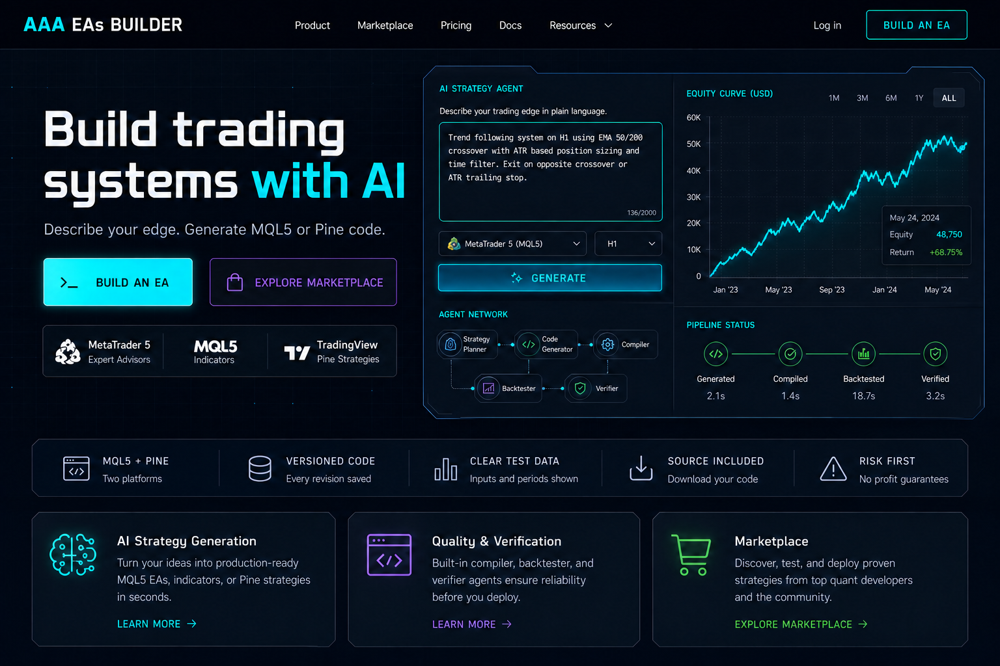
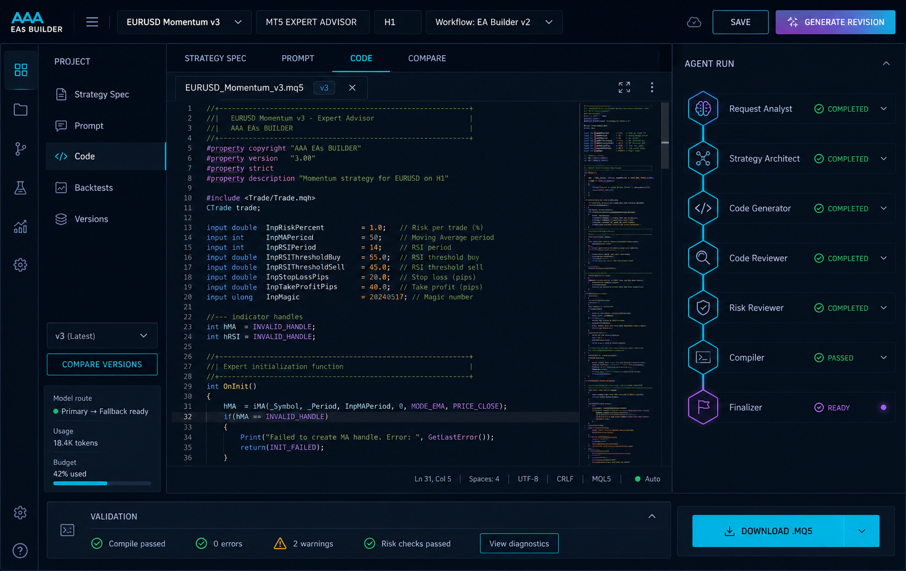
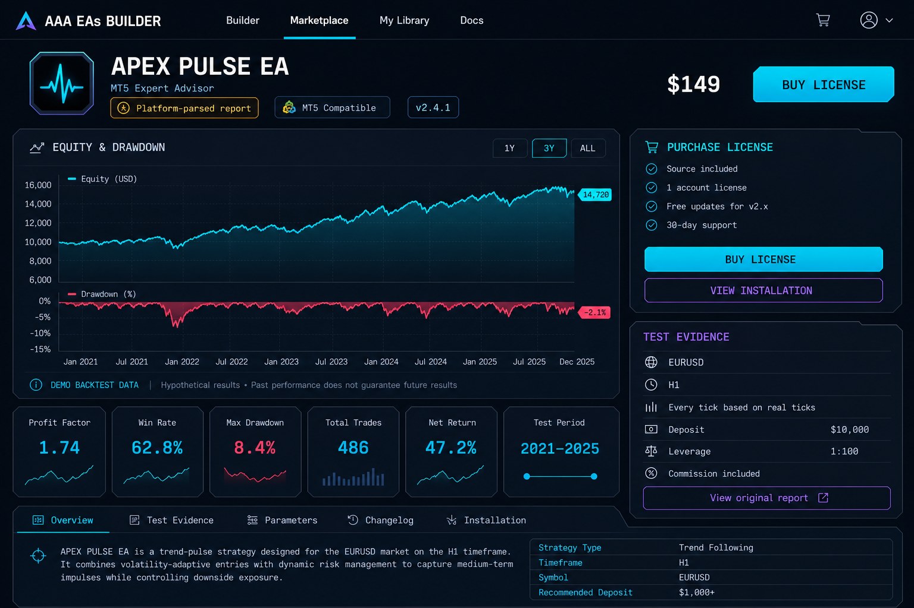

# AAA EAs Builder — Initial UI Mockups

These mockups establish the initial visual direction for the customer-facing product: a modern trading terminal with restrained cyberpunk styling, strong data hierarchy, and honest performance context.

They are visual references rather than pixel-perfect implementation specifications. The final interface must be implemented responsively with Django templates, Tailwind CSS, HTMX, and Alpine.js.

## Landing page

Implementation focus:

- Strong product message and clear builder/marketplace actions.
- Prompt composer and equity visualization demonstrate the workflow without suggesting guaranteed profits.
- Capability strip uses factual labels rather than invented certifications, ratings, or customer numbers.
- The first viewport introduces generation, validation, and marketplace value without excessive copy.

## AI builder workspace

Implementation focus:

- Desktop-first workspace with project navigation, strategy/code tabs, editor, agent run status, and validation console.
- The agent panel maps directly to the planned LangGraph workflow.
- Model route, token usage, and run budget are visible without distracting from the code.
- Narrow layouts should convert the navigation to a drawer and the agent panel to a bottom sheet.

## Marketplace product analytics

Implementation focus:

- Price and purchase action remain visible alongside compatibility and licensing information.
- Equity, drawdown, profit factor, win rate, trade count, test period, and evidence provenance appear together.
- The displayed numbers and product are fictional demo content.
- Production pages must load metrics from an immutable test run and preserve the test assumptions and verification label.

## Shared visual language

- Deep navy/near-black background with panel elevation rather than pure black everywhere.
- Electric cyan for primary actions and active navigation.
- Violet for AI/workflow states.
- Green, red, and amber reserved for semantic trading and system states.
- Thin grid borders, clipped corners, restrained glow, and compact monospace metrics.
- Large geometric headings paired with highly readable body text.
- Cyberpunk details should frame information, never compete with it.

## Mockup generation prompts

The images were generated with the built-in image generation workflow using the `ui-mockup` use case. The prompt set requested:

1. A high-fidelity SaaS landing page with navigation, two-column hero, AI prompt composer, equity preview, factual capability strip, and feature cards.
2. A high-fidelity builder workspace with an MQL5 editor, project/version navigation, LangGraph agent run panel, validation console, usage/budget context, and download action.
3. A high-fidelity marketplace product page with fictional demo backtest data, equity/drawdown visualization, metric cards, evidence settings, compatibility, licensing, and purchase actions.

All prompts required production-style UI rather than concept art, readable typography, the project’s Tailwind color tokens, restrained neon effects, no real company logos, no invented trust claims, and no guaranteed-profit language.
