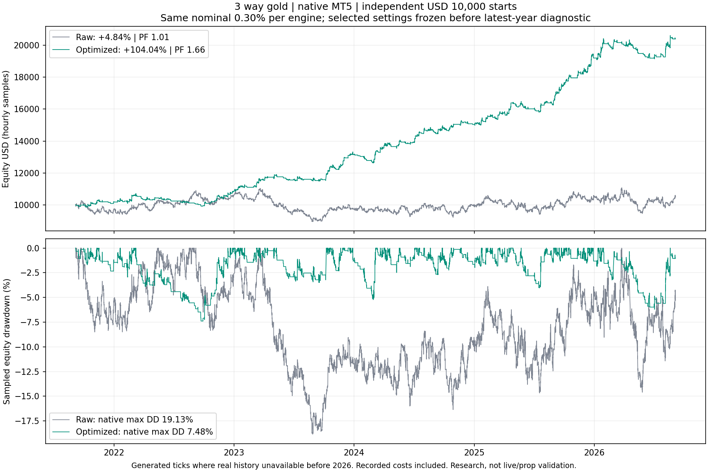

# 3 way gold — full parameter research results

**Research/tester only. No live, website, BAT or Git changes.** This is our implementation of the three-engine concept, not the Instagram creator's unavailable code.

Search: **5,152 engine configurations**, 37 combined configurations evaluated in two chronological splits, four native finalists and **30 completed native runs** including parity, controls and stresses.
This was a broad bounded discrete search plus local refinement, not every possible combination and not a guarantee of globally best parameters. Screening estimates are not presented as native backtests.

## Selected settings

Selection ID: `94972c57f0ff`. Frozen 2026-09-13T15:07:14.422322+00:00 before opening the latest-year diagnostic. Passed development/validation eligibility: **True**.
Direction: **long only**. H1 closed candles. ATR length **20**. Nominal **0.30% equity per engine**, up to three simultaneous positions on one $10,000 hedging account.

| Engine | Optimized entry | Stop | Target |
|---|---|---|---|
| Momentum | EMA20 reclaim; EMA30/200 direction; ADX10 >= 15, DI agreement | 3 ATR | 3R |
| Trend change | EMA9/55 crossover; RSI21 > 60 for buys | 1 ATR | 1R |
| Breakout | Previous 55 hours; true range >= 2 preceding ATR; rising ATR not required | 1 ATR | 3R |

Management: **move SL to entry after completed H1 close reaches trigger**. Trigger 1.5R; trailing distance 1.5 ATR (inactive unless management is 2 or 3). Stops only ratchet favorably, and TP stays fixed. A trigger beyond an engine's TP is normally unreachable for that engine. Entry-price break-even can still lose commission/swap.

## Raw versus selected — native MT5

Independent $10,000 starts. Windows end 2026-09-05 exclusive (last trading tick September 4), using Exness Zero demo, 1:2000 leverage, Model4 requested, 1ms baseline delay. Net results include recorded commission/swap. Total return, not annualized. DD is native/every-tick equity drawdown.

| Window | Raw return | Selected return | Selected final USD | Raw / new trades | Raw / new win rate | Raw / new PF | Raw / new equity DD |
|---|---:|---:|---:|---:|---:|---:|---:|
| 6m | -2.73% | -0.69% | $9,931.17 | 185 / 44 | 32.43% / 29.55% | 0.954 / 0.949 | 16.14% / 8.68% |
| 1y | +3.81% | +19.30% | $11,930.36 | 333 / 104 | 33.93% / 37.50% | 1.034 / 1.616 | 15.09% / 9.03% |
| 3y | +13.18% | +80.17% | $18,017.41 | 1095 / 342 | 35.07% / 38.01% | 1.042 / 1.831 | 14.30% / 6.92% |
| 5y | +4.84% | +104.04% | $20,403.75 | 1809 / 566 | 34.49% / 36.40% | 1.010 / 1.664 | 19.13% / 7.48% |
| 2019-2026 | -16.90% | +120.10% | $22,009.70 | 2789 / 882 | 33.88% / 34.01% | 0.973 / 1.496 | 28.83% / 9.53% |

## Cash costs, exposure and execution

| Window | Net USD | Commission | Swap | Max individual initial risk | Max concurrent | Minimum equity | Stopout | Order/management errors |
|---|---:|---:|---:|---:|---:|---:|---|---:|
| 1y | $1,930.36 | -$12.03 | -$102.23 | 1.88% | 3 | $9,992.09 | False | 9 |
| 6m | -$68.83 | -$4.00 | -$34.05 | 1.34% | 3 | $9,290.55 | False | 0 |
| 3y | $8,017.41 | -$89.54 | -$633.03 | 1.28% | 3 | $9,966.32 | False | 11 |
| 5y | $10,403.75 | -$183.13 | -$1,237.24 | 1.14% | 3 | $9,855.60 | False | 15 |
| 2019-2026 | $12,009.70 | -$340.09 | -$2,284.73 | 1.05% | 3 | $9,875.34 | False | 18 |

The project's round-UP/minimum-lot policy remains in force. The risk input is NOT a hard cap, and fixed minimum lots can dominate sizing. No adaptive portfolio controls, daily stop or FTMO rules are applied. Research settings cannot be initialized on a live chart.
Metadata note: the inherited max_gross_initial_stop_risk_pct field sums entry-to-CURRENT-SL downside, sampled at entries/hourly checks. With management enabled it is not a fixed original-risk sum or every-tick remaining-equity-risk cap.

## Native selection evidence — no latest-year selection

Development 2021-09-05 to 2024-09-05; validation 2024-09-05 to 2025-09-05. Eligibility requires both splits profitable, PF>1.05, DD<=20%, >=60/20 trades and no stopout. Rank is the worse split score.

| Candidate | Eligible | Development return / PF / DD / WR | Validation return / PF / DD / WR | Worst score |
|---|---|---|---|---:|
| 94972c57f0ff SELECTED | True | +45.11% / 1.57 / 7.48% / 35.98% | +18.61% / 1.78 / 4.11% / 37.27% | 26.29 |
| 5162b540ed7c | True | +23.93% / 1.30 / 5.31% / 48.15% | +18.26% / 1.74 / 2.58% / 54.61% | 16.84 |
| 059b471c237f | True | +30.54% / 1.41 / 7.61% / 30.29% | +19.34% / 1.91 / 4.19% / 32.41% | 17.82 |
| b7004234b496 | True | +39.55% / 1.56 / 6.37% / 39.39% | +14.53% / 1.60 / 5.11% / 37.93% | 18.75 |

### Native local parameter stability

Four one-at-a-time development-period perturbations around the selected configuration. These diagnose sensitivity without replacing the frozen selection or re-tuning on the recent diagnostic.

| Changed input | Development return | PF | Equity DD | Trades |
|---|---:|---:|---:|---:|
| {'InpPullbackEMA': 10} | +38.74% | 1.456 | 8.17% | 367 |
| {'InpADXMin': 20.0} | +43.29% | 1.569 | 7.49% | 342 |
| {'InpBreakoutBars': 30} | +43.47% | 1.472 | 6.91% | 403 |
| {'InpMomentumStopATR': 2.5} | +45.59% | 1.535 | 6.10% | 377 |

The raw historical aggregates were already viewed before optimization. The latest-year diagnostic was withheld from this parameter selection but is not pristine unseen OOS. Multiple testing and gold's historical trend bias remain risks. No re-tuning after the diagnostic.

## Five-year contributions inside the actual shared account

| Engine | Trades | Win rate | Net USD | Net PF |
|---|---:|---:|---:|---:|
| Momentum | 194 | 37.63% | $5,270.45 | 1.858 |
| Trend change | 67 | 61.19% | $598.50 | 1.489 |
| Breakout | 305 | 30.16% | $4,534.80 | 1.546 |

## Same settings, different engine allocation — native five years

These are post-selection diagnostics, not changes to the frozen main candidate. Risk stays per engine, so removing engines reduces nominal deployment. Do not add independent returns together.

| Enabled engines | Trades | Return | PF | Equity DD | Win rate |
|---|---:|---:|---:|---:|---:|
| Momentum + Change + Breakout | 566 | +104.04% | 1.664 | 7.48% | 36.40% |
| Momentum | 194 | +45.36% | 1.835 | 6.20% | 37.63% |
| Change | 67 | +5.47% | 1.570 | 2.70% | 61.19% |
| Breakout | 305 | +35.48% | 1.516 | 5.15% | 30.16% |
| Momentum + Change | 261 | +54.52% | 1.812 | 7.47% | 43.68% |
| Momentum + Breakout | 499 | +98.12% | 1.696 | 6.69% | 33.07% |
| Change + Breakout | 372 | +42.08% | 1.514 | 5.42% | 35.75% |

## Risk sensitivity — native five years

| Nominal risk per engine | Return | Net PF | Equity DD | Max actual trade risk |
|---|---:|---:|---:|---:|
| 0.15% | +51.07% | 1.599 | 6.42% | 1.50% |
| 0.30% | +104.04% | 1.664 | 7.48% | 1.14% |
| 0.50% | +207.34% | 1.697 | 10.87% | 0.88% |

Risk variants are sensitivities, not retrospective replacement of the frozen 0.30% setting. Minimum-lot constraints can prevent lower inputs from meaningfully reducing actual risk.

## Native execution-delay stress — latest year

| Delay | Trades | Return | Net PF | Equity DD |
|---|---:|---:|---:|---:|
| 1 ms | 104 | +19.30% | 1.616 | 9.03% |
| 100 ms | 104 | +19.20% | 1.611 | 9.08% |
| 500 ms | 104 | +18.49% | 1.586 | 9.22% |

MT5 delay applies to EA requests, not all server-side stop executions. This does not reproduce broker rejection, historical high-margin rules or every live-news gap.

## Extra friction — five-year fixed trade-ledger sensitivity

Additional round-trip price cost is deducted as cost × contract100 × lots from each native closed trade, plus the commission multiplier. This does not re-execute trades, change position sizing or reconstruct historical fee schedules.

| Extra price cost | Commission multiple | Net USD | Return on initial 10K | Net PF | Win rate |
|---|---:|---:|---:|---:|---:|
| 0.00 | 1.0x | $10,403.75 | +104.04% | 1.664 | 36.40% |
| 0.10 | 1.0x | $10,073.35 | +100.73% | 1.634 | 36.40% |
| 0.25 | 1.0x | $9,577.75 | +95.78% | 1.591 | 36.40% |
| 0.50 | 1.0x | $8,751.75 | +87.52% | 1.523 | 36.40% |
| 0.25 | 1.5x | $9,486.18 | +94.86% | 1.584 | 36.40% |
| 0.50 | 2.0x | $8,568.62 | +85.69% | 1.509 | 36.40% |

## 1,000 historical block-bootstrap paths

Three-month blocks sampled from 59 complete calendar months, excluding the two partial edge months, to form 60-month paths. Ending balance 5th / median / 95th percentile: **$14,840.75 / $20,068.09 / $26,566.16**. Monthly closed-balance DD median / 95th: **5.01% / 8.64%**. Paths finishing below $10,000: **0.1%**.
These resampling frequencies are NOT reliable future loss probabilities, prop-firm passing chances or intraday equity-risk estimates. Monthly close DD misses intramonth excursions. Overlapping three-month blocks retain limited serial dependence, not future regime shifts.

## Honest recommendation

Use the native development, validation, recent-year result and cost sensitivity together. A qualifying historical candidate is suitable for further demo observation, not a guarantee of live profitability or a reason to deploy automatically. Any recommendation to drop an engine must be reviewed separately; all three remain in the frozen main research set. Increasing risk to lift historical return does not create a better edge.

## Coverage and reproducibility

- Real-tick history begins2026-01-01; earlier absent real ticks are generated by MT5. Model4 does not guarantee real historical ticks across all years.
- The approximate baseline screen differed from native five-year return (~+2.82% vs +4.84%), illustrating why screening rankings alone were not accepted as final evidence.
- Recorded native commission and swap are included once per trade. They are the tester's loaded conditions, not an independently reconstructed historical schedule.
- Default parameterized EA exactly matches all185 raw six-month trades, including prices, sizes, stops and costs. 14 focused tests pass; independent indicator calculations matched29,558 raw decisions before screening. Every final native decision, entry, ledger and report hash is checked.
- All selected windows stop September4,2026. Latest September7–11 is excluded to match existing comparison windows.
- Source hashes, parameter files, closed-trade data, native HTML reports, search results, freeze time and verification are saved. No active EA or website evidence has been overwritten.

See [PROTOCOL.md](PROTOCOL.md), [selected-config.json](selected-config.json), [native-finalists.json](native-finalists.json), [verification.json](verification.json) and [monthly-breakdown.csv](monthly-breakdown.csv).

## Monthly combined results — selected five-year account

Closed-trade attribution with full recorded trade costs at closure; not monthly mark-to-market equity or payouts. First/last months partial.

| Month | Trades | Win rate | Net USD | Closed return | Ending balance | Commission | Swap |
|---|---:|---:|---:|---:|---:|---:|---:|
| 2021.09 | 6 | 33.33% | -$13.43 | -0.13% | $9,986.57 | -$2.49 | -$8.56 |
| 2021.10 | 12 | 33.33% | $78.82 | +0.79% | $10,065.39 | -$4.38 | -$36.37 |
| 2021.11 | 11 | 36.36% | $125.31 | +1.24% | $10,190.70 | -$4.49 | -$20.83 |
| 2021.12 | 6 | 33.33% | -$11.07 | -0.11% | $10,179.63 | -$2.11 | -$2.14 |
| 2022.01 | 9 | 33.33% | $24.09 | +0.24% | $10,203.72 | -$3.66 | -$22.45 |
| 2022.02 | 17 | 47.06% | $382.92 | +3.75% | $10,586.64 | -$6.71 | -$47.06 |
| 2022.03 | 11 | 9.09% | -$256.02 | -2.42% | $10,330.62 | -$2.84 | -$18.68 |
| 2022.04 | 9 | 33.33% | $17.39 | +0.17% | $10,348.01 | -$2.71 | -$8.55 |
| 2022.05 | 9 | 33.33% | -$26.96 | -0.26% | $10,321.05 | -$2.89 | -$17.63 |
| 2022.06 | 7 | 14.29% | -$81.21 | -0.79% | $10,239.84 | -$2.28 | -$12.29 |
| 2022.07 | 3 | 0.00% | -$103.37 | -1.01% | $10,136.47 | -$1.11 | $0.00 |
| 2022.08 | 5 | 20.00% | -$17.87 | -0.18% | $10,118.60 | -$1.77 | -$21.40 |
| 2022.09 | 7 | 14.29% | -$167.15 | -1.65% | $9,951.45 | -$2.38 | $0.00 |
| 2022.10 | 7 | 57.14% | $240.84 | +2.42% | $10,192.29 | -$1.99 | -$15.51 |
| 2022.11 | 11 | 54.55% | $203.81 | +2.00% | $10,396.10 | -$3.55 | -$35.82 |
| 2022.12 | 16 | 43.75% | $425.50 | +4.09% | $10,821.60 | -$5.58 | -$48.64 |
| 2023.01 | 9 | 44.44% | $262.27 | +2.42% | $11,083.87 | -$2.40 | -$47.53 |
| 2023.02 | 5 | 40.00% | $53.72 | +0.48% | $11,137.59 | -$1.94 | -$16.04 |
| 2023.03 | 16 | 37.50% | $408.15 | +3.66% | $11,545.74 | -$4.99 | -$22.46 |
| 2023.04 | 7 | 42.86% | $187.95 | +1.63% | $11,733.69 | -$2.28 | -$24.57 |
| 2023.05 | 12 | 25.00% | -$51.02 | -0.43% | $11,682.67 | -$5.10 | -$21.92 |
| 2023.06 | 6 | 33.33% | -$87.57 | -0.75% | $11,595.10 | -$2.49 | -$8.55 |
| 2023.07 | 13 | 30.77% | $9.48 | +0.08% | $11,604.58 | -$5.90 | -$48.68 |
| 2023.08 | 7 | 28.57% | $35.05 | +0.30% | $11,639.63 | -$4.70 | -$13.37 |
| 2023.09 | 6 | 16.67% | -$58.61 | -0.50% | $11,581.02 | -$3.36 | -$9.63 |
| 2023.10 | 14 | 50.00% | $746.93 | +6.45% | $12,327.95 | -$5.97 | -$36.89 |
| 2023.11 | 12 | 50.00% | $434.65 | +3.53% | $12,762.60 | -$5.98 | -$34.74 |
| 2023.12 | 9 | 55.56% | $376.67 | +2.95% | $13,139.27 | -$3.60 | -$32.09 |
| 2024.01 | 6 | 0.00% | -$224.23 | -1.71% | $12,915.04 | -$3.21 | -$16.01 |
| 2024.02 | 7 | 0.00% | -$287.33 | -2.22% | $12,627.71 | -$3.16 | -$19.76 |
| 2024.03 | 20 | 55.00% | $945.45 | +7.49% | $13,573.16 | -$7.75 | -$56.65 |
| 2024.04 | 10 | 30.00% | $82.43 | +0.61% | $13,655.59 | -$2.32 | -$34.77 |
| 2024.05 | 10 | 40.00% | $278.25 | +2.04% | $13,933.84 | -$3.71 | -$9.62 |
| 2024.06 | 8 | 37.50% | -$3.95 | -0.03% | $13,929.89 | -$3.99 | -$3.74 |
| 2024.07 | 13 | 53.85% | $673.74 | +4.84% | $14,603.63 | -$4.65 | -$27.78 |
| 2024.08 | 16 | 25.00% | -$36.89 | -0.25% | $14,566.74 | -$4.95 | -$30.44 |
| 2024.09 | 13 | 30.77% | $207.58 | +1.43% | $14,774.32 | -$3.94 | -$26.72 |
| 2024.10 | 8 | 37.50% | $271.66 | +1.84% | $15,045.98 | -$2.39 | -$32.56 |
| 2024.11 | 6 | 50.00% | $144.53 | +0.96% | $15,190.51 | -$1.94 | -$20.85 |
| 2024.12 | 4 | 0.00% | -$153.46 | -1.01% | $15,037.05 | -$1.27 | -$4.28 |
| 2025.01 | 12 | 33.33% | $190.35 | +1.27% | $15,227.40 | -$4.27 | -$39.02 |
| 2025.02 | 8 | 37.50% | $251.67 | +1.65% | $15,479.07 | -$2.11 | -$21.89 |
| 2025.03 | 9 | 44.44% | $291.20 | +1.88% | $15,770.27 | -$2.89 | -$28.86 |
| 2025.04 | 12 | 50.00% | $621.80 | +3.94% | $16,392.07 | -$2.16 | -$9.09 |
| 2025.05 | 10 | 20.00% | -$291.74 | -1.78% | $16,100.33 | -$1.73 | -$9.61 |
| 2025.06 | 4 | 0.00% | -$81.52 | -0.51% | $16,018.81 | -$0.72 | -$6.95 |
| 2025.07 | 8 | 37.50% | $231.28 | +1.44% | $16,250.09 | -$2.39 | -$17.10 |
| 2025.08 | 11 | 45.45% | $285.17 | +1.75% | $16,535.26 | -$4.36 | -$26.19 |
| 2025.09 | 16 | 50.00% | $1,058.76 | +6.40% | $17,594.02 | -$4.14 | -$24.07 |
| 2025.10 | 6 | 50.00% | $363.97 | +2.07% | $17,957.99 | -$0.73 | -$11.75 |
| 2025.11 | 7 | 28.57% | $187.14 | +1.04% | $18,145.13 | -$1.44 | -$12.84 |
| 2025.12 | 11 | 54.55% | $1,057.97 | +5.83% | $19,203.10 | -$2.44 | -$42.79 |
| 2026.01 | 16 | 50.00% | $897.70 | +4.67% | $20,100.80 | -$2.46 | -$14.95 |
| 2026.02 | 5 | 0.00% | -$312.78 | -1.56% | $19,788.02 | -$0.63 | -$3.73 |
| 2026.03 | 7 | 28.57% | $226.80 | +1.15% | $20,014.82 | -$0.84 | -$5.87 |
| 2026.04 | 5 | 20.00% | -$218.52 | -1.09% | $19,796.30 | -$0.78 | -$14.35 |
| 2026.05 | 5 | 0.00% | -$373.78 | -1.89% | $19,422.52 | -$0.62 | -$3.73 |
| 2026.06 | 7 | 14.29% | -$225.00 | -1.16% | $19,197.52 | -$1.17 | -$1.07 |
| 2026.07 | 9 | 33.33% | $74.39 | +0.39% | $19,271.91 | -$1.67 | -$3.21 |
| 2026.08 | 13 | 53.85% | $1,126.40 | +5.84% | $20,398.31 | -$2.21 | -$24.59 |
| 2026.09 | 2 | 50.00% | $5.44 | +0.03% | $20,403.75 | -$0.44 | $0.00 |

