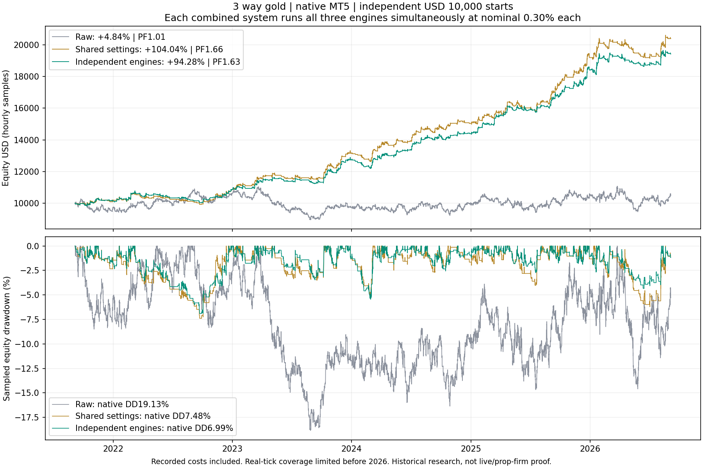

# 3 way gold — independently optimized engines

**Research only. Nothing deployed or changed on the website/BATs.** Each engine now retains its own settings; ATR, direction and exit management no longer have to match. All three run on one shared simulated account.

## What was tested

Reused the 5,152 engine parameter searches; shortlisted 24 candidates per engine using development data, compared them on validation, and ran three per engine natively on both splits (18 selection tests). A deduplication audit found that the first three trend-change configurations had identical ledgers because their 0.5R TP preceded the 1.5R management trigger. Two additional effective parameter sets were tested on both splits before final selection (four more native tests). Identical ledgers are not independent robustness evidence. The independent EA then received two exact inheritance parity tests, two combined split tests, five combined windows, three standalone five-year tests and two delay stresses.
Development: 2021-09-05 to 2024-09-05. Validation: 2024-09-05 to 2025-09-05. Latest year: 2025-09-05 to 2026-09-05, not used to choose the new settings. Prior historical aggregates had already been seen; this is additional exploratory multiple testing, not pristine unseen out-of-sample evidence.
Individual settings frozen **2026-09-13T15:32:33.252534+00:00**; assembled configuration **74317fe93b5a**. All three meet the stated individual development/validation criteria: **True**.

## Native shared-account comparison

Independent $10,000 starts; nominal 0.30% equity per engine; H1 closed candles; max one position per engine, three total. Exness Zero demo, leverage 1:2000. All periods end 2026-09-05 exclusive (last market tick September 4). Returns are total-period and include native recorded spread, commission and swap. Equity DD is native/every-tick, not only balance drawdown.

| Period | Raw return | Shared-settings optimized | Independent engines | Independent final USD | Independent trades | Independent WR |
|---|---:|---:|---:|---:|---:|---:|
| 6m | -2.73% | -0.69% | -0.71% | $9,928.65 | 57 | 36.84% |
| 1y | +3.81% | +19.30% | +15.19% | $11,519.30 | 130 | 40.77% |
| 3y | +13.18% | +80.17% | +72.64% | $17,264.30 | 416 | 42.55% |
| 5y | +4.84% | +104.04% | +94.28% | $19,428.10 | 674 | 41.39% |
| 2019-2026 | -16.90% | +120.10% | +94.66% | $19,465.80 | 1047 | 38.40% |

| Period | Raw PF | Shared PF | Independent PF | Raw equity DD | Shared equity DD | Independent equity DD |
|---|---:|---:|---:|---:|---:|---:|
| 6m | 0.954 | 0.949 | 0.946 | 16.14% | 8.68% | 5.88% |
| 1y | 1.034 | 1.616 | 1.458 | 15.09% | 9.03% | 7.21% |
| 3y | 1.042 | 1.831 | 1.768 | 14.30% | 6.92% | 5.71% |
| 5y | 1.010 | 1.664 | 1.635 | 19.13% | 7.48% | 6.99% |
| 2019-2026 | 0.973 | 1.496 | 1.426 | 28.83% | 9.53% | 11.15% |

## Decision

The independent combination is not a universal upgrade. Over five years it raises win rate from 36.40% to 41.39% and reduces equity DD from 7.48% to 6.99%, but lowers return from +104.04% to +94.28% and PF from 1.664 to 1.635.
The longer 2019–2026 diagnostic is less favorable: independent return +94.66% versus +120.10%, with DD 11.15% versus 9.53%. Both versions lose money in the latest six-month window.
Recommendation: keep the preceding jointly optimized preset as the primary research candidate and save the independently selected version as an alternative, not a replacement. Higher standalone validation scores and a higher combined win rate did not translate into a better full-history portfolio. Forward demo comparison is more useful now than further tuning to these already-seen windows. Neither preset is approved for live or prop-firm use.

## Independently selected inputs

| Engine | Direction | Signal | ATR period | Stop | TP | Management |
|---|---|---|---:|---:|---:|---|
| Momentum | Long only | EMA20 reclaim; EMA30/200; ADX20>=15, DI agreement | 20 | 3 ATR | 3R | BE after closed H1 reaches 1R |
| Trend change | Long only | EMA9/55 cross; RSI14 confirmation60 | 14 | 1 ATR | 0.5R | Fixed SL/TP |
| Breakout | Long only | 55-hour channel; range>=2 prior ATR; risingATR=False | 20 | 1 ATR | 3R | BE after closed H1 reaches 1R |

Targets remain fixed. Stops only tighten based on completed H1 candles. BE means entry-price SL, not fee-free break-even. RSI thresholds are symmetric for shorts (100 minus the shown threshold). Each engine owns its ATR period and management state.

## Each engine standalone — previous versus independently selected settings, five years

Each standalone test starts at $10,000 and uses 0.30% nominal risk. Standalone returns cannot be added to recreate the combined account, because position sizing uses changing shared equity.

| Engine | Previous return | New return | Previous/new trades | Previous/new WR | Previous/new PF | Previous/new equity DD |
|---|---:|---:|---:|---:|---:|---:|
| Momentum | +45.36% | +38.59% | 194/184 | 37.63%/33.15% | 1.835/1.872 | 6.20%/5.68% |
| Trend change | +5.47% | +3.71% | 67/183 | 61.19%/71.04% | 1.570/1.190 | 2.70%/2.83% |
| Breakout | +35.48% | +36.89% | 305/307 | 30.16%/28.66% | 1.516/1.582 | 5.15%/4.40% |

## Actual five-year contributions in the new combined account

| Engine | Trades | Win rate | Net USD | PF | Commission | Swap |
|---|---:|---:|---:|---:|---:|---:|
| Momentum | 184 | 33.15% | $4,458.50 | 1.899 | -$27.95 | -$659.86 |
| Trend change | 183 | 71.04% | $398.68 | 1.160 | -$70.33 | -$126.72 |
| Breakout | 307 | 28.66% | $4,570.92 | 1.618 | -$124.46 | -$398.93 |

## Individual native selection results

| Engine | Qualified | Train trades / return / PF / DD | Validation trades / return / PF / DD |
|---|---|---|---|
| Momentum | True | 105 / +20.61% / 2.071 / 2.37% | 43 / +9.25% / 2.273 / 3.32% |
| Trend change | True | 113 / +3.42% / 1.324 / 2.83% | 33 / +1.71% / 1.676 / 0.96% |
| Breakout | True | 195 / +13.83% / 1.347 / 4.40% | 56 / +6.55% / 1.662 / 1.95% |

Qualification: >=50/15 trades in development/validation, both profitable with PF>1.05 and equity DD<=15%, no stopout. The weakest split determines ranking. A best standalone engine is not automatically the best joint portfolio; the combined comparison above tests that assumption.

## Native costs, risk and delay stress

| Period | Commission | Swap | Max actual initial risk/trade | Max concurrent | Max losing streak | Stopout | Rejected requests |
|---|---:|---:|---:|---:|---:|---|---:|
| 1y | -$15.45 | -$95.36 | 1.94% | 3 | 6 | False | 9 |
| 6m | -$5.61 | -$30.91 | 1.34% | 2 | 5 | False | 1 |
| 3y | -$113.97 | -$613.83 | 1.33% | 3 | 12 | False | 11 |
| 5y | -$222.74 | -$1,185.51 | 1.20% | 3 | 12 | False | 13 |
| 2019-2026 | -$395.12 | -$2,054.82 | 1.19% | 3 | 14 | False | 17 |

Five-year rejected requests: 9 error: market closed, 4 manage_error: market closed. These are not filled trades. A rejected entry is not retried within the same H1 bar; a rejected stop modification leaves the prior SL in place until a subsequent valid management check. The recorded results include that behavior.

| Latest-year delay | Trades | Return | PF | Equity DD |
|---|---:|---:|---:|---:|
| 1ms | 130 | +15.19% | 1.458 | 7.21% |
| 100ms | 130 | +15.06% | 1.453 | 7.29% |
| 500ms | 130 | +14.68% | 1.440 | 7.55% |

## Interpretation and limitations

- The round-UP/minimum-lot rule is retained. Nominal 0.30% is not a hard cap. Small-account minimum-lot risk can exceed it substantially; no prop-firm or daily-loss protection has been applied.
- Native real ticks start 2026-01-01; MT5 generates earlier missing real ticks. The 1ms baseline is optimistic; 100/500ms tests are latency checks, not proof of live-news execution quality.
- Native recorded commission/swap are included once. Historical broker fee changes, dynamic leverage and high-margin requirements were not independently reconstructed.
- Selection uses overlapping historical research. Long-only success can reflect the gold trend sample. It is not a guarantee or a replica of the creator's unknown bot.
- Earlier period aggregates were known; latest-year results were not used to change these new parameters after freezing. Recent losses and weaker variants remain visible.
- Both inheritance parity tests match exactly: 185 raw six-month trades and 44 preceding optimized six-month trades. Independent signals, fill risk, management ratchets, cost ledgers and native report hashes are audited.

## Monthly new combined five-year closed-trade results

Trade net P/L belongs to its close month, including full recorded costs. This is not MTM monthly return or payouts. Edge months are partial.

| Month | Trades | Win rate | Net USD | Closed return | Ending balance | Commission | Swap |
|---|---:|---:|---:|---:|---:|---:|---:|
| 2021.09 | 8 | 37.50% | -$45.36 | -0.45% | $9,954.64 | -$3.20 | -$8.56 |
| 2021.10 | 14 | 42.86% | $62.82 | +0.63% | $10,017.46 | -$5.93 | -$36.37 |
| 2021.11 | 15 | 46.67% | $155.76 | +1.55% | $10,173.22 | -$6.19 | -$26.71 |
| 2021.12 | 8 | 50.00% | -$45.84 | -0.45% | $10,127.38 | -$2.99 | -$9.63 |
| 2022.01 | 11 | 45.45% | $125.59 | +1.24% | $10,252.97 | -$4.82 | -$17.64 |
| 2022.02 | 19 | 47.37% | $361.15 | +3.52% | $10,614.12 | -$7.43 | -$45.99 |
| 2022.03 | 13 | 23.08% | -$186.41 | -1.76% | $10,427.71 | -$3.39 | -$18.68 |
| 2022.04 | 9 | 44.44% | $86.66 | +0.83% | $10,514.37 | -$3.16 | -$9.08 |
| 2022.05 | 11 | 36.36% | -$83.52 | -0.79% | $10,430.85 | -$3.50 | -$17.63 |
| 2022.06 | 7 | 14.29% | -$101.79 | -0.98% | $10,329.06 | -$2.32 | -$17.65 |
| 2022.07 | 4 | 50.00% | -$36.80 | -0.36% | $10,292.26 | -$1.72 | $0.00 |
| 2022.08 | 8 | 12.50% | -$91.98 | -0.89% | $10,200.28 | -$2.83 | -$25.65 |
| 2022.09 | 9 | 33.33% | -$149.08 | -1.46% | $10,051.20 | -$3.60 | $0.00 |
| 2022.10 | 7 | 71.43% | $295.77 | +2.94% | $10,346.97 | -$2.32 | -$11.23 |
| 2022.11 | 11 | 45.45% | -$5.97 | -0.06% | $10,341.00 | -$3.77 | -$27.82 |
| 2022.12 | 18 | 50.00% | $489.38 | +4.73% | $10,830.38 | -$6.26 | -$41.15 |
| 2023.01 | 10 | 30.00% | $106.27 | +0.98% | $10,936.65 | -$2.57 | -$30.43 |
| 2023.02 | 7 | 42.86% | $14.89 | +0.14% | $10,951.54 | -$2.49 | -$19.25 |
| 2023.03 | 17 | 41.18% | $381.24 | +3.48% | $11,332.78 | -$5.15 | -$32.62 |
| 2023.04 | 11 | 45.45% | $150.37 | +1.33% | $11,483.15 | -$4.16 | -$24.57 |
| 2023.05 | 13 | 38.46% | $22.63 | +0.20% | $11,505.78 | -$5.31 | -$20.32 |
| 2023.06 | 7 | 42.86% | -$109.41 | -0.95% | $11,396.37 | -$3.21 | -$10.69 |
| 2023.07 | 11 | 36.36% | $68.89 | +0.60% | $11,465.26 | -$5.19 | -$33.16 |
| 2023.08 | 8 | 12.50% | -$129.91 | -1.13% | $11,335.35 | -$4.92 | -$13.90 |
| 2023.09 | 10 | 40.00% | -$14.50 | -0.13% | $11,320.85 | -$6.28 | -$18.71 |
| 2023.10 | 16 | 43.75% | $674.95 | +5.96% | $11,995.80 | -$5.99 | -$36.86 |
| 2023.11 | 13 | 53.85% | $452.17 | +3.77% | $12,447.97 | -$6.53 | -$19.79 |
| 2023.12 | 11 | 45.45% | $271.67 | +2.18% | $12,719.64 | -$4.16 | -$38.50 |
| 2024.01 | 9 | 11.11% | -$278.23 | -2.19% | $12,441.41 | -$4.97 | -$16.01 |
| 2024.02 | 10 | 20.00% | -$244.67 | -1.97% | $12,196.74 | -$5.20 | -$29.39 |
| 2024.03 | 22 | 50.00% | $609.99 | +5.00% | $12,806.73 | -$8.96 | -$46.50 |
| 2024.04 | 11 | 27.27% | $191.58 | +1.50% | $12,998.31 | -$2.32 | -$31.03 |
| 2024.05 | 15 | 53.33% | $287.32 | +2.21% | $13,285.63 | -$5.10 | -$13.89 |
| 2024.06 | 10 | 60.00% | $90.80 | +0.68% | $13,376.43 | -$4.80 | $0.00 |
| 2024.07 | 14 | 57.14% | $557.56 | +4.17% | $13,933.99 | -$5.32 | -$29.39 |
| 2024.08 | 15 | 40.00% | $174.39 | +1.25% | $14,108.38 | -$5.04 | -$26.71 |
| 2024.09 | 15 | 26.67% | $85.34 | +0.60% | $14,193.72 | -$4.17 | -$19.77 |
| 2024.10 | 10 | 20.00% | $83.50 | +0.59% | $14,277.22 | -$2.73 | -$27.22 |
| 2024.11 | 9 | 55.56% | $106.34 | +0.74% | $14,383.56 | -$2.99 | -$21.92 |
| 2024.12 | 6 | 50.00% | $13.38 | +0.09% | $14,396.94 | -$2.43 | -$7.49 |
| 2025.01 | 12 | 50.00% | $388.76 | +2.70% | $14,785.70 | -$4.65 | -$40.11 |
| 2025.02 | 9 | 33.33% | $160.20 | +1.08% | $14,945.90 | -$2.55 | -$16.04 |
| 2025.03 | 13 | 61.54% | $595.32 | +3.98% | $15,541.22 | -$4.21 | -$30.47 |
| 2025.04 | 13 | 46.15% | $572.06 | +3.68% | $16,113.28 | -$2.43 | -$9.09 |
| 2025.05 | 11 | 36.36% | -$124.73 | -0.77% | $15,988.55 | -$2.01 | -$8.54 |
| 2025.06 | 9 | 33.33% | -$66.40 | -0.42% | $15,922.15 | -$2.05 | -$14.44 |
| 2025.07 | 10 | 40.00% | $100.07 | +0.63% | $16,022.22 | -$3.33 | -$21.92 |
| 2025.08 | 10 | 50.00% | $115.14 | +0.72% | $16,137.36 | -$4.09 | -$7.49 |
| 2025.09 | 17 | 41.18% | $735.99 | +4.56% | $16,873.35 | -$4.47 | -$23.00 |
| 2025.10 | 6 | 50.00% | $376.35 | +2.23% | $17,249.70 | -$0.84 | -$11.22 |
| 2025.11 | 9 | 22.22% | $134.90 | +0.78% | $17,384.60 | -$1.72 | -$12.84 |
| 2025.12 | 14 | 57.14% | $1,029.92 | +5.92% | $18,414.52 | -$3.00 | -$41.19 |
| 2026.01 | 20 | 50.00% | $724.13 | +3.93% | $19,138.65 | -$3.07 | -$11.74 |
| 2026.02 | 8 | 37.50% | -$209.71 | -1.10% | $18,928.94 | -$0.86 | -$5.33 |
| 2026.03 | 9 | 33.33% | $277.09 | +1.46% | $19,206.03 | -$1.12 | -$6.40 |
| 2026.04 | 6 | 16.67% | -$225.18 | -1.17% | $18,980.85 | -$0.89 | -$9.06 |
| 2026.05 | 9 | 44.44% | -$143.96 | -0.76% | $18,836.89 | -$1.41 | -$9.07 |
| 2026.06 | 7 | 28.57% | -$82.85 | -0.44% | $18,754.04 | -$1.12 | -$1.07 |
| 2026.07 | 13 | 46.15% | $28.63 | +0.15% | $18,782.67 | -$2.45 | -$2.67 |
| 2026.08 | 15 | 40.00% | $675.21 | +3.59% | $19,457.88 | -$2.61 | -$21.91 |
| 2026.09 | 2 | 50.00% | -$29.78 | -0.15% | $19,428.10 | -$0.44 | $0.00 |

See [PROTOCOL.md](PROTOCOL.md), [assembled-selection.json](assembled-selection.json), [individual-selection.json](individual-selection.json), [diagnostics.json](diagnostics.json) and [verification.json](verification.json). Both optimized versions and their raw baseline remain saved.
