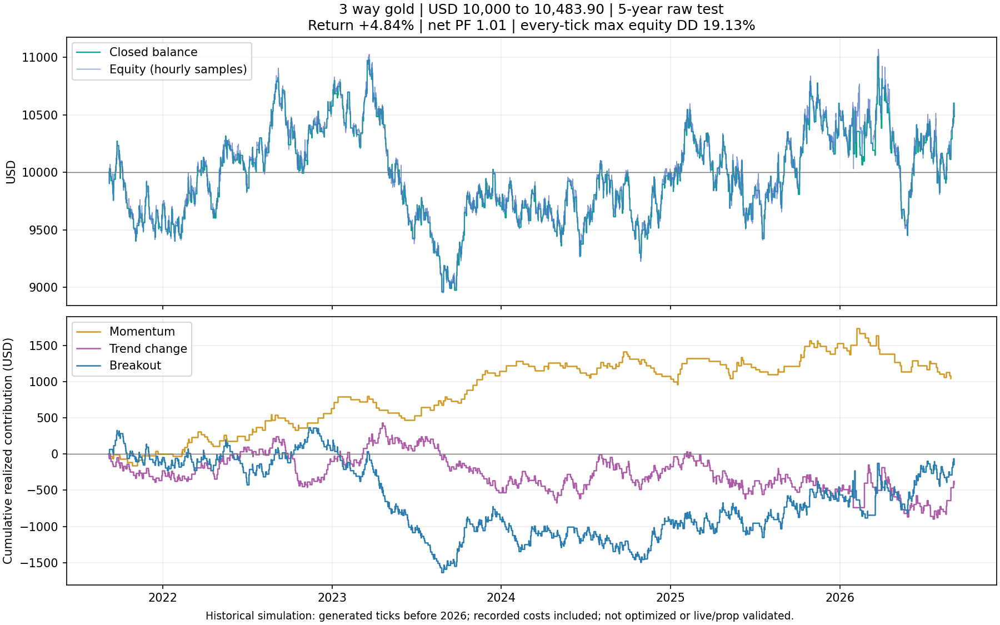

# 3 way gold — raw MT5 results

Research-only v0.1. No optimization, live deployment, website changes, installer changes or Git push.
The video is a concept, not an executable rulebook. This is our disclosed H1 implementation; the creator's +504% / 13% DD / 1,561 trades / PF 1.44 remains unverified and is not a replication benchmark.

## Fixed strategy and risk

- Momentum: EMA20 pullback/reclaim aligned with EMA50/200, ADX14 >= 25 and directional DI.
- Trend change: fresh EMA9/21 cross confirmed by RSI14 above/below 50.
- Breakout: close beyond prior 20 H1 bars, true range >= 1.5 previous ATR14 and rising ATR14.
- Every signal uses completed H1 candles. Stops: 2 ATR14; TP: 2R. No trailing or break-even.
- 0.30% nominal equity risk per engine; same shared account, one position per engine, up to three concurrent positions. Opposite-direction engine positions are allowed on the hedging account.
- Current round-up/minimum-lot sizing retained. This is NOT a 0.90% hard portfolio risk cap. Read actual risk below.

## Combined account — independent $10,000 starts

All periods end **2026-09-05 exclusive**, matching the existing system evidence cutoff. Returns are total-period, not annualized. Costs are included in net P/L, win rate and net PF. DD is the larger of native/every-tick maximum relative EQUITY drawdown.

| Window | Start | Trades | Win rate | Net P/L | Return | Final balance | Net PF | Max equity DD | Commission | Swap |
|---|---|---:|---:|---:|---:|---:|---:|---:|---:|---:|
| 6m | 2026.03.05 | 185 | 32.43% | -$272.84 | -2.73% | $9,727.16 | 0.954 | 16.14% | -$11.95 | -$71.77 |
| 1y | 2025.09.05 | 333 | 33.93% | $380.75 | +3.81% | $10,380.75 | 1.034 | 15.09% | -$24.12 | -$152.23 |
| 3y | 2023.09.05 | 1095 | 35.07% | $1,317.69 | +13.18% | $11,317.69 | 1.042 | 14.30% | -$167.61 | -$794.06 |
| 5y | 2021.09.05 | 1809 | 34.49% | $483.90 | +4.84% | $10,483.90 | 1.010 | 19.13% | -$318.18 | -$1,536.28 |
| 2019-2026 | 2019.01.01 | 2789 | 33.88% | -$1,690.34 | -16.90% | $8,309.66 | 0.973 | 28.83% | -$515.86 | -$2,557.48 |

Five-year average net result per completed trade: **$0.27**. This is an average expectancy from this sample, not a fixed win or a live-cost guarantee.

## What each engine contributed INSIDE the combined 5-year account

These cash contributions reconcile to the combined result; they are not independent-account returns. All engines share changing equity and can hold positions simultaneously.

| Engine | Trades | Win rate | Net P/L | Net PF | Average win | Average loss | Worst loss streak | Commission | Swap |
|---|---:|---:|---:|---:|---:|---:|---:|---:|---:|
| Momentum | 207 | 40.10% | $1,044.36 | 1.203 | $74.45 | -$41.41 | 9 | -$36.41 | -$176.72 |
| Trend change | 676 | 33.28% | -$416.85 | 0.976 | $75.52 | -$38.60 | 13 | -$119.99 | -$612.15 |
| Breakout | 926 | 34.13% | -$143.61 | 0.994 | $75.34 | -$39.26 | 11 | -$161.78 | -$747.41 |

## Unchanged standalone diagnostics — 5 years

Each standalone run also starts at $10,000 with 0.30% nominal risk. The combined account can deploy three engines, so these are not equal-risk or equal-exposure performance contests. This is diagnostic attribution, not an optimization sweep.

| Run | Trades | Win rate | Return | Net PF | Max equity DD |
|---|---:|---:|---:|---:|---:|
| All three together | 1809 | 34.49% | +4.84% | 1.010 | 19.13% |
| Momentum | 207 | 40.10% | +12.02% | 1.218 | 6.53% |
| Trend change | 676 | 33.28% | -6.69% | 0.961 | 14.13% |
| Breakout | 926 | 34.13% | -2.20% | 0.991 | 17.82% |

## Actual sizing and execution

| Window | Highest trade stop risk / entry equity | Highest gross initial stop risk / observed equity* | Max concurrent | Lowest equity | Stopout | Order errors | Boundary exits |
|---|---:|---:|---:|---:|---|---:|---:|
| 6m | 1.84% | 4.27% | 3 | $8,712.18 | No | 0 | 0 |
| 1y | 2.63% | 4.08% | 3 | $9,310.35 | No | 8 | 0 |
| 3y | 2.38% | 3.68% | 3 | $9,939.25 | No | 12 | 0 |
| 5y | 2.60% | 4.02% | 3 | $8,922.49 | No | 16 | 0 |
| 2019-2026 | 3.20% | 4.98% | 3 | $7,340.03 | No | 20 | 0 |

*Gross initial stop risk sums each open trade's original entry-to-SL loss, divided by current equity at entry/hourly checks. It does not offset hedges and is not an every-tick remaining-equity-at-risk guarantee. Per-trade risk excludes extra costs/gap losses. Fixed lot minimums can make the risk input unattainable.

## Coverage and cost honesty

- Native MT5 Strategy Tester, Model 4 requested, fixed 1 ms execution delay; Exness Zero demo feed, 1:2000 leverage. This is not FTMO or live-account evidence.
- Broker logs place real-tick history at 2026-01-01 onward. Earlier periods use generated ticks where real ticks are absent. A native "100%" history label does not turn generated ticks into observed historical ticks.
- Historical broker spreads plus recorded commission/swap/fees are included. They are the tester's loaded data, not independently reconstructed historical fee schedules, dynamic leverage or high-margin requirements.
- A 1 ms delay is optimistic and does not reproduce all news gaps, latency or adverse live fills. No full execution stress pipeline has been run.
- Windows overlap and the system was defined after those historical markets occurred. These are exploratory historical results, not unseen out-of-sample evidence.
- Results stop September 4 trading close; the latest September 7–11 trading week is not included, to preserve the project's comparison windows.

## Verification and native evidence

- 1y unfilled order attempts: market closed: 8. They remain unfilled; no imaginary replacement trades are added.
- 3y unfilled order attempts: market closed: 12. They remain unfilled; no imaginary replacement trades are added.
- 5y unfilled order attempts: market closed: 16. They remain unfilled; no imaginary replacement trades are added.
- 2019-2026 unfilled order attempts: market closed: 20. They remain unfilled; no imaginary replacement trades are added.
- 6m: [2026.03.05 00:00:00 to 2026.09.04 20:57:59](Backtest%20Reports/6m-engine0-d1-1789310061.htm); 3,002 closed-bar decisions checked. First/last actual tick, not assumed calendar coverage.
- 1y: [2025.09.05 00:00:00 to 2026.09.04 20:57:59](Backtest%20Reports/1y-engine0-d1-1789310090.htm); 5,911 closed-bar decisions checked. First/last actual tick, not assumed calendar coverage.
- 3y: [2023.09.05 00:00:00 to 2026.09.04 20:57:59](Backtest%20Reports/3y-engine0-d1-1789310156.htm); 17,738 closed-bar decisions checked. First/last actual tick, not assumed calendar coverage.
- 5y: [2021.09.05 22:05:00 to 2026.09.04 20:57:59](Backtest%20Reports/5y-engine0-d1-1789310384.htm); 29,558 closed-bar decisions checked. First/last actual tick, not assumed calendar coverage.
- 2019-2026: [2019.01.02 00:00:00 to 2026.09.04 20:57:59](Backtest%20Reports/2019-2026-engine0-d1-1789310471.htm); 45,350 closed-bar decisions checked. First/last actual tick, not assumed calendar coverage.

Native signal self-tests and Python unit tests cover mirrored long/short rules, equality boundaries, no-trend and no-expansion cases, net-cost classification, tester-only isolation, valid zero-spread quotes and no optimization. Every exported decision is independently recomputed. Channel extrema, OHLC, true range, ATR and warmed-up EMAs are checked against exported H1 history. Each filled entry has a valid engine signal; trade/fee totals reconcile with the native report; a single engine never holds overlapping positions.

The first 6-month preflight is archived under Preflight/. A quote-validation correction permits valid zero spreads; no signal parameters changed. Preflight vs final 6-month trade ledgers are checked for exact equality below.

Preflight/final 6-month trade ledger: **identical**.

## Monthly closed-trade P/L — combined 5 years

Cash belongs to the month a trade closes, including its full recorded costs. First/last months are partial. This is not a mark-to-market monthly equity return or a payout simulation. All windows and standalone runs are in monthly-breakdown.csv/json.

| Month | Trades | Net win rate | Net USD | Closed balance | Momentum USD | Trend change USD | Breakout USD | Commission | Swap |
|---|---:|---:|---:|---:|---:|---:|---:|---:|---:|
| 2021.09 | 35 | 37.14% | $86.30 | $10,086.30 | -$71.35 | -$123.53 | $281.18 | -$9.30 | -$13.90 |
| 2021.10 | 30 | 16.67% | -$572.97 | $9,513.33 | -$87.18 | -$172.45 | -$313.34 | -$7.27 | -$50.23 |
| 2021.11 | 31 | 41.94% | $272.37 | $9,785.70 | $138.22 | $66.77 | $67.38 | -$6.98 | -$25.66 |
| 2021.12 | 26 | 34.62% | -$64.07 | $9,721.63 | $24.11 | -$3.58 | -$84.60 | -$6.36 | -$58.76 |
| 2022.01 | 27 | 29.63% | -$186.34 | $9,535.29 | -$30.67 | -$144.74 | -$10.93 | -$7.17 | -$39.04 |
| 2022.02 | 35 | 45.71% | $281.90 | $9,817.19 | $187.31 | $28.02 | $66.57 | -$8.35 | -$56.12 |
| 2022.03 | 25 | 44.00% | $272.58 | $10,089.77 | $79.16 | $225.05 | -$31.63 | -$3.75 | -$46.53 |
| 2022.04 | 25 | 24.00% | -$269.31 | $9,820.46 | -$133.64 | -$81.71 | -$53.96 | -$4.85 | -$21.90 |
| 2022.05 | 32 | 40.62% | $260.14 | $10,080.60 | $74.62 | $148.59 | $36.93 | -$6.31 | -$47.03 |
| 2022.06 | 23 | 26.09% | -$247.30 | $9,833.30 | $14.40 | $87.33 | -$349.03 | -$4.95 | -$31.54 |
| 2022.07 | 24 | 54.17% | $465.51 | $10,298.81 | $175.61 | $36.18 | $253.72 | -$5.09 | -$31.51 |
| 2022.08 | 33 | 48.48% | $468.16 | $10,766.97 | $164.37 | $105.68 | $198.11 | -$8.82 | -$27.27 |
| 2022.09 | 28 | 17.86% | -$527.99 | $10,238.98 | -$112.81 | -$233.86 | -$181.32 | -$6.38 | -$16.04 |
| 2022.10 | 34 | 29.41% | -$186.59 | $10,052.39 | -$56.90 | -$388.56 | $258.87 | -$7.01 | -$51.26 |
| 2022.11 | 20 | 55.00% | $406.90 | $10,459.29 | $133.03 | $130.45 | $143.42 | -$4.63 | -$37.91 |
| 2022.12 | 26 | 38.46% | $116.49 | $10,575.78 | $131.81 | $217.19 | -$232.51 | -$6.17 | -$25.66 |
| 2023.01 | 30 | 33.33% | -$57.09 | $10,518.69 | $162.87 | -$26.97 | -$192.99 | -$6.65 | -$32.04 |
| 2023.02 | 19 | 21.05% | -$265.25 | $10,253.44 | -$70.30 | -$31.87 | -$163.08 | -$4.36 | -$18.69 |
| 2023.03 | 35 | 45.71% | $392.93 | $10,646.37 | -$8.94 | $349.42 | $52.45 | -$7.57 | -$58.28 |
| 2023.04 | 32 | 21.88% | -$460.22 | $10,186.15 | -$109.65 | $51.51 | -$402.08 | -$6.54 | -$26.19 |
| 2023.05 | 38 | 26.32% | -$352.66 | $9,833.49 | -$106.84 | -$92.80 | -$153.02 | -$7.90 | -$25.11 |
| 2023.06 | 28 | 25.00% | -$245.54 | $9,587.95 | $29.97 | -$39.06 | -$236.45 | -$6.22 | -$20.82 |
| 2023.07 | 36 | 30.56% | -$119.81 | $9,468.14 | $80.97 | $40.33 | -$241.11 | -$9.32 | -$14.44 |
| 2023.08 | 36 | 25.00% | -$306.80 | $9,161.34 | $130.57 | -$163.64 | -$273.73 | -$9.75 | -$26.75 |
| 2023.09 | 31 | 35.48% | $33.33 | $9,194.67 | -$34.26 | -$152.50 | $220.09 | -$9.20 | -$9.62 |
| 2023.10 | 33 | 48.48% | $484.14 | $9,678.81 | $245.61 | -$100.35 | $338.88 | -$7.03 | -$25.61 |
| 2023.11 | 31 | 41.94% | $225.25 | $9,904.06 | $202.56 | -$73.64 | $96.33 | -$7.40 | -$33.69 |
| 2023.12 | 30 | 26.67% | -$200.23 | $9,703.83 | -$7.27 | -$192.54 | -$0.42 | -$6.51 | -$35.27 |
| 2024.01 | 32 | 34.38% | -$1.65 | $9,702.18 | $79.29 | $180.08 | -$261.02 | -$7.30 | -$18.18 |
| 2024.02 | 28 | 35.71% | -$15.34 | $9,686.84 | -$11.09 | $27.25 | -$31.50 | -$7.71 | -$48.10 |
| 2024.03 | 28 | 32.14% | -$53.04 | $9,633.80 | -$64.43 | -$117.58 | $128.97 | -$6.25 | -$27.79 |
| 2024.04 | 25 | 32.00% | -$55.94 | $9,577.86 | $107.53 | -$154.24 | -$9.23 | -$3.01 | -$18.19 |
| 2024.05 | 34 | 41.18% | $278.35 | $9,856.21 | -$41.06 | $250.26 | $69.15 | -$5.38 | -$24.58 |
| 2024.06 | 30 | 26.67% | -$249.00 | $9,607.21 | -$93.31 | -$75.34 | -$80.35 | -$5.03 | -$20.83 |
| 2024.07 | 35 | 45.71% | $391.04 | $9,998.25 | $71.61 | $414.43 | -$95.00 | -$6.13 | -$33.11 |
| 2024.08 | 39 | 25.64% | -$385.32 | $9,612.93 | -$14.25 | -$209.20 | -$161.87 | -$6.49 | -$22.43 |
| 2024.09 | 34 | 41.18% | $315.49 | $9,928.42 | $168.97 | $42.16 | $104.36 | -$5.77 | -$25.12 |
| 2024.10 | 36 | 22.22% | -$429.31 | $9,499.11 | -$44.69 | -$170.41 | -$214.21 | -$5.93 | -$37.93 |
| 2024.11 | 34 | 41.18% | $228.52 | $9,727.63 | -$197.50 | $117.02 | $309.00 | -$4.93 | -$22.44 |
| 2024.12 | 28 | 39.29% | $161.23 | $9,888.86 | -$70.84 | $55.47 | $176.60 | -$4.49 | -$16.55 |
| 2025.01 | 35 | 48.57% | $543.27 | $10,432.13 | $216.57 | $177.05 | $149.65 | -$6.60 | -$47.02 |
| 2025.02 | 27 | 25.93% | -$266.37 | $10,165.76 | $71.31 | -$95.82 | -$241.86 | -$3.63 | -$12.82 |
| 2025.03 | 26 | 30.77% | -$74.15 | $10,091.61 | -$37.66 | -$135.85 | $99.36 | -$3.81 | -$18.17 |
| 2025.04 | 33 | 33.33% | -$62.68 | $10,028.93 | -$105.20 | -$73.29 | $115.81 | -$2.73 | -$7.47 |
| 2025.05 | 44 | 31.82% | -$175.79 | $9,853.14 | $38.82 | -$162.90 | -$51.71 | -$4.36 | -$9.60 |
| 2025.06 | 29 | 31.03% | -$55.32 | $9,797.82 | -$19.54 | $20.45 | -$56.23 | -$3.19 | -$11.77 |
| 2025.07 | 29 | 34.48% | $25.80 | $9,823.62 | -$99.94 | $19.37 | $106.37 | -$3.61 | -$17.11 |
| 2025.08 | 32 | 34.38% | $85.41 | $9,909.03 | $36.01 | $85.14 | -$35.74 | -$5.02 | -$32.61 |
| 2025.09 | 26 | 34.62% | -$6.63 | $9,902.40 | $76.44 | -$187.12 | $104.05 | -$3.05 | -$7.49 |
| 2025.10 | 32 | 53.12% | $758.54 | $10,660.94 | $311.89 | $152.08 | $294.57 | -$2.27 | -$11.70 |
| 2025.11 | 26 | 26.92% | -$185.21 | $10,475.73 | -$36.85 | -$95.37 | -$52.99 | -$2.06 | -$21.89 |
| 2025.12 | 27 | 33.33% | $12.40 | $10,488.13 | $38.46 | $0.00 | -$26.06 | -$2.27 | -$17.60 |
| 2026.01 | 24 | 33.33% | -$328.61 | $10,159.52 | -$18.99 | -$269.28 | -$40.34 | -$1.64 | -$7.44 |
| 2026.02 | 14 | 28.57% | $160.93 | $10,320.45 | $100.53 | $337.96 | -$277.56 | -$0.84 | -$17.02 |
| 2026.03 | 26 | 34.62% | $62.49 | $10,382.94 | -$224.09 | -$99.09 | $385.67 | -$1.56 | -$9.04 |
| 2026.04 | 29 | 24.14% | -$237.93 | $10,145.01 | -$117.19 | -$90.12 | -$30.62 | -$1.89 | -$21.24 |
| 2026.05 | 31 | 22.58% | -$361.75 | $9,783.26 | -$130.83 | -$181.84 | -$49.08 | -$1.96 | -$12.21 |
| 2026.06 | 35 | 45.71% | $495.49 | $10,278.75 | $86.65 | $37.05 | $371.79 | -$2.20 | -$4.77 |
| 2026.07 | 32 | 28.12% | -$268.50 | $10,010.25 | -$87.14 | -$38.79 | -$142.57 | -$2.82 | -$13.88 |
| 2026.08 | 29 | 41.38% | $382.29 | $10,392.54 | -$90.50 | $310.49 | $162.30 | -$1.99 | -$9.58 |
| 2026.09 | 7 | 42.86% | $91.36 | $10,483.90 | $0.00 | $48.41 | $42.95 | -$0.42 | -$3.73 |

## Recommendation

Do not add this combined raw version to the portfolio. The five-year net PF is only about 1.01, six-month performance is negative, and the 2019–2026 run loses money. Momentum is the strongest five-year standalone candidate; trend change and breakout each lose money in their unchanged standalone runs and reduce the combined five-year profit. This does not establish momentum as a robust winner: the selection is retrospective, and it still needs separate unseen-period and execution-cost validation.

My proposed next step, only if approved: study momentum first; redesign the weak engines from a fresh, predeclared hypothesis before considering a full combined optimization. Address minimum-lot risk overshoot and realistic execution costs before any live or prop-firm deployment. No such optimization, redesign or deployment was performed in this raw experiment. Do not assume three named engines are independent or that a positive long backtest predicts future profits.

See [RULES.md](RULES.md) for engine-by-engine sources and every assumption. The research references justify candidate families, not “best settings.” No performance parameters were tuned.

