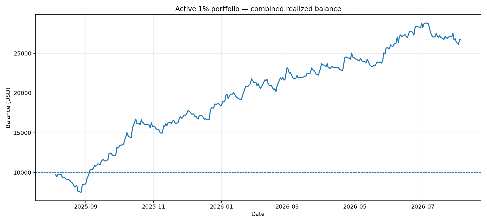
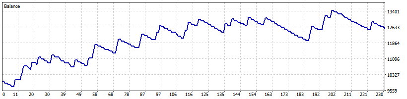
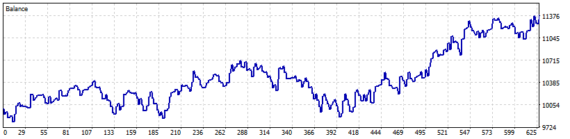
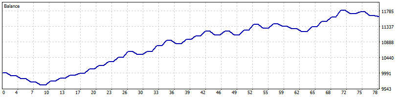
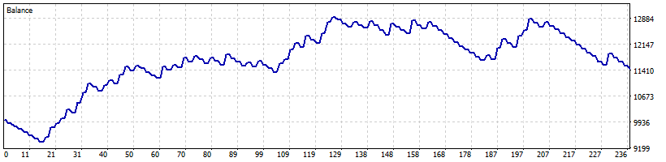
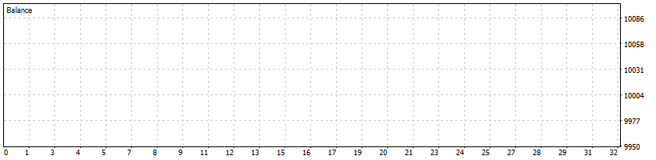
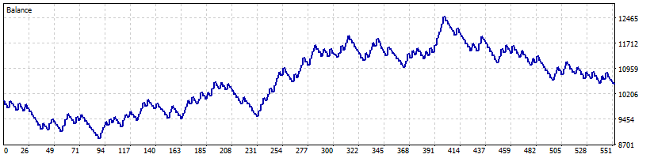
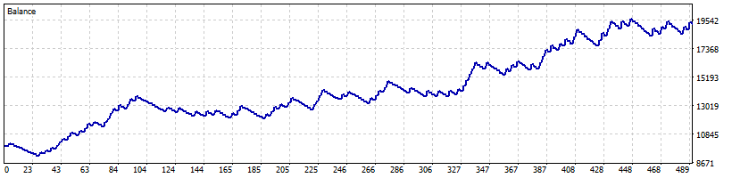

# Active 1% portfolio — one-year Exness report

## Test method

- Broker: Exness Technologies Ltd, `Exness-MT5Trial16`
- Period: 2025-08-05 through 2026-08-04
- Initial balance: $10,000 USD per individual test
- Leverage: 1:2000
- Model: Every tick generated from Exness M1 data
- Execution: random execution delay
- Risk: synchronized installer settings at 1% per EA trade; Go Long uses the installer-equivalent fixed lot and hard stop

## Results

| EA | Chart | Net profit | Return | Max equity DD | PF | Win rate | Trades |
|---|---|---:|---:|---:|---:|---:|---:|
| ATR Candle Breakout | XAUUSD H1 | $2,554.10 | 25.54% | 8.77% | 1.34 | 25.22% | 115 |
| Go Long | US30 D1 | $1,392.50 | 13.93% | 8.34% | 1.16 | 50.32% | 312 |
| AAA Final EMA3 | XAUUSD H4 | $1,619.52 | 16.20% | 4.10% | 2.21 | 61.54% | 39 |
| AAA Final Asia Breakout | XAUUSD H1 | $1,442.45 | 14.42% | 12.15% | 1.18 | 35.59% | 118 |
| AAA Final Weekend Direction | XAUUSD M15 | $0.00 | 0.00% | 0.00% | 0.00 | 0.00% | 0 |
| AAA Final XAU Weakness | XAUUSD M15 | $506.74 | 5.07% | 16.55% | 1.03 | 34.91% | 275 |
| LTA Volume Profile | XAUUSD M15 | $9,214.62 | 92.15% | 14.82% | 1.41 | 32.79% | 244 |

## Combined realized-balance aggregation

- Final balance: $26,729.93
- Net profit: $16,729.93 (167.30%)
- Realized balance drawdown: $2,571.75 (25.72%)
- Aggregated profit factor: 1.26
- Trades: 1,103; winning trades: 428 (38.80%)

## Individual native MT5 reports and graphs

### ATR Candle Breakout — XAUUSD H1

- Final balance: $12,554.10
- Net profit: $2,554.10 (25.54%)
- Max equity drawdown: $1,157.89 (8.77%)
- Profit factor: 1.34; recovery factor: 2.21; Sharpe: 3.23
- Trades: 115; wins: 29 (25.22%); losses: 86
- Average win/loss: $348.58 / $-87.54
- Largest win/loss: $397.54 / $-100.00
- [Native MT5 report](MT5 Reports/active-01-atr-candle-breakout.htm)

### Go Long — US30 D1

- Final balance: $11,392.50
- Net profit: $1,392.50 (13.93%)
- Max equity drawdown: $896.38 (8.34%)
- Profit factor: 1.16; recovery factor: 1.55; Sharpe: 0.88
- Trades: 312; wins: 157 (50.32%); losses: 155
- Average win/loss: $64.61 / $-56.16
- Largest win/loss: $334.53 / $-180.56
- [Native MT5 report](MT5 Reports/active-02-go-long.htm)

### AAA Final EMA3 — XAUUSD H4

- Final balance: $11,619.52
- Net profit: $1,619.52 (16.20%)
- Max equity drawdown: $411.06 (4.10%)
- Profit factor: 2.21; recovery factor: 3.94; Sharpe: 3.88
- Trades: 39; wins: 24 (61.54%); losses: 15
- Average win/loss: $123.39 / $-89.24
- Largest win/loss: $192.32 / $-114.21
- [Native MT5 report](MT5 Reports/active-03-aaa-final-ema3.htm)

### AAA Final Asia Breakout — XAUUSD H1

- Final balance: $11,442.45
- Net profit: $1,442.45 (14.42%)
- Max equity drawdown: $1,579.94 (12.15%)
- Profit factor: 1.18; recovery factor: 0.91; Sharpe: 1.56
- Trades: 118; wins: 42 (35.59%); losses: 76
- Average win/loss: $221.61 / $-103.14
- Largest win/loss: $360.71 / $-146.72
- [Native MT5 report](MT5 Reports/active-04-aaa-final-asia-breakout.htm)

### AAA Final Weekend Direction — XAUUSD M15

- Final balance: $10,000.00
- Net profit: $0.00 (0.00%)
- Max equity drawdown: $0.00 (0.00%)
- Profit factor: 0.00; recovery factor: 0.00; Sharpe: 0.00
- Trades: 0; wins: 0 (0.00%); losses: 0
- Average win/loss: $0.00 / $0.00
- Largest win/loss: $0.00 / $0.00
- [Native MT5 report](MT5 Reports/active-05-aaa-final-weekend-direction.htm)

### AAA Final XAU Weakness — XAUUSD M15

- Final balance: $10,506.74
- Net profit: $506.74 (5.07%)
- Max equity drawdown: $2,075.86 (16.55%)
- Profit factor: 1.03; recovery factor: 0.24; Sharpe: 0.41
- Trades: 275; wins: 96 (34.91%); losses: 179
- Average win/loss: $190.52 / $-98.73
- Largest win/loss: $246.46 / $-182.72
- [Native MT5 report](MT5 Reports/active-06-aaa-final-xau-weakness.htm)

### LTA Volume Profile — XAUUSD M15

- Final balance: $19,214.62
- Net profit: $9,214.62 (92.15%)
- Max equity drawdown: $2,084.51 (14.82%)
- Profit factor: 1.41; recovery factor: 4.42; Sharpe: 4.48
- Trades: 244; wins: 80 (32.79%); losses: 164
- Average win/loss: $393.76 / $-134.90
- Largest win/loss: $570.80 / $-192.80
- [Native MT5 report](MT5 Reports/active-07-lta-volume-profile.htm)

## Critical combined-result limitation

The combined curve merges the realized cash flows from seven separate $10,000 MT5 tests. It shows what their closed-deal results would look like on one timeline, including commissions and swaps. It is not an exact multi-EA MT5 portfolio simulation: percentage-risk EAs sized trades from their own standalone balances, not a shared changing balance, and the combined curve does not reconstruct overlapping floating P/L. Therefore the combined realized drawdown can understate live equity drawdown. Simultaneous 1% trades can stack account exposure well above 1%.

Weekend Direction generated zero trades on this Exness data/window despite being enabled. That is reported as-is, not filled using results from a different broker.
