# Synchronized BAT portfolio — complete one-year Exness backtest

## Method

- Source of truth: `_Auto Deploy/Install-BMTradingPortfolio.ps1` (13 currently deployed EAs)
- Broker: Exness `Exness-MT5Trial16`
- Period: 2025-08-07 through 2026-08-06 (latest complete 12-month window available in the synchronized local Exness history)
- Initial balance: USD 10,000 for each independent EA test
- Risk: the exact 1%/USD 100 configuration referenced by the AUTO BAT
- Model: MT5 Every Tick generated from broker history, random execution delay, leverage 1:2000
- Execution evidence: native MT5 reports generated 7 Aug 2026; on 9 Aug every input was compared with the current BAT reference and all 13 matched. A same-day rerun was attempted but Exness weekend synchronization did not authorize the isolated tester.
- PASS gate used for labeling only: return >=20%, PF >=1.10, equity DD <=20%

## Individual results

| Status | EA | Symbol / TF | Final | Net / return | Max equity DD | PF | Win rate | Trades |
|---|---|---|---:|---:|---:|---:|---:|---:|
| PASS | LTA Volume Profile | XAUUSD M15 | $18,204.75 | $8,204.75 / +82.05% | $1,947.69 / 14.39% | 1.37 | 32.11% | 246 |
| WATCH | ORB Volume Profile | XAUUSD M5 | $10,818.92 | $818.92 / +8.19% | $650.20 / 6.40% | 1.53 | 40.00% | 50 |
| PASS | ATR Candle Breakout | XAUUSD H1 | $13,020.35 | $3,020.35 / +30.20% | $1,157.89 / 8.77% | 1.40 | 26.50% | 117 |
| PASS | AAA Final Asia Breakout | XAUUSD H1 | $12,140.45 | $2,140.45 / +21.40% | $1,674.16 / 12.66% | 1.27 | 37.29% | 118 |
| PASS | AAA Final DmC | XAUUSD H1 | $12,089.81 | $2,089.81 / +20.90% | $1,197.61 / 9.82% | 1.15 | 41.20% | 233 |
| WATCH | Go Long | US30 D1 | $11,724.47 | $1,724.47 / +17.24% | $896.06 / 8.29% | 1.20 | 50.64% | 312 |
| WATCH | AAA Final EMA3 | XAUUSD H4 | $11,575.60 | $1,575.60 / +15.76% | $394.48 / 3.93% | 2.14 | 61.54% | 39 |
| WATCH | AAA Final XAU Weakness | XAUUSD M15 | $10,919.35 | $919.35 / +9.19% | $2,261.34 / 17.89% | 1.05 | 35.74% | 277 |
| WATCH | Ninja Turtle Scalper | EURUSD M5 | $10,847.66 | $847.66 / +8.48% | $920.08 / 8.54% | 1.13 | 79.89% | 353 |
| WATCH | Nasdaq Overnight | USTEC M1 | $10,785.28 | $785.28 / +7.85% | $260.77 / 2.39% | 1.85 | 57.75% | 71 |
| WATCH | Turnaround Tuesday | USTEC D1 | $10,328.73 | $328.73 / +3.29% | $633.40 / 6.11% | 1.20 | 36.67% | 30 |
| WATCH | AAA Final US100 Weakness | USTEC M15 | $10,326.78 | $326.78 / +3.27% | $663.10 / 6.04% | 1.15 | 42.86% | 70 |
| FAIL | AAA Final News Pulse - TEMP TEST | XAUUSD M1 | $9,495.12 | -$504.88 / -5.05% | $623.36 / 6.16% | 0.00 | 0.00% | 11 |

## Combined realized cash-flow aggregation

- Initial balance: $10,000.00
- Final balance: $32,277.27
- Net result: $22,277.27 (+222.77%)
- Realized-balance max drawdown: $2,487.58 (24.88%)
- Aggregated PF: 1.24
- Trades: 1,927; wins: 915 (47.48%)

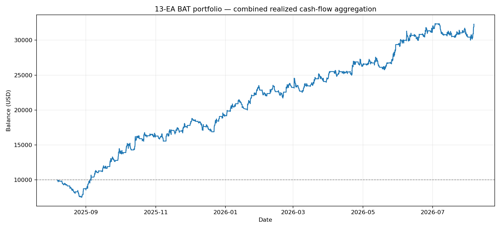

## Important portfolio limitation

The combined curve merges closed-deal cash flows from 13 separate $10,000 MT5 tests. It is not an exact shared-margin simulation: each percentage-risk EA sized from its standalone balance, and overlapping floating P/L is unavailable. Consequently, live shared-account equity drawdown can be materially worse. With 13 EAs each allowed roughly 1% risk, simultaneous exposure can approach 13% before correlations, slippage, or gaps.

## Native reports and graphs

### LTA Volume Profile — XAUUSD M15

- Net: $8,204.75 (+82.05%); equity DD: 14.39%; PF: 1.37
- Trades: 246; wins/losses: 79/167; average win/loss: $383.13/-$131.17
- [Native MT5 report](MT5 Reports/01-lta-volume-profile.htm)

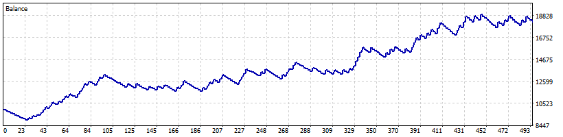

### ORB Volume Profile — XAUUSD M5

- Net: $818.92 (+8.19%); equity DD: 6.40%; PF: 1.53
- Trades: 50; wins/losses: 20/30; average win/loss: $118.16/-$50.89
- [Native MT5 report](MT5 Reports/02-orb-volume-profile.htm)

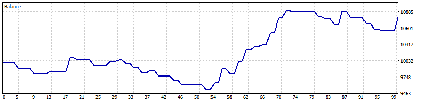

### ATR Candle Breakout — XAUUSD H1

- Net: $3,020.35 (+30.20%); equity DD: 8.77%; PF: 1.40
- Trades: 117; wins/losses: 31/86; average win/loss: $341.14/-$87.54
- [Native MT5 report](MT5 Reports/03-atr-candle-breakout.htm)

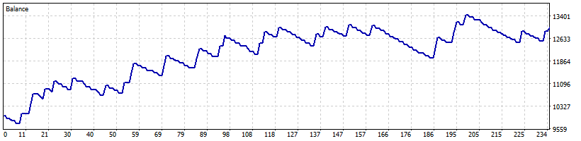

### AAA Final Asia Breakout — XAUUSD H1

- Net: $2,140.45 (+21.40%); equity DD: 12.66%; PF: 1.27
- Trades: 118; wins/losses: 44/74; average win/loss: $225.69/-$104.91
- [Native MT5 report](MT5 Reports/04-aaa-final-asia-breakout.htm)

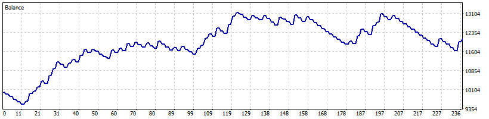

### AAA Final DmC — XAUUSD H1

- Net: $2,089.81 (+20.90%); equity DD: 9.82%; PF: 1.15
- Trades: 233; wins/losses: 96/137; average win/loss: $162.64/-$98.31
- [Native MT5 report](MT5 Reports/05-aaa-final-dmc.htm)

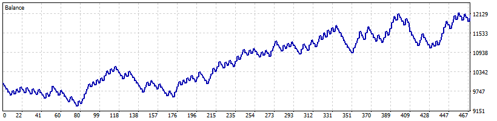

### Go Long — US30 D1

- Net: $1,724.47 (+17.24%); equity DD: 8.29%; PF: 1.20
- Trades: 312; wins/losses: 158/154; average win/loss: $65.78/-$55.99
- [Native MT5 report](MT5 Reports/06-go-long.htm)

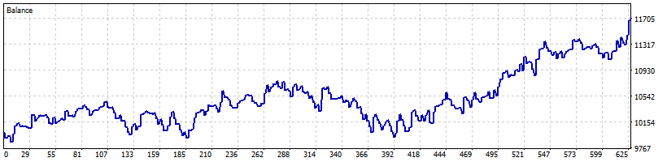

### AAA Final EMA3 — XAUUSD H4

- Net: $1,575.60 (+15.76%); equity DD: 3.93%; PF: 2.14
- Trades: 39; wins/losses: 24/15; average win/loss: $123.39/-$92.17
- [Native MT5 report](MT5 Reports/07-aaa-final-ema3.htm)

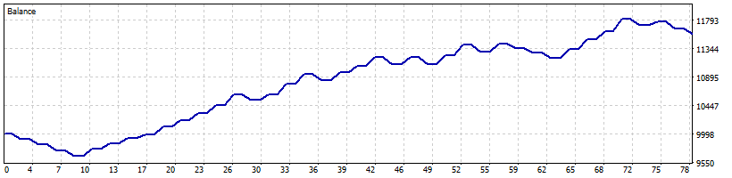

### AAA Final XAU Weakness — XAUUSD M15

- Net: $919.35 (+9.19%); equity DD: 17.89%; PF: 1.05
- Trades: 277; wins/losses: 99/178; average win/loss: $192.89/-$101.48
- [Native MT5 report](MT5 Reports/08-aaa-final-xau-weakness.htm)

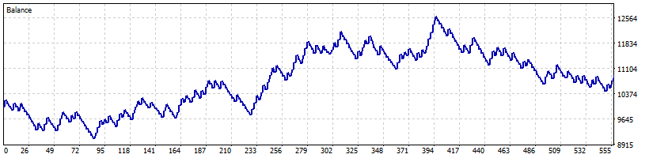

### Ninja Turtle Scalper — EURUSD M5

- Net: $847.66 (+8.48%); equity DD: 8.54%; PF: 1.13
- Trades: 353; wins/losses: 282/71; average win/loss: $26.89/-$93.87
- [Native MT5 report](MT5 Reports/09-ninja-turtle-scalper.htm)

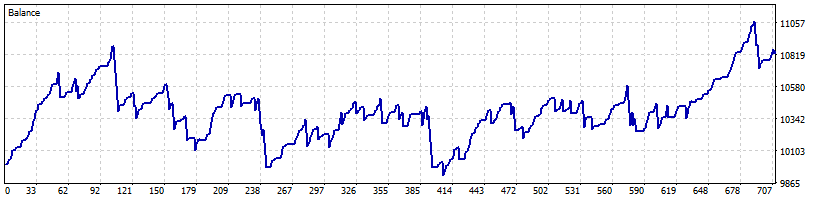

### Nasdaq Overnight — USTEC M1

- Net: $785.28 (+7.85%); equity DD: 2.39%; PF: 1.85
- Trades: 71; wins/losses: 41/30; average win/loss: $41.59/-$30.38
- [Native MT5 report](MT5 Reports/10-nasdaq-overnight.htm)

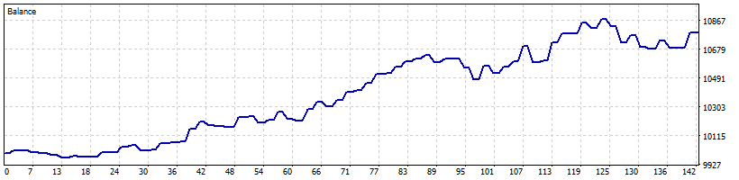

### Turnaround Tuesday — USTEC D1

- Net: $328.73 (+3.29%); equity DD: 6.11%; PF: 1.20
- Trades: 30; wins/losses: 11/19; average win/loss: $180.88/-$86.98
- [Native MT5 report](MT5 Reports/11-turnaround-tuesday.htm)

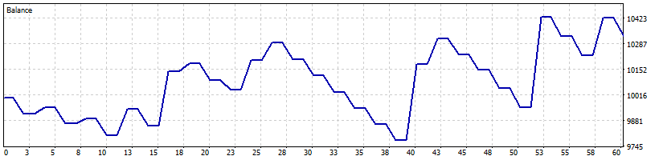

### AAA Final US100 Weakness — USTEC M15

- Net: $326.78 (+3.27%); equity DD: 6.04%; PF: 1.15
- Trades: 70; wins/losses: 30/40; average win/loss: $83.29/-$53.56
- [Native MT5 report](MT5 Reports/12-aaa-final-us100-weakness.htm)

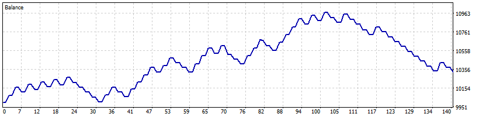

### AAA Final News Pulse - TEMP TEST — XAUUSD M1

- Net: -$504.88 (-5.05%); equity DD: 6.16%; PF: 0.00
- Trades: 11; wins/losses: 0/11; average win/loss: $0.00/-$45.62
- [Native MT5 report](MT5 Reports/13-aaa-final-news-pulse.htm)

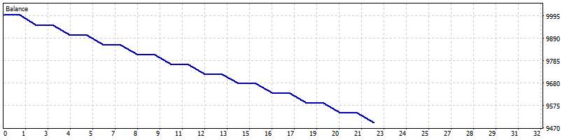

