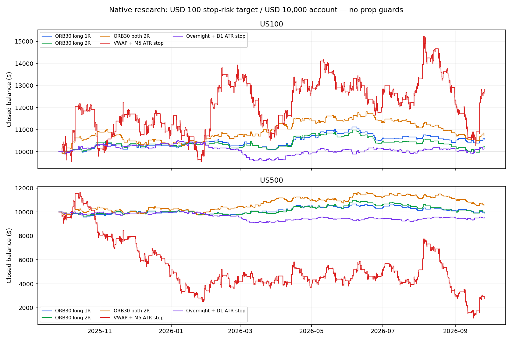

# Conte interview ideas — native tests and prop scenarios

Built and tested as isolated research. No live EA, installer, website or account was changed.

## Decision

No candidate has earned promotion through the frozen raw gates. Do not add this basket to the funded system on these results.

PEAD is **not tested**: individual-stock point-in-time earnings/consensus and historical universe data are missing. The three index strategy families were built and tested; that is not a four-paper replication.

10 long-history attempts are data/execution-blocked and excluded from performance statistics. A blocked test is not a pass or a measured strategy loss. See the data-blocked table below.

## Read this before the numbers

- Periods end 2026-09-27 (exclusive). Last year starts 2025-09-27; last six months 2026-03-27. Last trading date may be earlier.
- Protected rows: $10,000 native starting balance and fixed $100 intended initial hard-stop risk, no compounding. Actual fill risk/cost can differ. These are NOT the guarded prop-account results.
- Unstopped rows: fixed **1 CFD lot**, NOT 1% risk. One US100 lot is not one NQ futures contract. Never compare their percentage returns as equal-risk strategies.
- The source broker has real ticks only from 2026-01-01. Older data in Model 4 is generated ticks; Model 1 is generated-tick screening. Neither the year nor the five-year test is all real tick data.
- Source execution quotes often show zero spread. Real-tick availability is NOT proof of representative prop-firm costs. Order-log quote diagnostics are recorded below; swap specifications are tester-time metadata, not independently verified historical financing.
- Original 16:00 instructions execute at the earlier of **15:59 New York or one minute before the broker session ends** (15:54 on winter Fridays in this source). VWAP is **tick-volume VWAP**, not consolidated ETF/futures trade-volume VWAP.
- ORB uses completed M5 breakout closes of the 09:30–10:00 range, flat 15:30. VWAP reverses on closed M1 signals; protected stop = 2 x completed M5 ATR14. Overnight long at the broker-aware closing cutoff, exit next NYSE open; protected stop = 1 x completed UTC D1 ATR14.
- Latest year is repeatedly used research history, not a newly untouched holdout. All 22 configurations and controls were declared before results; no full parameter optimization was run.
- PF is calculated from NET complete trades including commission/swap, not separate native report deal components. Trades/day means per weekday including zero-trade weekdays; holidays reduce actual session count.

## Last-year protected strategies — comparable $100 intended stop risk

| Asset | Strategy | Return | PF | Win | Eq DD | Trades | /mo | /weekday | W/L max |
|---|---|---:|---:|---:|---:|---:|---:|---:|---:|
| US500 | ORB30 both 2R | +5.46% | 1.06 | 45.93% | 9.62% | 246 | 20.5 | 0.95 | 7/7 |
| US500 | ORB30 long 1R | -0.95% | 0.98 | 50.31% | 7.21% | 161 | 13.4 | 0.62 | 7/6 |
| US500 | ORB30 long 2R | -0.26% | 1.00 | 48.45% | 9.88% | 161 | 13.4 | 0.62 | 7/9 |
| US500 | Overnight + D1 ATR stop | -4.89% | 0.90 | 52.42% | 10.57% | 248 | 20.7 | 0.95 | 7/5 |
| US500 | VWAP + M5 ATR stop | -70.69% | 0.92 | 16.21% | 90.73% | 3967 | 330.8 | 15.26 | 5/47 |
| US100 | ORB30 both 2R | +7.40% | 1.10 | 51.44% | 11.27% | 243 | 20.3 | 0.93 | 6/5 |
| US100 | ORB30 long 1R | +5.70% | 1.14 | 56.05% | 7.45% | 157 | 13.1 | 0.60 | 5/5 |
| US100 | ORB30 long 2R | +2.11% | 1.05 | 54.14% | 9.96% | 157 | 13.1 | 0.60 | 5/6 |
| US100 | Overnight + D1 ATR stop | +1.27% | 1.03 | 51.21% | 9.39% | 248 | 20.7 | 0.95 | 8/5 |
| US100 | VWAP + M5 ATR stop | +28.17% | 1.04 | 17.30% | 33.27% | 3758 | 313.4 | 14.45 | 4/38 |

The curves show closed balance at full native research risk, not the prop overlay and not intra-trade equity. See the tables for native equity drawdown.

## Controls and unstopped benchmarks

Same columns; raw one-lot rows do not have the same risk budget.

| Asset | Strategy | Return | PF | Win | Eq DD | Trades | /mo | /weekday | W/L max |
|---|---|---:|---:|---:|---:|---:|---:|---:|---:|
| US500 | Day long + D1 ATR control | +0.23% | 1.00 | 50.81% | 7.98% | 248 | 20.7 | 0.95 | 5/5 |
| US500 | Day long / fixed 1 lot control | -0.28% | 0.99 | 50.81% | 7.10% | 248 | 20.7 | 0.95 | 5/5 |
| US500 | 10:00 long control | -19.28% | 0.84 | 47.18% | 22.84% | 248 | 20.7 | 0.95 | 5/7 |
| US500 | Overnight / fixed 1 lot | +3.01% | 1.09 | 53.23% | 6.62% | 248 | 20.7 | 0.95 | 8/5 |
| US500 | TWAP + M5 ATR control † | -99.55% | 0.89 | 17.36% | 99.61% | 4217 | 351.7 | 16.22 | 5/48 |
| US500 | VWAP / fixed 1 lot | -11.73% | 0.89 | 16.24% | 15.20% | 3960 | 330.2 | 15.23 | 5/47 |
| US100 | Day long + D1 ATR control | -0.05% | 1.00 | 50.40% | 10.39% | 248 | 20.7 | 0.95 | 7/8 |
| US100 | Day long / fixed 1 lot control | +6.94% | 1.03 | 51.21% | 33.81% | 248 | 20.7 | 0.95 | 7/8 |
| US100 | 10:00 long control | -7.86% | 0.92 | 51.61% | 18.98% | 248 | 20.7 | 0.95 | 6/8 |
| US100 | Overnight / fixed 1 lot | +23.46% | 1.12 | 52.02% | 25.70% | 248 | 20.7 | 0.95 | 8/5 |
| US100 | TWAP + M5 ATR control | +1.53% | 1.00 | 17.66% | 39.72% | 4417 | 368.3 | 16.99 | 5/35 |
| US100 | VWAP / fixed 1 lot | -20.00% | 0.96 | 17.32% | 39.21% | 3753 | 313.0 | 14.43 | 4/38 |

### Execution-cost data checks

Order-log quote samples can be duplicated and are not all ticks; these diagnose source-feed limitations, not a market spread estimate. No zero spread is assumed for a future prop account.

| Asset | Protected VWAP real-tick share | Logged quotes with zero spread | Median logged spread (index points) |
|---|---|---:|---:|
| US500 | 63% real ticks | 73.81% | 0.00 |
| US100 | 63% real ticks | 67.37% | 0.00 |

### Where the money went — last-year protected VWAP and overnight

Before-fee/swap P&L below still includes the native spread and execution outcomes. It is not frictionless theoretical profit.

| Asset | Strategy | Before commission/swap | Commission + fees | Swap | Net |
|---|---|---:|---:|---:|---:|
| US500 | Overnight + D1 ATR stop | $412.10 | $-87.07 | $-813.79 | $-488.76 |
| US500 | VWAP + M5 ATR stop | $1,540.22 | $-8,609.68 | $0.00 | $-7,069.46 |
| US100 | Overnight + D1 ATR stop | $772.84 | $-38.46 | $-607.06 | $127.32 |
| US100 | VWAP + M5 ATR stop | $6,424.65 | $-3,608.14 | $0.00 | $2,816.51 |

## Six-month native results

All configured variants, not just the best.

| Asset | Strategy | Return | PF | Win | Eq DD | Trades | /mo | /weekday | W/L max |
|---|---|---:|---:|---:|---:|---:|---:|---:|---:|
| US500 | Day long + D1 ATR control | +4.83% | 1.21 | 53.97% | 5.27% | 126 | 20.8 | 0.96 | 5/5 |
| US500 | Day long / fixed 1 lot control | +4.13% | 1.22 | 53.97% | 4.35% | 126 | 20.8 | 0.96 | 5/5 |
| US500 | ORB30 both 2R | -3.40% | 0.94 | 42.74% | 10.41% | 124 | 20.5 | 0.95 | 5/5 |
| US500 | 10:00 long control | -7.84% | 0.87 | 46.83% | 12.00% | 126 | 20.8 | 0.96 | 5/7 |
| US500 | ORB30 long 1R | -1.09% | 0.97 | 45.35% | 7.22% | 86 | 14.2 | 0.66 | 7/6 |
| US500 | ORB30 long 2R | +0.90% | 1.03 | 44.19% | 9.77% | 86 | 14.2 | 0.66 | 7/9 |
| US500 | Overnight + D1 ATR stop | +3.75% | 1.17 | 53.97% | 3.93% | 126 | 20.8 | 0.96 | 6/5 |
| US500 | Overnight / fixed 1 lot | +5.07% | 1.33 | 53.97% | 2.49% | 126 | 20.8 | 0.96 | 6/5 |
| US500 | TWAP + M5 ATR control | -27.20% | 0.94 | 18.21% | 54.60% | 2279 | 377.0 | 17.40 | 5/48 |
| US500 | VWAP + M5 ATR stop | -11.22% | 0.97 | 16.63% | 49.43% | 2044 | 338.1 | 15.60 | 5/42 |
| US500 | VWAP / fixed 1 lot | -3.29% | 0.94 | 16.66% | 6.94% | 2041 | 337.6 | 15.58 | 5/41 |
| US100 | Day long + D1 ATR control | +6.99% | 1.31 | 53.17% | 5.81% | 126 | 20.8 | 0.96 | 6/8 |
| US100 | Day long / fixed 1 lot control | +30.01% | 1.26 | 53.17% | 25.04% | 126 | 20.8 | 0.96 | 6/8 |
| US100 | ORB30 both 2R | -2.31% | 0.94 | 49.59% | 12.28% | 123 | 20.3 | 0.94 | 5/5 |
| US100 | 10:00 long control | +4.46% | 1.09 | 53.97% | 10.91% | 126 | 20.8 | 0.96 | 6/8 |
| US100 | ORB30 long 1R | +4.75% | 1.21 | 54.65% | 7.52% | 86 | 14.2 | 0.66 | 5/5 |
| US100 | ORB30 long 2R | +1.29% | 1.05 | 52.33% | 10.04% | 86 | 14.2 | 0.66 | 5/6 |
| US100 | Overnight + D1 ATR stop | +5.17% | 1.23 | 56.35% | 3.41% | 126 | 20.8 | 0.96 | 8/4 |
| US100 | Overnight / fixed 1 lot | +27.39% | 1.25 | 57.14% | 15.81% | 126 | 20.8 | 0.96 | 8/4 |
| US100 | TWAP + M5 ATR control | -2.69% | 0.99 | 17.55% | 40.81% | 2279 | 377.0 | 17.40 | 4/31 |
| US100 | VWAP + M5 ATR stop | +19.28% | 1.05 | 17.51% | 35.31% | 1925 | 318.4 | 14.69 | 4/38 |
| US100 | VWAP / fixed 1 lot | -7.34% | 0.98 | 17.58% | 35.35% | 1923 | 318.1 | 14.68 | 4/38 |

## Long-history generated-tick screens

These overlapping windows are robustness screens, not independent holdout tests. Failed screens were not optimized.

### 3y

| Asset | Strategy | Return | PF | Win | Eq DD | Trades | /mo | /weekday | W/L max |
|---|---|---:|---:|---:|---:|---:|---:|---:|---:|
| US500 | ORB30 both 2R | +16.28% | 1.05 | 46.49% | 21.97% | 740 | 20.6 | 0.95 | 7/9 |
| US500 | 10:00 long control | -45.95% | 0.87 | 48.45% | 46.34% | 743 | 20.6 | 0.95 | 12/7 |
| US500 | ORB30 long 1R | -13.72% | 0.93 | 52.07% | 28.29% | 507 | 14.1 | 0.65 | 9/8 |
| US500 | ORB30 long 2R | +9.60% | 1.05 | 49.90% | 20.19% | 507 | 14.1 | 0.65 | 9/9 |
| US500 | Overnight + D1 ATR stop | -6.42% | 0.95 | 52.46% | 13.89% | 690 | 19.2 | 0.88 | 7/9 |
| US500 | Overnight / fixed 1 lot | -0.14% | 1.00 | 52.90% | 11.77% | 690 | 19.2 | 0.88 | 8/9 |
| US500 | TWAP + M5 ATR control † | -100.03% | 0.48 | 13.74% | 100.03% | 626 | 17.4 | 0.80 | 4/36 |
| US500 | VWAP + M5 ATR stop † | -99.98% | 0.45 | 13.34% | 99.98% | 592 | 16.4 | 0.76 | 5/29 |
| US100 | ORB30 both 2R | +31.18% | 1.12 | 50.00% | 11.46% | 734 | 20.4 | 0.94 | 7/7 |
| US100 | 10:00 long control | -0.22% | 1.00 | 51.68% | 22.04% | 743 | 20.6 | 0.95 | 8/10 |
| US100 | ORB30 long 1R | +27.52% | 1.19 | 55.99% | 8.85% | 484 | 13.4 | 0.62 | 6/6 |
| US100 | ORB30 long 2R | +18.77% | 1.12 | 53.72% | 8.70% | 484 | 13.4 | 0.62 | 6/7 |
| US100 | Overnight + D1 ATR stop | +5.37% | 1.04 | 51.88% | 9.05% | 690 | 19.2 | 0.88 | 10/9 |
| US100 | Overnight / fixed 1 lot | +22.44% | 1.05 | 52.03% | 41.16% | 690 | 19.2 | 0.88 | 10/9 |
| US100 | TWAP + M5 ATR control † | -100.24% | 0.52 | 14.02% | 100.24% | 763 | 21.2 | 0.97 | 3/31 |
| US100 | VWAP + M5 ATR stop † | -100.01% | 0.52 | 14.94% | 100.04% | 763 | 21.2 | 0.97 | 3/35 |

### 5y

| Asset | Strategy | Return | PF | Win | Eq DD | Trades | /mo | /weekday | W/L max |
|---|---|---:|---:|---:|---:|---:|---:|---:|---:|
| US500 | ORB30 both 2R | +31.17% | 1.06 | 46.34% | 25.11% | 1230 | 20.5 | 0.94 | 7/9 |
| US500 | 10:00 long control | -76.40% | 0.87 | 48.43% | 77.75% | 1243 | 20.7 | 0.95 | 12/8 |
| US500 | ORB30 long 1R | -18.49% | 0.94 | 52.37% | 29.56% | 844 | 14.1 | 0.65 | 11/8 |
| US500 | ORB30 long 2R | +8.68% | 1.03 | 49.64% | 20.36% | 844 | 14.1 | 0.65 | 11/9 |
| US500 | Overnight + D1 ATR stop | -20.51% | 0.87 | 51.28% | 25.99% | 780 | 13.0 | 0.60 | 7/9 |
| US500 | Overnight / fixed 1 lot | -7.10% | 0.93 | 51.67% | 15.49% | 780 | 13.0 | 0.60 | 8/9 |
| US500 | TWAP + M5 ATR control † | -100.13% | 0.52 | 10.86% | 100.13% | 608 | 10.1 | 0.47 | 4/43 |
| US500 | VWAP + M5 ATR stop † | -100.01% | 0.60 | 11.89% | 100.01% | 681 | 11.4 | 0.52 | 3/58 |
| US500 | VWAP / fixed 1 lot † | -99.93% | 0.64 | 13.54% | 99.94% | 9052 | 150.9 | 6.94 | 5/55 |
| US100 | ORB30 both 2R | +38.63% | 1.09 | 49.55% | 14.22% | 1223 | 20.4 | 0.94 | 7/7 |
| US100 | 10:00 long control | -19.73% | 0.96 | 50.93% | 30.90% | 1243 | 20.7 | 0.95 | 9/10 |
| US100 | ORB30 long 1R | +31.99% | 1.13 | 54.92% | 10.15% | 803 | 13.4 | 0.62 | 6/7 |
| US100 | ORB30 long 2R | +31.08% | 1.12 | 52.43% | 9.70% | 803 | 13.4 | 0.62 | 6/7 |
| US100 | Overnight + D1 ATR stop | -5.19% | 0.96 | 50.77% | 17.31% | 780 | 13.0 | 0.60 | 10/9 |
| US100 | Overnight / fixed 1 lot | -3.60% | 0.99 | 50.90% | 54.14% | 780 | 13.0 | 0.60 | 10/9 |
| US100 | TWAP + M5 ATR control † | -100.34% | 0.86 | 16.47% | 100.31% | 2744 | 45.7 | 2.10 | 4/35 |
| US100 | VWAP + M5 ATR stop † | -100.01% | 0.88 | 16.07% | 100.02% | 2912 | 48.5 | 2.23 | 3/35 |
| US100 | VWAP / fixed 1 lot † | -100.00% | 0.81 | 15.96% | 100.01% | 3585 | 59.8 | 2.75 | 3/49 |

## Long-history Model 4 confirmations

These overlapping windows are robustness screens, not independent holdout tests. Failed screens were not optimized.

No candidate passed both long-history screening windows, so the frozen pipeline did not advance any candidate to long-history Model 4 confirmation. Annual and six-month Model 4 tests were still completed for all 22 variants and controls.

## Capital-limited native failures (†)

The strategy was kept at the frozen $100 risk target, not topped up after losses. Closed balance fell to $100 or less and later signals were skipped, or a native margin stop-out occurred (verified against the exit-deal reason). These are failed account paths with censored trade samples, NOT unlimited-capital full-window edge estimates. They remain visible rather than being silently discarded. No capital-censored native year is used as a prop simulation input.

| Native case | Minimum closed balance | Skipped signals | Last native close |
|---|---:|---:|---|
| US500-twap-atr-1y-m4 | $45.37 | 4509 | 2026-09-24T18:05:00.179000+00:00 |
| US500-twap-atr-3y-m1 | $-2.60 | 44532 | 2024-05-01T19:52:00+00:00 |
| US500-twap-atr-5y-m1 | $-12.82 | 20441 | 2022-01-24T15:26:00+00:00 |
| US500-vwap-atr-3y-m1 | $1.70 | 276352 | 2024-02-01T15:50:40+00:00 |
| US500-vwap-atr-5y-m1 | $-0.89 | 17415 | 2022-01-26T20:47:00+00:00 |
| US500-vwap-raw-5y-m1 | $6.79 | 278336 | 2023-11-01T18:02:00.150000+00:00 |
| US100-twap-atr-3y-m1 | $-24.33 | 17800 | 2024-01-31T20:02:00+00:00 |
| US100-twap-atr-5y-m1 | $-34.39 | 277770 | 2025-04-07T14:21:00+00:00 |
| US100-vwap-atr-3y-m1 | $-1.09 | 27083 | 2024-03-08T17:34:00+00:00 |
| US100-vwap-atr-5y-m1 | $-1.15 | 24722 | 2022-09-21T19:01:00+00:00 |
| US100-vwap-raw-5y-m1 | $-0.22 | 14188 | 2022-10-10T17:31:00+00:00 |

## Raw gate decisions

3y AND 5y: positive net, net-trade PF >=1.15, >=30 trades and better net than the stated control. Control limitations are disclosed in RULES.md.

| Asset | Candidate | Model 1 screen |
|---|---|---|
| US100 | ORB30 long 1R | Fail — stop |
| US100 | ORB30 long 2R | Fail — stop |
| US100 | ORB30 both 2R | Fail — stop |
| US100 | VWAP / fixed 1 lot | Data blocked — not validated |
| US100 | VWAP + M5 ATR stop | Fail — stop |
| US100 | Overnight / fixed 1 lot | Data blocked — not validated |
| US100 | Overnight + D1 ATR stop | Data blocked — not validated |
| US500 | ORB30 long 1R | Fail — stop |
| US500 | ORB30 long 2R | Fail — stop |
| US500 | ORB30 both 2R | Fail — stop |
| US500 | VWAP / fixed 1 lot | Data blocked — not validated |
| US500 | VWAP + M5 ATR stop | Fail — stop |
| US500 | Overnight / fixed 1 lot | Data blocked — not validated |
| US500 | Overnight + D1 ATR stop | Data blocked — not validated |

## Data-blocked long-history attempts

Native Market Closed errors mean the prescribed closing-time rule was not executed. These runs are NOT valid backtests and their returns are intentionally excluded. The first observed USTEC case was 2024-01-23: the archived M1 export has 20:58 UTC, no 20:59 bar, then quotes during the currently declared session break. The next close attempt at 21:00 was rejected. We do not shift the rules again or optimise around this source-history problem. Failed reports, journals and traces are retained as invalid-* artifacts.

| Case | Market Closed log lines* | Status |
|---|---:|---|
| US500-day-atr-3y-m1 | 4348 | Excluded; needs valid execution data |
| US500-day-atr-5y-m1 | 4348 | Excluded; needs valid execution data |
| US500-day-raw-3y-m1 | 4792 | Excluded; needs valid execution data |
| US500-day-raw-5y-m1 | 4792 | Excluded; needs valid execution data |
| US500-vwap-raw-3y-m1 | 4792 | Excluded; needs valid execution data |
| US100-day-atr-3y-m1 | 4720 | Excluded; needs valid execution data |
| US100-day-atr-5y-m1 | 4720 | Excluded; needs valid execution data |
| US100-day-raw-3y-m1 | 5192 | Excluded; needs valid execution data |
| US100-day-raw-5y-m1 | 5192 | Excluded; needs valid execution data |
| US100-vwap-raw-3y-m1 | 5192 | Excluded; needs valid execution data |

*Log lines may duplicate terminal/agent messages and are not unique trade counts.

## Prop-account results — standalone, conditional scenarios

These are **500 block-bootstrap paths per scenario**, not measured live pass odds. Whole 28-day entry blocks preserve clustered results, non-trading days and full overnight trades. All variants are tested separately. Complete rules, cost assumptions and limitations are in PROP_PROTOCOL.md.

FTMO $10K 2-Step Swing: 10%/5% phase targets, four entry days per phase, 5% daily equity loss and 10% static loss. FundedNext $5K Stellar Instant: **funded from day zero**, 6% balance-trailing loss floor, conditional EA addon and payout rules. [FTMO objectives](https://ftmo.com/en/trading-objectives/), [Instant loss rules](https://help.fundednext.com/en/articles/11641163-what-are-the-daily-loss-limit-and-the-maximum-loss-limit-for-the-stellar-instant-accounts).

FTMO caps: 0.25%/0.50%. Instant caps: 0.15%/0.25%, further limited to 5% of available buffered drawdown room. Both use a 30%-of-balance margin cap and source minimum lots. **Actual risk can be far smaller than the selected percentage.**

Instant leverage is conditional: its [product page](https://fundednext.com/cfds/stellar-instant) lists index leverage 1:10 but its [dedicated help article](https://help.fundednext.com/en/articles/11641369-what-is-the-leverage-provided-in-the-stellar-instant-accounts) lists 1:5. These scenarios retain the stricter predeclared **1:5**. Confirm the actual account specification before relying on a payout projection.

Request day is calendar days from simulation start, conditional on reaching eligibility within the horizon. It is not average time for every account. Phase-2 day is cumulative from start. No request within the window does not necessarily mean an account breach. Admin delays are assumptions; payment/KYC/review delays and purchase fees are excluded.

Instant retains a 3%-of-initial-capital buffer above its trailing floor when requesting a payout. Reference deductions cover only 29 locally available news timestamps; this is not a full compliant news-calendar simulation. Stress adds hypothetical slippage, financing and profit deductions. Quick Strike failures are shown separately from drawdown breaches.

### 180-day reference scenarios

| Strategy | Account/cap | Phase 1 | Both phases | Request | Request day* | DD breach | Quick flag | No trades | First reward* |
|---|---|---:|---:|---:|---:|---:|---:|---:|---:|
| US100-orb-long-1r | FTMO .50% | 0.4% | 0.0% | 0/500 (0.0%) | — | 0/500 | 0/500 | 0/500 | — |
| US100-orb-long-1r | Instant .25% | n/a | n/a | 228/500 (45.6%) | 79.5 | 0/500 | 0/500 | 0/500 | $37.50 |
| US100-orb-long-2r | FTMO .50% | 0.6% | 0.0% | 0/500 (0.0%) | — | 0/500 | 0/500 | 0/500 | — |
| US100-orb-long-2r | Instant .25% | n/a | n/a | 181/500 (36.2%) | 64.7 | 0/500 | 0/500 | 0/500 | $38.11 |
| US100-orb-both-2r | FTMO .50% | 2.2% | 0.4% | 0/500 (0.0%) | — | 0/500 | 0/500 | 0/500 | — |
| US100-orb-both-2r | Instant .25% | n/a | n/a | 309/500 (61.8%) | 56.7 | 0/500 | 0/500 | 0/500 | $38.33 |
| US100-vwap-atr | FTMO .50% | 60.6% | 39.4% | 159/500 (31.8%) | 113.4 | 0/500 | 0/500 | 0/500 | $128.74 |
| US100-vwap-atr | Instant .25% | n/a | n/a | 444/500 (88.8%) | 22.4 | 0/500 | 0/500 | 0/500 | $46.80 |
| US100-overnight-atr | FTMO .50% | 0.0% | 0.0% | 0/500 (0.0%) | — | 0/500 | 0/500 | 0/500 | — |
| US100-overnight-atr | Instant .25% | n/a | n/a | 18/500 (3.6%) | 123.4 | 0/500 | 0/500 | 55/500 | $37.13 |
| US500-orb-long-1r | FTMO .50% | 0.0% | 0.0% | 0/500 (0.0%) | — | 0/500 | 0/500 | 0/500 | — |
| US500-orb-long-1r | Instant .25% | n/a | n/a | 236/500 (47.2%) | 64.5 | 0/500 | 0/500 | 0/500 | $37.61 |
| US500-orb-long-2r | FTMO .50% | 0.2% | 0.0% | 0/500 (0.0%) | — | 0/500 | 0/500 | 0/500 | — |
| US500-orb-long-2r | Instant .25% | n/a | n/a | 240/500 (48.0%) | 50.6 | 0/500 | 0/500 | 0/500 | $38.37 |
| US500-orb-both-2r | FTMO .50% | 4.4% | 0.0% | 0/500 (0.0%) | — | 0/500 | 0/500 | 0/500 | — |
| US500-orb-both-2r | Instant .25% | n/a | n/a | 347/500 (69.4%) | 32.5 | 0/500 | 0/500 | 0/500 | $38.88 |
| US500-vwap-atr | FTMO .50% | 23.8% | 4.6% | 9/500 (1.8%) | 121.4 | 0/500 | 0/500 | 0/500 | $97.35 |
| US500-vwap-atr | Instant .25% | n/a | n/a | 236/500 (47.2%) | 25.4 | 0/500 | 0/500 | 0/500 | $58.13 |
| US500-overnight-atr | FTMO .50% | 0.0% | 0.0% | 0/500 (0.0%) | — | 0/500 | 0/500 | 0/500 | — |
| US500-overnight-atr | Instant .25% | n/a | n/a | 13/500 (2.6%) | 98.4 | 0/500 | 0/500 | 0/500 | $36.69 |

### 180-day stress scenarios

| Strategy | Account/cap | Phase 1 | Both phases | Request | Request day* | DD breach | Quick flag | No trades | First reward* |
|---|---|---:|---:|---:|---:|---:|---:|---:|---:|
| US100-orb-long-1r | FTMO .50% | 0.0% | 0.0% | 0/500 (0.0%) | — | 0/500 | 0/500 | 0/500 | — |
| US100-orb-long-1r | Instant .25% | n/a | n/a | 35/500 (7.0%) | 74.5 | 0/500 | 0/500 | 0/500 | $36.83 |
| US100-orb-long-2r | FTMO .50% | 0.0% | 0.0% | 0/500 (0.0%) | — | 0/500 | 0/500 | 0/500 | — |
| US100-orb-long-2r | Instant .25% | n/a | n/a | 34/500 (6.8%) | 72.7 | 0/500 | 0/500 | 0/500 | $38.95 |
| US100-orb-both-2r | FTMO .50% | 0.4% | 0.0% | 0/500 (0.0%) | — | 0/500 | 0/500 | 0/500 | — |
| US100-orb-both-2r | Instant .25% | n/a | n/a | 51/500 (10.2%) | 67.5 | 0/500 | 0/500 | 0/500 | $36.54 |
| US100-vwap-atr | FTMO .50% | 20.4% | 6.4% | 15/500 (3.0%) | 99.7 | 0/500 | 0/500 | 0/500 | $218.56 |
| US100-vwap-atr | Instant .25% | n/a | n/a | 150/500 (30.0%) | 29.7 | 0/500 | 0/500 | 0/500 | $60.10 |
| US100-overnight-atr | FTMO .50% | 0.0% | 0.0% | 0/500 (0.0%) | — | 0/500 | 0/500 | 0/500 | — |
| US100-overnight-atr | Instant .25% | n/a | n/a | 1/500 (0.2%) | 176.4 | 0/500 | 0/500 | 55/500 | $35.40 |
| US500-orb-long-1r | FTMO .50% | 0.0% | 0.0% | 0/500 (0.0%) | — | 0/500 | 0/500 | 0/500 | — |
| US500-orb-long-1r | Instant .25% | n/a | n/a | 22/500 (4.4%) | 72.6 | 0/500 | 0/500 | 0/500 | $37.35 |
| US500-orb-long-2r | FTMO .50% | 0.0% | 0.0% | 0/500 (0.0%) | — | 0/500 | 0/500 | 0/500 | — |
| US500-orb-long-2r | Instant .25% | n/a | n/a | 36/500 (7.2%) | 36.5 | 0/500 | 0/500 | 0/500 | $36.56 |
| US500-orb-both-2r | FTMO .50% | 0.0% | 0.0% | 0/500 (0.0%) | — | 0/500 | 0/500 | 0/500 | — |
| US500-orb-both-2r | Instant .25% | n/a | n/a | 81/500 (16.2%) | 31.6 | 0/500 | 0/500 | 0/500 | $37.88 |
| US500-vwap-atr | FTMO .50% | 5.4% | 0.6% | 0/500 (0.0%) | — | 0/500 | 0/500 | 0/500 | — |
| US500-vwap-atr | Instant .25% | n/a | n/a | 49/500 (9.8%) | 14.7 | 0/500 | 0/500 | 0/500 | $50.46 |
| US500-overnight-atr | FTMO .50% | 0.0% | 0.0% | 0/500 (0.0%) | — | 0/500 | 0/500 | 0/500 | — |
| US500-overnight-atr | Instant .25% | n/a | n/a | 0/500 (0.0%) | — | 0/500 | 0/500 | 0/500 | — |

*Conditional medians among qualifying paths. A simulated reward is net of the assumed split, not approved/received cash. A shorter stressed median can mean that only a few fast paths qualified, not that stress improved the strategy.

## All 2/4/6-month scenarios

Reference bootstrap; conservative and higher caps both shown. The raw JSON also includes cost-stress scenarios and actual weekly rolling starts.

| Strategy | Profile | Days | P1 % / day | Both % / day | Funded % / day | P2 duration* | Request % / day | DD breach % | Unresolved % | Mean risk $ |
|---|---|---:|---:|---:|---:|---:|---:|---:|---:|---:|
| US100-orb-long-1r | FTMO 10K 0.25% cap / 30% margin | 60 | 0.0% / — | 0.0% / — | 0.0% / — | — | 0.0% / — | 0.0% | 100.0% | 23.99 |
| US100-orb-long-1r | FTMO 10K 0.25% cap / 30% margin | 120 | 0.0% / — | 0.0% / — | 0.0% / — | — | 0.0% / — | 0.0% | 100.0% | 23.99 |
| US100-orb-long-1r | FTMO 10K 0.25% cap / 30% margin | 180 | 0.0% / — | 0.0% / — | 0.0% / — | — | 0.0% / — | 0.0% | 100.0% | 23.99 |
| US100-orb-long-1r | FTMO 10K 0.50% cap / 30% margin | 60 | 0.0% / — | 0.0% / — | 0.0% / — | — | 0.0% / — | 0.0% | 100.0% | 48.95 |
| US100-orb-long-1r | FTMO 10K 0.50% cap / 30% margin | 120 | 0.0% / — | 0.0% / — | 0.0% / — | — | 0.0% / — | 0.0% | 100.0% | 48.94 |
| US100-orb-long-1r | FTMO 10K 0.50% cap / 30% margin | 180 | 0.4% / 155.6 | 0.0% / — | 0.0% / — | — | 0.0% / — | 0.0% | 100.0% | 48.94 |
| US100-orb-long-1r | Instant 5K 0.15% cap / 30% margin | 60 | n/a | n/a | 100.0% / 0.0 | — | 0.2% / 52.5 | 0.0% | 99.8% | 7.00 |
| US100-orb-long-1r | Instant 5K 0.15% cap / 30% margin | 120 | n/a | n/a | 100.0% / 0.0 | — | 1.8% / 86.5 | 0.0% | 98.2% | 6.99 |
| US100-orb-long-1r | Instant 5K 0.15% cap / 30% margin | 180 | n/a | n/a | 100.0% / 0.0 | — | 4.8% / 130.0 | 0.0% | 95.2% | 6.99 |
| US100-orb-long-1r | Instant 5K 0.25% cap / 30% margin | 60 | n/a | n/a | 100.0% / 0.0 | — | 15.2% / 38.5 | 0.0% | 84.8% | 11.66 |
| US100-orb-long-1r | Instant 5K 0.25% cap / 30% margin | 120 | n/a | n/a | 100.0% / 0.0 | — | 33.2% / 63.6 | 0.0% | 66.8% | 11.54 |
| US100-orb-long-1r | Instant 5K 0.25% cap / 30% margin | 180 | n/a | n/a | 100.0% / 0.0 | — | 45.6% / 79.5 | 0.0% | 54.4% | 11.32 |
| US100-orb-long-2r | FTMO 10K 0.25% cap / 30% margin | 60 | 0.0% / — | 0.0% / — | 0.0% / — | — | 0.0% / — | 0.0% | 100.0% | 23.99 |
| US100-orb-long-2r | FTMO 10K 0.25% cap / 30% margin | 120 | 0.0% / — | 0.0% / — | 0.0% / — | — | 0.0% / — | 0.0% | 100.0% | 23.99 |
| US100-orb-long-2r | FTMO 10K 0.25% cap / 30% margin | 180 | 0.0% / — | 0.0% / — | 0.0% / — | — | 0.0% / — | 0.0% | 100.0% | 23.99 |
| US100-orb-long-2r | FTMO 10K 0.50% cap / 30% margin | 60 | 0.0% / — | 0.0% / — | 0.0% / — | — | 0.0% / — | 0.0% | 100.0% | 48.95 |
| US100-orb-long-2r | FTMO 10K 0.50% cap / 30% margin | 120 | 0.0% / — | 0.0% / — | 0.0% / — | — | 0.0% / — | 0.0% | 100.0% | 48.94 |
| US100-orb-long-2r | FTMO 10K 0.50% cap / 30% margin | 180 | 0.6% / 162.6 | 0.0% / — | 0.0% / — | — | 0.0% / — | 0.0% | 100.0% | 48.94 |
| US100-orb-long-2r | Instant 5K 0.15% cap / 30% margin | 60 | n/a | n/a | 100.0% / 0.0 | — | 0.4% / 44.7 | 0.0% | 99.6% | 7.00 |
| US100-orb-long-2r | Instant 5K 0.15% cap / 30% margin | 120 | n/a | n/a | 100.0% / 0.0 | — | 3.6% / 86.6 | 0.0% | 96.4% | 6.99 |
| US100-orb-long-2r | Instant 5K 0.15% cap / 30% margin | 180 | n/a | n/a | 100.0% / 0.0 | — | 6.6% / 100.7 | 0.0% | 93.4% | 6.99 |
| US100-orb-long-2r | Instant 5K 0.25% cap / 30% margin | 60 | n/a | n/a | 100.0% / 0.0 | — | 17.0% / 30.6 | 0.0% | 83.0% | 11.62 |
| US100-orb-long-2r | Instant 5K 0.25% cap / 30% margin | 120 | n/a | n/a | 100.0% / 0.0 | — | 27.6% / 48.2 | 0.0% | 72.4% | 11.46 |
| US100-orb-long-2r | Instant 5K 0.25% cap / 30% margin | 180 | n/a | n/a | 100.0% / 0.0 | — | 36.2% / 64.7 | 0.0% | 63.8% | 11.18 |
| US100-orb-both-2r | FTMO 10K 0.25% cap / 30% margin | 60 | 0.0% / — | 0.0% / — | 0.0% / — | — | 0.0% / — | 0.0% | 100.0% | 23.97 |
| US100-orb-both-2r | FTMO 10K 0.25% cap / 30% margin | 120 | 0.0% / — | 0.0% / — | 0.0% / — | — | 0.0% / — | 0.0% | 100.0% | 23.98 |
| US100-orb-both-2r | FTMO 10K 0.25% cap / 30% margin | 180 | 0.0% / — | 0.0% / — | 0.0% / — | — | 0.0% / — | 0.0% | 100.0% | 23.98 |
| US100-orb-both-2r | FTMO 10K 0.50% cap / 30% margin | 60 | 0.0% / — | 0.0% / — | 0.0% / — | — | 0.0% / — | 0.0% | 100.0% | 48.96 |
| US100-orb-both-2r | FTMO 10K 0.50% cap / 30% margin | 120 | 0.2% / 112.7 | 0.0% / — | 0.0% / — | — | 0.0% / — | 0.0% | 100.0% | 48.95 |
| US100-orb-both-2r | FTMO 10K 0.50% cap / 30% margin | 180 | 2.2% / 149.7 | 0.4% / 177.1 | 0.0% / — | 56.9 | 0.0% / — | 0.0% | 100.0% | 48.96 |
| US100-orb-both-2r | Instant 5K 0.15% cap / 30% margin | 60 | n/a | n/a | 100.0% / 0.0 | — | 1.0% / 57.5 | 0.0% | 99.0% | 7.02 |
| US100-orb-both-2r | Instant 5K 0.15% cap / 30% margin | 120 | n/a | n/a | 100.0% / 0.0 | — | 4.4% / 86.7 | 0.0% | 95.6% | 7.01 |
| US100-orb-both-2r | Instant 5K 0.15% cap / 30% margin | 180 | n/a | n/a | 100.0% / 0.0 | — | 11.8% / 137.7 | 0.0% | 88.2% | 7.01 |
| US100-orb-both-2r | Instant 5K 0.25% cap / 30% margin | 60 | n/a | n/a | 100.0% / 0.0 | — | 33.0% / 36.5 | 0.0% | 67.0% | 11.54 |
| US100-orb-both-2r | Instant 5K 0.25% cap / 30% margin | 120 | n/a | n/a | 100.0% / 0.0 | — | 52.2% / 51.7 | 0.0% | 47.8% | 11.10 |
| US100-orb-both-2r | Instant 5K 0.25% cap / 30% margin | 180 | n/a | n/a | 100.0% / 0.0 | — | 61.8% / 56.7 | 0.0% | 38.2% | 10.60 |
| US100-vwap-atr | FTMO 10K 0.25% cap / 30% margin | 60 | 5.2% / 50.2 | 0.0% / — | 0.0% / — | — | 0.0% / — | 0.0% | 100.0% | 24.67 |
| US100-vwap-atr | FTMO 10K 0.25% cap / 30% margin | 120 | 24.6% / 78.7 | 4.2% / 99.7 | 3.4% / 105.7 | 28.0 | 1.2% / 104.6 | 0.0% | 98.8% | 24.66 |
| US100-vwap-atr | FTMO 10K 0.25% cap / 30% margin | 180 | 45.2% / 113.2 | 16.8% / 141.7 | 15.2% / 141.7 | 44.5 | 10.4% / 157.1 | 0.0% | 89.6% | 24.66 |
| US100-vwap-atr | FTMO 10K 0.50% cap / 30% margin | 60 | 30.4% / 29.7 | 9.2% / 44.1 | 5.6% / 46.5 | 27.0 | 1.0% / 57.4 | 0.0% | 99.0% | 49.48 |
| US100-vwap-atr | FTMO 10K 0.50% cap / 30% margin | 120 | 52.4% / 50.7 | 25.8% / 77.7 | 23.8% / 78.7 | 30.7 | 17.2% / 90.2 | 0.0% | 82.8% | 49.35 |
| US100-vwap-atr | FTMO 10K 0.50% cap / 30% margin | 180 | 60.6% / 59.6 | 39.4% / 95.7 | 38.6% / 102.4 | 35.0 | 31.8% / 113.4 | 0.0% | 68.2% | 49.32 |
| US100-vwap-atr | Instant 5K 0.15% cap / 30% margin | 60 | n/a | n/a | 100.0% / 0.0 | — | 64.4% / 25.5 | 0.0% | 35.6% | 7.12 |
| US100-vwap-atr | Instant 5K 0.15% cap / 30% margin | 120 | n/a | n/a | 100.0% / 0.0 | — | 81.8% / 29.7 | 0.0% | 18.2% | 6.83 |
| US100-vwap-atr | Instant 5K 0.15% cap / 30% margin | 180 | n/a | n/a | 100.0% / 0.0 | — | 89.6% / 32.4 | 0.0% | 10.4% | 6.50 |
| US100-vwap-atr | Instant 5K 0.25% cap / 30% margin | 60 | n/a | n/a | 100.0% / 0.0 | — | 70.6% / 15.4 | 0.0% | 29.4% | 9.31 |
| US100-vwap-atr | Instant 5K 0.25% cap / 30% margin | 120 | n/a | n/a | 100.0% / 0.0 | — | 82.8% / 17.6 | 0.0% | 17.2% | 7.91 |
| US100-vwap-atr | Instant 5K 0.25% cap / 30% margin | 180 | n/a | n/a | 100.0% / 0.0 | — | 88.8% / 22.4 | 0.0% | 11.2% | 7.31 |
| US100-overnight-atr | FTMO 10K 0.25% cap / 30% margin | 60 | 0.0% / — | 0.0% / — | 0.0% / — | — | 0.0% / — | 0.0% | 100.0% | 23.37 |
| US100-overnight-atr | FTMO 10K 0.25% cap / 30% margin | 120 | 0.0% / — | 0.0% / — | 0.0% / — | — | 0.0% / — | 0.0% | 100.0% | 23.35 |
| US100-overnight-atr | FTMO 10K 0.25% cap / 30% margin | 180 | 0.0% / — | 0.0% / — | 0.0% / — | — | 0.0% / — | 0.0% | 100.0% | 23.28 |
| US100-overnight-atr | FTMO 10K 0.50% cap / 30% margin | 60 | 0.0% / — | 0.0% / — | 0.0% / — | — | 0.0% / — | 0.0% | 100.0% | 47.89 |
| US100-overnight-atr | FTMO 10K 0.50% cap / 30% margin | 120 | 0.0% / — | 0.0% / — | 0.0% / — | — | 0.0% / — | 0.0% | 100.0% | 47.83 |
| US100-overnight-atr | FTMO 10K 0.50% cap / 30% margin | 180 | 0.0% / — | 0.0% / — | 0.0% / — | — | 0.0% / — | 0.0% | 100.0% | 47.78 |
| US100-overnight-atr | Instant 5K 0.15% cap / 30% margin | 60 | n/a | n/a | 100.0% / 0.0 | — | 0.0% / — | 0.0% | 100.0% | 0.00 |
| US100-overnight-atr | Instant 5K 0.15% cap / 30% margin | 120 | n/a | n/a | 100.0% / 0.0 | — | 0.0% / — | 0.0% | 100.0% | 0.00 |
| US100-overnight-atr | Instant 5K 0.15% cap / 30% margin | 180 | n/a | n/a | 100.0% / 0.0 | — | 0.0% / — | 0.0% | 100.0% | 0.00 |
| US100-overnight-atr | Instant 5K 0.25% cap / 30% margin | 60 | n/a | n/a | 100.0% / 0.0 | — | 0.0% / — | 0.0% | 100.0% | 11.91 |
| US100-overnight-atr | Instant 5K 0.25% cap / 30% margin | 120 | n/a | n/a | 100.0% / 0.0 | — | 1.6% / 91.9 | 0.0% | 98.4% | 11.83 |
| US100-overnight-atr | Instant 5K 0.25% cap / 30% margin | 180 | n/a | n/a | 100.0% / 0.0 | — | 3.6% / 123.4 | 0.0% | 96.4% | 11.84 |
| US500-orb-long-1r | FTMO 10K 0.25% cap / 30% margin | 60 | 0.0% / — | 0.0% / — | 0.0% / — | — | 0.0% / — | 0.0% | 100.0% | 24.85 |
| US500-orb-long-1r | FTMO 10K 0.25% cap / 30% margin | 120 | 0.0% / — | 0.0% / — | 0.0% / — | — | 0.0% / — | 0.0% | 100.0% | 24.85 |
| US500-orb-long-1r | FTMO 10K 0.25% cap / 30% margin | 180 | 0.0% / — | 0.0% / — | 0.0% / — | — | 0.0% / — | 0.0% | 100.0% | 24.85 |
| US500-orb-long-1r | FTMO 10K 0.50% cap / 30% margin | 60 | 0.0% / — | 0.0% / — | 0.0% / — | — | 0.0% / — | 0.0% | 100.0% | 49.83 |
| US500-orb-long-1r | FTMO 10K 0.50% cap / 30% margin | 120 | 0.0% / — | 0.0% / — | 0.0% / — | — | 0.0% / — | 0.0% | 100.0% | 49.83 |
| US500-orb-long-1r | FTMO 10K 0.50% cap / 30% margin | 180 | 0.0% / — | 0.0% / — | 0.0% / — | — | 0.0% / — | 0.0% | 100.0% | 49.83 |
| US500-orb-long-1r | Instant 5K 0.15% cap / 30% margin | 60 | n/a | n/a | 100.0% / 0.0 | — | 1.0% / 56.6 | 0.0% | 99.0% | 7.36 |
| US500-orb-long-1r | Instant 5K 0.15% cap / 30% margin | 120 | n/a | n/a | 100.0% / 0.0 | — | 11.0% / 87.5 | 0.0% | 89.0% | 7.36 |
| US500-orb-long-1r | Instant 5K 0.15% cap / 30% margin | 180 | n/a | n/a | 100.0% / 0.0 | — | 19.0% / 112.5 | 0.0% | 81.0% | 7.36 |
| US500-orb-long-1r | Instant 5K 0.25% cap / 30% margin | 60 | n/a | n/a | 100.0% / 0.0 | — | 22.4% / 31.5 | 0.0% | 77.6% | 12.23 |
| US500-orb-long-1r | Instant 5K 0.25% cap / 30% margin | 120 | n/a | n/a | 100.0% / 0.0 | — | 37.8% / 52.5 | 0.0% | 62.2% | 11.85 |
| US500-orb-long-1r | Instant 5K 0.25% cap / 30% margin | 180 | n/a | n/a | 100.0% / 0.0 | — | 47.2% / 64.5 | 0.0% | 52.8% | 11.41 |
| US500-orb-long-2r | FTMO 10K 0.25% cap / 30% margin | 60 | 0.0% / — | 0.0% / — | 0.0% / — | — | 0.0% / — | 0.0% | 100.0% | 24.85 |
| US500-orb-long-2r | FTMO 10K 0.25% cap / 30% margin | 120 | 0.0% / — | 0.0% / — | 0.0% / — | — | 0.0% / — | 0.0% | 100.0% | 24.85 |
| US500-orb-long-2r | FTMO 10K 0.25% cap / 30% margin | 180 | 0.0% / — | 0.0% / — | 0.0% / — | — | 0.0% / — | 0.0% | 100.0% | 24.85 |
| US500-orb-long-2r | FTMO 10K 0.50% cap / 30% margin | 60 | 0.0% / — | 0.0% / — | 0.0% / — | — | 0.0% / — | 0.0% | 100.0% | 49.83 |
| US500-orb-long-2r | FTMO 10K 0.50% cap / 30% margin | 120 | 0.0% / — | 0.0% / — | 0.0% / — | — | 0.0% / — | 0.0% | 100.0% | 49.83 |
| US500-orb-long-2r | FTMO 10K 0.50% cap / 30% margin | 180 | 0.2% / 142.7 | 0.0% / — | 0.0% / — | — | 0.0% / — | 0.0% | 100.0% | 49.83 |
| US500-orb-long-2r | Instant 5K 0.15% cap / 30% margin | 60 | n/a | n/a | 100.0% / 0.0 | — | 6.0% / 43.1 | 0.0% | 94.0% | 7.36 |
| US500-orb-long-2r | Instant 5K 0.15% cap / 30% margin | 120 | n/a | n/a | 100.0% / 0.0 | — | 16.0% / 70.7 | 0.0% | 84.0% | 7.36 |
| US500-orb-long-2r | Instant 5K 0.15% cap / 30% margin | 180 | n/a | n/a | 100.0% / 0.0 | — | 23.2% / 85.7 | 0.0% | 76.8% | 7.36 |
| US500-orb-long-2r | Instant 5K 0.25% cap / 30% margin | 60 | n/a | n/a | 100.0% / 0.0 | — | 29.4% / 29.5 | 0.0% | 70.6% | 12.15 |
| US500-orb-long-2r | Instant 5K 0.25% cap / 30% margin | 120 | n/a | n/a | 100.0% / 0.0 | — | 42.6% / 43.7 | 0.0% | 57.4% | 11.56 |
| US500-orb-long-2r | Instant 5K 0.25% cap / 30% margin | 180 | n/a | n/a | 100.0% / 0.0 | — | 48.0% / 50.6 | 0.0% | 52.0% | 10.97 |
| US500-orb-both-2r | FTMO 10K 0.25% cap / 30% margin | 60 | 0.0% / — | 0.0% / — | 0.0% / — | — | 0.0% / — | 0.0% | 100.0% | 24.85 |
| US500-orb-both-2r | FTMO 10K 0.25% cap / 30% margin | 120 | 0.0% / — | 0.0% / — | 0.0% / — | — | 0.0% / — | 0.0% | 100.0% | 24.85 |
| US500-orb-both-2r | FTMO 10K 0.25% cap / 30% margin | 180 | 0.0% / — | 0.0% / — | 0.0% / — | — | 0.0% / — | 0.0% | 100.0% | 24.85 |
| US500-orb-both-2r | FTMO 10K 0.50% cap / 30% margin | 60 | 0.0% / — | 0.0% / — | 0.0% / — | — | 0.0% / — | 0.0% | 100.0% | 49.84 |
| US500-orb-both-2r | FTMO 10K 0.50% cap / 30% margin | 120 | 0.4% / 107.6 | 0.0% / — | 0.0% / — | — | 0.0% / — | 0.0% | 100.0% | 49.84 |
| US500-orb-both-2r | FTMO 10K 0.50% cap / 30% margin | 180 | 4.4% / 160.2 | 0.0% / — | 0.0% / — | — | 0.0% / — | 0.0% | 100.0% | 49.84 |
| US500-orb-both-2r | Instant 5K 0.15% cap / 30% margin | 60 | n/a | n/a | 100.0% / 0.0 | — | 27.0% / 32.5 | 0.0% | 73.0% | 7.36 |
| US500-orb-both-2r | Instant 5K 0.15% cap / 30% margin | 120 | n/a | n/a | 100.0% / 0.0 | — | 51.0% / 57.7 | 0.0% | 49.0% | 7.35 |
| US500-orb-both-2r | Instant 5K 0.15% cap / 30% margin | 180 | n/a | n/a | 100.0% / 0.0 | — | 61.2% / 66.7 | 0.0% | 38.8% | 7.35 |
| US500-orb-both-2r | Instant 5K 0.25% cap / 30% margin | 60 | n/a | n/a | 100.0% / 0.0 | — | 47.4% / 23.6 | 0.0% | 52.6% | 11.72 |
| US500-orb-both-2r | Instant 5K 0.25% cap / 30% margin | 120 | n/a | n/a | 100.0% / 0.0 | — | 62.8% / 28.6 | 0.0% | 37.2% | 10.79 |
| US500-orb-both-2r | Instant 5K 0.25% cap / 30% margin | 180 | n/a | n/a | 100.0% / 0.0 | — | 69.4% / 32.5 | 0.0% | 30.6% | 10.07 |
| US500-vwap-atr | FTMO 10K 0.25% cap / 30% margin | 60 | 1.6% / 54.2 | 0.0% / — | 0.0% / — | — | 0.0% / — | 0.0% | 100.0% | 24.94 |
| US500-vwap-atr | FTMO 10K 0.25% cap / 30% margin | 120 | 5.2% / 78.7 | 0.4% / 106.2 | 0.2% / 99.7 | 38.5 | 0.0% / — | 0.0% | 100.0% | 24.94 |
| US500-vwap-atr | FTMO 10K 0.25% cap / 30% margin | 180 | 7.4% / 92.7 | 0.8% / 130.2 | 0.8% / 137.2 | 44.0 | 0.6% / 161.7 | 0.0% | 99.4% | 24.93 |
| US500-vwap-atr | FTMO 10K 0.50% cap / 30% margin | 60 | 15.2% / 29.7 | 1.6% / 53.7 | 0.8% / 46.7 | 27.5 | 0.0% / — | 0.0% | 100.0% | 47.15 |
| US500-vwap-atr | FTMO 10K 0.50% cap / 30% margin | 120 | 21.8% / 42.5 | 3.8% / 77.7 | 3.6% / 81.2 | 35.0 | 0.8% / 96.4 | 0.0% | 99.2% | 46.84 |
| US500-vwap-atr | FTMO 10K 0.50% cap / 30% margin | 180 | 23.8% / 43.7 | 4.6% / 78.7 | 4.6% / 85.7 | 48.0 | 1.8% / 121.4 | 0.0% | 98.2% | 46.74 |
| US500-vwap-atr | Instant 5K 0.15% cap / 30% margin | 60 | n/a | n/a | 100.0% / 0.0 | — | 39.6% / 22.6 | 0.0% | 60.4% | 7.12 |
| US500-vwap-atr | Instant 5K 0.15% cap / 30% margin | 120 | n/a | n/a | 100.0% / 0.0 | — | 49.4% / 28.7 | 0.0% | 50.6% | 6.33 |
| US500-vwap-atr | Instant 5K 0.15% cap / 30% margin | 180 | n/a | n/a | 100.0% / 0.0 | — | 55.4% / 29.7 | 0.0% | 44.6% | 5.45 |
| US500-vwap-atr | Instant 5K 0.25% cap / 30% margin | 60 | n/a | n/a | 100.0% / 0.0 | — | 36.2% / 22.6 | 0.0% | 63.8% | 8.62 |
| US500-vwap-atr | Instant 5K 0.25% cap / 30% margin | 120 | n/a | n/a | 100.0% / 0.0 | — | 43.4% / 23.4 | 0.0% | 56.6% | 6.88 |
| US500-vwap-atr | Instant 5K 0.25% cap / 30% margin | 180 | n/a | n/a | 100.0% / 0.0 | — | 47.2% / 25.4 | 0.0% | 52.8% | 5.81 |
| US500-overnight-atr | FTMO 10K 0.25% cap / 30% margin | 60 | 0.0% / — | 0.0% / — | 0.0% / — | — | 0.0% / — | 0.0% | 100.0% | 24.62 |
| US500-overnight-atr | FTMO 10K 0.25% cap / 30% margin | 120 | 0.0% / — | 0.0% / — | 0.0% / — | — | 0.0% / — | 0.0% | 100.0% | 24.61 |
| US500-overnight-atr | FTMO 10K 0.25% cap / 30% margin | 180 | 0.0% / — | 0.0% / — | 0.0% / — | — | 0.0% / — | 0.0% | 100.0% | 24.60 |
| US500-overnight-atr | FTMO 10K 0.50% cap / 30% margin | 60 | 0.0% / — | 0.0% / — | 0.0% / — | — | 0.0% / — | 0.0% | 100.0% | 49.61 |
| US500-overnight-atr | FTMO 10K 0.50% cap / 30% margin | 120 | 0.0% / — | 0.0% / — | 0.0% / — | — | 0.0% / — | 0.0% | 100.0% | 49.60 |
| US500-overnight-atr | FTMO 10K 0.50% cap / 30% margin | 180 | 0.0% / — | 0.0% / — | 0.0% / — | — | 0.0% / — | 0.0% | 100.0% | 49.58 |
| US500-overnight-atr | Instant 5K 0.15% cap / 30% margin | 60 | n/a | n/a | 100.0% / 0.0 | — | 0.0% / — | 0.0% | 100.0% | 7.24 |
| US500-overnight-atr | Instant 5K 0.15% cap / 30% margin | 120 | n/a | n/a | 100.0% / 0.0 | — | 0.0% / — | 0.0% | 100.0% | 7.26 |
| US500-overnight-atr | Instant 5K 0.15% cap / 30% margin | 180 | n/a | n/a | 100.0% / 0.0 | — | 0.0% / — | 0.0% | 100.0% | 7.26 |
| US500-overnight-atr | Instant 5K 0.25% cap / 30% margin | 60 | n/a | n/a | 100.0% / 0.0 | — | 0.0% / — | 0.0% | 100.0% | 12.13 |
| US500-overnight-atr | Instant 5K 0.25% cap / 30% margin | 120 | n/a | n/a | 100.0% / 0.0 | — | 2.2% / 95.4 | 0.0% | 97.8% | 12.08 |
| US500-overnight-atr | Instant 5K 0.25% cap / 30% margin | 180 | n/a | n/a | 100.0% / 0.0 | — | 2.6% / 98.4 | 0.0% | 97.4% | 11.82 |

## Actual chronological last-year account replays

One historical path per account, not a probability. Reference costs and the higher caps; all four profiles and both costs remain in PROP_YEAR.json. Days are calendar days from 2025-09-27.

| Strategy | Account | P1 day | P2 day | First request day | Requests | Total modelled reward | Trades taken | Rejected: minimum lot |
|---|---|---:|---:|---:|---:|---:|---:|---:|
| US100-orb-long-1r | FTMO .50% | — | — | — | 0 | $0.00 | 157 | 0 |
| US100-orb-long-1r | Instant .25% | n/a | n/a | 214.8 | 1 | $36.65 | 108 | 49 |
| US100-orb-long-2r | FTMO .50% | — | — | — | 0 | $0.00 | 157 | 0 |
| US100-orb-long-2r | Instant .25% | n/a | n/a | 200.8 | 1 | $37.26 | 103 | 54 |
| US100-orb-both-2r | FTMO .50% | — | — | — | 0 | $0.00 | 243 | 0 |
| US100-orb-both-2r | Instant .25% | n/a | n/a | 16.8 | 1 | $52.66 | 85 | 158 |
| US100-vwap-atr | FTMO .50% | 124.9 | 132.6 | — | 0 | $0.00 | 428 | 0 |
| US100-vwap-atr | Instant .25% | n/a | n/a | 16.6 | 3 | $197.03 | 864 | 417 |
| US100-overnight-atr | FTMO .50% | — | — | — | 0 | $0.00 | 247 | 0 |
| US100-overnight-atr | Instant .25% | n/a | n/a | 100.6 | 1 | $39.11 | 20 | 227 |
| US500-orb-long-1r | FTMO .50% | — | — | — | 0 | $0.00 | 161 | 0 |
| US500-orb-long-1r | Instant .25% | n/a | n/a | 250.7 | 1 | $38.80 | 161 | 0 |
| US500-orb-long-2r | FTMO .50% | — | — | — | 0 | $0.00 | 161 | 0 |
| US500-orb-long-2r | Instant .25% | n/a | n/a | 229.8 | 1 | $37.26 | 161 | 0 |
| US500-orb-both-2r | FTMO .50% | — | — | — | 0 | $0.00 | 246 | 0 |
| US500-orb-both-2r | Instant .25% | n/a | n/a | 174.8 | 2 | $76.22 | 243 | 3 |
| US500-vwap-atr | FTMO .50% | — | — | — | 0 | $0.00 | 85 | 0 |
| US500-vwap-atr | Instant .25% | n/a | n/a | — | 0 | $0.00 | 709 | 1208 |
| US500-overnight-atr | FTMO .50% | — | — | — | 0 | $0.00 | 247 | 0 |
| US500-overnight-atr | Instant .25% | n/a | n/a | — | 0 | $0.00 | 107 | 140 |

## Evidence and limitations

- 78 valid non-smoke native cases, 10 explicitly blocked historical attempts, plus 6 final-build smoke cases. Initial failed-build outputs retained separately.
- 140,389 automated evidence checks; passed=True. Unit tests cover 24 accounting/time/risk/execution edge cases.
- Native bid/ask, commission and swap are source-broker costs. Prop symbols, financing, holidays, routing, minimum lots and fills may differ.
- Older overnight tests can skip scheduled entries when the required minute has no quote, even with no order rejection. Zero error flags do not certify complete historical session coverage.
- At the test boundary, native tester liquidation of an overnight trade is included in native results and identified in the deal ledger; it is removed from prop-path inputs.
- No-stop variants are benchmark research only. Their price-based exit does not define a maximum dollar loss.
- Failed candidates do not become deployable because a resampled path happened to earn a payout.
- Offline position sizing rescales recorded fills and uses realised fill-to-stop unit risk; it is not a new native test of each account and cannot reproduce pre-fill sizing or size-dependent execution exactly.
- Entry guards may halt an account near a risk buffer without a formal breach. No breach is not the same as success; unresolved and zero-trade paths are reported.
- Portfolio diversification, existing-EA overlap, target-broker validation, complete news constraints, paper/forward testing and untouched holdout remain before deployment.

## Files and source checks

- RULES.md: frozen mechanical definitions and broker-session execution amendments.
- RESEARCH_NOTES.md: findings versus interview claims, primary-source links and access limits.
- RAW_RESULTS.json: all native net-trade statistics; native/ contains compressed reports, deals, floating traces and run manifests.
- PROP_RESULTS.json: every risk/cost/horizon/rolling/bootstrap scenario; PROP_YEAR.json: chronological full-year lifecycle logs.
- PROP_PROTOCOL.md: account rules, guards, costs, bootstrapping and timing assumptions.
- AUDIT.json, BUILD.json and PROP_MANIFEST.json: checks and hashes.

No profits, pass rates or payouts are guaranteed. This is research evidence, not a recommendation to buy or deploy a prop account.
