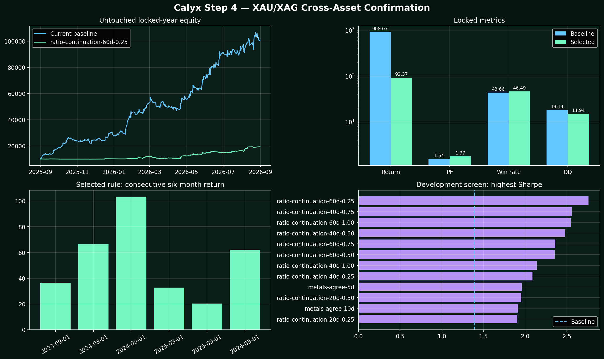

# Step 4 — XAU/XAG Cross-Asset Confirmation

**Decision: REJECT / DO NOT ADD. No EA, BAT, SET, website, cache, or portfolio file was changed.**

## Frozen rule

`ratio-continuation-60d-0.25` was selected using the combined development portfolio only. Each source trade retained its native 1% risk configuration, entry, stop, target, trailing/breakeven behavior and session. The overlay can only veto a trade after the source EA triggers. Maximum simultaneous initial metals risk is 4%.

## Portfolio evidence

| Sample | Return base→gate | PF base→gate | Win base→gate | DD base→gate | Trades base→gate | Gate Sharpe | Gate recovery |
|---|---|---|---|---|---|---|---|
| Development | +567.37→+652.04% | 1.20→1.50 | 39.25→45.12% | 29.98→17.72% | 1391→727 | 2.76 | 36.80 |
| Locked | +908.07→+92.37% | 1.54→1.77 | 43.66→46.49% | 18.14→14.94% | 662→228 | 4.30 | 6.18 |
| Three Year | +6433.80→+1346.71% | 1.47→1.61 | 40.62→45.45% | 29.98→17.72% | 2053→955 | 3.20 | 76.01 |

Extra locked cost stress (0.05R per accepted trade): **+71.69%**, PF **1.60**. Monte Carlo: P5 **+27.42%**, median **+93.97%**, P95 **+196.78%**, profitable paths **99.60%**, DD P95 **18.81%**.

## Locked-year breakdown by EA

| EA | Asset | Return base→gate | PF base→gate | Win base→gate | DD base→gate | Trades base→gate | Gate Sharpe | Gate recovery |
|---|---|---|---|---|---|---|---|---|
| LTA Volume Profile | XAUUSD | +102.05→+32.51% | 1.43→1.91 | 33.47→38.60% | 12.47→7.18% | 245→57 | 5.79 | 4.53 |
| Engineered Liquidity XAU | XAUUSD | +32.19→+3.41% | 1.56→1.58 | 42.50→50.00% | 7.67→2.72% | 80→12 | 2.92 | 1.25 |
| ORB Volume Profile | XAUUSD | +12.94→+6.26% | 1.84→2.52 | 44.90→47.06% | 5.16→1.36% | 49→17 | 5.10 | 4.61 |
| ORB High-Win 0.75R | XAUUSD | +6.19→+3.14% | 1.57→1.98 | 69.39→70.59% | 2.82→1.18% | 49→17 | 4.85 | 2.66 |
| ORB Volume-Confirmed | XAUUSD | +12.49→+5.85% | 2.81→3.90 | 47.83→50.00% | 2.24→1.27% | 23→10 | 7.30 | 4.62 |
| XAU ORB New York M30 | XAUUSD | +1.95→-1.15% | 2.20→0.00 | 41.67→0.00% | 1.41→1.15% | 12→4 | -9.51 | -1.00 |
| XAU ORB London–NY M30 | XAUUSD | +5.33→+3.43% | 2.25→3.67 | 41.67→55.56% | 2.79→1.28% | 24→9 | 8.44 | 2.69 |
| Asia Breakout | XAUUSD | +30.07→-1.66% | 1.83→0.71 | 47.69→36.36% | 5.10→3.92% | 65→11 | -2.52 | -0.42 |
| EMA3 | XAUUSD | +13.46→+3.71% | 2.02→2.55 | 66.67→62.50% | 3.28→1.77% | 42→8 | 6.56 | 2.10 |
| XAU Weakness | XAUUSD | +82.44→+14.46% | 1.83→1.64 | 42.74→42.50% | 11.46→6.01% | 124→40 | 3.37 | 2.41 |
| XAU RSI VWAP | XAUUSD | +4.31→+2.56% | 1.45→1.49 | 72.73→72.00% | 1.92→1.92% | 44→25 | 2.91 | 1.33 |
| XAU Trend Progression | XAUUSD | +18.41→+2.78% | 2.79→2.44 | 60.00→71.43% | 2.81→1.88% | 25→7 | 4.60 | 1.48 |
| XAU Elliott Wave 1-2-3 | XAUUSD | +21.24→-1.11% | 3.51→0.70 | 55.56→20.00% | 2.63→3.59% | 18→5 | -2.26 | -0.31 |
| XAU Slow Trend | XAUUSD | +36.03→+0.03% | 2.25→1.00 | 27.78→12.50% | 8.43→4.45% | 36→8 | 0.03 | 0.01 |
| XAG Session VWAP Snapback | XAGUSD | +4.02→+0.56% | 2.68→2.59 | 53.33→40.00% | 1.87→0.21% | 15→5 | 3.99 | 2.66 |

## Promotion checks

- PASS — non baseline
- PASS — locked min trades
- FAIL — locked retention 40pct
- FAIL — locked return improves
- PASS — locked pf improves
- PASS — locked dd not worse
- PASS — cost stress positive
- PASS — monte carlo p5 positive
- PASS — four of six positive halves

## Interpretation

The locked year was never used to select the rule. If the baseline wins development selection or any locked requirement fails, the correct action is to retain the existing EAs unchanged. A higher PF from a much smaller trade sample is not sufficient.

This is a ledger-veto reconstruction using native MT5 trade outcomes and causal prior-day broker data. A skipped trade can change later EA state, so any passing result would still require a copied-EA implementation and native MT5 Every Tick replay. Broker CFD daily data are also not centralized COMEX futures settlement data.

## Files

- `development-screen.csv`: every tested cross-metal rule.
- `selected-locked-trades.csv`: accepted locked-year trades.
- `six-month-stability.csv`: consecutive half-year results.
- `results.json`: complete machine-readable evidence and gate decisions.
- `Charts/step4-summary.png`: locked comparison, stability, and development screen.
