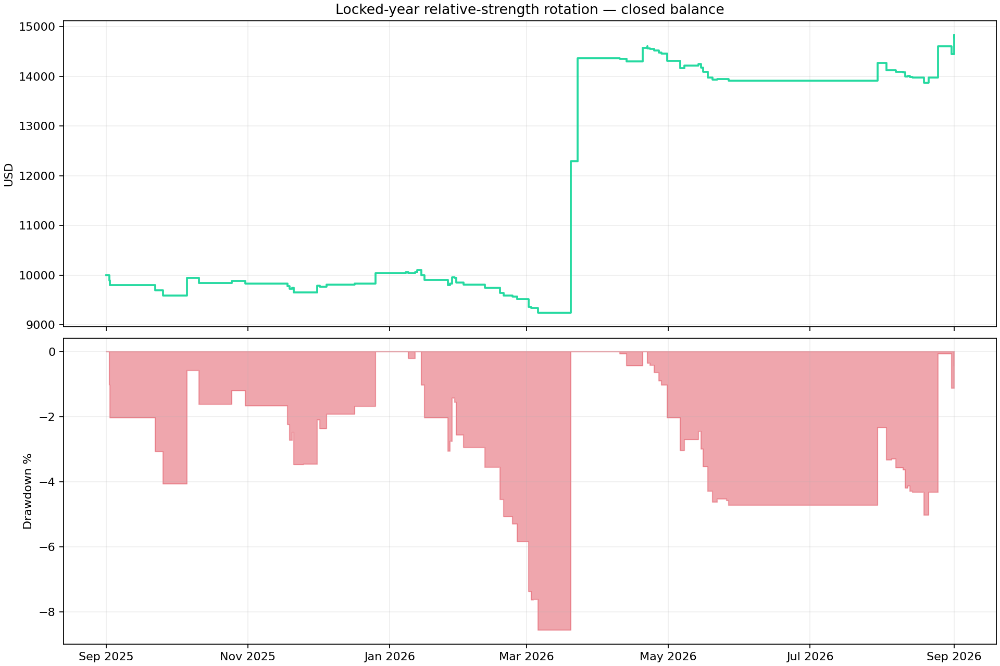
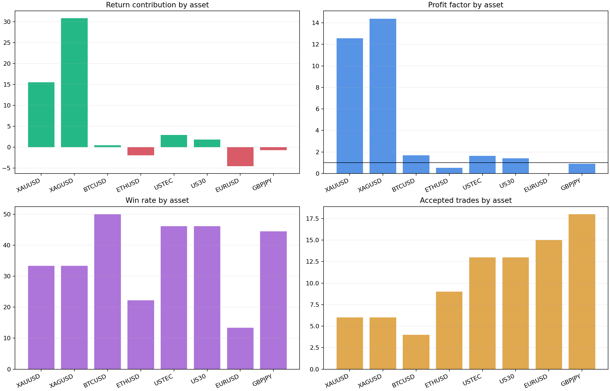
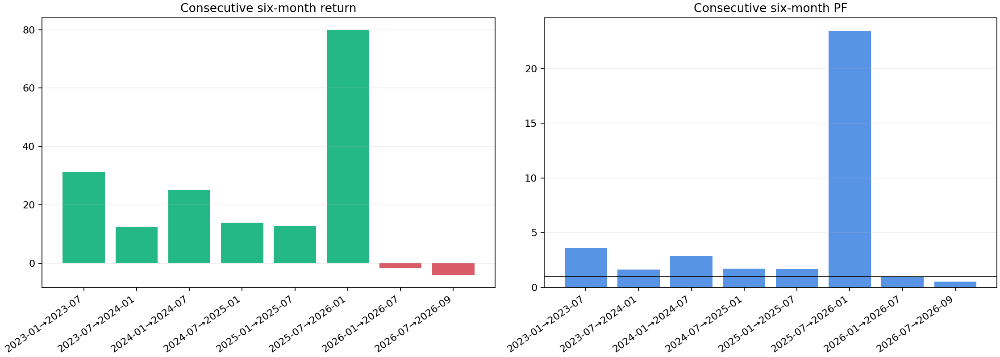
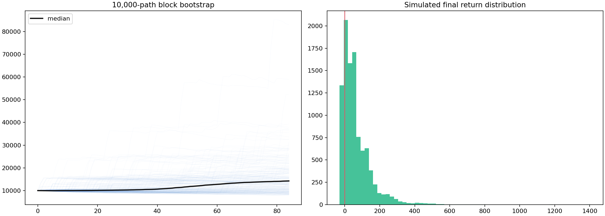
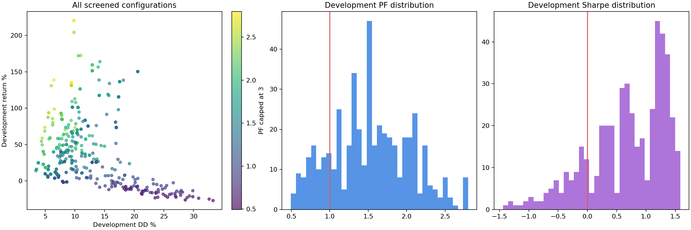

# Step 2 — Relative-Strength Momentum Rotation

**Decision: REJECT / DO NOT ADD. No EA, BAT, website or recommended-portfolio file was changed.**

## Frozen configuration

`monthly rebalance, 1-3-6m, top 4, raw, positive momentum required, long-only, none, D1 ATR 1.5 ATR; rank change; none; london`

The configuration was selected across all eight assets using development data only. Ranking uses completed daily closes. Risk is 1% of current equity per trade with a hard four-position cap.

## Portfolio evidence

| Sample | Return | PF | Win rate | Closed DD | Trades | Sharpe | Recovery | Positive assets |
|---|---:|---:|---:|---:|---:|---:|---:|---:|
| Development | +220.41% | 2.77 | 40.53% | 9.82% | 190 | 1.23 | 22.44 | 6/8 |
| Locked year | +47.80% | 2.44 | 35.71% | 8.56% | 84 | 0.99 | 5.58 | 5/8 |
| Full context | +381.63% | 2.77 | 39.10% | 9.82% | 266 | 1.16 | 38.86 | 7/8 |

## Locked-year asset breakdown

| Asset | Return contribution | PF | Win rate | Trades | Sharpe | Recovery | Standalone M15 MTM DD |
|---|---:|---:|---:|---:|---:|---:|---:|
| XAUUSD | +15.55% | 12.55 | 33.33% | 6 | 1.16 | 13.50 | 16.03% |
| XAGUSD | +30.83% | 14.39 | 33.33% | 6 | 1.18 | 18.61 | 32.66% |
| BTCUSD | +0.44% | 1.70 | 50.00% | 4 | 0.66 | 0.70 | 2.77% |
| ETHUSD | -1.96% | 0.53 | 22.22% | 9 | -0.61 | -0.52 | 5.70% |
| USTEC | +2.93% | 1.64 | 46.15% | 13 | 0.52 | 1.04 | 5.83% |
| US30 | +1.79% | 1.41 | 46.15% | 13 | 0.31 | 0.76 | 4.69% |
| EURUSD | -4.54% | 0.03 | 13.33% | 15 | -3.22 | -1.00 | 4.78% |
| GBPJPY | -0.73% | 0.91 | 44.44% | 18 | -0.16 | -0.15 | 5.59% |

## Consecutive six-month stability

| Period | Return | PF | Win rate | DD | Trades |
|---|---:|---:|---:|---:|---:|
| 2023-01→2023-07 | +31.17% | 3.56 | 52.78% | 4.09% | 36 |
| 2023-07→2024-01 | +12.51% | 1.63 | 27.27% | 16.14% | 44 |
| 2024-01→2024-07 | +25.02% | 2.84 | 43.75% | 5.03% | 32 |
| 2024-07→2025-01 | +13.89% | 1.69 | 32.56% | 11.28% | 43 |
| 2025-01→2025-07 | +12.63% | 1.68 | 40.74% | 11.30% | 54 |
| 2025-07→2026-01 | +79.87% | 23.47 | 72.00% | 2.31% | 25 |
| 2026-01→2026-07 | -1.55% | 0.91 | 29.17% | 11.57% | 48 |
| 2026-07→2026-09 | -4.07% | 0.53 | 29.17% | 7.16% | 24 |

## Robustness

Monte Carlo used 10,000 five-trade block-bootstrap paths. Return P5 was -12.31%, median +42.43% and P95 +225.09%. Median DD was 9.14% and P95 DD 17.20%; 79.62% of paths finished profitable.

Adding another 0.05% account cost to every trade produced +41.74% return, PF 2.16 and 9.52% DD.

## Promotion decision

- Standalone locked gate: FAIL.
- Better than the rejected shared-rule predecessor: PASS.
- Eligible for an incremental test against the active Calyx portfolio: NO.
- A strategy is never added merely because development or full-context performance looks strong.

## Limitations

The pipeline screened 467 staged configurations using archived broker M15 bars, recorded spreads and conservative same-bar handling. It is not native MT5 tick replay. A passing result would still require native execution validation and an incremental portfolio correlation test before installation.

