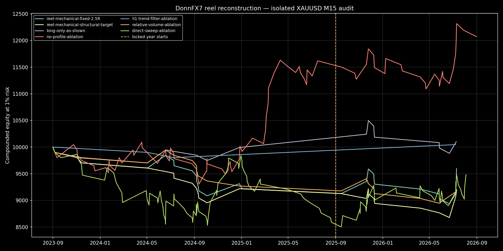

# DonnFX7 reel reconstruction — raw XAUUSD result

## Decision

**RAW REJECT. The mechanical reconstruction did not meet the minimum untouched-year gate (positive return, PF >= 1.10, at least 25 trades). Do not optimize or deploy it unless the user deliberately approves a broader hypothesis test.**

This is a no-lookahead mechanical reconstruction of what is visible in the reel—not a claim that these are the creator's unpublished exact rules. No Calyx EA, website page, BAT, recommended portfolio, or active MT5 terminal was changed.

## What the reel shows

- XAUUSD returning to a lower demand/discount region.
- A liquidity sweep/rejection around a marked horizontal level.
- Fixed-range volume-profile confluence around the completed move.
- A long entry aimed at the opposing upper supply area.
- The reel shows examples and account results, but not a complete rulebook, timeframe declaration, profile anchor rule, or objective zone algorithm.

## Auditable rule translation

1. Use only the previous completed week's XAUUSD M15 bars to build a 128-row, 70% value-area tick-volume profile.
2. Treat the prior week's 61.8%-78.6% retracement as discount/premium. Longs require VAL near discount; shorts require VAH near premium.
3. Require an M15 sweep of the prior 16-bar extreme and a close back through it inside the discount/premium zone.
4. Within eight bars require a directional change-of-character close through the pre-sweep three-bar structure and a VAL/VAH reclaim.
5. Enter next bar, stop beyond the sweep, target 2.5R, and force-close after 96 bars. Same-bar ambiguity is always charged as a loss.

## Results

| Version | Period | Return | PF | Win rate | DD | Trades | Sharpe | Exp. R | Long / short |
|---|---|---:|---:|---:|---:|---:|---:|---:|---:|
| reel-mechanical-fixed-2.5R | development | -7.81% | 0.38 | 13.33% | 9.15% | 15 | -1.19 | -0.533 | 7 / 8 |
| reel-mechanical-fixed-2.5R | locked | +4.09% | 1.52 | 38.46% | 6.79% | 13 | 0.67 | +0.323 | 9 / 4 |
| reel-mechanical-fixed-2.5R | full | -4.03% | 0.82 | 25.00% | 10.62% | 28 | -0.27 | -0.136 | 16 / 12 |
| reel-mechanical-structural-target | development | -7.82% | 0.27 | 8.33% | 10.47% | 12 | -1.44 | -0.670 | 5 / 7 |
| reel-mechanical-structural-target | locked | -0.20% | 1.00 | 27.27% | 5.87% | 11 | -0.01 | -0.003 | 6 / 5 |
| reel-mechanical-structural-target | full | -8.00% | 0.58 | 17.39% | 13.23% | 23 | -0.64 | -0.351 | 11 / 12 |
| long-only-as-shown | development | -0.09% | 1.00 | 28.57% | 2.97% | 7 | -0.00 | -0.000 | 7 / 0 |
| long-only-as-shown | locked | +1.09% | 1.20 | 33.33% | 5.85% | 9 | 0.23 | +0.133 | 9 / 0 |
| long-only-as-shown | full | +1.00% | 1.11 | 31.25% | 5.85% | 16 | 0.10 | +0.075 | 16 / 0 |
| no-profile-ablation | development | +16.18% | 1.42 | 38.71% | 7.81% | 62 | 0.86 | +0.255 | 29 / 33 |
| no-profile-ablation | locked | +3.91% | 1.23 | 33.33% | 6.36% | 27 | 0.48 | +0.155 | 17 / 10 |
| no-profile-ablation | full | +20.72% | 1.36 | 37.08% | 7.81% | 89 | 0.75 | +0.225 | 46 / 43 |
| h1-trend-filter-ablation | development | -1.99% | 0.00 | 0.00% | 1.99% | 2 | 0.00 | -1.000 | 1 / 1 |
| h1-trend-filter-ablation | locked | +2.50% | 999.00 | 100.00% | 0.00% | 1 | 0.00 | +2.500 | 0 / 1 |
| h1-trend-filter-ablation | full | +0.46% | 1.25 | 33.33% | 1.99% | 3 | 0.08 | +0.167 | 1 / 2 |
| relative-volume-ablation | development | -7.30% | 0.25 | 9.09% | 7.30% | 11 | -1.52 | -0.682 | 6 / 5 |
| relative-volume-ablation | locked | -1.09% | 0.83 | 25.00% | 4.90% | 8 | -0.22 | -0.125 | 4 / 4 |
| relative-volume-ablation | full | -8.31% | 0.47 | 15.79% | 10.54% | 19 | -0.86 | -0.447 | 10 / 9 |
| direct-sweep-ablation | development | -14.13% | 0.76 | 24.05% | 14.70% | 79 | -0.77 | -0.182 | 36 / 43 |
| direct-sweep-ablation | locked | +10.41% | 1.39 | 35.71% | 4.90% | 42 | 0.95 | +0.250 | 24 / 18 |
| direct-sweep-ablation | full | -5.19% | 0.96 | 28.10% | 14.99% | 121 | -0.13 | -0.032 | 60 / 61 |

## Reading the ablations

- `no-profile-ablation` answers whether the volume-profile requirement adds value or merely removes trades.
- `h1-trend-filter-ablation` measures the extra trend rule that was initially considered but is not stated by the reel.
- `relative-volume-ablation` measures an additional median-volume confirmation that is not stated by the reel.
- `direct-sweep-ablation` enters without the later structure break, measuring the contribution of confirmation.
- `long-only-as-shown` tests only the direction actually demonstrated in the reel.
- `structural-target` aims at the opposing weekly premium/discount boundary instead of forcing 2.5R.

Mechanical development: -7.81% return, PF 0.38, 15 trades. Mechanical untouched year: +4.09% return, PF 1.52, 13 trades.

