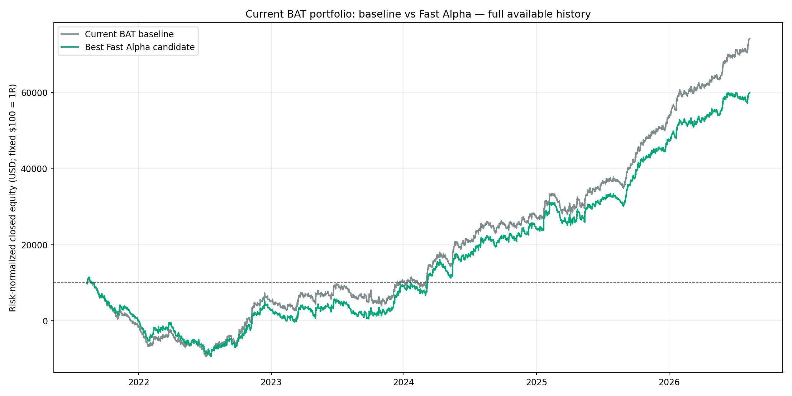
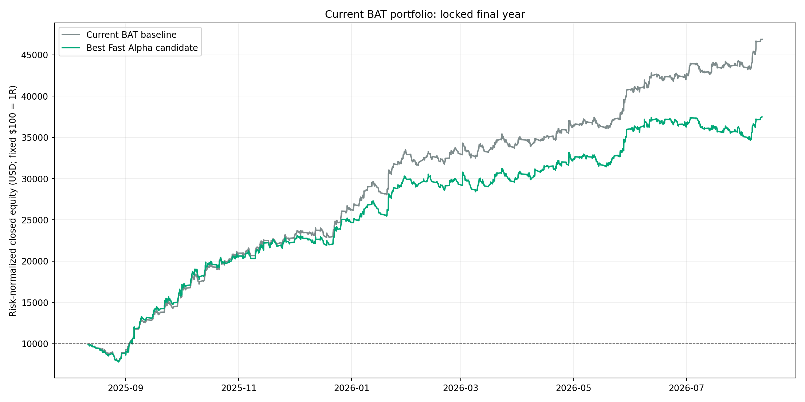
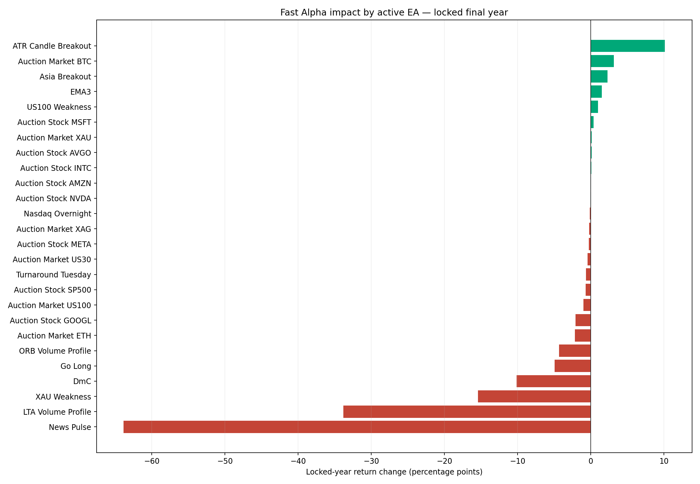
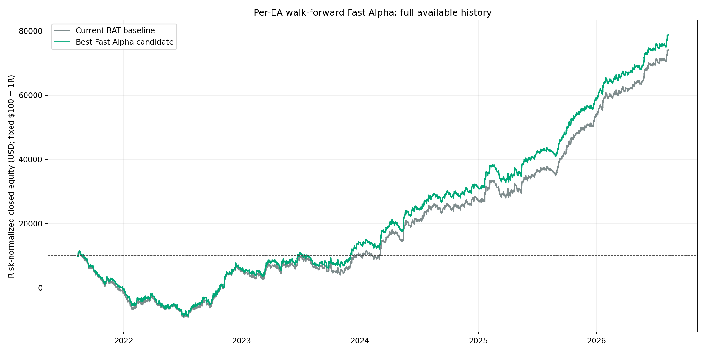
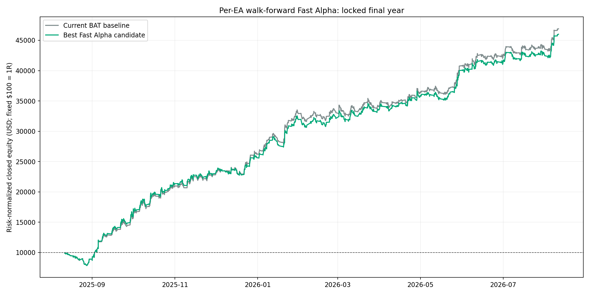

# Fast Alpha optimization — currently configured BAT portfolio

Generated: 2026-08-15T20:18:28.423762+00:00

## Decision: REJECT

The strongest pre-lock candidate was **ENTRY with a 60-minute maximum wait and a 1.00R emergency loss cap**. This was the strongest Fast Alpha candidate that passed the development gates, but it did not beat the unchanged baseline in validation, so it is rejected.

This is a research overlay only. **The live BAT and EA files were not changed.** The rule follows the paper: the slow EA still decides direction, stop and target; a long waits for one red M5 candle and a short waits for one green M5 candle; a stop exit may wait for one M5 candle favorable to the open position. If no entry confirmation appears inside the time cap, the signal is skipped. A delayed stop exits at the first favorable M5 close, the original target, the emergency loss cap, or the maximum-wait market exit—whichever occurs first. This removes look-ahead and prevents an unlimited delayed-stop loss.

## Portfolio result

All figures below normalize every retained trade to **1% equity risk at its unchanged structural stop**, starting from **$10,000**. Costs already present in each source test are retained. `DD*` is closed-equity drawdown; it is not tick-level floating drawdown.

The compounded percentages below are a serial 1%-risk normalization, **not a realistic shared-account forecast**. The `net R` columns and fixed-$100-risk graphs are the safer combined comparison because the active EAs can overlap.

| Period | Base serial return | Fast serial return | Delta | Base net R | Fast net R | Base PF | Fast PF | Base win | Fast win | Base DD* | Fast DD* | Base trades | Fast trades |
|---|---:|---:|---:|---:|---:|---:|---:|---:|---:|---:|---:|---:|---:|
| Full available history | +20762.09% | +4773.96% | -15988.13 pp | +641.77R | +500.43R | 1.32 | 1.19 | 36.30% | 36.70% | 88.96% | 89.25% | 7838 | 7654 |
| Locked final year (2025-08-11 to 2026-08-10) | +3084.64% | +1163.01% | -1921.63 pp | +369.01R | +274.87R | 1.34 | 1.21 | 40.66% | 41.37% | 19.59% | 25.76% | 1692 | 1634 |

## Locked final year by EA

| EA | Base return | Fast return | Delta | Base/Fast PF | Base/Fast win | Base/Fast DD* | Trades retained | Verdict |
|---|---:|---:|---:|---:|---:|---:|---:|---|
| LTA Volume Profile | +93.95% | +60.13% | -33.82 pp | 1.39/1.27 | 32.5%/33.1% | 13.13%/13.30% | 236/243 (97.1%) | NOT IMPROVED |
| ATR Candle Breakout | +39.62% | +49.74% | +10.12 pp | 1.34/1.49 | 26.1%/28.6% | 11.68%/11.63% | 105/119 (88.2%) | IMPROVED |
| EMA3 | +28.26% | +29.77% | +1.50 pp | 2.69/2.77 | 65.0%/65.0% | 3.94%/3.95% | 40/40 (100.0%) | IMPROVED |
| Asia Breakout | +24.54% | +26.84% | +2.29 pp | 1.27/1.29 | 37.2%/37.2% | 13.72%/16.52% | 113/113 (100.0%) | IMPROVED |
| DmC | +30.13% | +19.97% | -10.15 pp | 1.20/1.14 | 42.1%/42.6% | 9.95%/12.39% | 230/235 (97.9%) | NOT IMPROVED |
| Auction Market BTC | +13.95% | +17.09% | +3.14 pp | 1.91/2.11 | 26.3%/26.3% | 10.56%/10.56% | 19/19 (100.0%) | IMPROVED |
| Go Long | +20.24% | +15.30% | -4.93 pp | 1.19/1.15 | 50.6%/51.3% | 9.09%/10.25% | 312/312 (100.0%) | NOT IMPROVED |
| Auction Stock META | +14.15% | +13.87% | -0.27 pp | 4.19/4.13 | 60.0%/60.0% | 2.05%/2.05% | 10/10 (100.0%) | NOT IMPROVED |
| Auction Market ETH | +14.33% | +12.17% | -2.16 pp | 2.88/2.61 | 36.4%/36.4% | 4.13%/4.17% | 11/11 (100.0%) | NOT IMPROVED |
| Nasdaq Overnight | +7.96% | +7.83% | -0.13 pp | 1.81/1.77 | 58.3%/59.7% | 1.83%/1.92% | 72/72 (100.0%) | NOT IMPROVED |
| US100 Weakness | +6.78% | +7.77% | +0.99 pp | 1.15/1.18 | 42.9%/42.4% | 11.66%/11.37% | 66/70 (94.3%) | IMPROVED |
| Auction Market XAU | +6.08% | +6.22% | +0.14 pp | 4619.64/52.02 | 66.7%/66.7% | 0.00%/0.11% | 3/3 (100.0%) | NOT IMPROVED |
| ORB Volume Profile | +9.95% | +5.62% | -4.33 pp | 1.61/1.33 | 38.8%/54.2% | 6.00%/5.98% | 48/49 (98.0%) | NOT IMPROVED |
| Auction Stock MSFT | +4.86% | +5.22% | +0.37 pp | 5.41/5.73 | 66.7%/66.7% | 1.04%/1.04% | 3/3 (100.0%) | IMPROVED |
| Auction Stock INTC | +4.37% | +4.45% | +0.08 pp | 4.86/5.12 | 60.0%/60.0% | 1.01%/1.02% | 5/5 (100.0%) | IMPROVED |
| Auction Stock GOOGL | +6.15% | +4.04% | -2.11 pp | 6.62/4.76 | 50.0%/50.0% | 1.02%/1.02% | 2/2 (100.0%) | NOT IMPROVED |
| Auction Stock AVGO | +3.15% | +3.27% | +0.13 pp | 2.23/2.16 | 22.2%/33.3% | 2.51%/2.67% | 9/9 (100.0%) | NOT IMPROVED |
| Turnaround Tuesday | +3.23% | +2.59% | -0.64 pp | 1.17/1.14 | 36.7%/36.7% | 5.93%/5.93% | 30/30 (100.0%) | NOT IMPROVED |
| Auction Market US30 | +2.53% | +2.10% | -0.43 pp | 1.52/1.43 | 16.7%/16.7% | 4.91%/4.92% | 6/6 (100.0%) | NOT IMPROVED |
| Auction Stock NVDA | +1.93% | +1.95% | +0.02 pp | 2.90/2.83 | 33.3%/33.3% | 1.02%/1.06% | 3/3 (100.0%) | NOT IMPROVED |
| Auction Stock AMZN | +0.88% | +0.91% | +0.02 pp | 1.43/1.44 | 33.3%/33.3% | 1.02%/1.02% | 3/3 (100.0%) | IMPROVED |
| News Pulse | +63.85% | +0.00% | -63.85 pp | 46.01/0.00 | 84.2%/0.0% | 1.02%/0.00% | 0/19 (0.0%) | NOT IMPROVED |
| Auction Stock SP500 | -0.06% | -0.77% | -0.71 pp | 0.99/0.82 | 33.3%/33.3% | 4.27%/4.22% | 6/6 (100.0%) | NOT IMPROVED |
| Auction Market XAG | -1.45% | -1.69% | -0.25 pp | 0.82/0.79 | 14.3%/23.1% | 6.88%/6.75% | 13/14 (92.9%) | NOT IMPROVED |
| Auction Market US100 | -1.01% | -2.04% | -1.02 pp | 0.93/0.86 | 17.6%/17.6% | 13.17%/13.18% | 17/17 (100.0%) | NOT IMPROVED |
| XAU Weakness | +12.96% | -2.44% | -15.40 pp | 1.07/0.99 | 35.8%/35.7% | 18.14%/19.59% | 272/279 (97.5%) | NOT IMPROVED |

## Per-EA walk-forward optimization

This second pass allowed a different Fast Alpha timing rule per EA, but still chose every rule before the locked year. EAs with fewer than 40 development trades or 10 validation trades were marked insufficient instead of optimized.

| Portfolio construction | Base net R | Candidate net R | Base PF | Candidate PF | Base DD* | Candidate DD* | Base trades | Candidate trades |
|---|---:|---:|---:|---:|---:|---:|---:|---:|
| Full available history | +641.77R | +689.09R | 1.32 | 1.32 | 88.96% | 88.72% | 7838 | 7754 |
| Locked final year | +369.01R | +360.04R | 1.34 | 1.34 | 19.59% | 19.67% | 1692 | 1680 |

| EA | Pre-lock | Rule | Validation base/fast | Locked base/fast | Locked PF base/fast | Locked DD* base/fast | Locked trades | OOS |
|---|---|---|---:|---:|---:|---:|---:|---|
| Auction Market BTC | INSUFFICIENT | unchanged | +2.84%/+2.84% | +13.95%/+13.95% | 1.91/1.91 | 10.56%/10.56% | 19/19 | NOT TESTED |
| Auction Market US100 | INSUFFICIENT | unchanged | +9.28%/+9.28% | -1.01%/-1.01% | 0.93/0.93 | 13.17%/13.17% | 17/17 | NOT TESTED |
| Auction Market US30 | INSUFFICIENT | unchanged | +22.56%/+22.56% | +2.53%/+2.53% | 1.52/1.52 | 4.91%/4.91% | 6/6 | NOT TESTED |
| Auction Market XAU | INSUFFICIENT | unchanged | +1.89%/+1.89% | +6.08%/+6.08% | 4619.64/4619.64 | 0.00%/0.00% | 3/3 | NOT TESTED |
| Auction Stock AMZN | INSUFFICIENT | unchanged | +1.85%/+1.85% | +0.88%/+0.88% | 1.43/1.43 | 1.02%/1.02% | 3/3 | NOT TESTED |
| Auction Stock AVGO | INSUFFICIENT | unchanged | +0.00%/+0.00% | +3.15%/+3.15% | 2.23/2.23 | 2.51%/2.51% | 9/9 | NOT TESTED |
| Auction Stock GOOGL | INSUFFICIENT | unchanged | -2.07%/-2.07% | +6.15%/+6.15% | 6.62/6.62 | 1.02%/1.02% | 2/2 | NOT TESTED |
| Auction Stock INTC | INSUFFICIENT | unchanged | +3.63%/+3.63% | +4.37%/+4.37% | 4.86/4.86 | 1.01%/1.01% | 5/5 | NOT TESTED |
| Auction Stock META | INSUFFICIENT | unchanged | +4.80%/+4.80% | +14.15%/+14.15% | 4.19/4.19 | 2.05%/2.05% | 10/10 | NOT TESTED |
| Auction Stock MSFT | INSUFFICIENT | unchanged | -1.02%/-1.02% | +4.86%/+4.86% | 5.41/5.41 | 1.04%/1.04% | 3/3 | NOT TESTED |
| Auction Stock NVDA | INSUFFICIENT | unchanged | +6.69%/+6.69% | +1.93%/+1.93% | 2.90/2.90 | 1.02%/1.02% | 3/3 | NOT TESTED |
| Auction Stock SP500 | INSUFFICIENT | unchanged | +4.09%/+4.09% | -0.06%/-0.06% | 0.99/0.99 | 4.27%/4.27% | 6/6 | NOT TESTED |
| News Pulse | INSUFFICIENT | unchanged | +0.00%/+0.00% | +63.85%/+63.85% | 46.01/46.01 | 1.02%/1.02% | 19/19 | NOT TESTED |
| Asia Breakout | PASS | both / 20m / 2.00R | -2.58%/+1.83% | +24.54%/+20.41% | 1.27/1.22 | 13.72%/19.26% | 110/113 | FAILED |
| Auction Market ETH | PASS | both / 15m / 1.50R | +11.48%/+15.89% | +14.33%/+12.90% | 2.88/2.84 | 4.13%/3.35% | 10/11 | FAILED |
| Auction Market XAG | PASS | exit / 15m / 1.25R | +20.19%/+20.65% | -1.45%/-1.70% | 0.82/0.79 | 6.88%/7.21% | 14/14 | FAILED |
| EMA3 | PASS | exit / 60m / 1.50R | +2.29%/+3.11% | +28.26%/+28.37% | 2.69/2.70 | 3.94%/4.09% | 40/40 | FAILED |
| Turnaround Tuesday | PASS | entry / 20m / 1.00R | +4.22%/+4.86% | +3.23%/+2.89% | 1.17/1.16 | 5.93%/5.93% | 28/30 | FAILED |
| US100 Weakness | PASS | both / 30m / 1.25R | +0.33%/+6.13% | +6.78%/+2.84% | 1.15/1.06 | 11.66%/12.36% | 64/70 | FAILED |
| ATR Candle Breakout | REJECT | unchanged | -15.03%/-15.03% | +39.62%/+39.62% | 1.34/1.34 | 11.68%/11.68% | 119/119 | NOT TESTED |
| DmC | REJECT | unchanged | -14.52%/-14.52% | +30.13%/+30.13% | 1.20/1.20 | 9.95%/9.95% | 235/235 | NOT TESTED |
| Go Long | REJECT | unchanged | -2.78%/-2.78% | +20.24%/+20.24% | 1.19/1.19 | 9.09%/9.09% | 312/312 | NOT TESTED |
| LTA Volume Profile | REJECT | unchanged | -8.11%/-8.11% | +93.95%/+93.95% | 1.39/1.39 | 13.13%/13.13% | 243/243 | NOT TESTED |
| Nasdaq Overnight | REJECT | unchanged | -2.07%/-2.07% | +7.96%/+7.96% | 1.81/1.81 | 1.83%/1.83% | 72/72 | NOT TESTED |
| ORB Volume Profile | REJECT | unchanged | +12.87%/+12.87% | +9.95%/+9.95% | 1.61/1.61 | 6.00%/6.00% | 49/49 | NOT TESTED |
| XAU Weakness | REJECT | unchanged | +37.54%/+37.54% | +12.96%/+12.96% | 1.07/1.07 | 18.14%/18.14% | 279/279 | NOT TESTED |

## Full available history by EA

| EA | Base return | Fast return | Delta | Base/Fast PF | Base/Fast win | Base/Fast DD* | Trades retained | Verdict |
|---|---:|---:|---:|---:|---:|---:|---:|---|
| ATR Candle Breakout | +93.03% | +77.64% | -15.39 pp | 1.13/1.13 | 23.4%/24.0% | 37.02%/37.74% | 651/670 (97.2%) | NOT IMPROVED |
| Auction Market XAG | +85.20% | +76.20% | -9.00 pp | 2.73/2.63 | 28.2%/40.0% | 6.88%/6.75% | 75/78 (96.2%) | NOT IMPROVED |
| Auction Market ETH | +65.40% | +73.90% | +8.50 pp | 1.91/2.00 | 23.5%/23.9% | 13.50%/13.63% | 67/68 (98.5%) | IMPROVED |
| Auction Market US30 | +38.36% | +48.41% | +10.05 pp | 2.41/2.83 | 23.3%/25.0% | 8.19%/8.12% | 28/30 (93.3%) | IMPROVED |
| Auction Market BTC | +42.87% | +47.61% | +4.74 pp | 1.72/1.80 | 28.8%/28.8% | 10.56%/10.56% | 66/66 (100.0%) | IMPROVED |
| Auction Market US100 | +44.45% | +46.72% | +2.27 pp | 2.01/2.06 | 23.3%/23.3% | 13.17%/13.18% | 43/43 (100.0%) | IMPROVED |
| Auction Stock GOOGL | +46.17% | +44.61% | -1.56 pp | 4.62/4.47 | 50.0%/50.0% | 3.08%/3.10% | 20/20 (100.0%) | NOT IMPROVED |
| ORB Volume Profile | +59.73% | +41.39% | -18.34 pp | 1.42/1.31 | 40.5%/48.1% | 6.24%/8.93% | 289/301 (96.0%) | NOT IMPROVED |
| EMA3 | +43.88% | +39.59% | -4.29 pp | 1.41/1.38 | 49.7%/49.7% | 10.32%/10.24% | 187/187 (100.0%) | NOT IMPROVED |
| Auction Stock META | +38.58% | +38.13% | -0.44 pp | 2.85/2.81 | 51.4%/51.4% | 4.41%/4.54% | 35/35 (100.0%) | NOT IMPROVED |
| Auction Stock INTC | +28.81% | +28.59% | -0.22 pp | 4.90/4.85 | 54.2%/54.2% | 3.51%/3.63% | 24/24 (100.0%) | NOT IMPROVED |
| Auction Stock NVDA | +23.92% | +26.77% | +2.85 pp | 2.53/2.83 | 41.9%/46.7% | 4.48%/4.47% | 30/31 (96.8%) | IMPROVED |
| Auction Stock AMZN | +23.90% | +24.96% | +1.06 pp | 3.15/3.23 | 56.5%/56.5% | 2.07%/2.07% | 23/23 (100.0%) | IMPROVED |
| Auction Market XAU | +24.67% | +23.83% | -0.84 pp | 3.72/3.86 | 56.0%/58.3% | 2.98%/2.98% | 24/25 (96.0%) | NOT IMPROVED |
| Auction Stock SP500 | +22.83% | +21.68% | -1.15 pp | 1.93/1.88 | 50.0%/50.0% | 4.42%/4.71% | 38/38 (100.0%) | NOT IMPROVED |
| Auction Stock MSFT | +19.89% | +19.56% | -0.33 pp | 3.43/3.79 | 56.2%/60.0% | 2.12%/1.12% | 15/16 (93.8%) | NOT IMPROVED |
| Auction Stock AVGO | +16.38% | +17.80% | +1.41 pp | 2.48/2.50 | 25.0%/33.3% | 5.66%/5.68% | 24/24 (100.0%) | IMPROVED |
| Asia Breakout | +5.47% | +14.77% | +9.31 pp | 1.01/1.04 | 34.4%/34.6% | 35.53%/37.13% | 656/660 (99.4%) | IMPROVED |
| Nasdaq Overnight | +8.15% | +7.43% | -0.72 pp | 1.28/1.26 | 56.1%/57.1% | 4.65%/4.75% | 189/189 (100.0%) | NOT IMPROVED |
| News Pulse | +63.85% | +0.00% | -63.85 pp | 46.01/0.00 | 84.2%/0.0% | 1.02%/0.00% | 0/19 (0.0%) | NOT IMPROVED |
| Turnaround Tuesday | -11.27% | -9.76% | +1.51 pp | 0.87/0.89 | 30.4%/30.6% | 25.81%/25.00% | 147/148 (99.3%) | IMPROVED |
| Go Long | -11.67% | -23.14% | -11.47 pp | 0.97/0.94 | 46.1%/45.3% | 43.58%/45.34% | 1551/1555 (99.7%) | NOT IMPROVED |
| US100 Weakness | -45.34% | -23.20% | +22.14 pp | 0.76/0.88 | 34.9%/35.2% | 51.84%/35.51% | 347/370 (93.8%) | IMPROVED |
| DmC | -16.23% | -24.09% | -7.87 pp | 0.94/0.91 | 37.4%/37.6% | 41.74%/43.88% | 567/572 (99.1%) | NOT IMPROVED |
| LTA Volume Profile | +30.16% | -25.80% | -55.96 pp | 1.04/0.95 | 26.6%/27.0% | 42.60%/58.31% | 1122/1160 (96.7%) | NOT IMPROVED |
| XAU Weakness | -28.06% | -55.81% | -27.75 pp | 0.96/0.90 | 35.1%/34.8% | 58.51%/67.75% | 1436/1486 (96.6%) | NOT IMPROVED |

## Pre-lock optimization grid

Development ends 2024-12-31. Validation is 2025-01-01 through 2025-08-10. The locked year was not used to choose the setting.

| Mode | Wait | Emergency cap | Dev return | Dev PF | Dev DD* | Dev trades | Validation return | Validation PF | Validation DD* | Validation trades |
|---|---:|---:|---:|---:|---:|---:|---:|---:|---:|---:|
| baseline | 0m | 1.00R | +184.66% | 1.07 | 88.96% | 5124 | +130.13% | 1.14 | 43.24% | 1022 |
| exit | 10m | 2.00R | +3.53% | 1.00 | 88.48% | 5124 | +92.08% | 1.10 | 44.68% | 1022 |
| exit | 30m | 1.50R | -7.20% | 1.00 | 89.57% | 5124 | +91.69% | 1.10 | 45.01% | 1022 |
| exit | 60m | 1.50R | -6.63% | 1.00 | 89.61% | 5124 | +91.49% | 1.10 | 45.01% | 1022 |
| exit | 15m | 1.50R | -5.84% | 1.00 | 89.58% | 5124 | +91.19% | 1.10 | 45.90% | 1022 |
| exit | 20m | 1.50R | -6.75% | 1.00 | 89.45% | 5124 | +90.51% | 1.10 | 45.31% | 1022 |
| exit | 60m | 2.00R | -2.32% | 1.00 | 88.15% | 5124 | +87.42% | 1.10 | 45.79% | 1022 |
| exit | 30m | 2.00R | -4.08% | 1.00 | 88.13% | 5124 | +87.02% | 1.10 | 45.46% | 1022 |
| entry | 60m | 1.00R | +106.99% | 1.06 | 89.25% | 5011 | +86.43% | 1.10 | 46.50% | 1009 |
| exit | 15m | 2.00R | -1.68% | 1.00 | 88.13% | 5124 | +86.22% | 1.09 | 45.59% | 1022 |
| exit | 15m | 1.25R | -6.72% | 1.00 | 90.12% | 5124 | +85.94% | 1.10 | 46.29% | 1022 |
| exit | 60m | 1.25R | -8.81% | 0.99 | 90.13% | 5124 | +85.77% | 1.10 | 46.08% | 1022 |
| exit | 30m | 1.25R | -9.16% | 0.99 | 90.11% | 5124 | +85.66% | 1.10 | 46.08% | 1022 |
| exit | 20m | 1.25R | -6.48% | 1.00 | 90.00% | 5124 | +85.55% | 1.10 | 46.10% | 1022 |
| exit | 10m | 1.50R | -4.46% | 1.00 | 89.63% | 5124 | +85.47% | 1.10 | 45.66% | 1022 |
| exit | 20m | 2.00R | -4.03% | 1.00 | 88.12% | 5124 | +85.24% | 1.09 | 45.08% | 1022 |
| exit | 10m | 1.25R | -8.86% | 0.99 | 90.06% | 5124 | +84.98% | 1.10 | 45.71% | 1022 |
| entry | 30m | 1.00R | +122.27% | 1.06 | 88.94% | 4921 | +82.35% | 1.10 | 47.34% | 988 |
| exit | 5m | 1.25R | +128.94% | 1.05 | 83.81% | 5124 | +81.83% | 1.09 | 45.35% | 1022 |
| exit | 5m | 2.00R | +124.54% | 1.05 | 83.81% | 5124 | +81.81% | 1.09 | 45.42% | 1022 |
| exit | 5m | 1.50R | +127.10% | 1.05 | 83.82% | 5124 | +81.37% | 1.09 | 45.63% | 1022 |
| entry | 20m | 1.00R | +53.52% | 1.04 | 89.72% | 4635 | +63.21% | 1.08 | 48.96% | 923 |
| entry | 15m | 1.00R | +62.52% | 1.05 | 88.27% | 4206 | +52.71% | 1.07 | 47.02% | 839 |
| both | 60m | 2.00R | -5.19% | 1.00 | 87.82% | 5011 | +52.19% | 1.06 | 50.80% | 1009 |
| both | 30m | 2.00R | -0.47% | 1.00 | 87.48% | 4921 | +51.83% | 1.06 | 51.32% | 988 |
| both | 60m | 1.25R | -13.36% | 0.99 | 90.50% | 5011 | +50.25% | 1.06 | 49.87% | 1009 |
| both | 30m | 1.25R | -7.49% | 0.99 | 90.18% | 4921 | +47.39% | 1.06 | 50.80% | 988 |
| both | 60m | 1.50R | -12.87% | 0.99 | 89.38% | 5011 | +47.00% | 1.06 | 49.89% | 1009 |
| entry | 10m | 1.00R | +41.86% | 1.04 | 84.24% | 3400 | +45.43% | 1.08 | 43.39% | 655 |
| both | 30m | 1.50R | -7.74% | 0.99 | 89.05% | 4921 | +45.12% | 1.06 | 50.69% | 988 |
| both | 20m | 2.00R | -32.65% | 0.97 | 88.54% | 4635 | +35.26% | 1.05 | 54.05% | 923 |
| both | 20m | 1.25R | -34.62% | 0.97 | 91.13% | 4635 | +33.28% | 1.04 | 53.12% | 923 |
| both | 20m | 1.50R | -34.77% | 0.97 | 90.10% | 4635 | +31.32% | 1.04 | 53.57% | 923 |
| both | 15m | 2.00R | -23.88% | 0.98 | 87.07% | 4206 | +29.75% | 1.04 | 51.11% | 839 |
| both | 15m | 1.25R | -24.55% | 0.97 | 89.87% | 4206 | +28.52% | 1.04 | 51.37% | 839 |
| both | 15m | 1.50R | -24.36% | 0.97 | 88.64% | 4206 | +25.81% | 1.04 | 51.28% | 839 |
| both | 10m | 2.00R | -27.31% | 0.97 | 85.56% | 3400 | +22.92% | 1.04 | 50.07% | 655 |
| both | 10m | 1.25R | -39.40% | 0.95 | 87.58% | 3400 | +22.15% | 1.04 | 50.34% | 655 |
| both | 10m | 1.50R | -35.56% | 0.96 | 86.78% | 3400 | +19.57% | 1.04 | 49.65% | 655 |
| entry | 5m | 1.00R | +15.71% | 1.02 | 69.32% | 1848 | -26.78% | 0.87 | 54.44% | 381 |
| both | 5m | 2.00R | +0.45% | 1.00 | 68.51% | 1848 | -35.70% | 0.83 | 57.46% | 381 |
| both | 5m | 1.50R | +0.89% | 1.00 | 68.52% | 1848 | -35.83% | 0.83 | 57.55% | 381 |
| both | 5m | 1.25R | +1.26% | 1.00 | 68.61% | 1848 | -35.84% | 0.83 | 57.38% | 381 |

## Evidence and limits

- Native group: twelve real MT5 Strategy Tester reports, Exness, every tick, random execution delay, 2021-08-11 to 2026-08-10.
- Auction-market group: six local M1 replays with spread and slippage, beginning in 2022.
- Auction-stock group: eight active PF>=2 stock/index selections on Exness M1 data, with spread, 25% spread slippage, commission and swap estimates, beginning in 2022.
- This is an **execution-overlay replay**, not a newly compiled tick-by-tick MT5 test of modified EAs. It changes only entry/stop-exit timing and keeps each original slow signal and structural levels.
- The combined curve serializes closed trades. It does not reconstruct simultaneous floating P/L, margin pressure, cross-EA correlation or gaps, so true account-level maximum drawdown can be higher.
- A delayed stop can lose more than 1R. Position size is normalized at the actual delayed entry so the structural stop starts at 1% planned risk; gaps and delayed exits can exceed it.
- Small samples (especially News Pulse and several stock EAs) are not sufficient to claim a durable edge.
- Three active binaries (ATR Candle Breakout, Go Long, Turnaround Tuesday) have no editable source in this package. Their result is research-only unless source code is obtained or a separate execution wrapper is built.

## Source coverage

| group          | ea                   |   trades |
|:---------------|:---------------------|---------:|
| Auction market | Auction Market BTC   |       66 |
| Auction market | Auction Market ETH   |       68 |
| Auction market | Auction Market US100 |       43 |
| Auction market | Auction Market US30  |       30 |
| Auction market | Auction Market XAG   |       78 |
| Auction market | Auction Market XAU   |       25 |
| Auction stock  | Auction Stock AMZN   |       23 |
| Auction stock  | Auction Stock AVGO   |       24 |
| Auction stock  | Auction Stock GOOGL  |       20 |
| Auction stock  | Auction Stock INTC   |       24 |
| Auction stock  | Auction Stock META   |       35 |
| Auction stock  | Auction Stock MSFT   |       16 |
| Auction stock  | Auction Stock NVDA   |       31 |
| Auction stock  | Auction Stock SP500  |       38 |
| Native MT5     | ATR Candle Breakout  |      670 |
| Native MT5     | Asia Breakout        |      660 |
| Native MT5     | DmC                  |      572 |
| Native MT5     | EMA3                 |      187 |
| Native MT5     | Go Long              |     1555 |
| Native MT5     | LTA Volume Profile   |     1160 |
| Native MT5     | Nasdaq Overnight     |      189 |
| Native MT5     | News Pulse           |       19 |
| Native MT5     | ORB Volume Profile   |      301 |
| Native MT5     | Turnaround Tuesday   |      148 |
| Native MT5     | US100 Weakness       |      370 |
| Native MT5     | XAU Weakness         |     1486 |
