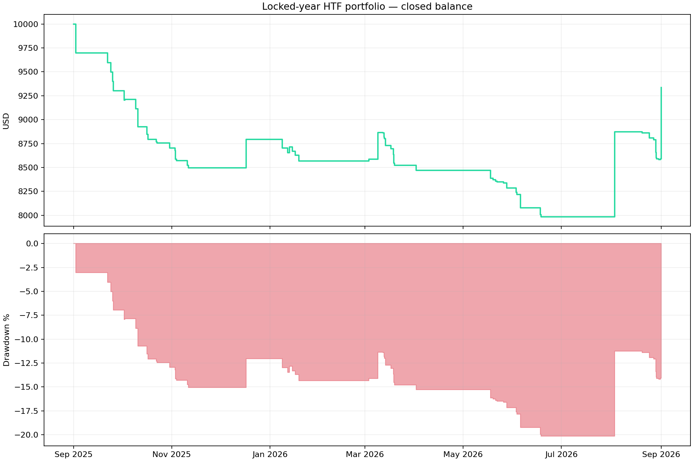
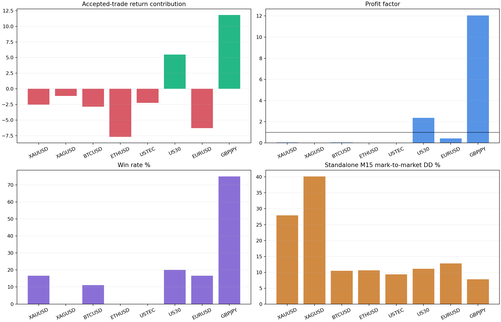
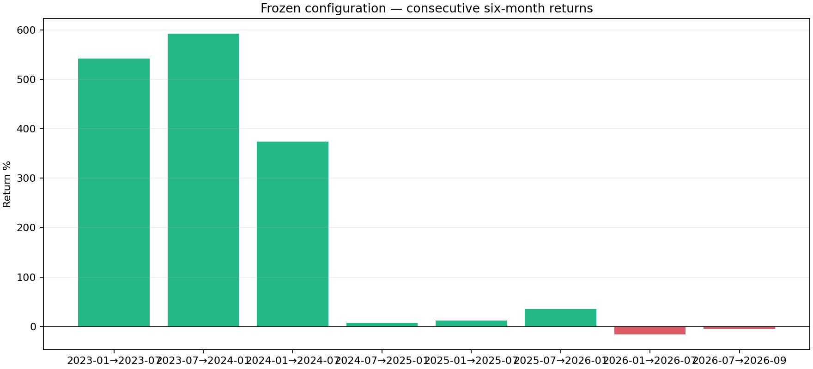
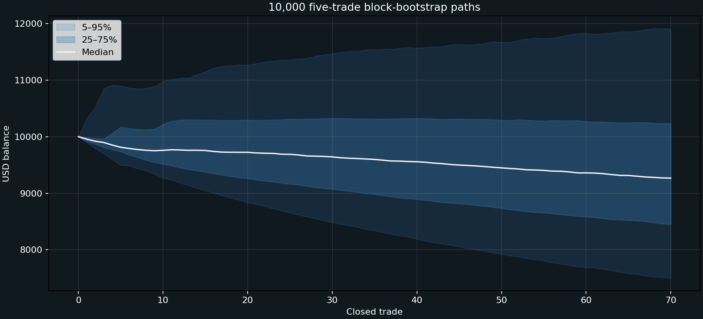
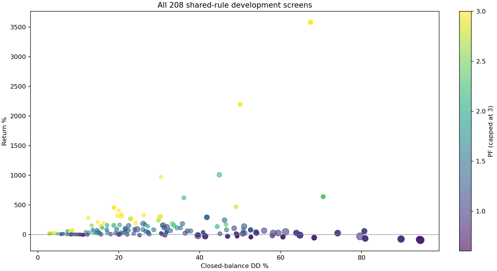

# Step 1 — Paper-Based HTF Multi-Asset Trend Portfolio

**Decision: REJECT / RESEARCH ONLY. No EA, BAT or website change has been made.**

## Frozen shared configuration

`H4, 3-6-12m, ema200, long-only, all-day; ATR stop with 2.5 ATR floor; signal reversal; none management`

This single configuration was selected across all eight assets using development data only. Every accepted trade uses a volatility-derived stop and a maximum of 1% current-equity risk; no more than four trades may overlap.

## Portfolio results

| Sample | Return | PF | Win rate | Closed DD | Trades | Sharpe | Recovery | Profitable assets |
|---|---:|---:|---:|---:|---:|---:|---:|---:|
| Development | +455.13% | 5.94 | 21.32% | 18.79% | 136 | 0.59 | 24.22 | 6/8 |
| Locked year | -6.62% | 0.78 | 15.71% | 20.15% | 70 | -0.30 | -0.33 | 2/8 |
| Full context | +435.56% | 3.91 | 19.37% | 13.62% | 191 | 0.69 | 31.97 | 6/8 |

Closed-balance DD is the synchronized portfolio figure. The maximum standalone M15 mark-to-market DD is reported separately because combining independent broker-bar simulations cannot reconstruct perfectly synchronized intraday equity.

## Locked-year asset breakdown

| Asset | Return contribution | PF | Win rate | Accepted trades | Sharpe | Recovery | Standalone M15 MTM DD | Standalone trades |
|---|---:|---:|---:|---:|---:|---:|---:|---:|
| XAUUSD | -2.52% | 0.04 | 16.67% | 6 | -2.25 | -0.96 | 27.89% | 7 |
| XAGUSD | -1.13% | 0.00 | 0.00% | 2 | -19.90 | -1.00 | 40.17% | 3 |
| BTCUSD | -2.85% | 0.05 | 11.11% | 9 | -1.90 | -0.95 | 10.49% | 14 |
| ETHUSD | -7.68% | 0.00 | 0.00% | 10 | -3.46 | -1.00 | 10.60% | 14 |
| USTEC | -2.23% | 0.00 | 0.00% | 5 | -12.71 | -1.00 | 9.37% | 11 |
| US30 | +5.47% | 2.37 | 20.00% | 10 | 0.62 | 2.69 | 11.09% | 10 |
| EURUSD | -6.29% | 0.43 | 16.67% | 24 | -1.10 | -0.90 | 12.75% | 24 |
| GBPJPY | +11.80% | 12.06 | 75.00% | 4 | 0.91 | 11.06 | 7.79% | 4 |

## Consecutive six-month stability

| Period | Return | PF | Win rate | DD | Trades |
|---|---:|---:|---:|---:|---:|
| 2023-01→2023-07 | +542.07% | 35.92 | 25.64% | 13.39% | 39 |
| 2023-07→2024-01 | +592.50% | 22.51 | 17.65% | 25.67% | 51 |
| 2024-01→2024-07 | +373.80% | 29.45 | 25.00% | 13.11% | 20 |
| 2024-07→2025-01 | +7.31% | 1.26 | 13.64% | 22.52% | 44 |
| 2025-01→2025-07 | +11.73% | 1.40 | 16.98% | 28.22% | 53 |
| 2025-07→2026-01 | +35.59% | 3.65 | 18.18% | 10.66% | 22 |
| 2026-01→2026-07 | -16.25% | 0.33 | 8.16% | 23.86% | 49 |
| 2026-07→2026-09 | -4.87% | 0.57 | 20.00% | 11.33% | 20 |

## Robustness

Monte Carlo used 10,000 five-trade block-bootstrap paths. Return P5 was -25.02%, median -7.33% and P95 +19.07%. Median DD was 16.00% and P95 DD 27.14%; 30.17% of paths finished profitable.

Adding another 0.05% account cost to every trade produced -9.84% return, PF 0.69 and 22.36% DD.

## Screen and limitations

The development pipeline evaluated 208 shared configurations. The locked year was not used to choose the rule.

- The screen uses archived broker M15 bars and spread observations, not native MT5 tick replay. A qualifying result would still require a compiled portfolio implementation and native MT5 validation.
- The four-position cap accepts the strongest simultaneous signals. A rejected independent trade is not retried until that standalone signal generates another entry; this is conservative but not identical to a centralized execution engine.
- Carry, futures rolls and reliable historical CFD swap charges are not fully reconstructed. A holding-time financing allowance is included, plus the explicit additional-cost stress.
- The available common broker history is roughly 2022–2026, much shorter than the century-scale paper evidence. This test validates our instruments and broker conditions, not the paper itself.
- Backtests and Monte Carlo are not forecasts or guarantees.

