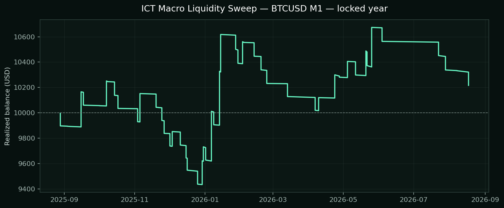
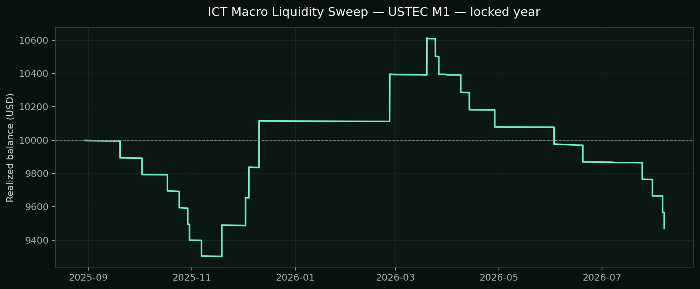
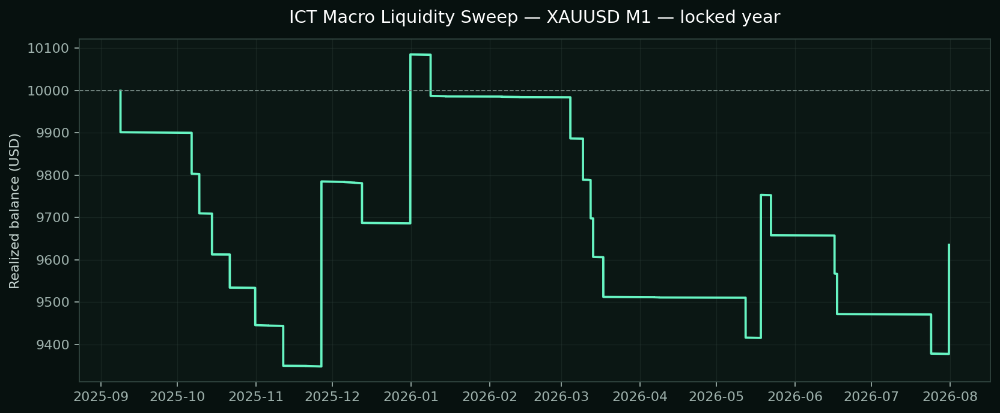

# ICT Macro Liquidity Sweep — native MT5 validation

## Locked one-year result

The configuration for each instrument was chosen only from the preceding development year. The table below is the untouched following year, so it is the decision table—not the development ranking.

| Decision | Symbol / TF | Selected window and trigger | Return | PF | Win rate | Max equity DD | Trades | Net | Costs (commission / swap) |
| --- | --- | --- | ---: | ---: | ---: | ---: | ---: | ---: | ---: |
| REJECT | BTCUSD M1 | 08:50–09:10 NY; L60; confirm 2 | +2.16% | 1.07 | 29.41% | 9.70% | 51 | $216.38 | -$213.69 / $0.00 |
| REJECT | USTEC M1 | 10:50–11:10 NY; L60; confirm 2 | -5.29% | 0.71 | 19.44% | 12.42% | 36 | -$529.24 | -$65.03 / $0.00 |
| REJECT | XAUUSD M1 | 09:50–10:10 NY; L90; confirm 1 | -3.65% | 0.80 | 12.12% | 8.24% | 33 | -$364.77 | -$23.57 / $0.00 |

## Locked equity graphs

### BTCUSD M1

### USTEC M1

### XAUUSD M1

## What was implemented

- New York-local macro windows with U.S. daylight-saving conversion and an explicit broker UTC offset.
- A pre-window liquidity range, range-width/ATR filter, one-side liquidity sweep, close back inside the range, and a later displacement confirmation.
- Confirmation can be an inversion-style three-candle fair-value gap, a close through the nearest opposite candle (order-block proxy), or either/both.
- Stop beyond the sweep, target at opposing range liquidity, minimum/maximum R gate, 1% equity risk, spread gate, optional break-even, and time exit.
- One trade maximum per selected macro window per New York day.

The transcript's SMT reference was not forced into the cross-asset tests. Genuine SMT needs a synchronized reference future such as ES against NQ; substituting unrelated CFD symbols for XAU or BTC would fabricate the rule. Breaker blocks are also not a separate trigger in this first deterministic version; the test uses FVG and order-block confirmation.

## Development screen

| Symbol | Variant | Return | PF | Win rate | Equity DD | Trades |
| --- | --- | ---: | ---: | ---: | ---: | ---: |
| BTCUSD | h0850-l60-either **selected** | +10.39% | 2.84 | 41.67% | 3.03% | 12 |
| BTCUSD | h1150-l60-either | +5.15% | 1.92 | 36.36% | 3.82% | 11 |
| BTCUSD | h0950-l120-fvg | -3.62% | 0.62 | 23.08% | 6.85% | 13 |
| BTCUSD | h0950-l90-ob | -4.20% | 0.70 | 19.23% | 6.57% | 26 |
| BTCUSD | h1050-l60-either | -5.98% | 0.00 | 0.00% | 6.26% | 10 |
| BTCUSD | h0950-l30-either | -7.73% | 0.74 | 22.45% | 12.81% | 49 |
| BTCUSD | h0950-l60-either | -8.96% | 0.65 | 20.93% | 11.57% | 43 |
| USTEC | h1050-l60-either **selected** | +3.29% | 1.43 | 33.33% | 5.73% | 18 |
| USTEC | h0950-l120-fvg | -0.24% | 0.97 | 40.00% | 5.02% | 15 |
| USTEC | h0850-l60-either | -1.97% | 0.37 | 16.67% | 3.56% | 6 |
| USTEC | h0950-l30-either | -4.97% | 0.88 | 25.64% | 11.83% | 78 |
| USTEC | h1150-l60-either | -7.75% | 0.54 | 11.54% | 12.63% | 26 |
| USTEC | h0950-l90-ob | -8.89% | 0.68 | 23.53% | 11.61% | 51 |
| USTEC | h0950-l60-either | -11.17% | 0.74 | 23.46% | 15.01% | 81 |
| XAUUSD | h0950-l90-ob **selected** | +1.81% | 1.25 | 25.00% | 6.85% | 20 |
| XAUUSD | h1150-l60-either | -2.57% | 0.80 | 28.00% | 9.77% | 25 |
| XAUUSD | h0850-l60-either | -2.77% | 0.82 | 24.32% | 10.49% | 37 |
| XAUUSD | h0950-l120-fvg | -3.00% | 0.00 | 0.00% | 3.00% | 3 |
| XAUUSD | h0950-l30-either | -4.30% | 0.86 | 22.54% | 16.01% | 71 |
| XAUUSD | h0950-l60-either | -5.85% | 0.72 | 23.91% | 14.56% | 46 |
| XAUUSD | h1050-l60-either | -12.93% | 0.37 | 14.71% | 14.31% | 34 |

## Test integrity

- Broker: Exness MT5 Trial 16; symbols XAUUSD, USTEC, BTCUSD.
- Native MT5 Every Tick model, random execution delay, $10,000 deposit, 1:2000 leverage, 1% calculated risk per trade.
- Development: 2024-08-28 through 2025-08-27. Locked: 2025-08-28 through 2026-08-27.
- MT5's native report statistics include modeled spread; the cost column is reconstructed from deal commission and swap.
- No BAT or website deployment was made. A positive test remains historical evidence, not a payout or future-profit guarantee.
