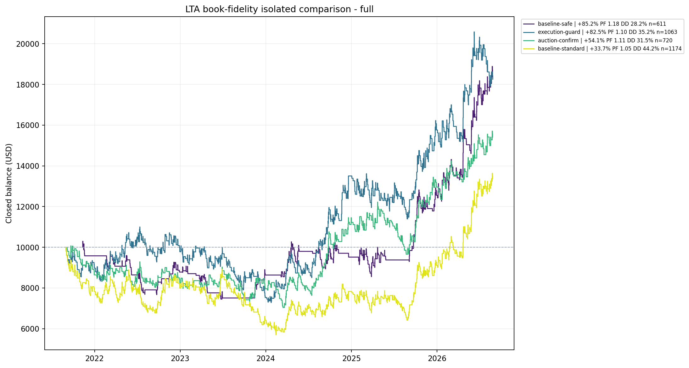

# LTA Book Fidelity Research - Review Copy

## Decision

**Do not promote any PDF-derived change to the live/recommended system yet.**

The current Safe LTA remains the strongest five-year configuration in this comparison. The execution guard and auction-confirmation variants show useful behavior, but neither improves the current Safe default across return, profit factor, drawdown, trade sample, and Monte Carlo downside together.

This folder is an isolated research package. It did not modify the production LTA EA, Best Recommended BAT, installed portfolio SET files, website defaults, or cached portfolio evidence.

## What was implemented

The research EA adds independent switches for the implementable concepts found in the LTA book:

1. **M1 volume-at-price proxy** - builds completed profiles from M1 typical-price activity instead of uniformly spreading each M15 candle's volume across every touched price bin.
2. **Structural swing profile** - anchors the profile to confirmed opposing H1 pivots instead of a fixed rolling bar count.
3. **Completed fixed-range profile** - detects an H1 balance, freezes its range after a confirmed breakout, and profiles only that completed auction.
4. **Multiple volume nodes** - identifies local secondary HVN and upper/lower LVN candidates instead of treating POC as the only HVN and a single absolute minimum as the only LVN.
5. **Auction-state logic** - tests value-area acceptance, VAH/VAL rejection, and LVN traversal as either a confirmation gate or a priority level source.
6. **Supply/demand quality** - scores freshness, expansion strength, structure removal, and distinct prior touches.
7. **Structural targets** - targets the nearest valid profile/zone level subject to a minimum 1.5R and maximum 4R boundary.
8. **Execution protection** - blocks 21:00-23:00 UTC rollover entries and applies a 500-point maximum XAUUSD spread.
9. **Attribution** - research trades use the `LTA-BOOK` comment so they can be separated from production LTA trades.

The book's genuine COT, open-interest, futures-volume, sentiment, and valuation inputs were deliberately **not faked with moving averages**. This Exness XAUUSD CFD history has broker tick volume, not centralized COMEX GC volume.

## Test design

| Item | Setting |
| --- | --- |
| Platform | Native MetaTrader 5 Strategy Tester |
| Broker history | Exness XAUUSD |
| Model | Every Tick, random execution delay |
| Chart / execution | M15 |
| Starting balance | USD 10,000 |
| Risk | Hard-capped at 1% requested equity risk per trade |
| Baseline exits | Current LTA exits, fixed 3R |
| Development | 2021-09-01 to 2024-08-31 |
| Untouched validation | 2024-09-01 to 2025-08-31 |
| Locked latest year | 2025-09-01 to 2026-09-01 |
| Full comparison | 2021-09-01 to 2026-09-01 |
| Monte Carlo | 4,000 closed-trade percentage-return bootstrap paths |

Promotion gate: positive return, PF at least as high as Standard and at least 1.05, drawdown no worse than Standard, at least 60% trade retention, positive Monte Carlo P5, and stability outside development.

## Development screen - every change tested independently

| Case | Return | PF | Win rate | Max DD | Trades | Sharpe | Recovery | MC P5 | Result |
| --- | ---: | ---: | ---: | ---: | ---: | ---: | ---: | ---: | --- |
| Full book stack | +10.17% | 1.02 | 35.71% | 38.25% | 826 | 0.36 | 0.23 | -43.56% | Reject |
| Execution guard | +1.55% | 1.00 | 25.95% | 35.21% | 632 | 0.04 | 0.04 | -50.31% | Validate only |
| Auction confirmation | -10.26% | 0.96 | 25.12% | 31.47% | 410 | -0.44 | -0.32 | -50.02% | Validate only |
| Baseline Safe | -9.76% | 0.94 | 24.90% | 28.25% | 261 | -0.70 | -0.34 | -41.32% | Control |
| Fixed range | -18.60% | 0.96 | 25.26% | 39.23% | 768 | -0.49 | -0.47 | -61.66% | Reject |
| M1 profile proxy | -18.95% | 0.96 | 25.14% | 44.84% | 696 | -0.54 | -0.37 | -61.15% | Reject |
| Structural swing | -18.89% | 0.97 | 25.44% | 45.12% | 908 | -0.44 | -0.37 | -65.27% | Reject |
| Baseline Standard | -32.81% | 0.92 | 24.49% | 44.17% | 686 | -1.02 | -0.73 | -66.74% | Control |
| Structural targets | -35.64% | 0.91 | 29.58% | 52.43% | 808 | -1.25 | -0.67 | -68.08% | Reject |
| Quality zones | -40.99% | 0.89 | 23.95% | 49.14% | 693 | -1.36 | -0.82 | -71.10% | Reject |
| Multiple nodes | -42.38% | 0.90 | 24.24% | 55.53% | 792 | -1.28 | -0.75 | -72.69% | Reject |
| Auction priority | -55.47% | 0.82 | 22.78% | 63.71% | 663 | -2.30 | -0.86 | -77.60% | Reject |

No development case passed the full research gate. The execution guard, auction confirmation, and full stack were examined further because they materially improved at least part of the weak Standard development regime.

## Untouched validation year

| Case | Return | PF | Win rate | Max DD | Trades | Sharpe | Recovery | MC P5 |
| --- | ---: | ---: | ---: | ---: | ---: | ---: | ---: | ---: |
| Execution guard | +13.33% | 1.07 | 27.10% | 17.26% | 214 | 1.07 | 0.57 | -24.10% |
| Auction confirmation | +6.98% | 1.05 | 26.92% | 22.90% | 156 | 0.73 | 0.22 | -24.44% |
| Baseline Safe | +3.05% | 1.03 | 26.15% | 19.05% | 130 | 0.55 | 0.14 | -24.42% |
| Baseline Standard | -1.89% | 0.99 | 25.42% | 21.13% | 236 | -0.16 | -0.07 | -35.11% |
| Full book stack | -15.31% | 0.92 | 32.88% | 27.57% | 292 | -1.88 | -0.50 | -42.55% |
| Fixed range | -15.75% | 0.93 | 23.94% | 31.10% | 284 | -1.25 | -0.43 | -46.41% |

The full stack failed immediately out of sample. Execution protection and auction confirmation were the only book-derived survivors, but both still had negative Monte Carlo P5.

## Locked latest year

| Case | Return | PF | Win rate | Max DD | Trades | Sharpe | Recovery | MC P5 |
| --- | ---: | ---: | ---: | ---: | ---: | ---: | ---: | ---: |
| Baseline Standard | +109.81% | 1.43 | 33.07% | 12.04% | 254 | 5.10 | 5.64 | +31.46% |
| Baseline Safe | +101.72% | 1.43 | 33.05% | 11.89% | 239 | 5.20 | 5.89 | +27.40% |
| Auction confirmation | +55.44% | 1.42 | 33.12% | 8.96% | 154 | 5.00 | 4.25 | +9.40% |
| Execution guard | +56.60% | 1.28 | 30.88% | 13.27% | 217 | 3.53 | 2.42 | +1.88% |

Auction confirmation does reduce latest-year drawdown by about 3 percentage points, but gives up roughly half the return and 39% of trades. Execution protection does not improve the latest-year risk/return profile.

## Full five-year comparison

| Case | Return | PF | Win rate | Max DD | Trades | Sharpe | Recovery | MC P5 |
| --- | ---: | ---: | ---: | ---: | ---: | ---: | ---: | ---: |
| **Baseline Safe** | **+85.18%** | **1.18** | **28.31%** | **28.25%** | 611 | **1.88** | **2.93** | **-6.69%** |
| Execution guard | +82.55% | 1.10 | 27.19% | 35.21% | 1,063 | 0.99 | 2.09 | -28.49% |
| Auction confirmation | +54.09% | 1.11 | 27.22% | 31.47% | 720 | 1.01 | 1.69 | -27.76% |
| Baseline Standard | +33.70% | 1.05 | 26.49% | 44.17% | 1,174 | 0.45 | 0.75 | -47.33% |

## Interpretation

- **Keep current Safe as the recommended default.** It has the best five-year return, PF, Sharpe, recovery, and drawdown in this comparison.
- **Do not deploy the full book stack.** Its development improvement failed in the untouched validation year, a clear regime-instability warning.
- **Do not replace the current profile engine with the M1 CFD proxy.** It did not improve the development evidence, and it is still only broker tick volume rather than exchange volume.
- **Auction confirmation can remain a research-only defensive preset.** It reduces latest-year DD but sacrifices too much return and sample size to replace Safe.
- **Execution guard is operationally sensible but not yet statistically superior.** Its five-year return is close to Safe, but PF, DD, Sharpe, recovery, and Monte Carlo downside are worse.
- **True futures-volume validation is the only high-value follow-up.** Re-test the profile features on COMEX GC volume through NinjaTrader or another futures data source before revisiting production.

## Files for review

- `EA/LTA Book Fidelity Research EA.mq5` - isolated source with all feature switches.
- `EA/LTA Book Fidelity Research EA.ex5` - compiled research binary, 0 errors and 0 warnings.
- `Run-Book-Fidelity-Research.ps1` - reproducible native MT5 runner.
- `Analyze-Book-Fidelity.py` - report parser, Monte Carlo and chart builder.
- `Results/*-summary.csv` and `Results/*-summary.json` - machine-readable evidence.
- `Backtest Reports/<phase>/` - native MT5 reports and tester graphs.

## Review gate

Current status: **RESEARCH COMPLETE - NO PROMOTION APPROVED**.

Nothing should be copied into the production LTA folder, selected portfolio settings, Best Recommended installer, or website until the user explicitly approves a specific variant.
