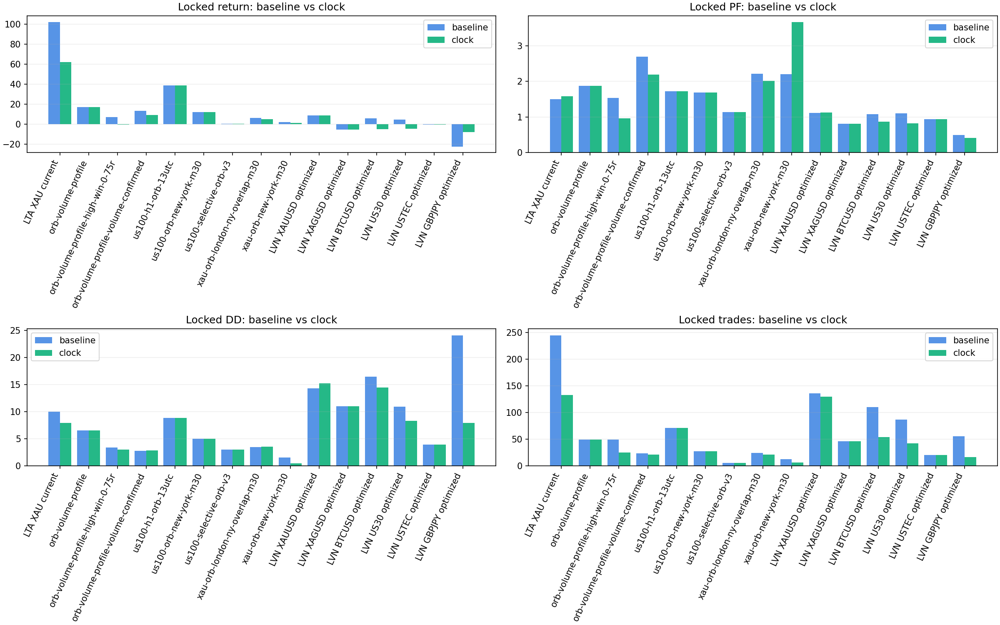
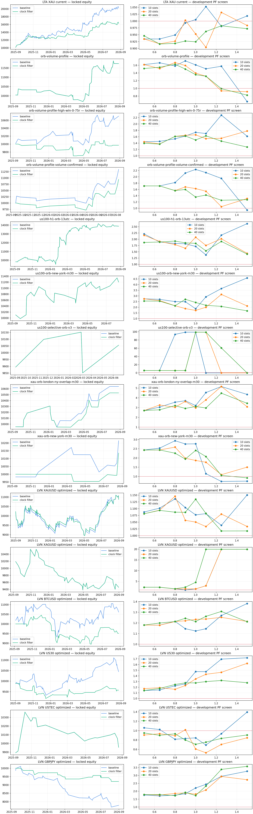

# Step 3 — Liquidity-Clock Confirmation

**Decision: REJECT / DO NOT ADD. No production file was changed.**

The screen evaluated 15 existing native strategy ledgers. Each filter was selected on development data only, then opened once on the locked last year.

| Family / setup | Clock filter | Locked return base → filter | PF base → filter | Win rate base → filter | DD base → filter | Trades base → filter | Sharpe | Recovery | MC P5 | Gate |
|---|---|---:|---:|---:|---:|---:|---:|---:|---:|---|
| LTA / LTA XAU current | clock10>=1.10 | +102.33% → +62.39% | 1.50 → 1.58 | 33.88% → 35.34% | 9.97% → 7.89% | 245 → 133 | 2.14 | 7.90 | +20.77% | FAIL |
| ORB / orb-volume-profile | baseline | +17.37% → +17.37% | 1.88 → 1.88 | 44.90% → 44.90% | 6.55% → 6.55% | 49 → 49 | 1.31 | 2.65 | -3.00% | FAIL |
| ORB / orb-volume-profile-high-win-0-75r | clock10>=1.25 | +7.04% → -0.29% | 1.54 → 0.97 | 69.39% → 56.00% | 3.39% → 2.96% | 49 → 25 | -0.07 | -0.10 | -4.86% | FAIL |
| ORB / orb-volume-profile-volume-confirmed | clock10>=0.90 | +13.43% → +9.44% | 2.69 → 2.19 | 47.83% → 42.86% | 2.74% → 2.82% | 23 → 21 | 1.14 | 3.34 | +0.18% | FAIL |
| ORB / us100-h1-orb-13utc | baseline | +38.78% → +38.78% | 1.72 → 1.72 | 50.70% → 50.70% | 8.83% → 8.83% | 71 → 71 | 1.31 | 4.39 | +0.16% | FAIL |
| ORB / us100-orb-new-york-m30 | baseline | +12.05% → +12.05% | 1.68 → 1.68 | 48.15% → 48.15% | 4.98% → 4.98% | 27 → 27 | 0.97 | 2.42 | -1.35% | FAIL |
| ORB / us100-selective-orb-v3 | baseline | +0.56% → +0.56% | 1.14 → 1.14 | 60.00% → 60.00% | 2.96% → 2.96% | 5 → 5 | 0.12 | 0.19 | +0.56% | FAIL |
| ORB / xau-orb-london-ny-overlap-m30 | clock20>=0.65 | +6.39% → +5.31% | 2.21 → 2.01 | 41.67% → 42.86% | 3.47% → 3.48% | 24 → 21 | 1.05 | 1.52 | -2.87% | FAIL |
| ORB / xau-orb-new-york-m30 | clock10>=1.00 | +2.15% → +1.36% | 2.20 → 3.66 | 41.67% → 33.33% | 1.54% → 0.46% | 12 → 6 | 0.83 | 2.95 | -0.12% | FAIL |
| LVN / LVN XAUUSD optimized | clock10>=0.80 | +8.83% → +8.78% | 1.12 → 1.12 | 40.44% → 40.77% | 14.26% → 15.23% | 136 → 130 | 0.46 | 0.58 | -16.02% | FAIL |
| LVN / LVN XAGUSD optimized | baseline | -5.41% → -5.41% | 0.81 → 0.81 | 30.43% → 30.43% | 10.99% → 10.99% | 46 → 46 | -0.53 | -0.49 | -18.27% | FAIL |
| LVN / LVN BTCUSD optimized | clock10>=1.50 | +6.12% → -4.89% | 1.08 → 0.87 | 47.27% → 44.44% | 16.46% → 14.43% | 110 → 54 | -0.43 | -0.34 | -23.73% | FAIL |
| LVN / LVN US30 optimized | clock10>=1.25 | +4.52% → -4.29% | 1.11 → 0.82 | 54.02% → 45.24% | 10.88% → 8.25% | 87 → 42 | -0.60 | -0.52 | -14.82% | FAIL |
| LVN / LVN USTEC optimized | baseline | -0.45% → -0.45% | 0.94 → 0.94 | 55.00% → 55.00% | 3.92% → 3.92% | 20 → 20 | -0.09 | -0.11 | -6.58% | FAIL |
| LVN / LVN GBPJPY optimized | clock40>=1.25 | -22.20% → -7.90% | 0.49 → 0.41 | 34.55% → 31.25% | 24.10% → 7.90% | 55 → 16 | -1.50 | -1.00 | -14.83% | FAIL |

## Interpretation

0 of 15 configurations passed the deliberately strict preliminary gate.
A pass is not permission to deploy: the filter must next be implemented in a copied EA and rerun natively because a ledger veto cannot reconstruct additional signals that may occur after a skipped position.
Broker tick count is a quote-activity proxy, not centralized exchange volume.

