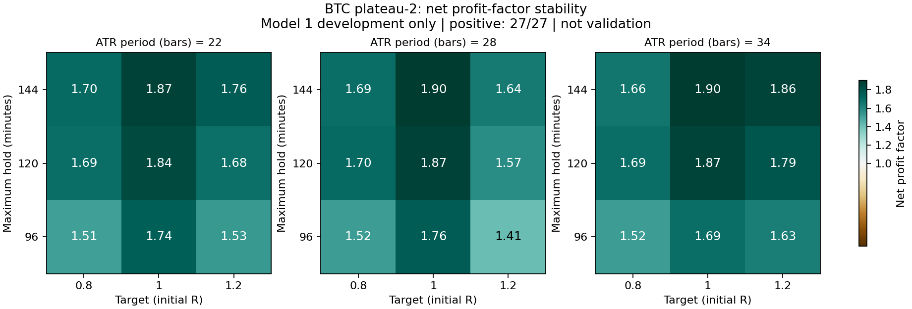
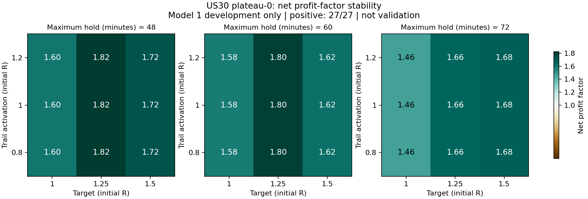
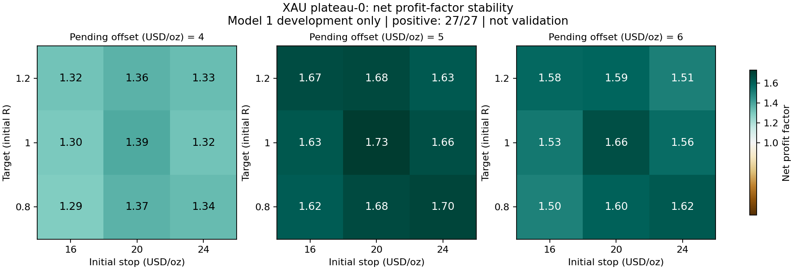
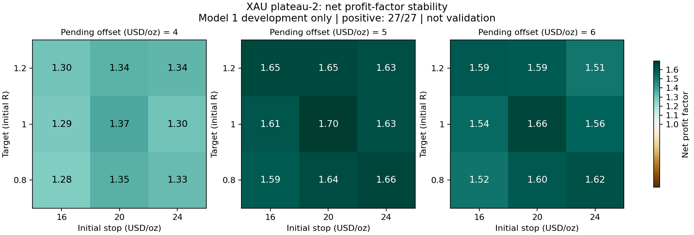

# Liquidity continuation — exploratory full parameter pipeline

Generated 2026-09-28T00:39:36.913490+00:00. Search: **complete**.

Requested: Gold first-touch + retest as one EA; BTC first-touch; US30 first-touch. No changes to the live system, BATs or website for these research candidates. The separate Nasdaq DI + wider stop + ATR deployment was pushed in commit `bae7aefb9`.

## Verdicts

| Asset | Research gate |
|---|---|
| XAU | REJECTED_PLATEAU_OR_VALIDATION |
| BTC | REJECTED_PLATEAU_OR_VALIDATION |
| US30 | REJECTED_PLATEAU_OR_VALIDATION |

**Terminal decision: all three research candidates rejected.** The conditional older holdout, Monte Carlo, FTMO and production stages were not started because no finalist passed validation. This is a completed rejection decision, not a pending deployment.

## Same-date, same-model raw vs optimized comparison

Native Model 4, 150 ms, 2024-03-27–2025-09-27. The candidate shown is the first-ranked DEVELOPMENT leader, not whichever lost least in validation. All three validation alternatives per asset are retained below. Per-position risk can differ when the chosen position cap reserves capacity; that is explicitly shown.

| Asset / test | Dates | Planned risk/position | Return | Trades (month / day) | Win | PF | Equity DD | Max W/L; avg W/L streak |
|---|---|---:|---:|---:|---:|---:|---:|---:|
| XAU raw, same validation window | 2024.03.27–2025.09.27 | 0.50% | -50.63% | 2,124 (117.8 / 5.40) | 48.49% | 0.87 | 54.35% | 11/10; 2.11/2.23 |
| XAU development leader, validation | 2024.03.27–2025.09.27 | 0.50% | -1.64% | 204 (11.3 / 0.52) | 46.08% | 0.92 | 3.11% | 5/5; 1.59/1.90 |
| BTC raw, same validation window | 2024.03.27–2025.09.27 | 1.00% | -77.79% | 2,041 (113.2 / 3.72) | 48.55% | 0.81 | 83.30% | 10/14; 1.90/2.01 |
| BTC development leader, validation | 2024.03.27–2025.09.27 | 1.00% | -1.76% | 37 (2.1 / 0.07) | 32.43% | 0.78 | 4.73% | 2/7; 1.20/2.50 |
| US30 raw, same validation window | 2024.03.27–2025.09.27 | 1.00% | -84.41% | 1,683 (93.3 / 4.28) | 47.30% | 0.68 | 88.21% | 16/18; 2.00/2.23 |
| US30 development leader, validation | 2024.03.27–2025.09.27 | 0.50% | -0.94% | 36 (2.0 / 0.09) | 30.56% | 0.54 | 1.86% | 3/15; 1.38/3.57 |

**No candidate is approved for deployment by this report.** A search-stage pass is not a full robustness/FTMO pass.

## Data and selection limitations

- $10,000 research account, 1:2000 research leverage, native broker symbol costs. This is not an FTMO account simulation.
- Development: 2021-09-27–2024-03-27, Model 1. Validation: 2024-03-27–2025-09-27, Model 4 and 150 ms.
- Recent year: 2025-09-27–2026-09-27, already viewed; retrospective only. Earlier 2019-09-27–2021-09-27 history is checked once if available, not described as future-forward validation.
- Real ticks start January 2026; earlier ticks are generated. Native history-quality percentages also include the 300-day no-trade warmup.
- Gold defaults allocate 0.5% planned equity risk to each of two independent entry engines. Single-engine baselines allocate 1%. Lots round UP, preserving the raw study; minimum lots, costs and gaps can exceed planned risk.
- A two-position-cap candidate divides its engine allocation by two. This lowers per-position exposure if its additional capacity is unused; lower dollar drawdown is not credited solely to better entries. Every confirmation table states planned per-position risk.
- These are price-only CFD rules, not the source author’s private futures/order-flow strategy. No claim to reproduce the 8× volume or 70% aggressor measurements.
- All original raw candidates failed the 3y/5y gate. This search is an explicitly requested exploratory exception, not a reversal of that finding.
- Trades/month annualizes the stated calendar window; trades/day uses weekdays for XAU/US30 and calendar days for BTC, not only days on which a trade happened. Streaks use completed position net P&L; zero breaks a streak. Equity DD comes from native floating-equity statistics.

## Exact baseline parity and raw combined Gold

| Asset / test | Dates | Planned risk/position | Return | Trades (month / day) | Win | PF | Equity DD | Max W/L; avg W/L streak |
|---|---|---:|---:|---:|---:|---:|---:|---:|
| BTC parity-touch | 2025.09.27–2026.09.27 | 1.00% | +109.18% | 1,338 (111.6 / 3.67) | 57.77% | 1.11 | 27.29% | 14/6; 2.25/1.65 |
| US30 parity-touch | 2025.09.27–2026.09.27 | 1.00% | +45.57% | 1,110 (92.6 / 4.27) | 53.42% | 1.05 | 33.27% | 13/7; 2.22/1.94 |
| XAU combined-raw-1y | 2025.09.27–2026.09.27 | 0.50% | +8.82% | 1,355 (113.0 / 5.21) | 53.14% | 1.02 | 17.44% | 9/9; 2.26/2.00 |
| XAU combined-raw-3y | 2023.09.27–2026.09.27 | 0.50% | -44.77% | 4,194 (116.5 / 5.36) | 50.74% | 0.94 | 54.80% | 11/10; 2.19/2.13 |
| XAU combined-raw-5y | 2021.09.27–2026.09.27 | 0.50% | -91.73% | 7,112 (118.5 / 5.45) | 48.88% | 0.82 | 94.74% | 11/12; 2.13/2.22 |
| XAU combined-raw-6m | 2026.03.27–2026.09.27 | 0.50% | -9.60% | 677 (112.0 / 5.17) | 51.40% | 0.95 | 17.54% | 9/9; 2.20/2.08 |
| XAU parity-retest | 2025.09.27–2026.09.27 | 1.00% | +12.51% | 373 (31.1 / 1.43) | 52.82% | 1.06 | 14.74% | 10/8; 2.19/1.96 |
| XAU parity-touch | 2025.09.27–2026.09.27 | 1.00% | +1.96% | 979 (81.6 / 3.77) | 53.32% | 1.00 | 30.07% | 9/6; 2.17/1.90 |

## Search coverage and dimension leaders

Completed search cases: 1,242; unique asset/settings combinations: 1,152. Repeated settings across stages remain counted as tests. Original raw testing and pre-search smoke/parity runs are additional research exposure.

Top-three beam search, not a Cartesian exhaustive global optimum. Negative intermediate leaders are retained so later exit/filter stages can be explored, but final development eligibility still requires positive return, PF ≥ 1.15 and ≥60 trades.

| Asset / stage | Return | N (month / day) | Win | PF | Equity DD | W/L streaks | Leader settings (Model 1 screening only) |
|---|---:|---:|---:|---:|---:|---|---|
| XAU / timeframe | -30.83% | 2218 (74.0 / 3.40) | 40.94% | 0.70 | 31.80% | not recorded in optimization XML | D1; original; SL ATR 1; trail none; exit 1R; all; both; filter none |
| XAU / entry | +0.79% | 252 (8.4 / 0.39) | 42.86% | 1.05 | 2.50% | not recorded in optimization XML | D1; stop continuation; SL ATR 1; trail none; exit 1R; all; both; filter none |
| XAU / stop | +6.86% | 1071 (35.7 / 1.64) | 52.75% | 1.12 | 3.88% | not recorded in optimization XML | H1; price limit; SL price distance 20; trail none; exit 1R; all; both; filter none |
| XAU / trailing | +7.08% | 1071 (35.7 / 1.64) | 52.75% | 1.12 | 3.87% | not recorded in optimization XML | H1; price limit; SL price distance 20; trail ATR; exit 1R; all; both; filter none |
| XAU / rr_exit | +7.08% | 1071 (35.7 / 1.64) | 52.75% | 1.12 | 3.87% | not recorded in optimization XML | H1; price limit; SL price distance 20; trail ATR; exit 1R; all; both; filter none |
| XAU / session | +6.35% | 278 (9.3 / 0.43) | 57.55% | 1.56 | 1.60% | not recorded in optimization XML | H1; price limit; SL price distance 20; trail ATR; exit 1R; NY; both; filter none |
| XAU / direction | +6.35% | 278 (9.3 / 0.43) | 57.55% | 1.56 | 1.60% | not recorded in optimization XML | H1; price limit; SL price distance 20; trail ATR; exit 1R; NY; both; filter none |
| XAU / filters | +6.67% | 276 (9.2 / 0.42) | 57.97% | 1.61 | 1.59% | not recorded in optimization XML | H1; price limit; SL price distance 20; trail ATR; exit 1R; NY; both; filter spread cap |
| XAU / management | +6.84% | 275 (9.2 / 0.42) | 58.18% | 1.64 | 1.59% | not recorded in optimization XML | H1; price limit; SL price distance 20; trail ATR; exit 1R; NY; both; filter spread cap |
| XAU / levels | +6.19% | 217 (7.2 / 0.33) | 56.68% | 1.73 | 1.18% | not recorded in optimization XML | H1; price limit; SL price distance 20; trail ATR; exit 1R; NY; both; filter spread cap |
| XAU / plateau-0 | +6.19% | 217 (7.2 / 0.33) | 56.68% | 1.73 | 1.18% | not recorded in optimization XML | H1; price limit; SL price distance 20; trail ATR; exit 1R; NY; both; filter spread cap |
| XAU / plateau-1 | +6.19% | 217 (7.2 / 0.33) | 56.68% | 1.73 | 1.18% | not recorded in optimization XML | H1; price limit; SL price distance 20; trail ATR; exit 1R; NY; both; filter spread cap |
| XAU / plateau-2 | +6.01% | 217 (7.2 / 0.33) | 56.22% | 1.70 | 1.18% | not recorded in optimization XML | H1; price limit; SL price distance 20; trail ATR; exit 1R; NY; both; filter spread cap |
| BTC / timeframe | -76.24% | 2881 (96.2 / 3.16) | 30.86% | 0.51 | 76.41% | not recorded in optimization XML | D1; original; SL ATR 1; trail none; exit 1R; all; both; filter none |
| BTC / entry | +0.38% | 68 (2.3 / 0.07) | 47.06% | 1.08 | 1.44% | not recorded in optimization XML | D1; bar confirmation; SL ATR 1; trail none; exit 1R; all; both; filter none |
| BTC / stop | +2.98% | 68 (2.3 / 0.07) | 48.53% | 1.39 | 2.59% | not recorded in optimization XML | D1; bar confirmation; SL structure 1; trail none; exit 1R; all; both; filter none |
| BTC / trailing | +3.11% | 68 (2.3 / 0.07) | 48.53% | 1.40 | 2.59% | not recorded in optimization XML | D1; bar confirmation; SL structure 1; trail M15 step; exit 1R; all; both; filter none |
| BTC / rr_exit | +3.11% | 68 (2.3 / 0.07) | 48.53% | 1.40 | 2.59% | not recorded in optimization XML | D1; bar confirmation; SL structure 1; trail M15 step; exit 1R; all; both; filter none |
| BTC / session | +3.11% | 68 (2.3 / 0.07) | 48.53% | 1.40 | 2.59% | not recorded in optimization XML | D1; bar confirmation; SL structure 1; trail M15 step; exit 1R; Asia; both; filter none |
| BTC / direction | +3.11% | 68 (2.3 / 0.07) | 48.53% | 1.40 | 2.59% | not recorded in optimization XML | D1; bar confirmation; SL structure 1; trail M15 step; exit 1R; all; both; filter none |
| BTC / filters | +3.11% | 68 (2.3 / 0.07) | 48.53% | 1.40 | 2.59% | not recorded in optimization XML | D1; bar confirmation; SL structure 1; trail M15 step; exit 1R; Asia; both; filter spread cap |
| BTC / management | +7.02% | 68 (2.3 / 0.07) | 52.94% | 1.84 | 3.51% | not recorded in optimization XML | D1; bar confirmation; SL structure 1; trail M15 step; exit 1R; all; both; filter spread cap |
| BTC / levels | +7.26% | 68 (2.3 / 0.07) | 52.94% | 1.87 | 3.45% | not recorded in optimization XML | D1; bar confirmation; SL structure 1; trail M15 step; exit 1R; Asia; both; filter spread cap |
| BTC / plateau-0 | +7.25% | 68 (2.3 / 0.07) | 55.88% | 1.90 | 3.03% | not recorded in optimization XML | D1; bar confirmation; SL structure 1; trail M15 step; exit 1R; Asia; both; filter spread cap |
| BTC / plateau-1 | +7.25% | 68 (2.3 / 0.07) | 55.88% | 1.90 | 3.03% | not recorded in optimization XML | D1; bar confirmation; SL structure 1; trail M15 step; exit 1R; Asia; both; filter H1 EMA50 |
| BTC / plateau-2 | +7.25% | 68 (2.3 / 0.07) | 55.88% | 1.90 | 3.03% | not recorded in optimization XML | D1; bar confirmation; SL structure 1; trail M15 step; exit 1R; all; both; filter spread cap |
| US30 / timeframe | -50.70% | 2414 (80.6 / 3.70) | 40.72% | 0.66 | 51.42% | not recorded in optimization XML | D1; original; SL ATR 1; trail none; exit 1R; all; both; filter none |
| US30 / entry | -0.08% | 68 (2.3 / 0.10) | 44.12% | 0.96 | 0.71% | not recorded in optimization XML | D1; bar confirmation; SL ATR 1; trail none; exit 1R; all; both; filter none |
| US30 / stop | +1.86% | 68 (2.3 / 0.10) | 45.59% | 1.33 | 1.79% | not recorded in optimization XML | D1; bar confirmation; SL structure 1; trail none; exit 1R; all; both; filter none |
| US30 / trailing | +1.86% | 68 (2.3 / 0.10) | 45.59% | 1.33 | 1.79% | not recorded in optimization XML | D1; bar confirmation; SL structure 1; trail chandelier; exit 1R; all; both; filter none |
| US30 / rr_exit | +2.89% | 68 (2.3 / 0.10) | 45.59% | 1.51 | 1.79% | not recorded in optimization XML | D1; bar confirmation; SL structure 1; trail chandelier; exit 1.25R; all; both; filter none |
| US30 / session | +3.71% | 62 (2.1 / 0.10) | 48.39% | 1.80 | 1.79% | not recorded in optimization XML | D1; bar confirmation; SL structure 1; trail chandelier; exit 1.25R; Asia; both; filter none |
| US30 / direction | +3.71% | 62 (2.1 / 0.10) | 48.39% | 1.80 | 1.79% | not recorded in optimization XML | D1; bar confirmation; SL structure 1; trail chandelier; exit 1.25R; Asia; both; filter none |
| US30 / filters | +3.71% | 62 (2.1 / 0.10) | 48.39% | 1.80 | 1.79% | not recorded in optimization XML | D1; bar confirmation; SL structure 1; trail chandelier; exit 1.25R; Asia; both; filter spread cap |
| US30 / management | +1.86% | 62 (2.1 / 0.10) | 48.39% | 1.80 | 0.90% | not recorded in optimization XML | D1; bar confirmation; SL structure 1; trail chandelier; exit 1.25R; Asia; both; filter spread cap |
| US30 / levels | +1.86% | 62 (2.1 / 0.10) | 48.39% | 1.80 | 0.90% | not recorded in optimization XML | D1; bar confirmation; SL structure 1; trail chandelier; exit 1.25R; Asia; both; filter spread cap |
| US30 / plateau-0 | +1.86% | 62 (2.1 / 0.10) | 48.39% | 1.80 | 0.90% | not recorded in optimization XML | D1; bar confirmation; SL structure 1; trail chandelier; exit 1.25R; Asia; both; filter spread cap |
| US30 / plateau-1 | +1.86% | 62 (2.1 / 0.10) | 48.39% | 1.80 | 0.90% | not recorded in optimization XML | D1; bar confirmation; SL structure 1; trail chandelier; exit 1.25R; Asia; both; filter spread cap |
| US30 / plateau-2 | +1.86% | 62 (2.1 / 0.10) | 48.39% | 1.80 | 0.90% | not recorded in optimization XML | D1; bar confirmation; SL structure 1; trail chandelier; exit 1.25R; Asia; both; filter spread cap |

Screening XML/net summaries do not contain the closed-position sequence, so no screening streaks are fabricated. Full sequence metrics appear for each native confirmation below.

## Model 4 confirmation / control results

| Asset / test | Dates | Planned risk/position | Return | Trades (month / day) | Win | PF | Equity DD | Max W/L; avg W/L streak |
|---|---|---:|---:|---:|---:|---:|---:|---:|
| BTC raw-validation | 2024.03.27–2025.09.27 | 1.00% | -77.79% | 2,041 (113.2 / 3.72) | 48.55% | 0.81 | 83.30% | 10/14; 1.90/2.01 |
| BTC validation-0 | 2024.03.27–2025.09.27 | 1.00% | -1.76% | 37 (2.1 / 0.07) | 32.43% | 0.78 | 4.73% | 2/7; 1.20/2.50 |
| BTC validation-1 | 2024.03.27–2025.09.27 | 1.00% | -1.76% | 37 (2.1 / 0.07) | 32.43% | 0.78 | 4.73% | 2/7; 1.20/2.50 |
| BTC validation-2 | 2024.03.27–2025.09.27 | 1.00% | -1.76% | 37 (2.1 / 0.07) | 32.43% | 0.78 | 4.73% | 2/7; 1.20/2.50 |
| US30 raw-validation | 2024.03.27–2025.09.27 | 1.00% | -84.41% | 1,683 (93.3 / 4.28) | 47.30% | 0.68 | 88.21% | 16/18; 2.00/2.23 |
| US30 validation-0 | 2024.03.27–2025.09.27 | 0.50% | -0.94% | 36 (2.0 / 0.09) | 30.56% | 0.54 | 1.86% | 3/15; 1.38/3.57 |
| US30 validation-1 | 2024.03.27–2025.09.27 | 0.50% | -0.94% | 36 (2.0 / 0.09) | 30.56% | 0.54 | 1.86% | 3/15; 1.38/3.57 |
| US30 validation-2 | 2024.03.27–2025.09.27 | 0.50% | -0.94% | 36 (2.0 / 0.09) | 30.56% | 0.54 | 1.86% | 3/15; 1.38/3.57 |
| XAU raw-validation | 2024.03.27–2025.09.27 | 0.50% | -50.63% | 2,124 (117.8 / 5.40) | 48.49% | 0.87 | 54.35% | 11/10; 2.11/2.23 |
| XAU validation-0 | 2024.03.27–2025.09.27 | 0.50% | -1.64% | 204 (11.3 / 0.52) | 46.08% | 0.92 | 3.11% | 5/5; 1.59/1.90 |
| XAU validation-1 | 2024.03.27–2025.09.27 | 0.50% | -1.64% | 204 (11.3 / 0.52) | 46.08% | 0.92 | 3.11% | 5/5; 1.59/1.90 |
| XAU validation-2 | 2024.03.27–2025.09.27 | 0.50% | -1.44% | 203 (11.3 / 0.52) | 46.31% | 0.92 | 2.91% | 5/5; 1.59/1.88 |

## Development sensitivity plots

Green/profitable development neighborhoods are not evidence of a validation pass. The verdicts above take precedence.

## Conditional downstream gates

Only candidates surviving development, plateau and frozen confirmation proceed to 10,000-path block bootstrap, trade-order reshuffle, missed-fill tests, measured execution-cost stress and FTMO/portfolio overlays. Rejected candidates stop; unavailable history or measured-cost/equity evidence blocks readiness claims. No pass-rate or payout forecast is inferred from a native return.

## Evidence

- `PROTOCOL.md`: pre-search rules and review correction.
- `PARITY.json`: original vs extension entries, exits, volumes and net P&L.
- `SEARCH RESULTS.json`: every completed screening case.
- `FINALISTS.json` and asset frozen final files: selection/gate evidence.
- `native-v2/`: authoritative per-batch source, binary, hashes, exact cases, inputs, native reports, compressed journals and position-ID ledgers.
- `native/`: retained pre-review attempts, not current optimization evidence.
- `VERIFICATION.json`: completed-batch checks; `verify.py` has independent boundary, stage-space, streak and ledger checks.

No production promotion or public-site deployment is performed by this research runner.
