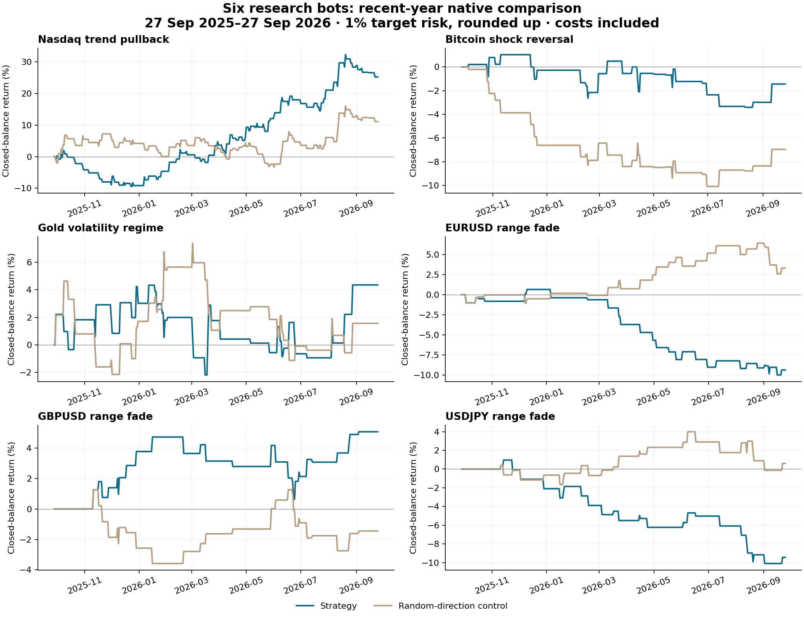

# Market-style bots — six-bot native comparison

Gold volatility regime ranks first among these frozen implementations. It passes the raw shortlist rules, not the full validation pipeline.

The user clip supplies hypotheses, not complete strategies. These are our fixed-rule research implementations, not reproductions of the unspecified +180R experiment. Four model families were built across six broker CFDs. No optimization was performed and no live bot was deployed.

## What was built

- Nasdaq / USTEC: trend-aligned EMA pullback, then continuation confirmation; 3R target.
- BTCUSD: fade a large hourly shock after an opposite candle confirms a reaction; 1.5R target.
- XAUUSD: trade directional confirmation only in a persistent high-volatility state; 2R target.
- EURUSD, GBPUSD, USDJPY: fade a band excursion after re-entry in a low-efficiency, flat-trend environment; target the frozen pre-excursion mean.

All use completed H1 bars, one attempt/day, 1.5 ATR initial stop, 1% equity target risk rounded UP, and bounded intraday holds. No martingale, pyramiding or averaging. [Full frozen rules](RULES.md). An asset characteristic is not itself a profitable directional signal. Gold needs an additional directional rule, explicitly defined rather than assumed. The regime skill informed past-data-only state estimation; its missing packaged runner was replaced by the documented volatility-state transition model, not advertised as GARCH/HMM or the original skill algorithm.

## Main five-year screens

2021-09-27 to 2026-09-27 exclusive. Native one-minute-OHLC screens on Exness-MT5Trial16, $10,000 starting balance, USD, 150ms delay. These are not five years of recorded real ticks.

| Bot | Trades | /month | /day | Return | PF | Win% | Equity DD | W/L streak | Mean net R |
|---|---:|---:|---:|---:|---:|---:|---:|---:|---:|
| Gold volatility regime | 209 | 3.48 | 0.162 | +33.11% | 1.33 | 52.6 | 7.48% | 7/7 | 0.139 |
| Nasdaq trend pullback † | 570 | 9.50 | 0.441 | +58.66% | 1.13 | 35.6 | 21.14% | 6/15 | 0.092 |
| Bitcoin shock reversal | 178 | 2.97 | 0.097 | +3.70% | 1.05 | 47.8 | 14.36% | 10/6 | 0.022 |
| GBPUSD range fade | 151 | 2.52 | 0.116 | +9.88% | 1.16 | 57.0 | 8.49% | 11/4 | 0.065 |
| USDJPY range fade | 138 | 2.30 | 0.106 | -7.93% | 0.86 | 53.6 | 11.39% | 7/6 | -0.055 |
| EURUSD range fade | 172 | 2.87 | 0.132 | -1.61% | 0.98 | 54.7 | 13.46% | 5/9 | -0.006 |

† Execution/carry warning: inspect the exceptions below. Returns include configured spread, commission, swap and actual modeled fills, compounded at the target sizing rule. Equity DD is the native report’s relative floating-equity drawdown; closed-balance DD is separately saved in RESULTS.json. /day is trades per eligible UTC date with quotes during the permitted entry hours, not per day with a trade. Lot rounding/slippage mean 1% is a target, not an exact cap.

## Recent year

2025-09-27 to 2026-09-27 exclusive, Model 4 real-tick mode. Real/generated proportions are listed below; this recent year has already been seen in other research and is not an untouched holdout.

| Bot | Trades | /month | /day | Return | PF | Win% | Equity DD | W/L streak | Mean net R |
|---|---:|---:|---:|---:|---:|---:|---:|---:|---:|
| Gold volatility regime | 44 | 3.67 | 0.171 | +4.36% | 1.17 | 45.5 | 7.00% | 3/4 | 0.079 |
| Nasdaq trend pullback † | 103 | 8.59 | 0.399 | +25.22% | 1.44 | 45.6 | 12.11% | 6/11 | 0.227 |
| Bitcoin shock reversal | 33 | 2.75 | 0.090 | -1.44% | 0.89 | 36.4 | 4.93% | 3/6 | -0.047 |
| GBPUSD range fade | 28 | 2.33 | 0.109 | +5.06% | 1.59 | 60.7 | 4.39% | 4/4 | 0.179 |
| USDJPY range fade | 28 | 2.33 | 0.109 | -9.43% | 0.39 | 35.7 | 11.37% | 2/6 | -0.346 |
| EURUSD range fade | 29 | 2.42 | 0.112 | -9.38% | 0.40 | 31.0 | 10.95% | 2/10 | -0.332 |

The chart shows daily sampled closed balance, not intratrade equity or maximum drawdown. Each bot runs in its own account simulation; adding these returns is not a portfolio backtest.

## Does each bot beat its control?

Controls randomize direction with seed 290929 at the same qualifying signals, reflect SL/TP distances, and retain the same risk/session rules. This isolates directional information conditional on the selected times; it does not prove that signal timing beats random times or reproduce the clip’s random-level test. One seed is a noisy comparator, not a distribution of random strategies. Compare mean net R; differently compounded balances can otherwise distort the comparison.

### 5y: raw and matched control

| Bot | Trades | /month | /day | Return | PF | Win% | Equity DD | W/L streak | Mean net R |
|---|---:|---:|---:|---:|---:|---:|---:|---:|---:|
| Nasdaq trend pullback † | 570 | 9.50 | 0.441 | +58.66% | 1.13 | 35.6 | 21.14% | 6/15 | 0.092 |
| Nasdaq trend pullback control † | 570 | 9.50 | 0.441 | +55.72% | 1.15 | 35.3 | 22.21% | 6/9 | 0.089 |
| Bitcoin shock reversal | 178 | 2.97 | 0.097 | +3.70% | 1.05 | 47.8 | 14.36% | 10/6 | 0.022 |
| Bitcoin shock reversal control | 178 | 2.97 | 0.097 | -15.68% | 0.80 | 40.4 | 22.07% | 6/10 | -0.088 |
| Gold volatility regime | 209 | 3.48 | 0.162 | +33.11% | 1.33 | 52.6 | 7.48% | 7/7 | 0.139 |
| Gold volatility regime control | 209 | 3.48 | 0.162 | +15.54% | 1.16 | 51.2 | 9.81% | 4/7 | 0.071 |
| EURUSD range fade | 172 | 2.87 | 0.132 | -1.61% | 0.98 | 54.7 | 13.46% | 5/9 | -0.006 |
| EURUSD range fade control | 172 | 2.87 | 0.132 | +15.33% | 1.25 | 61.0 | 7.28% | 11/8 | 0.086 |
| GBPUSD range fade | 151 | 2.52 | 0.116 | +9.88% | 1.16 | 57.0 | 8.49% | 11/4 | 0.065 |
| GBPUSD range fade control | 151 | 2.52 | 0.116 | +3.11% | 1.05 | 57.0 | 10.11% | 8/8 | 0.023 |
| USDJPY range fade | 138 | 2.30 | 0.106 | -7.93% | 0.86 | 53.6 | 11.39% | 7/6 | -0.055 |
| USDJPY range fade control | 138 | 2.30 | 0.106 | -10.08% | 0.81 | 49.3 | 12.65% | 9/5 | -0.073 |

### 3y: raw and matched control

| Bot | Trades | /month | /day | Return | PF | Win% | Equity DD | W/L streak | Mean net R |
|---|---:|---:|---:|---:|---:|---:|---:|---:|---:|
| Nasdaq trend pullback † | 347 | 9.64 | 0.448 | +17.04% | 1.08 | 36.0 | 21.21% | 6/15 | 0.056 |
| Nasdaq trend pullback control † | 347 | 9.64 | 0.448 | +68.50% | 1.26 | 39.2 | 12.41% | 6/8 | 0.161 |
| Bitcoin shock reversal | 106 | 2.94 | 0.097 | +6.68% | 1.14 | 46.2 | 6.46% | 6/6 | 0.066 |
| Bitcoin shock reversal control | 106 | 2.94 | 0.097 | -12.11% | 0.75 | 37.7 | 19.57% | 5/10 | -0.114 |
| Gold volatility regime | 131 | 3.64 | 0.169 | +16.13% | 1.25 | 50.4 | 7.90% | 7/7 | 0.125 |
| Gold volatility regime control | 131 | 3.64 | 0.169 | +2.86% | 1.05 | 48.1 | 9.39% | 4/7 | 0.025 |
| EURUSD range fade | 85 | 2.36 | 0.109 | -8.06% | 0.78 | 48.2 | 13.49% | 5/9 | -0.095 |
| EURUSD range fade control | 85 | 2.36 | 0.109 | +5.04% | 1.17 | 58.8 | 6.22% | 7/5 | 0.062 |
| GBPUSD range fade | 80 | 2.22 | 0.103 | +1.02% | 1.03 | 53.8 | 7.10% | 5/4 | 0.016 |
| GBPUSD range fade control | 80 | 2.22 | 0.103 | +5.54% | 1.17 | 60.0 | 7.88% | 7/4 | 0.072 |
| USDJPY range fade | 76 | 2.11 | 0.098 | -5.53% | 0.82 | 52.6 | 11.37% | 7/6 | -0.071 |
| USDJPY range fade control | 76 | 2.11 | 0.098 | -5.26% | 0.83 | 50.0 | 9.42% | 3/5 | -0.066 |

### 1y: raw and matched control

| Bot | Trades | /month | /day | Return | PF | Win% | Equity DD | W/L streak | Mean net R |
|---|---:|---:|---:|---:|---:|---:|---:|---:|---:|
| Nasdaq trend pullback † | 103 | 8.59 | 0.399 | +25.22% | 1.44 | 45.6 | 12.11% | 6/11 | 0.227 |
| Nasdaq trend pullback control † | 103 | 8.59 | 0.399 | +11.08% | 1.18 | 39.8 | 11.19% | 6/8 | 0.110 |
| Bitcoin shock reversal | 33 | 2.75 | 0.090 | -1.44% | 0.89 | 36.4 | 4.93% | 3/6 | -0.047 |
| Bitcoin shock reversal control | 33 | 2.75 | 0.090 | -6.96% | 0.56 | 30.3 | 11.11% | 2/9 | -0.204 |
| Gold volatility regime | 44 | 3.67 | 0.171 | +4.36% | 1.17 | 45.5 | 7.00% | 3/4 | 0.079 |
| Gold volatility regime control | 44 | 3.67 | 0.171 | +1.57% | 1.06 | 45.5 | 9.21% | 4/5 | 0.033 |
| EURUSD range fade | 29 | 2.42 | 0.112 | -9.38% | 0.40 | 31.0 | 10.95% | 2/10 | -0.332 |
| EURUSD range fade control | 29 | 2.42 | 0.112 | +3.30% | 1.35 | 62.1 | 3.79% | 5/5 | 0.114 |
| GBPUSD range fade | 28 | 2.33 | 0.109 | +5.06% | 1.59 | 60.7 | 4.39% | 4/4 | 0.179 |
| GBPUSD range fade control | 28 | 2.33 | 0.109 | -1.45% | 0.87 | 53.6 | 5.03% | 7/3 | -0.051 |
| USDJPY range fade | 28 | 2.33 | 0.109 | -9.43% | 0.39 | 35.7 | 11.37% | 2/6 | -0.346 |
| USDJPY range fade control | 28 | 2.33 | 0.109 | +0.61% | 1.06 | 57.1 | 4.54% | 3/3 | 0.024 |

### 6m: raw and matched control

| Bot | Trades | /month | /day | Return | PF | Win% | Equity DD | W/L streak | Mean net R |
|---|---:|---:|---:|---:|---:|---:|---:|---:|---:|
| Nasdaq trend pullback † | 56 | 9.26 | 0.427 | +24.62% | 1.82 | 51.8 | 5.92% | 6/3 | 0.403 |
| Nasdaq trend pullback control | 56 | 9.26 | 0.427 | +7.43% | 1.24 | 42.9 | 8.99% | 6/8 | 0.136 |
| Bitcoin shock reversal | 19 | 3.14 | 0.103 | -1.93% | 0.74 | 26.3 | 4.23% | 1/6 | -0.102 |
| Bitcoin shock reversal control | 19 | 3.14 | 0.103 | +0.54% | 1.08 | 36.8 | 5.30% | 2/4 | 0.032 |
| Gold volatility regime | 16 | 2.65 | 0.123 | +2.59% | 1.31 | 43.8 | 4.10% | 3/3 | 0.104 |
| Gold volatility regime control | 16 | 2.65 | 0.123 | +0.51% | 1.06 | 43.8 | 4.99% | 2/4 | 0.085 |
| EURUSD range fade | 18 | 2.98 | 0.137 | -5.90% | 0.42 | 33.3 | 6.65% | 1/5 | -0.332 |
| EURUSD range fade control | 18 | 2.98 | 0.137 | +2.54% | 1.43 | 61.1 | 3.80% | 5/5 | 0.142 |
| GBPUSD range fade | 15 | 2.48 | 0.115 | +1.85% | 1.44 | 53.3 | 3.45% | 4/4 | 0.126 |
| GBPUSD range fade control | 15 | 2.48 | 0.115 | +0.19% | 1.04 | 60.0 | 4.05% | 4/3 | 0.011 |
| USDJPY range fade | 14 | 2.32 | 0.107 | -4.17% | 0.47 | 35.7 | 6.76% | 2/6 | -0.298 |
| USDJPY range fade control | 14 | 2.32 | 0.107 | -0.75% | 0.89 | 50.0 | 4.54% | 3/3 | -0.050 |

## Qualification and ranking

The frozen raw gate requires positive P&L, PF >=1.15 and at least 30 trades in BOTH 3y/5y, better control mean R, matched dates, and valid execution/cost evidence. The current shortlist also requires a positive, execution-clean latest year. Rank eligible passes by the lower 3y/5y PF, then equity drawdown and recent-year PF. A nonpassing leader is a research lead only.

- **1. Gold volatility regime** — raw shortlist pass; minimum long-window PF 1.250. Needs the separately approved optimization/validation/stress pipeline before any promotion.
- **2. Nasdaq trend pullback** — not qualified; minimum long-window PF 1.084. 3y PF below 1.15; 3y raw execution/carry flags; 3y control missing or execution/carry flags; 3y does not beat matched control mean R; 5y PF below 1.15; 5y raw execution/carry flags; 5y control missing or execution/carry flags; Recent-year execution/carry flags
- **3. Bitcoin shock reversal** — not qualified; minimum long-window PF 1.049. 3y PF below 1.15; 5y PF below 1.15; Recent-year net loss or zero return
- **4. GBPUSD range fade** — not qualified; minimum long-window PF 1.030. 3y PF below 1.15; 3y does not beat matched control mean R
- **5. USDJPY range fade** — not qualified; minimum long-window PF 0.825. 3y net loss; 3y PF below 1.15; 3y does not beat matched control mean R; 5y net loss; 5y PF below 1.15; Recent-year net loss or zero return
- **6. EURUSD range fade** — not qualified; minimum long-window PF 0.778. 3y net loss; 3y PF below 1.15; 3y does not beat matched control mean R; 5y net loss; 5y PF below 1.15; 5y does not beat matched control mean R; Recent-year net loss or zero return

Long-window real-tick-mode confirmations for screen passers (generated ticks before recorded real-tick history begins):

| Bot | Trades | /month | /day | Return | PF | Win% | Equity DD | W/L streak | Mean net R |
|---|---:|---:|---:|---:|---:|---:|---:|---:|---:|
| Gold volatility regime (3y) | 131 | 3.64 | 0.169 | +16.10% | 1.25 | 50.4 | 7.80% | 7/7 | 0.125 |
| Gold volatility regime control (3y) | 131 | 3.64 | 0.169 | +3.01% | 1.05 | 48.9 | 9.09% | 4/7 | 0.025 |
| Gold volatility regime (5y) | 209 | 3.48 | 0.162 | +33.06% | 1.33 | 52.6 | 7.38% | 7/7 | 0.139 |
| Gold volatility regime control (5y) | 209 | 3.48 | 0.162 | +16.28% | 1.17 | 51.7 | 9.46% | 4/7 | 0.071 |

## Execution, risk and data audit

- **Nasdaq trend pullback:** five-year raw flags {"entry_fail": 0, "close_fail": 0, "invalid_volume": 0, "invalid_stops": 0, "stopout": 0, "overnight_positions": 13, "swap_positions": 6}. Maximum hold 79.50h. Initial stop risk median/max 1.002% / 1.015% of entry equity. Latest year native history label: 59% real ticks; latest six months: 98% real ticks.
- **Bitcoin shock reversal:** five-year raw flags {"entry_fail": 0, "close_fail": 0, "invalid_volume": 0, "invalid_stops": 0, "stopout": 0, "overnight_positions": 0, "swap_positions": 0}. Maximum hold 6.00h. Initial stop risk median/max 1.022% / 1.276% of entry equity. Latest year native history label: 59% real ticks; latest six months: 98% real ticks.
- **Gold volatility regime:** five-year raw flags {"entry_fail": 0, "close_fail": 0, "invalid_volume": 0, "invalid_stops": 0, "stopout": 0, "overnight_positions": 0, "swap_positions": 0}. Maximum hold 8.03h. Initial stop risk median/max 1.047% / 1.695% of entry equity. Latest year native history label: 59% real ticks; latest six months: 98% real ticks.
- **EURUSD range fade:** five-year raw flags {"entry_fail": 0, "close_fail": 0, "invalid_volume": 0, "invalid_stops": 0, "stopout": 0, "overnight_positions": 0, "swap_positions": 0}. Maximum hold 6.00h. Initial stop risk median/max 1.009% / 1.032% of entry equity. Latest year native history label: 59% real ticks; latest six months: 98% real ticks.
- **GBPUSD range fade:** five-year raw flags {"entry_fail": 0, "close_fail": 0, "invalid_volume": 0, "invalid_stops": 0, "stopout": 0, "overnight_positions": 0, "swap_positions": 0}. Maximum hold 6.00h. Initial stop risk median/max 1.010% / 1.060% of entry equity. Latest year native history label: 59% real ticks; latest six months: 98% real ticks.
- **USDJPY range fade:** five-year raw flags {"entry_fail": 0, "close_fail": 0, "invalid_volume": 0, "invalid_stops": 0, "stopout": 0, "overnight_positions": 0, "swap_positions": 0}. Maximum hold 6.00h. Initial stop risk median/max 1.010% / 1.037% of entry equity. Latest year native history label: 59% real ticks; latest six months: 98% real ticks.

Across all raw runs, actual initial-stop risk reached **1.94% of equity** despite the 1% target. Volume rounding/minimums and fill changes are material; these tests do not represent a strict 1%-maximum-loss system. Commissions and gap losses can add further loss beyond the measured initial stop risk.

Scheduled flat times cannot execute without quotes. Historical missing/early-ending sessions can carry trades into the next session/weekend; those positions are retained with their real modeled costs, not excluded after looking at profits. Such flags block an unqualified intraday/pass claim. Native symbols supply current weekday session schedules, not a complete point-in-time historical holiday calendar. [Session API specification](https://www.mql5.com/en/docs/marketinformation/symbolinfosessiontrade).

Real ticks generally begin 2026-01-01 on this feed. Earlier records are generated. Model 1 is a screen with OHLC path limitations; Model 4 also uses generated ticks where recorded ticks are absent. [MetaTrader real/generated tick documentation](https://www.metatrader5.com/en/terminal/help/algotrading/tick_generation). A 150ms simulated delay is not measured live slippage. Commission/swap schedules are tester/account-specific and not audited historical fee series. Do not transfer returns to a different broker or FTMO account.

Native history-quality labels describe the full tester run, including the 90-day warmup; they are not separately measured tick-coverage percentages for just the trading window. Inspect each run’s recorded real-tick start date and archived journal for provenance.

## What these results cannot establish

The overlapping 5y/3y/1y/6m windows are not independent replications. Six model/asset combinations were compared; selecting the best creates selection bias. There is no fresh holdout, multiple-testing-adjusted proof, full random-control distribution or completed Monte Carlo/FTMO validation here. No claim that Nasdaq always trends, all forex ranges, gold is uniquely clustered, or Bitcoin always reverses is established by this experiment. Nor does a failed implementation disprove an entire strategy family. Gold’s overlapping rolling ATR windows mechanically contribute to state persistence: a high estimated Hot-to-Hot probability is not, by itself, proof of forecast skill.

The original clip supplies four market families despite saying five; we used three FX pairs for a transparent six-asset comparison. We did not test every style on every asset. The gold bot is a NEW intraday regime strategy, not a repair or retest of the previous 23:00 London clock-bias strategy. Its results cannot settle that strategy’s financing discrepancy.

## Artifacts and verification

[Research bot source](MarketStyles.mq5), compiled MarketStyles.ex5, six named presets in `presets/`, [full results](RESULTS.json), [cash/evidence verification](VERIFICATION.json), [independent signal verification](SIGNAL_VERIFICATION.json), source H1 data and archived native reports/deals/signals/traces. The EA refuses to initialize outside Strategy Tester. Do not attach it to a trading account expecting live execution. No installers, production EAs, SETs, website or live account were modified. No optimization or deployment is implied by a raw pass.
