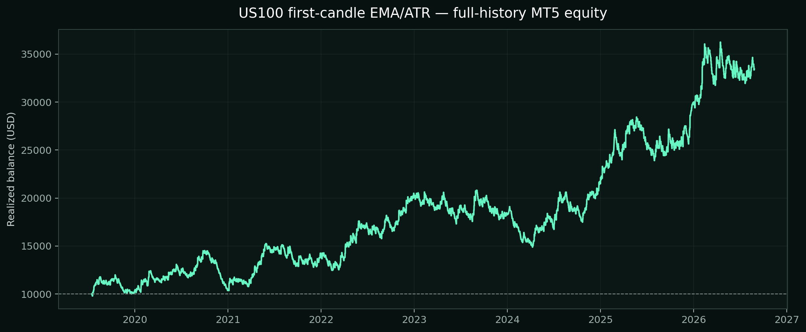
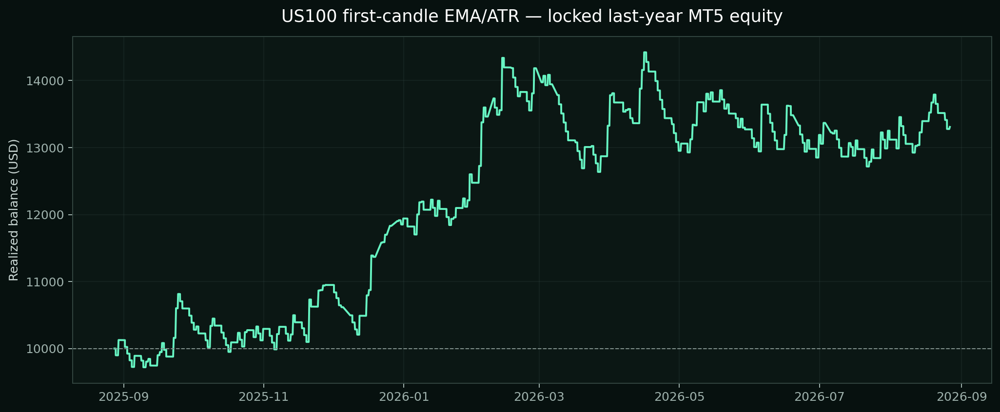

# US100 first-candle momentum — 982% claim recheck

## Decision

The strategy is profitable, and the new delayed-trailing version improves the prior full-history return. The advertised +982% return and 57% win rate were not reproduced. The selected configuration is a research candidate, not an automatic BAT replacement.

| Test | Dates | Return | PF | Win rate | Max equity DD | Trades | Final | Quality |
| --- | --- | ---: | ---: | ---: | ---: | ---: | ---: | ---: |
| Full history | 2019-07-16 - 2026-08-27 | +234.31% | 1.12 | 38.88% | 29.54% | 1,821 | $33,431.26 | 98% |
| Locked post-selection | 2025-01-01 - 2026-08-27 | +50.84% | 1.17 | 41.47% | 17.18% | 422 | $15,083.69 | 100% |
| Locked last year | 2025-08-28 - 2026-08-27 | +33.09% | 1.19 | 41.02% | 13.40% | 256 | $13,308.53 | 100% |

## Selected reproducible rules

- Exness USTEC, five-minute chart.
- At 09:35 New York time, use the completed 09:30–09:35 candle.
- Close above EMA(12): buy. Close below EMA(12): sell.
- One trade maximum per New York trading day; both directions enabled.
- ATR(14) initial stop at 4 ATR.
- Start trailing after +1R; Chandelier-style trailing distance 6 ATR.
- Close any remaining position at 15:55 New York time.
- Risk 1% of current equity to the initial stop; no take-profit and no news filter.

These parameters were selected using only 2019-07-16 through 2024-12-31. The post-2025 and last-year rows were run afterward without changing the settings.

## Full-history statistics

- Initial / final: $10,000.00 / $33,431.26
- Net profit: $23,431.26
- Gross profit / loss: $218,782.07 / -$195,350.81
- Wins / losses: 708 / 1,113
- Long trades: 913; 42.17% won
- Short trades: 908; 35.57% won
- Largest win / loss: $1,973.93 / -$527.12
- Average win / loss: $309.01 / -$172.49
- Recovery factor / MT5 Sharpe: 3.79 / 2.01
- Commission / swap: -$3,367.47 / -$1,170.42

## Locked last-year equity

## Comparison

| Version | Full-history return | PF | Win rate | Max DD |
| --- | ---: | ---: | ---: | ---: |
| New delayed-trail candidate | +234.31% | 1.12 | 38.88% | 29.54% |
| Existing session-close candidate | +155.35% | 1.12 | 36.07% | 27.10% |
| Existing literal hold candidate | +56.38% | 1.04 | 32.24% | 34.61% |
| Advertised claim | +982% | Not disclosed | 57% | 20% |

The new candidate improves return but not robustness across every segment: its locked post-selection return is below the prior session-close candidate's +70.18%, and its full-history drawdown is slightly higher. It should be forward-tested before any BAT change.

## Test integrity

Native MT5 Every Tick testing used the synchronized Exness USTEC history, $10,000 initial balance, 1:2000 leverage, random execution delay, broker spread, reported commission and swap, and risk-based volume. The source video's proprietary stop formula was not disclosed, so the advertised result is not independently reproducible from the public description.
