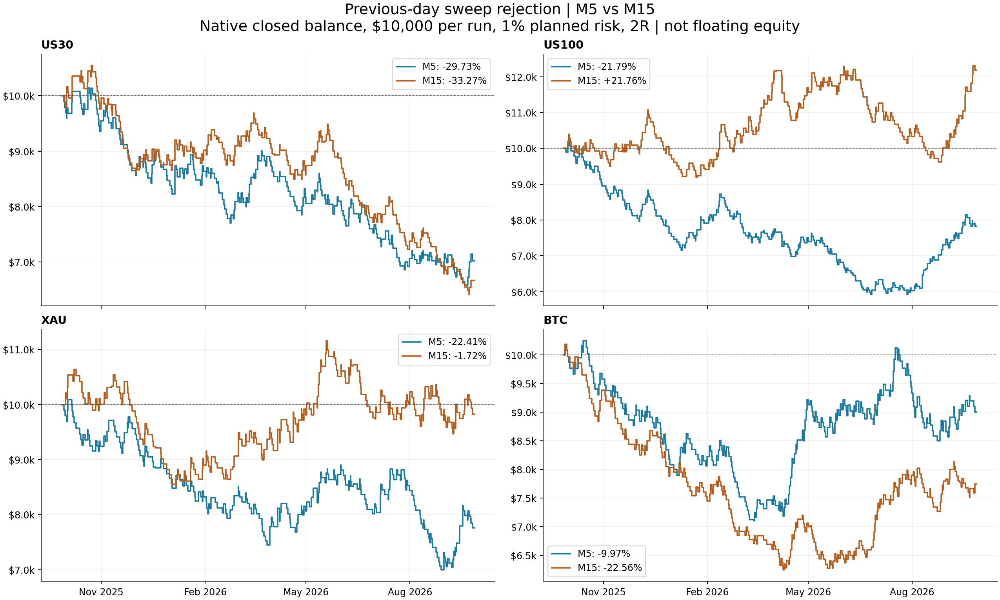

# Previous-day sweep rejection — M5 versus M15

Completed main runs: **64/64**. Four extra engineering smoke runs. No optimization, production changes or live orders.

## What was tested

The transcript supplies only the previous-day sweep and reverse-on-close idea. Our raw defaults: same-candle rejection on M5 or M15, market entry at the next fresh quote, one-tick-beyond-candle stop, 2R target, 1% equity planned risk, one position, first qualifying signal per PDH/PDL per day, 23:50 broker-time close attempt. See `RULES.md` for boundary cases and day-end gaps.

The two timeframes share every other rule. Each run starts independently at $10,000, on isolated Exness CFD history; not FTMO, not a combined portfolio, not an exact copy of RoboQuant.

## Which timeframe looks better?

- **US30**: last-year return leader M5; PF leader M5; lower equity DD M5. Long-window raw gates: M5 **FAIL**, M15 **FAIL**.
- **US100**: last-year return leader M15; PF leader M15; lower equity DD M15. Long-window raw gates: M5 **FAIL**, M15 **FAIL**.
- **XAU**: last-year return leader M15; PF leader M15; lower equity DD M15. Long-window raw gates: M5 **FAIL**, M15 **FAIL**.
- **BTC**: last-year return leader M5; PF leader M5; lower equity DD M5. Long-window raw gates: M5 **FAIL**, M15 **FAIL**.

**Completed raw decision: all eight asset/timeframe variants FAIL the frozen gate. None is selected for optimization or promotion.**

A recent-year winner is descriptive, not proof of future superiority. The predeclared 3y/5y/control gate takes priority. Passing that gate only qualifies for review, not live/FTMO use. All windows overlap; none is untouched out-of-sample evidence.

## Latest year — reversal only

| Asset | TF / variant | Return | Trades | /month | /day | Win rate | Net PF | Equity DD | Balance DD | Max W/L | Avg W/L |
|---|---|---:|---:|---:|---:|---:|---:|---:|---:|---:|---:|
| US30 | M5 raw | -29.73% | 267 | 22.3 | 1.03 | 31.46% | 0.82 | 35.52% | 35.19% | 4/9 | 1.53/3.27 |
| US30 | M15 raw | -33.27% | 252 | 21.0 | 0.97 | 31.75% | 0.78 | 39.65% | 39.20% | 4/13 | 1.45/3.13 |
| US100 | M5 raw | -21.79% | 283 | 23.6 | 1.09 | 33.92% | 0.86 | 43.88% | 42.48% | 7/11 | 1.66/3.17 |
| US100 | M15 raw | +21.76% | 269 | 22.4 | 1.03 | 39.03% | 1.12 | 22.48% | 21.76% | 6/12 | 1.88/2.93 |
| XAU | M5 raw | -22.41% | 257 | 21.4 | 0.99 | 31.91% | 0.86 | 30.86% | 30.65% | 5/11 | 1.58/3.30 |
| XAU | M15 raw | -1.72% | 243 | 20.3 | 0.93 | 34.57% | 0.99 | 19.67% | 19.66% | 5/13 | 1.58/3.00 |
| BTC | M5 raw | -9.97% | 285 | 23.8 | 0.78 | 34.04% | 0.94 | 31.32% | 30.70% | 5/16 | 1.49/2.89 |
| BTC | M15 raw | -22.56% | 270 | 22.5 | 0.74 | 32.59% | 0.84 | 39.06% | 38.73% | 6/12 | 1.47/3.08 |

## 1y: 2025.09.27 to 2026.09.27 (end exclusive)

| Asset | TF / variant | Return | Trades | /month | /day | Win rate | Net PF | Equity DD | Balance DD | Max W/L | Avg W/L |
|---|---|---:|---:|---:|---:|---:|---:|---:|---:|---:|---:|
| US30 | M5 raw | -29.73% | 267 | 22.3 | 1.03 | 31.46% | 0.82 | 35.52% | 35.19% | 4/9 | 1.53/3.27 |
| US30 | M5 control | -25.39% | 251 | 20.9 | 0.97 | 32.67% | 0.83 | 32.89% | 32.41% | 4/11 | 1.44/3.02 |
| US30 | M15 raw | -33.27% | 252 | 21.0 | 0.97 | 31.75% | 0.78 | 39.65% | 39.20% | 4/13 | 1.45/3.13 |
| US30 | M15 control | -21.19% | 250 | 20.8 | 0.96 | 34.40% | 0.87 | 30.66% | 29.14% | 4/10 | 1.48/2.83 |
| US100 | M5 raw | -21.79% | 283 | 23.6 | 1.09 | 33.92% | 0.86 | 43.88% | 42.48% | 7/11 | 1.66/3.17 |
| US100 | M5 control | -28.01% | 266 | 22.2 | 1.02 | 33.46% | 0.82 | 43.71% | 43.65% | 5/13 | 1.41/2.85 |
| US100 | M15 raw | +21.76% | 269 | 22.4 | 1.03 | 39.03% | 1.12 | 22.48% | 21.76% | 6/12 | 1.88/2.93 |
| US100 | M15 control | -18.78% | 264 | 22.0 | 1.02 | 34.47% | 0.89 | 28.94% | 28.41% | 6/10 | 1.65/3.09 |
| XAU | M5 raw | -22.41% | 257 | 21.4 | 0.99 | 31.91% | 0.86 | 30.86% | 30.65% | 5/11 | 1.58/3.30 |
| XAU | M5 control | -18.22% | 254 | 21.2 | 0.98 | 33.07% | 0.90 | 34.19% | 34.12% | 3/11 | 1.40/2.83 |
| XAU | M15 raw | -1.72% | 243 | 20.3 | 0.93 | 34.57% | 0.99 | 19.67% | 19.66% | 5/13 | 1.58/3.00 |
| XAU | M15 control | -26.90% | 246 | 20.5 | 0.95 | 31.30% | 0.83 | 39.15% | 38.22% | 4/13 | 1.51/3.31 |
| BTC | M5 raw | -9.97% | 285 | 23.8 | 0.78 | 34.04% | 0.94 | 31.32% | 30.70% | 5/16 | 1.49/2.89 |
| BTC | M5 control | -31.38% | 280 | 23.3 | 0.77 | 33.21% | 0.83 | 36.57% | 35.69% | 7/11 | 1.60/3.22 |
| BTC | M15 raw | -22.56% | 270 | 22.5 | 0.74 | 32.59% | 0.84 | 39.06% | 38.73% | 6/12 | 1.47/3.08 |
| BTC | M15 control | -34.42% | 271 | 22.6 | 0.74 | 31.37% | 0.78 | 36.19% | 35.63% | 5/13 | 1.73/3.80 |

## 6m: 2026.03.27 to 2026.09.27 (end exclusive)

| Asset | TF / variant | Return | Trades | /month | /day | Win rate | Net PF | Equity DD | Balance DD | Max W/L | Avg W/L |
|---|---|---:|---:|---:|---:|---:|---:|---:|---:|---:|---:|
| US30 | M5 raw | -19.55% | 129 | 21.3 | 0.98 | 30.23% | 0.77 | 26.57% | 26.16% | 4/9 | 1.50/3.46 |
| US30 | M5 control | -3.47% | 121 | 20.0 | 0.92 | 36.36% | 0.96 | 16.50% | 16.04% | 4/7 | 1.52/2.75 |
| US30 | M15 raw | -28.46% | 123 | 20.3 | 0.94 | 27.64% | 0.64 | 32.79% | 32.42% | 3/11 | 1.48/3.87 |
| US30 | M15 control | -19.64% | 122 | 20.2 | 0.93 | 31.97% | 0.77 | 30.63% | 29.12% | 4/10 | 1.56/3.32 |
| US100 | M5 raw | +3.72% | 141 | 23.3 | 1.08 | 38.30% | 1.04 | 24.18% | 23.60% | 7/10 | 1.59/2.49 |
| US100 | M5 control | -7.42% | 131 | 21.7 | 1.00 | 36.64% | 0.91 | 22.15% | 21.94% | 5/8 | 1.45/2.52 |
| US100 | M15 raw | +6.19% | 136 | 22.5 | 1.04 | 39.71% | 1.07 | 22.47% | 21.75% | 4/12 | 1.80/2.65 |
| US100 | M15 control | -10.94% | 134 | 22.2 | 1.02 | 35.82% | 0.88 | 27.85% | 26.64% | 6/9 | 1.71/2.97 |
| XAU | M5 raw | +3.72% | 140 | 23.2 | 1.07 | 35.71% | 1.04 | 21.77% | 21.20% | 5/11 | 1.72/3.00 |
| XAU | M5 control | -23.70% | 138 | 22.8 | 1.05 | 29.71% | 0.74 | 33.83% | 33.34% | 3/10 | 1.32/3.13 |
| XAU | M15 raw | +4.72% | 134 | 22.2 | 1.02 | 36.57% | 1.05 | 18.12% | 16.72% | 4/10 | 1.53/2.66 |
| XAU | M15 control | -24.48% | 137 | 22.7 | 1.05 | 28.47% | 0.72 | 32.75% | 31.96% | 4/13 | 1.62/4.08 |
| BTC | M5 raw | +20.23% | 156 | 25.8 | 0.85 | 39.74% | 1.17 | 16.50% | 16.01% | 5/9 | 1.55/2.35 |
| BTC | M5 control | -12.19% | 154 | 25.5 | 0.84 | 35.06% | 0.90 | 31.30% | 31.30% | 7/11 | 1.74/3.12 |
| BTC | M15 raw | +15.97% | 150 | 24.8 | 0.82 | 39.33% | 1.16 | 13.00% | 12.84% | 6/8 | 1.64/2.53 |
| BTC | M15 control | -12.20% | 152 | 25.1 | 0.83 | 34.21% | 0.89 | 18.53% | 18.26% | 5/12 | 1.73/3.33 |

## 3y: 2023.09.27 to 2026.09.27 (end exclusive)

| Asset | TF / variant | Return | Trades | /month | /day | Win rate | Net PF | Equity DD | Balance DD | Max W/L | Avg W/L |
|---|---|---:|---:|---:|---:|---:|---:|---:|---:|---:|---:|
| US30 | M5 raw | -66.62% | 774 | 21.5 | 0.99 | 31.40% | 0.78 | 71.98% | 71.75% | 5/13 | 1.47/3.22 |
| US30 | M5 control | -68.81% | 717 | 19.9 | 0.92 | 31.10% | 0.75 | 73.43% | 73.11% | 5/13 | 1.41/3.15 |
| US30 | M15 raw | -47.63% | 749 | 20.8 | 0.96 | 33.91% | 0.87 | 53.22% | 52.97% | 4/15 | 1.47/2.88 |
| US30 | M15 control | -80.21% | 737 | 20.5 | 0.94 | 30.12% | 0.64 | 82.10% | 82.00% | 4/13 | 1.40/3.24 |
| US100 | M5 raw | -84.34% | 810 | 22.5 | 1.03 | 29.14% | 0.65 | 89.32% | 89.24% | 7/15 | 1.46/3.52 |
| US100 | M5 control | -88.56% | 767 | 21.3 | 0.98 | 27.90% | 0.55 | 90.47% | 90.46% | 5/14 | 1.35/3.50 |
| US100 | M15 raw | -61.55% | 785 | 21.8 | 1.00 | 32.36% | 0.76 | 72.30% | 71.82% | 6/16 | 1.53/3.18 |
| US100 | M15 control | -81.57% | 754 | 20.9 | 0.96 | 29.31% | 0.63 | 83.79% | 83.63% | 6/17 | 1.46/3.51 |
| XAU | M5 raw | -58.88% | 786 | 21.8 | 1.00 | 32.06% | 0.84 | 64.45% | 64.31% | 6/13 | 1.45/3.07 |
| XAU | M5 control | -58.49% | 767 | 21.3 | 0.98 | 32.46% | 0.85 | 63.10% | 62.94% | 5/13 | 1.48/3.08 |
| XAU | M15 raw | -26.58% | 735 | 20.4 | 0.94 | 34.69% | 0.94 | 46.05% | 45.12% | 5/13 | 1.54/2.87 |
| XAU | M15 control | -65.70% | 735 | 20.4 | 0.94 | 31.29% | 0.82 | 71.75% | 71.55% | 4/13 | 1.43/3.12 |
| BTC | M5 raw | -34.64% | 898 | 24.9 | 0.82 | 34.08% | 0.93 | 52.09% | 51.94% | 6/16 | 1.60/3.08 |
| BTC | M5 control | -62.48% | 857 | 23.8 | 0.78 | 33.14% | 0.85 | 69.03% | 68.87% | 7/19 | 1.54/3.08 |
| BTC | M15 raw | -51.81% | 863 | 24.0 | 0.79 | 33.14% | 0.88 | 66.67% | 66.62% | 6/13 | 1.51/3.04 |
| BTC | M15 control | -78.28% | 846 | 23.5 | 0.77 | 30.50% | 0.73 | 79.41% | 79.30% | 6/22 | 1.52/3.44 |

## 5y: 2021.09.27 to 2026.09.27 (end exclusive)

| Asset | TF / variant | Return | Trades | /month | /day | Win rate | Net PF | Equity DD | Balance DD | Max W/L | Avg W/L |
|---|---|---:|---:|---:|---:|---:|---:|---:|---:|---:|---:|
| US30 | M5 raw | -90.34% | 1307 | 21.8 | 1.00 | 29.99% | 0.73 | 91.01% | 91.00% | 5/13 | 1.43/3.33 |
| US30 | M5 control | -91.39% | 1206 | 20.1 | 0.92 | 29.60% | 0.70 | 92.32% | 92.29% | 5/16 | 1.41/3.36 |
| US30 | M15 raw | -82.74% | 1268 | 21.1 | 0.97 | 31.62% | 0.77 | 84.31% | 84.15% | 4/15 | 1.42/3.07 |
| US30 | M15 control | -91.37% | 1238 | 20.6 | 0.95 | 30.37% | 0.75 | 92.15% | 92.04% | 6/17 | 1.44/3.32 |
| US100 | M5 raw | -95.60% | 1347 | 22.5 | 1.03 | 28.95% | 0.68 | 96.86% | 96.83% | 7/17 | 1.43/3.52 |
| US100 | M5 control | -98.48% | 1253 | 20.9 | 0.96 | 26.02% | 0.54 | 98.86% | 98.84% | 5/22 | 1.33/3.80 |
| US100 | M15 raw | -85.84% | 1302 | 21.7 | 1.00 | 31.34% | 0.74 | 89.91% | 89.81% | 6/16 | 1.50/3.29 |
| US100 | M15 control | -95.12% | 1232 | 20.5 | 0.94 | 28.57% | 0.68 | 96.07% | 96.04% | 6/17 | 1.41/3.53 |
| XAU | M5 raw | -81.77% | 1338 | 22.3 | 1.03 | 32.06% | 0.81 | 83.85% | 83.76% | 6/15 | 1.47/3.10 |
| XAU | M5 control | -96.12% | 1286 | 21.4 | 0.99 | 30.02% | 0.64 | 97.18% | 96.96% | 5/15 | 1.43/3.33 |
| XAU | M15 raw | -74.11% | 1261 | 21.0 | 0.97 | 32.83% | 0.81 | 79.18% | 78.95% | 5/17 | 1.52/3.10 |
| XAU | M15 control | -89.99% | 1245 | 20.8 | 0.95 | 30.92% | 0.78 | 91.36% | 91.28% | 11/15 | 1.47/3.27 |
| BTC | M5 raw | -78.39% | 1479 | 24.7 | 0.81 | 33.00% | 0.83 | 85.02% | 84.88% | 6/17 | 1.54/3.13 |
| BTC | M5 control | -93.56% | 1394 | 23.2 | 0.76 | 30.99% | 0.69 | 94.45% | 94.45% | 7/19 | 1.49/3.32 |
| BTC | M15 raw | -77.26% | 1439 | 24.0 | 0.79 | 33.84% | 0.85 | 83.20% | 83.03% | 6/13 | 1.47/2.87 |
| BTC | M15 control | -94.45% | 1398 | 23.3 | 0.77 | 30.83% | 0.67 | 94.62% | 94.55% | 7/22 | 1.48/3.30 |

## Costs, sizing and holding limitations — latest-year raw

| Asset / TF | Trades (/month; /day) | Commission / swap / fee | Median / max risk multiplier | Above 1.1% planned risk | Mean adverse entry slip | Overnight positions | Profitable calendar months |
|---|---|---|---|---:|---:|---:|---:|
| US30 M5 | 267 (22.3; 1.03) | $-857.27 / $0.00 / $0.00 | 1.00x / 1.02x | 0 | $-0.62 | 0 | 23.1% |
| US30 M15 | 252 (21.0; 0.97) | $-545.63 / $-11.79 / $0.00 | 1.00x / 1.03x | 0 | $0.09 | 2 | 38.5% |
| US100 M5 | 283 (23.6; 1.09) | $-997.32 / $-56.18 / $0.00 | 1.00x / 1.01x | 0 | $0.28 | 2 | 38.5% |
| US100 M15 | 269 (22.4; 1.03) | $-796.57 / $-30.70 / $0.00 | 1.00x / 1.02x | 0 | $-0.18 | 2 | 46.2% |
| XAU M5 | 257 (21.4; 0.99) | $-290.37 / $0.00 / $0.00 | 1.04x / 1.57x | 31 | $-0.18 | 0 | 46.2% |
| XAU M15 | 243 (20.3; 0.93) | $-175.41 / $-5.11 / $0.00 | 1.04x / 2.09x | 54 | $-0.29 | 4 | 61.5% |
| BTC M5 | 285 (23.8; 0.78) | $-971.91 / $0.00 / $0.00 | 1.01x / 1.12x | 1 | $-0.56 | 0 | 30.8% |
| BTC M15 | 270 (22.5; 0.74) | $-515.72 / $0.00 / $0.00 | 1.01x / 1.19x | 3 | $-0.35 | 0 | 23.1% |

- Returns/PF/wins are recomputed from position-ID ledgers NET of commission, swap and fees. Spread and simulated delay are already in execution prices; they are not subtracted twice. Positive entry slippage means an adverse fill versus submission quote. Exit slippage is not separately measured.
- Lots round UP per the existing raw-research convention. The risk multiplier is planned stop loss after lot rounding divided by requested 1% risk, BEFORE commissions/slippage. This is not a hard maximum loss. Minimum lots or account depletion can reduce comparability.
- Day-end closes require a tradable tick. Instrument closure can carry positions past midnight/weekends; those exposures and swap are retained, not removed after seeing results.
- /day is all weekdays for US30/US100/XAU and all calendar days for BTC, including no-trade days. /month uses elapsed calendar time. Monthly consistency includes two partial endpoint months (13 calendar buckets for 1y). Zero-net trades break win/loss streaks.
- Native floating-equity DD is distinct from closed-balance DD. Do not use either alone to estimate FTMO daily-equity breaches.
- Model 4 plus 150 ms delay is used throughout. Real ticks in the retained broker history begin January 2026; earlier data use generated ticks. A mode label does not guarantee real-tick coverage. [MetaTrader documentation](https://www.metatrader5.com/en/terminal/help/algotrading/tick_generation).
- The control retains sweep conditions but randomizes direction with one predeclared seed. It is not a test against non-key price levels, multiple seeds, or a perfectly paired execution experiment. Different trade counts can result from stops and occupancy.
- The Instagram $10,000/week statement and optimized screenshot results are not verified and are not a return forecast for these settings.

## Data / execution audit

- BTC M15 random-direction-control 1y: native history quality `65% real ticks` including warmup; flags `{"init_failed": 0, "critical": 0, "export_failed": 0, "history_shortened": 0, "invalid_volume": 0, "invalid_stops": 0, "market_closed": 0, "margin_call": 0}`; `PS_SUMMARY tag=BTC-M15-control-1y signals=278 ambiguous=1 stale=369 missing=0 busy=1 invalid=6 marginSkip=0 orders=271 entryFails=0 closeFails=0`.
- BTC M15 random-direction-control 3y: native history quality `23% real ticks` including warmup; flags `{"init_failed": 0, "critical": 0, "export_failed": 0, "history_shortened": 0, "invalid_volume": 0, "invalid_stops": 0, "market_closed": 0, "margin_call": 0}`; `PS_SUMMARY tag=BTC-M15-control-3y signals=875 ambiguous=2 stale=1127 missing=0 busy=2 invalid=27 marginSkip=0 orders=846 entryFails=0 closeFails=0`.
- BTC M15 random-direction-control 5y: native history quality `14% real ticks` including warmup; flags `{"init_failed": 0, "critical": 0, "export_failed": 0, "history_shortened": 0, "invalid_volume": 0, "invalid_stops": 0, "market_closed": 0, "margin_call": 0}`; `PS_SUMMARY tag=BTC-M15-control-5y signals=1469 ambiguous=7 stale=1879 missing=0 busy=6 invalid=65 marginSkip=0 orders=1398 entryFails=0 closeFails=0`.
- BTC M15 random-direction-control 6m: native history quality `100% real ticks` including warmup; flags `{"init_failed": 0, "critical": 0, "export_failed": 0, "history_shortened": 0, "invalid_volume": 0, "invalid_stops": 0, "market_closed": 0, "margin_call": 0}`; `PS_SUMMARY tag=BTC-M15-control-6m signals=156 ambiguous=0 stale=185 missing=0 busy=1 invalid=3 marginSkip=0 orders=152 entryFails=0 closeFails=0`.
- BTC M15 reversal 1y: native history quality `65% real ticks` including warmup; flags `{"init_failed": 0, "critical": 0, "export_failed": 0, "history_shortened": 0, "invalid_volume": 0, "invalid_stops": 0, "market_closed": 0, "margin_call": 0}`; `PS_SUMMARY tag=BTC-M15-reversal-1y signals=278 ambiguous=1 stale=369 missing=0 busy=4 invalid=4 marginSkip=0 orders=270 entryFails=0 closeFails=0`.
- BTC M15 reversal 3y: native history quality `23% real ticks` including warmup; flags `{"init_failed": 0, "critical": 0, "export_failed": 0, "history_shortened": 0, "invalid_volume": 0, "invalid_stops": 0, "market_closed": 0, "margin_call": 0}`; `PS_SUMMARY tag=BTC-M15-reversal-3y signals=875 ambiguous=2 stale=1127 missing=0 busy=6 invalid=6 marginSkip=0 orders=863 entryFails=0 closeFails=0`.
- BTC M15 reversal 5y: native history quality `14% real ticks` including warmup; flags `{"init_failed": 0, "critical": 0, "export_failed": 0, "history_shortened": 0, "invalid_volume": 0, "invalid_stops": 0, "market_closed": 0, "margin_call": 0}`; `PS_SUMMARY tag=BTC-M15-reversal-5y signals=1469 ambiguous=7 stale=1879 missing=0 busy=13 invalid=17 marginSkip=0 orders=1439 entryFails=0 closeFails=0`.
- BTC M15 reversal 6m: native history quality `100% real ticks` including warmup; flags `{"init_failed": 0, "critical": 0, "export_failed": 0, "history_shortened": 0, "invalid_volume": 0, "invalid_stops": 0, "market_closed": 0, "margin_call": 0}`; `PS_SUMMARY tag=BTC-M15-reversal-6m signals=156 ambiguous=0 stale=185 missing=0 busy=3 invalid=3 marginSkip=0 orders=150 entryFails=0 closeFails=0`.
- BTC M5 random-direction-control 1y: native history quality `65% real ticks` including warmup; flags `{"init_failed": 0, "critical": 0, "export_failed": 0, "history_shortened": 0, "invalid_volume": 0, "invalid_stops": 6, "market_closed": 0, "margin_call": 0}`; `PS_SUMMARY tag=BTC-M5-control-1y signals=290 ambiguous=0 stale=381 missing=0 busy=0 invalid=7 marginSkip=2 orders=280 entryFails=1 closeFails=0`.
- BTC M5 random-direction-control 3y: native history quality `23% real ticks` including warmup; flags `{"init_failed": 0, "critical": 0, "export_failed": 0, "history_shortened": 0, "invalid_volume": 0, "invalid_stops": 6, "market_closed": 0, "margin_call": 0}`; `PS_SUMMARY tag=BTC-M5-control-3y signals=907 ambiguous=1 stale=1156 missing=0 busy=1 invalid=46 marginSkip=2 orders=857 entryFails=1 closeFails=0`.
- BTC M5 random-direction-control 5y: native history quality `14% real ticks` including warmup; flags `{"init_failed": 0, "critical": 0, "export_failed": 0, "history_shortened": 0, "invalid_volume": 0, "invalid_stops": 6, "market_closed": 0, "margin_call": 0}`; `PS_SUMMARY tag=BTC-M5-control-5y signals=1515 ambiguous=3 stale=1927 missing=0 busy=3 invalid=115 marginSkip=2 orders=1394 entryFails=1 closeFails=0`.
- BTC M5 random-direction-control 6m: native history quality `100% real ticks` including warmup; flags `{"init_failed": 0, "critical": 0, "export_failed": 0, "history_shortened": 0, "invalid_volume": 0, "invalid_stops": 6, "market_closed": 0, "margin_call": 0}`; `PS_SUMMARY tag=BTC-M5-control-6m signals=160 ambiguous=0 stale=192 missing=0 busy=0 invalid=4 marginSkip=1 orders=154 entryFails=1 closeFails=0`.
- BTC M5 reversal 1y: native history quality `65% real ticks` including warmup; flags `{"init_failed": 0, "critical": 0, "export_failed": 0, "history_shortened": 0, "invalid_volume": 0, "invalid_stops": 0, "market_closed": 0, "margin_call": 0}`; `PS_SUMMARY tag=BTC-M5-reversal-1y signals=290 ambiguous=0 stale=381 missing=0 busy=1 invalid=4 marginSkip=0 orders=285 entryFails=0 closeFails=0`.
- BTC M5 reversal 3y: native history quality `23% real ticks` including warmup; flags `{"init_failed": 0, "critical": 0, "export_failed": 0, "history_shortened": 0, "invalid_volume": 0, "invalid_stops": 0, "market_closed": 0, "margin_call": 0}`; `PS_SUMMARY tag=BTC-M5-reversal-3y signals=907 ambiguous=1 stale=1156 missing=0 busy=2 invalid=7 marginSkip=0 orders=898 entryFails=0 closeFails=0`.
- BTC M5 reversal 5y: native history quality `14% real ticks` including warmup; flags `{"init_failed": 0, "critical": 0, "export_failed": 0, "history_shortened": 0, "invalid_volume": 0, "invalid_stops": 0, "market_closed": 0, "margin_call": 0}`; `PS_SUMMARY tag=BTC-M5-reversal-5y signals=1515 ambiguous=3 stale=1927 missing=0 busy=7 invalid=29 marginSkip=0 orders=1479 entryFails=0 closeFails=0`.
- BTC M5 reversal 6m: native history quality `100% real ticks` including warmup; flags `{"init_failed": 0, "critical": 0, "export_failed": 0, "history_shortened": 0, "invalid_volume": 0, "invalid_stops": 0, "market_closed": 0, "margin_call": 0}`; `PS_SUMMARY tag=BTC-M5-reversal-6m signals=160 ambiguous=0 stale=192 missing=0 busy=1 invalid=3 marginSkip=0 orders=156 entryFails=0 closeFails=0`.
- US100 M15 random-direction-control 1y: native history quality `65% real ticks` including warmup; flags `{"init_failed": 0, "critical": 0, "export_failed": 0, "history_shortened": 0, "invalid_volume": 0, "invalid_stops": 12, "market_closed": 6, "margin_call": 0}`; `PS_SUMMARY tag=US100-M15-control-1y signals=278 ambiguous=4 stale=519 missing=0 busy=2 invalid=6 marginSkip=3 orders=264 entryFails=3 closeFails=0`.
- US100 M15 random-direction-control 3y: native history quality `23% real ticks` including warmup; flags `{"init_failed": 0, "critical": 0, "export_failed": 0, "history_shortened": 0, "invalid_volume": 0, "invalid_stops": 12, "market_closed": 24, "margin_call": 0}`; `PS_SUMMARY tag=US100-M15-control-3y signals=828 ambiguous=22 stale=1560 missing=0 busy=9 invalid=56 marginSkip=3 orders=754 entryFails=6 closeFails=0`.
- US100 M15 random-direction-control 5y: native history quality `14% real ticks` including warmup; flags `{"init_failed": 0, "critical": 0, "export_failed": 0, "history_shortened": 0, "invalid_volume": 0, "invalid_stops": 12, "market_closed": 24, "margin_call": 0}`; `PS_SUMMARY tag=US100-M15-control-5y signals=1379 ambiguous=94 stale=2608 missing=0 busy=17 invalid=121 marginSkip=3 orders=1232 entryFails=6 closeFails=0`.
- US100 M15 random-direction-control 6m: native history quality `100% real ticks` including warmup; flags `{"init_failed": 0, "critical": 0, "export_failed": 0, "history_shortened": 0, "invalid_volume": 0, "invalid_stops": 6, "market_closed": 0, "margin_call": 0}`; `PS_SUMMARY tag=US100-M15-control-6m signals=139 ambiguous=2 stale=261 missing=0 busy=0 invalid=1 marginSkip=3 orders=134 entryFails=1 closeFails=0`.
- US100 M15 reversal 1y: native history quality `65% real ticks` including warmup; flags `{"init_failed": 0, "critical": 0, "export_failed": 0, "history_shortened": 0, "invalid_volume": 0, "invalid_stops": 0, "market_closed": 6, "margin_call": 0}`; `PS_SUMMARY tag=US100-M15-reversal-1y signals=278 ambiguous=4 stale=519 missing=0 busy=7 invalid=1 marginSkip=0 orders=269 entryFails=1 closeFails=0`.
- US100 M15 reversal 3y: native history quality `23% real ticks` including warmup; flags `{"init_failed": 0, "critical": 0, "export_failed": 0, "history_shortened": 0, "invalid_volume": 0, "invalid_stops": 0, "market_closed": 24, "margin_call": 0}`; `PS_SUMMARY tag=US100-M15-reversal-3y signals=828 ambiguous=22 stale=1560 missing=0 busy=18 invalid=21 marginSkip=0 orders=785 entryFails=4 closeFails=0`.
- US100 M15 reversal 5y: native history quality `14% real ticks` including warmup; flags `{"init_failed": 0, "critical": 0, "export_failed": 0, "history_shortened": 0, "invalid_volume": 0, "invalid_stops": 0, "market_closed": 24, "margin_call": 0}`; `PS_SUMMARY tag=US100-M15-reversal-5y signals=1379 ambiguous=94 stale=2608 missing=0 busy=34 invalid=39 marginSkip=0 orders=1302 entryFails=4 closeFails=0`.
- US100 M15 reversal 6m: native history quality `100% real ticks` including warmup; flags `{"init_failed": 0, "critical": 0, "export_failed": 0, "history_shortened": 0, "invalid_volume": 0, "invalid_stops": 0, "market_closed": 0, "margin_call": 0}`; `PS_SUMMARY tag=US100-M15-reversal-6m signals=139 ambiguous=2 stale=261 missing=0 busy=2 invalid=1 marginSkip=0 orders=136 entryFails=0 closeFails=0`.
- US100 M5 random-direction-control 1y: native history quality `65% real ticks` including warmup; flags `{"init_failed": 0, "critical": 0, "export_failed": 0, "history_shortened": 0, "invalid_volume": 0, "invalid_stops": 18, "market_closed": 12, "margin_call": 0}`; `PS_SUMMARY tag=US100-M5-control-1y signals=292 ambiguous=1 stale=521 missing=0 busy=0 invalid=13 marginSkip=8 orders=266 entryFails=5 closeFails=0`.
- US100 M5 random-direction-control 3y: native history quality `23% real ticks` including warmup; flags `{"init_failed": 0, "critical": 0, "export_failed": 0, "history_shortened": 0, "invalid_volume": 0, "invalid_stops": 18, "market_closed": 24, "margin_call": 0}`; `PS_SUMMARY tag=US100-M5-control-3y signals=866 ambiguous=8 stale=1567 missing=0 busy=4 invalid=80 marginSkip=8 orders=767 entryFails=7 closeFails=0`.
- US100 M5 random-direction-control 5y: native history quality `14% real ticks` including warmup; flags `{"init_failed": 0, "critical": 0, "export_failed": 0, "history_shortened": 0, "invalid_volume": 0, "invalid_stops": 18, "market_closed": 24, "margin_call": 0}`; `PS_SUMMARY tag=US100-M5-control-5y signals=1450 ambiguous=35 stale=2624 missing=0 busy=9 invalid=173 marginSkip=8 orders=1253 entryFails=7 closeFails=0`.
- US100 M5 random-direction-control 6m: native history quality `100% real ticks` including warmup; flags `{"init_failed": 0, "critical": 0, "export_failed": 0, "history_shortened": 0, "invalid_volume": 0, "invalid_stops": 12, "market_closed": 0, "margin_call": 0}`; `PS_SUMMARY tag=US100-M5-control-6m signals=144 ambiguous=0 stale=262 missing=0 busy=0 invalid=3 marginSkip=8 orders=131 entryFails=2 closeFails=0`.
- US100 M5 reversal 1y: native history quality `65% real ticks` including warmup; flags `{"init_failed": 0, "critical": 0, "export_failed": 0, "history_shortened": 0, "invalid_volume": 0, "invalid_stops": 0, "market_closed": 12, "margin_call": 0}`; `PS_SUMMARY tag=US100-M5-reversal-1y signals=292 ambiguous=1 stale=521 missing=0 busy=2 invalid=5 marginSkip=0 orders=283 entryFails=2 closeFails=0`.
- US100 M5 reversal 3y: native history quality `23% real ticks` including warmup; flags `{"init_failed": 0, "critical": 0, "export_failed": 0, "history_shortened": 0, "invalid_volume": 0, "invalid_stops": 0, "market_closed": 30, "margin_call": 0}`; `PS_SUMMARY tag=US100-M5-reversal-3y signals=866 ambiguous=8 stale=1567 missing=0 busy=7 invalid=44 marginSkip=0 orders=810 entryFails=5 closeFails=0`.
- US100 M5 reversal 5y: native history quality `14% real ticks` including warmup; flags `{"init_failed": 0, "critical": 0, "export_failed": 0, "history_shortened": 0, "invalid_volume": 0, "invalid_stops": 0, "market_closed": 30, "margin_call": 0}`; `PS_SUMMARY tag=US100-M5-reversal-5y signals=1450 ambiguous=35 stale=2624 missing=0 busy=17 invalid=81 marginSkip=0 orders=1347 entryFails=5 closeFails=0`.
- US100 M5 reversal 6m: native history quality `100% real ticks` including warmup; flags `{"init_failed": 0, "critical": 0, "export_failed": 0, "history_shortened": 0, "invalid_volume": 0, "invalid_stops": 0, "market_closed": 0, "margin_call": 0}`; `PS_SUMMARY tag=US100-M5-reversal-6m signals=144 ambiguous=0 stale=262 missing=0 busy=1 invalid=2 marginSkip=0 orders=141 entryFails=0 closeFails=0`.
- US30 M15 random-direction-control 1y: native history quality `65% real ticks` including warmup; flags `{"init_failed": 0, "critical": 0, "export_failed": 0, "history_shortened": 0, "invalid_volume": 0, "invalid_stops": 0, "market_closed": 6, "margin_call": 0}`; `PS_SUMMARY tag=US30-M15-control-1y signals=267 ambiguous=11 stale=520 missing=0 busy=5 invalid=7 marginSkip=4 orders=250 entryFails=1 closeFails=0`.
- US30 M15 random-direction-control 3y: native history quality `23% real ticks` including warmup; flags `{"init_failed": 0, "critical": 0, "export_failed": 0, "history_shortened": 0, "invalid_volume": 0, "invalid_stops": 0, "market_closed": 24, "margin_call": 0}`; `PS_SUMMARY tag=US30-M15-control-3y signals=817 ambiguous=37 stale=1649 missing=0 busy=13 invalid=57 marginSkip=6 orders=737 entryFails=4 closeFails=0`.
- US30 M15 random-direction-control 5y: native history quality `14% real ticks` including warmup; flags `{"init_failed": 0, "critical": 0, "export_failed": 0, "history_shortened": 0, "invalid_volume": 0, "invalid_stops": 0, "market_closed": 24, "margin_call": 0}`; `PS_SUMMARY tag=US30-M15-control-5y signals=1377 ambiguous=94 stale=2740 missing=0 busy=24 invalid=105 marginSkip=6 orders=1238 entryFails=4 closeFails=0`.
- US30 M15 random-direction-control 6m: native history quality `100% real ticks` including warmup; flags `{"init_failed": 0, "critical": 0, "export_failed": 0, "history_shortened": 0, "invalid_volume": 0, "invalid_stops": 0, "market_closed": 0, "margin_call": 0}`; `PS_SUMMARY tag=US30-M15-control-6m signals=130 ambiguous=5 stale=261 missing=0 busy=3 invalid=3 marginSkip=2 orders=122 entryFails=0 closeFails=0`.
- US30 M15 reversal 1y: native history quality `65% real ticks` including warmup; flags `{"init_failed": 0, "critical": 0, "export_failed": 0, "history_shortened": 0, "invalid_volume": 0, "invalid_stops": 0, "market_closed": 6, "margin_call": 0}`; `PS_SUMMARY tag=US30-M15-reversal-1y signals=267 ambiguous=11 stale=520 missing=0 busy=8 invalid=6 marginSkip=0 orders=252 entryFails=1 closeFails=0`.
- US30 M15 reversal 3y: native history quality `23% real ticks` including warmup; flags `{"init_failed": 0, "critical": 0, "export_failed": 0, "history_shortened": 0, "invalid_volume": 0, "invalid_stops": 0, "market_closed": 24, "margin_call": 0}`; `PS_SUMMARY tag=US30-M15-reversal-3y signals=817 ambiguous=37 stale=1649 missing=0 busy=23 invalid=41 marginSkip=0 orders=749 entryFails=4 closeFails=0`.
- US30 M15 reversal 5y: native history quality `14% real ticks` including warmup; flags `{"init_failed": 0, "critical": 0, "export_failed": 0, "history_shortened": 0, "invalid_volume": 0, "invalid_stops": 0, "market_closed": 24, "margin_call": 0}`; `PS_SUMMARY tag=US30-M15-reversal-5y signals=1377 ambiguous=94 stale=2740 missing=0 busy=43 invalid=62 marginSkip=0 orders=1268 entryFails=4 closeFails=0`.
- US30 M15 reversal 6m: native history quality `100% real ticks` including warmup; flags `{"init_failed": 0, "critical": 0, "export_failed": 0, "history_shortened": 0, "invalid_volume": 0, "invalid_stops": 0, "market_closed": 0, "margin_call": 0}`; `PS_SUMMARY tag=US30-M15-reversal-6m signals=130 ambiguous=5 stale=261 missing=0 busy=5 invalid=2 marginSkip=0 orders=123 entryFails=0 closeFails=0`.
- US30 M5 random-direction-control 1y: native history quality `65% real ticks` including warmup; flags `{"init_failed": 0, "critical": 0, "export_failed": 0, "history_shortened": 0, "invalid_volume": 0, "invalid_stops": 0, "market_closed": 6, "margin_call": 0}`; `PS_SUMMARY tag=US30-M5-control-1y signals=278 ambiguous=3 stale=531 missing=0 busy=0 invalid=15 marginSkip=11 orders=251 entryFails=1 closeFails=0`.
- US30 M5 random-direction-control 3y: native history quality `23% real ticks` including warmup; flags `{"init_failed": 0, "critical": 0, "export_failed": 0, "history_shortened": 0, "invalid_volume": 0, "invalid_stops": 0, "market_closed": 18, "margin_call": 0}`; `PS_SUMMARY tag=US30-M5-control-3y signals=853 ambiguous=9 stale=1938 missing=0 busy=3 invalid=119 marginSkip=11 orders=717 entryFails=3 closeFails=0`.
- US30 M5 random-direction-control 5y: native history quality `14% real ticks` including warmup; flags `{"init_failed": 0, "critical": 0, "export_failed": 0, "history_shortened": 0, "invalid_volume": 0, "invalid_stops": 0, "market_closed": 18, "margin_call": 0}`; `PS_SUMMARY tag=US30-M5-control-5y signals=1444 ambiguous=42 stale=3217 missing=0 busy=8 invalid=216 marginSkip=11 orders=1206 entryFails=3 closeFails=0`.
- US30 M5 random-direction-control 6m: native history quality `100% real ticks` including warmup; flags `{"init_failed": 0, "critical": 0, "export_failed": 0, "history_shortened": 0, "invalid_volume": 0, "invalid_stops": 0, "market_closed": 0, "margin_call": 0}`; `PS_SUMMARY tag=US30-M5-control-6m signals=133 ambiguous=3 stale=262 missing=0 busy=0 invalid=6 marginSkip=6 orders=121 entryFails=0 closeFails=0`.
- US30 M5 reversal 1y: native history quality `65% real ticks` including warmup; flags `{"init_failed": 0, "critical": 0, "export_failed": 0, "history_shortened": 0, "invalid_volume": 0, "invalid_stops": 0, "market_closed": 6, "margin_call": 0}`; `PS_SUMMARY tag=US30-M5-reversal-1y signals=278 ambiguous=3 stale=531 missing=0 busy=0 invalid=10 marginSkip=0 orders=267 entryFails=1 closeFails=0`.
- US30 M5 reversal 3y: native history quality `23% real ticks` including warmup; flags `{"init_failed": 0, "critical": 0, "export_failed": 0, "history_shortened": 0, "invalid_volume": 0, "invalid_stops": 0, "market_closed": 18, "margin_call": 0}`; `PS_SUMMARY tag=US30-M5-reversal-3y signals=853 ambiguous=9 stale=1938 missing=0 busy=5 invalid=71 marginSkip=0 orders=774 entryFails=3 closeFails=0`.
- US30 M5 reversal 5y: native history quality `14% real ticks` including warmup; flags `{"init_failed": 0, "critical": 0, "export_failed": 0, "history_shortened": 0, "invalid_volume": 0, "invalid_stops": 0, "market_closed": 18, "margin_call": 0}`; `PS_SUMMARY tag=US30-M5-reversal-5y signals=1444 ambiguous=42 stale=3217 missing=0 busy=13 invalid=121 marginSkip=0 orders=1307 entryFails=3 closeFails=0`.
- US30 M5 reversal 6m: native history quality `100% real ticks` including warmup; flags `{"init_failed": 0, "critical": 0, "export_failed": 0, "history_shortened": 0, "invalid_volume": 0, "invalid_stops": 0, "market_closed": 0, "margin_call": 0}`; `PS_SUMMARY tag=US30-M5-reversal-6m signals=133 ambiguous=3 stale=262 missing=0 busy=0 invalid=4 marginSkip=0 orders=129 entryFails=0 closeFails=0`.
- XAU M15 random-direction-control 1y: native history quality `65% real ticks` including warmup; flags `{"init_failed": 0, "critical": 0, "export_failed": 0, "history_shortened": 0, "invalid_volume": 0, "invalid_stops": 6, "market_closed": 6, "margin_call": 0}`; `PS_SUMMARY tag=XAU-M15-control-1y signals=254 ambiguous=4 stale=518 missing=0 busy=4 invalid=2 marginSkip=0 orders=246 entryFails=2 closeFails=0`.
- XAU M15 random-direction-control 3y: native history quality `23% real ticks` including warmup; flags `{"init_failed": 0, "critical": 0, "export_failed": 0, "history_shortened": 0, "invalid_volume": 0, "invalid_stops": 6, "market_closed": 6, "margin_call": 0}`; `PS_SUMMARY tag=XAU-M15-control-3y signals=765 ambiguous=20 stale=1561 missing=0 busy=11 invalid=17 marginSkip=0 orders=735 entryFails=2 closeFails=0`.
- XAU M15 random-direction-control 5y: native history quality `14% real ticks` including warmup; flags `{"init_failed": 0, "critical": 0, "export_failed": 0, "history_shortened": 0, "invalid_volume": 0, "invalid_stops": 6, "market_closed": 6, "margin_call": 0}`; `PS_SUMMARY tag=XAU-M15-control-5y signals=1313 ambiguous=49 stale=2602 missing=0 busy=17 invalid=49 marginSkip=0 orders=1245 entryFails=2 closeFails=0`.
- XAU M15 random-direction-control 6m: native history quality `100% real ticks` including warmup; flags `{"init_failed": 0, "critical": 0, "export_failed": 0, "history_shortened": 0, "invalid_volume": 0, "invalid_stops": 0, "market_closed": 0, "margin_call": 0}`; `PS_SUMMARY tag=XAU-M15-control-6m signals=141 ambiguous=3 stale=259 missing=0 busy=3 invalid=1 marginSkip=0 orders=137 entryFails=0 closeFails=0`.
- XAU M15 reversal 1y: native history quality `65% real ticks` including warmup; flags `{"init_failed": 0, "critical": 0, "export_failed": 0, "history_shortened": 0, "invalid_volume": 0, "invalid_stops": 0, "market_closed": 6, "margin_call": 0}`; `PS_SUMMARY tag=XAU-M15-reversal-1y signals=254 ambiguous=4 stale=518 missing=0 busy=9 invalid=1 marginSkip=0 orders=243 entryFails=1 closeFails=0`.
- XAU M15 reversal 3y: native history quality `23% real ticks` including warmup; flags `{"init_failed": 0, "critical": 0, "export_failed": 0, "history_shortened": 0, "invalid_volume": 0, "invalid_stops": 0, "market_closed": 6, "margin_call": 0}`; `PS_SUMMARY tag=XAU-M15-reversal-3y signals=765 ambiguous=20 stale=1561 missing=0 busy=20 invalid=9 marginSkip=0 orders=735 entryFails=1 closeFails=0`.
- XAU M15 reversal 5y: native history quality `14% real ticks` including warmup; flags `{"init_failed": 0, "critical": 0, "export_failed": 0, "history_shortened": 0, "invalid_volume": 0, "invalid_stops": 0, "market_closed": 6, "margin_call": 0}`; `PS_SUMMARY tag=XAU-M15-reversal-5y signals=1313 ambiguous=49 stale=2602 missing=0 busy=36 invalid=15 marginSkip=0 orders=1261 entryFails=1 closeFails=0`.
- XAU M15 reversal 6m: native history quality `100% real ticks` including warmup; flags `{"init_failed": 0, "critical": 0, "export_failed": 0, "history_shortened": 0, "invalid_volume": 0, "invalid_stops": 0, "market_closed": 0, "margin_call": 0}`; `PS_SUMMARY tag=XAU-M15-reversal-6m signals=141 ambiguous=3 stale=259 missing=0 busy=6 invalid=1 marginSkip=0 orders=134 entryFails=0 closeFails=0`.
- XAU M5 random-direction-control 1y: native history quality `65% real ticks` including warmup; flags `{"init_failed": 0, "critical": 0, "export_failed": 0, "history_shortened": 0, "invalid_volume": 0, "invalid_stops": 12, "market_closed": 6, "margin_call": 0}`; `PS_SUMMARY tag=XAU-M5-control-1y signals=266 ambiguous=1 stale=523 missing=0 busy=1 invalid=8 marginSkip=0 orders=254 entryFails=3 closeFails=0`.
- XAU M5 random-direction-control 3y: native history quality `23% real ticks` including warmup; flags `{"init_failed": 0, "critical": 0, "export_failed": 0, "history_shortened": 0, "invalid_volume": 0, "invalid_stops": 18, "market_closed": 6, "margin_call": 0}`; `PS_SUMMARY tag=XAU-M5-control-3y signals=813 ambiguous=6 stale=1572 missing=0 busy=6 invalid=36 marginSkip=0 orders=767 entryFails=4 closeFails=0`.
- XAU M5 random-direction-control 5y: native history quality `14% real ticks` including warmup; flags `{"init_failed": 0, "critical": 0, "export_failed": 0, "history_shortened": 0, "invalid_volume": 0, "invalid_stops": 18, "market_closed": 6, "margin_call": 0}`; `PS_SUMMARY tag=XAU-M5-control-5y signals=1390 ambiguous=13 stale=2623 missing=0 busy=12 invalid=88 marginSkip=0 orders=1286 entryFails=4 closeFails=0`.
- XAU M5 random-direction-control 6m: native history quality `100% real ticks` including warmup; flags `{"init_failed": 0, "critical": 0, "export_failed": 0, "history_shortened": 0, "invalid_volume": 0, "invalid_stops": 12, "market_closed": 0, "margin_call": 0}`; `PS_SUMMARY tag=XAU-M5-control-6m signals=145 ambiguous=0 stale=259 missing=0 busy=1 invalid=4 marginSkip=0 orders=138 entryFails=2 closeFails=0`.
- XAU M5 reversal 1y: native history quality `65% real ticks` including warmup; flags `{"init_failed": 0, "critical": 0, "export_failed": 0, "history_shortened": 0, "invalid_volume": 0, "invalid_stops": 0, "market_closed": 6, "margin_call": 0}`; `PS_SUMMARY tag=XAU-M5-reversal-1y signals=266 ambiguous=1 stale=523 missing=0 busy=4 invalid=4 marginSkip=0 orders=257 entryFails=1 closeFails=0`.
- XAU M5 reversal 3y: native history quality `23% real ticks` including warmup; flags `{"init_failed": 0, "critical": 0, "export_failed": 0, "history_shortened": 0, "invalid_volume": 0, "invalid_stops": 0, "market_closed": 6, "margin_call": 0}`; `PS_SUMMARY tag=XAU-M5-reversal-3y signals=813 ambiguous=6 stale=1572 missing=0 busy=11 invalid=15 marginSkip=0 orders=786 entryFails=1 closeFails=0`.
- XAU M5 reversal 5y: native history quality `14% real ticks` including warmup; flags `{"init_failed": 0, "critical": 0, "export_failed": 0, "history_shortened": 0, "invalid_volume": 0, "invalid_stops": 0, "market_closed": 6, "margin_call": 0}`; `PS_SUMMARY tag=XAU-M5-reversal-5y signals=1390 ambiguous=13 stale=2623 missing=0 busy=20 invalid=31 marginSkip=0 orders=1338 entryFails=1 closeFails=0`.
- XAU M5 reversal 6m: native history quality `100% real ticks` including warmup; flags `{"init_failed": 0, "critical": 0, "export_failed": 0, "history_shortened": 0, "invalid_volume": 0, "invalid_stops": 0, "market_closed": 0, "margin_call": 0}`; `PS_SUMMARY tag=XAU-M5-reversal-6m signals=145 ambiguous=0 stale=259 missing=0 busy=2 invalid=3 marginSkip=0 orders=140 entryFails=0 closeFails=0`.

## Verification

18 helper tests; 68 completed native cases checked; 40,020 positions and 42,866 signals reconciled.
Historical-bar reconstruction: 68 cases checked; unresolved omitted-signal candidates: 0. COMPLETE: all recorded signals match native historical candles/previous-day levels and every independently reconstructed eligible signal is accounted for.
The independent audit also uses native M1 availability for the <60-second entry guard. On BTC, 9 July 2024, the nominal 18:50 M5 candle actually begins with the 18:52 minute: the earlier 18:45 rejection is correctly skipped as stale. The later 22:50 rejection remains eligible. This correction affects the audit only, not the frozen EA or results.

## Evidence

`BUILD.json` freezes EA source, binary, rules and configuration. `native/<case>/` retains exact SET/INI, compressed native report and journal, full deals, position ledger and entry audits. Five-year raw runs export the native signal/D1 bars for independent reconstruction. The separate read-only `minute-audit/` exports verify fresh-quote availability. `RESULTS.json` retains monthly breakdowns, costs and all comparisons.

No optimization, Monte Carlo, FTMO pass probability, website/BAT update or live deployment is claimed.

## Latest-year closed balance — not floating equity

