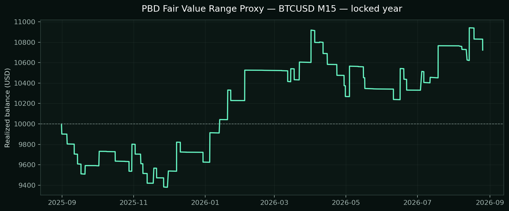
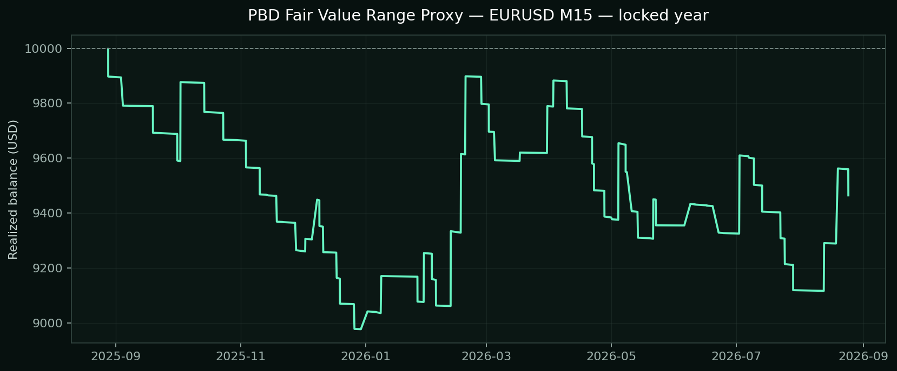
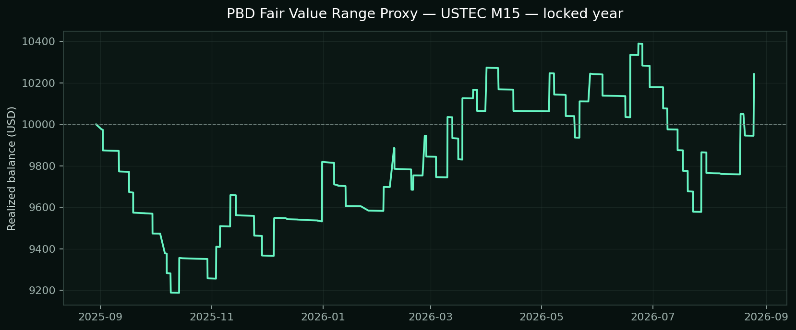
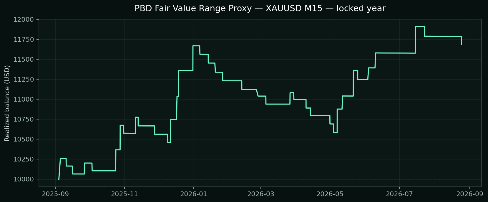

# PBD Fair Value Range Proxy — native MT5 validation

## Locked one-year decision table

Each instrument's configuration was selected only from the preceding development year. These are the untouched following-year results.

| Decision | Symbol / TF | Selected configuration | Return | PF | Win rate | Max equity DD | Trades | Net | Costs (commission / swap) |
| --- | --- | --- | ---: | ---: | ---: | ---: | ---: | ---: | ---: |
| KEEP CANDIDATE | BTCUSD M15 | both-r20-h4-rr3 | +7.23% | 1.21 | 27.40% | 7.81% | 73 | $723.48 | -$105.26 / -$46.28 |
| REJECT | EURUSD M15 | reclaim-r12-rr3 | -5.35% | 0.86 | 31.82% | 11.17% | 66 | -$535.31 | -$148.63 / -$42.07 |
| REJECT | USTEC M15 | reclaim-r12-rr3 | +2.42% | 1.06 | 30.49% | 10.31% | 82 | $242.32 | -$102.85 / -$40.85 |
| KEEP CANDIDATE | XAUUSD M15 | both-r20-h4-rr3 | +16.84% | 1.74 | 36.17% | 10.07% | 47 | $1,684.20 | -$21.63 / $0.00 |

## Locked equity graphs

### BTCUSD M15

### EURUSD M15

### USTEC M15

### XAUUSD M15

## Deterministic rules tested

- The M15 chart searches for an impulse followed by a compact fair-value range. The range must receive at least three alternating interactions with its upper and lower boundaries.
- False-break reclaim: price sweeps outside a validated range, closes back inside, and a later directional candle closes beyond the reclaim candle.
- Breakout confirmation: price closes outside a validated range and either confirms directly or retests the broken boundary before a further directional close, depending on the selected variant.
- Stops sit beyond the sweep/retest structure with an ATR buffer. Targets are at least 3R; one candidate also tests a capped measured-impulse target.
- Risk is 1% of current equity, with broker-aware volume, modeled spread, a spread/ATR gate, break-even at 1R, structure trailing from 2R and a 72-hour time exit.
- Optional H4 EMA direction and New York daytime filters were candidates, not assumed to be universally beneficial.

## What cannot be claimed

Patrick explicitly says the precise zone-drawing, resizing, volume-profile and footprint rules remain secret and that his execution is discretionary. This EA is therefore a transparent systematic proxy for the public framework, not Patrick Nill's exact strategy and not an endorsement by him.

## Development screen

| Symbol | Variant | Return | PF | Win rate | Equity DD | Trades |
| --- | --- | ---: | ---: | ---: | ---: | ---: |
| BTCUSD | both-r20-h4-rr3 **selected** | +2.38% | 1.09 | 28.33% | 9.12% | 60 |
| BTCUSD | both-r32-day-rr3 | -0.81% | 0.96 | 26.09% | 12.51% | 46 |
| BTCUSD | both-r20-rr4 | -3.75% | 0.90 | 24.32% | 9.30% | 74 |
| BTCUSD | break-r20-retest-rr3 | -3.93% | 0.78 | 21.05% | 7.52% | 38 |
| BTCUSD | break-r12-direct-rr3 | -7.31% | 0.88 | 20.18% | 12.19% | 109 |
| BTCUSD | both-r20-rr3 | -7.53% | 0.80 | 24.32% | 11.06% | 74 |
| BTCUSD | reclaim-r20-rr3 | -8.23% | 0.76 | 21.74% | 14.70% | 69 |
| BTCUSD | reclaim-r12-rr3 | -17.27% | 0.69 | 20.18% | 22.01% | 109 |
| EURUSD | reclaim-r12-rr3 **selected** | +5.96% | 1.13 | 43.53% | 12.52% | 85 |
| EURUSD | both-r32-day-rr3 | -1.29% | 0.95 | 33.33% | 8.30% | 45 |
| EURUSD | both-r20-h4-rr3 | -2.06% | 0.92 | 46.30% | 6.20% | 54 |
| EURUSD | both-r20-rr4 | -8.34% | 0.73 | 39.39% | 11.43% | 66 |
| EURUSD | both-r20-rr3 | -10.14% | 0.67 | 39.39% | 12.34% | 66 |
| EURUSD | break-r12-direct-rr3 | -12.76% | 0.68 | 35.90% | 19.06% | 78 |
| EURUSD | break-r20-retest-rr3 | -16.09% | 0.31 | 28.21% | 18.47% | 39 |
| EURUSD | reclaim-r20-rr3 | -19.58% | 0.38 | 24.14% | 21.54% | 58 |
| USTEC | reclaim-r12-rr3 **selected** | +14.33% | 1.33 | 31.91% | 10.55% | 94 |
| USTEC | break-r12-direct-rr3 | +6.25% | 1.14 | 27.50% | 13.66% | 80 |
| USTEC | both-r20-rr4 | +3.77% | 1.15 | 27.08% | 11.18% | 48 |
| USTEC | reclaim-r20-rr3 | +3.25% | 1.13 | 25.53% | 16.24% | 47 |
| USTEC | both-r20-rr3 | +1.85% | 1.08 | 27.08% | 10.53% | 48 |
| USTEC | break-r20-retest-rr3 | -4.09% | 0.74 | 19.35% | 8.42% | 31 |
| USTEC | both-r32-day-rr3 | -5.80% | 0.77 | 23.91% | 8.60% | 46 |
| USTEC | both-r20-h4-rr3 | -11.28% | 0.47 | 17.50% | 13.96% | 40 |
| XAUUSD | both-r20-h4-rr3 **selected** | +9.69% | 1.37 | 37.25% | 5.69% | 51 |
| XAUUSD | both-r20-rr4 | +6.36% | 1.22 | 31.82% | 10.87% | 66 |
| XAUUSD | both-r20-rr3 | +4.36% | 1.16 | 31.82% | 10.74% | 66 |
| XAUUSD | both-r32-day-rr3 | +2.00% | 1.10 | 25.64% | 6.75% | 39 |
| XAUUSD | break-r20-retest-rr3 | +0.59% | 1.03 | 27.50% | 6.28% | 40 |
| XAUUSD | reclaim-r20-rr3 | -0.63% | 0.97 | 23.21% | 7.33% | 56 |
| XAUUSD | break-r12-direct-rr3 | -12.54% | 0.69 | 22.50% | 14.81% | 80 |
| XAUUSD | reclaim-r12-rr3 | -13.19% | 0.66 | 18.29% | 14.41% | 82 |

## Test integrity

- Broker: Exness MT5 Trial 16; XAUUSD, BTCUSD, USTEC and EURUSD.
- Native MT5 Every Tick model, random execution delay, $10,000 initial balance, 1:2000 leverage and 1% calculated risk per trade.
- Development: 2024-08-28 through 2025-08-27. Locked test: 2025-08-28 through 2026-08-27.
- MT5 statistics include modeled broker spread. Commission and swap are reconstructed from the native deal ledger.
- No active BAT or website file was changed.
