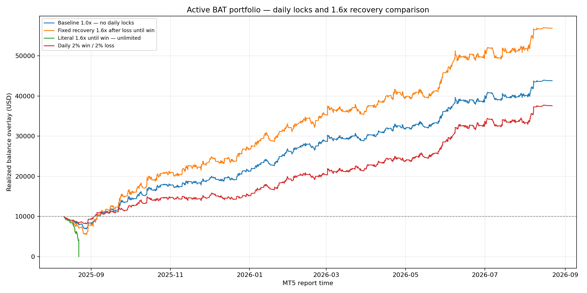

# Active BAT portfolio risk-control study

## Decision

- Added to the BAT: a portfolio-wide +2% daily profit lock and -2% daily loss lock.
- Not added: either 1.6x recovery interpretation. Even the fixed 1.6x-original-risk version increased drawdown, while compounding 1.6x after every loss ruined the simulation.

## Evidence-aligned last-year overlay

| Policy | Return | Realized DD | PF | Win rate | Closed trades | Skipped entries | Maximum nominal risk | Ruined |
|---|---:|---:|---:|---:|---:|---:|---:|---|
| Baseline 1.0x — no daily locks | +338.03% | 31.04% | 1.31 | 41.38% | 2,066 | 0 | 1.00% | No |
| Daily 2% win / 2% loss | +275.85% | 18.12% | 1.31 | 41.25% | 1,675 | 391 | 1.00% | No |
| Fixed recovery 1.6x after loss until win | +468.56% | 44.86% | 1.32 | 41.38% | 2,066 | 0 | 1.60% | No |
| Daily 2%/2% + fixed recovery 1.6x | +318.21% | 24.11% | 1.29 | 40.98% | 1,469 | 597 | 1.60% | No |
| Literal 1.6x until win — unlimited | -100.00% | 100.00% | 0.17 | 23.21% | 56 | 0 | 68.72% | YES |
| Recovery 1.6x — capped at 2.56x | +616.66% | 62.23% | 1.34 | 41.38% | 2,066 | 0 | 2.56% | No |
| Daily 2%/2% + recovery cap 2.56x | +452.54% | 24.13% | 1.34 | 41.02% | 1,514 | 552 | 2.56% | No |
| Daily 2%/2% + literal unlimited recovery | +1206.31% | 96.64% | 1.47 | 40.72% | 1,579 | 487 | 109.95% | No |

## What the 1.6x sequence does

The phrase '1.6x the original risk until a win' was tested literally as a fixed 1.60% risk after every loss, and separately as a compounding sequence. In the compounding interpretation, consecutive losses request 1.00%, 1.60%, 2.56%, 4.10%, 6.55%, 10.49%, 16.78%, 26.84%, 42.95%, then 68.72% risk. The observed portfolio sequence contained a fourteen-loss streak. A win does not guarantee recovery because the active EAs have different reward/risk ratios and realized losses include spread, commission, swap and slippage.

## Method limits

- The source is 18 native MT5 one-year reports and 2,066 reconstructed closed trades, including the newly added BTC and ETH EAs.
- Newer EA evidence ends up to sixteen days later than the original BAT reports, so this is an evidence-aligned one-year overlay rather than one synchronized multi-EA tester run.
- The overlay includes report transaction costs but cannot reproduce shared margin, simultaneous floating drawdown, broker lot rounding or order rejection.
- Backtest daily locks react to realized closed-trade P/L and skip later entries. The live guard also includes managed floating P/L, closes managed positions and deletes managed pending orders, so it can lock earlier and live results will differ.
- EAs that do not natively read the guard lock may try to re-enter. While locked, the controller repeatedly removes those managed orders and positions; extra spread or commission can still occur.
