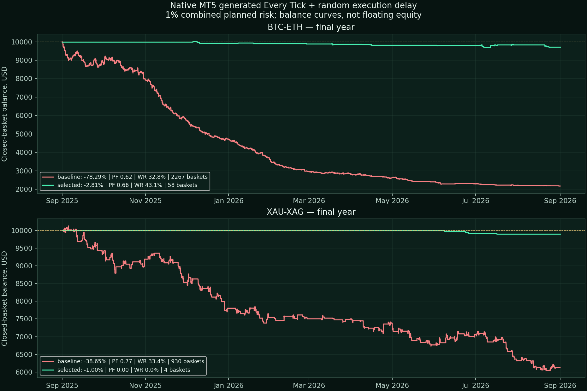
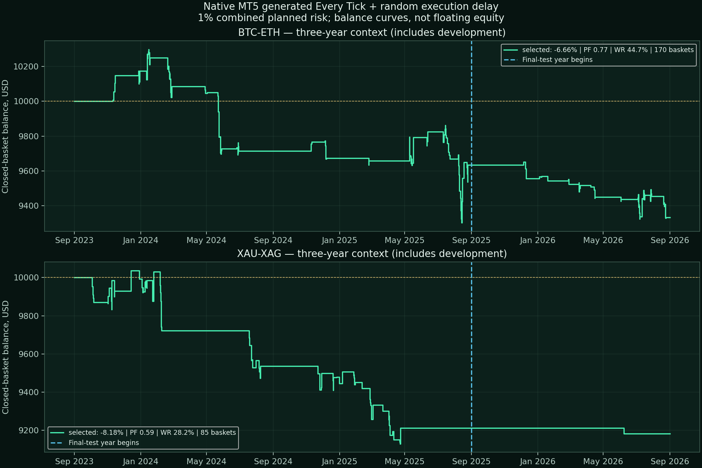
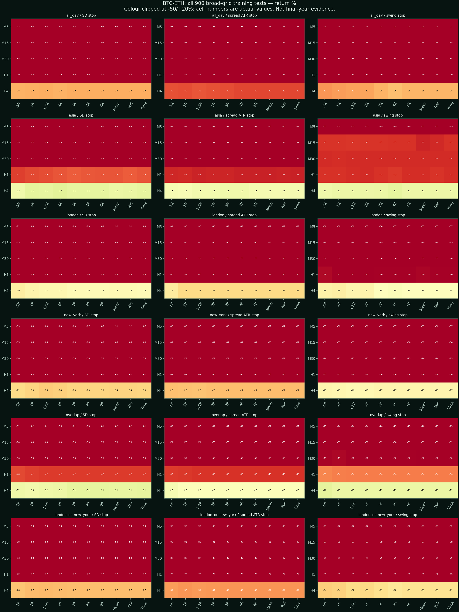
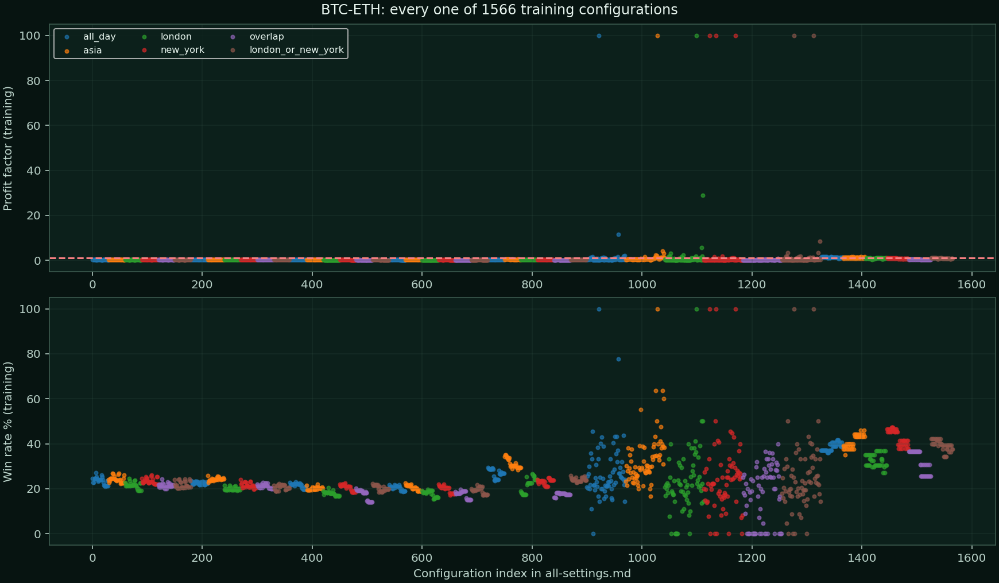
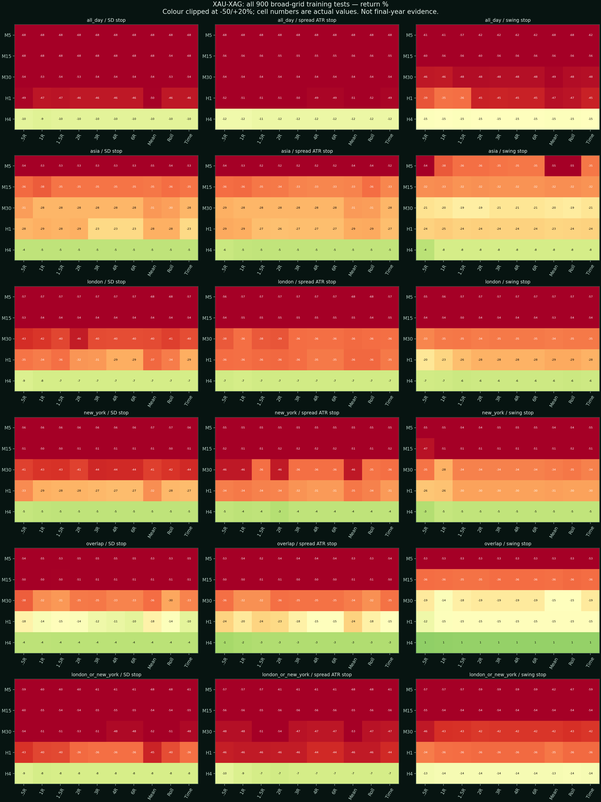
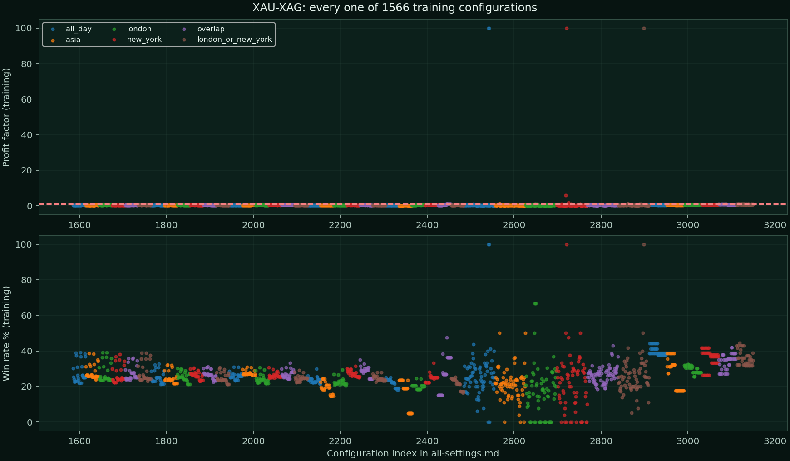
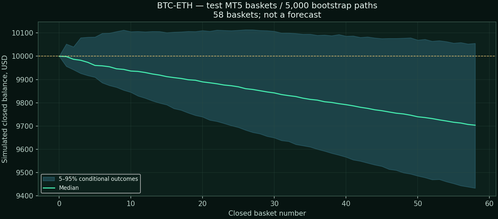
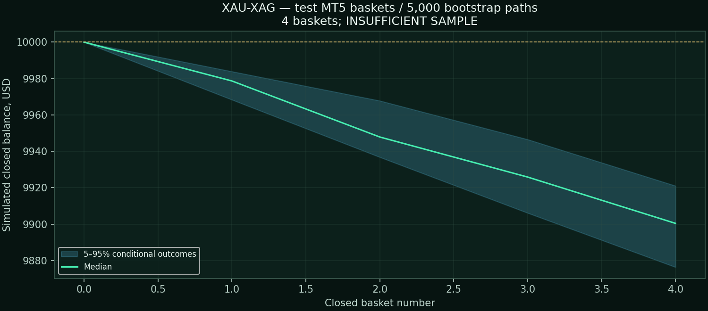

# Step 2 — Relative-Value Pairs: final research report

## 1. Decision

**Do not add BTC/ETH or XAU/XAG to the active system.** The locked candidates did not establish a repeatable net edge. These findings reject the tested implementation, not every possible pairs strategy. No production BATs, website data, or live-account orders were changed.

## 2. What was tested

3,132 distinct Python screening configurations (1,566 per pair), plus separate selection-validation/final/cost runs and native MT5 checks. Risk stayed at 1% **combined across both legs**, not 1% each. Risk was not optimized upward. Starting capital: $10,000. Exact scope is in PLAN.md.

- Timeframes: M5, M15, M30, H1, H4.
- Six clock windows: all day, Asia 00–08 UTC, London 08–17 local, New York 08–17 local, overlap, and London-or-New-York. Historical DST is handled; crypto weekend clock windows are not claims that stock exchanges are open.
- Fixed RR: 0.5, 1, 1.5, 2, 3, 4, 6. Also entry-time mean targets, rolling mean targets that genuinely change while holding, and time-only exits.
- Log-ratio and rolling OLS hedge; formation windows 32/64/128 completed bars; divergence thresholds 1.5/2/2.5/3; both spread directions and each direction separately.
- Stop placement: spread standard deviation, spread ATR, or adverse recent spread swing; each leg has an emergency stop and the remaining leg is closed when one exits.
- Management: none, BE at +0.5R/+1R, M15 closed-candle +0.5R → basket floor +0.2R, 0.5R/1R trailing after +1R, spread-volatility trailing. Hold caps 6/24/72 hours.
- The broad cross-grid contains all timeframe × session × stop × exit combinations. Signal and management refinements are staged around training anchors; this is not every possible Cartesian combination of all inputs.

Training: 2023-09-01–2024-09-01. Selection validation: 2024-09-01–2025-09-01. Final year: 2025-09-01–2026-09-01. Both candidates were saved to selection-lock.json before final-year performance was read. Subsequent debugging was correctness work, not retuning to improve the final year. The supplemental rolling diagnostic is not another untouched test.

## 3. Native MT5 results

PF and win rate below are calculated from **completed baskets**, including any aborted single-leg executions; the two leg trades are not counted as independent strategy wins. DD is native maximum relative floating-equity DD. Sharpe/recovery are the MT5-reported account metrics; a Sharpe of -5 may reflect the platform floor.

| Pair / config | Period | Return | PF | Win rate | DD | Trades | Sharpe | Recovery |
|---|---|---:|---:|---:|---:|---:|---:|---:|
| BTC-ETH selected | full | -6.66% | 0.77 | 44.71% | 10.09% | 170 | -5.00 | -0.64 |
| BTC-ETH baseline | test | -78.29% | 0.62 | 32.77% | 78.29% | 2267 | -5.00 | -1.00 |
| BTC-ETH selected | test | -2.81% | 0.66 | 43.10% | 3.47% | 58 | -5.00 | -0.81 |
| XAU-XAG selected | full | -8.18% | 0.59 | 28.24% | 9.24% | 85 | -5.00 | -0.88 |
| XAU-XAG baseline | test | -38.65% | 0.77 | 33.44% | 40.70% | 930 | -5.00 | -0.93 |
| XAU-XAG selected | test | -1.00% | 0.00 | 0.00% | 1.00% | 4 | -5.00 | -1.00 |

The curves above are closed-basket balances, not sampled floating equity. Full-period results include training/selection and are descriptive, not an independent test.

### Real-tick execution checks

| Pair / config | Period | Return | PF | Win rate | DD | Trades | Sharpe | Recovery |
|---|---|---:|---:|---:|---:|---:|---:|---:|
| XAU-XAG selected | recent | -0.85% | 0.00 | 0.00% | 1.03% | 4 | -5.00 | -0.82 |
| XAU-XAG selected | test | -0.79% | 0.00 | 0.00% | 0.94% | 4 | -5.00 | -0.84 |

Real-tick mode must be read with each Native/*model4/tester-audit.txt: MT5 may use generated ticks for minutes with missing real ticks. It is not automatically 100% genuine recorded ticks. Native broker spread/commission/swap differ from the conservative screen assumptions, so Python and MT5 are deliberately shown separately.

### Recorded-tick limitation

**No successful full-year recorded-tick validation is claimed for the unavailable runs.** The broker history synchronization did not produce a report within the bounded wait. Saved `unavailable.json` files record the actual status; this is not proof that the broker can never provide the data. The accepted native results above use generated Every Tick.

### Recorded-tick coverage audit

| Pair | Requested period | History quality | Evidence use |
|---|---|---:|---|
| XAU-XAG | M5 (2026.01.01 - 2026.09.01) | 100% | Accepted for this stated period only |
| XAU-XAG | M5 (2025.09.01 - 2026.09.01) | 66% | Partial recorded-tick window: exclude from full-year validation |

Gold/silver recorded ticks begin on 2026-01-01. Its 66%-quality full-year request is **not** accepted as full-year validation. The separate January–August run has 100% history quality, but only four baskets. BTC/ETH did not produce an auditable recorded-tick run; the shorter request logged no history data and stopped.

### Execution sensitivity (settings unchanged)

| Pair / config | Period | Return | PF | Win rate | DD | Trades | Sharpe | Recovery |
|---|---|---:|---:|---:|---:|---:|---:|---:|
| BTC-ETH selected-repeat1 / random delay | test | -3.06% | 0.63 | 41.38% | 3.51% | 58 | -5.00 | -0.87 |
| BTC-ETH selected-repeat2 / random delay | test | -2.81% | 0.65 | 41.38% | 3.28% | 58 | -5.00 | -0.85 |
| BTC-ETH selected / 250ms | test | -3.36% | 0.59 | 41.38% | 3.73% | 58 | -5.00 | -0.90 |
| XAU-XAG selected-repeat1 / random delay | test | -0.78% | 0.00 | 0.00% | 0.96% | 4 | -5.00 | -0.81 |
| XAU-XAG selected-repeat2 / random delay | test | -0.84% | 0.00 | 0.00% | 1.02% | 4 | -5.00 | -0.82 |
| XAU-XAG selected / 250ms | test | -0.85% | 0.00 | 0.00% | 1.04% | 4 | -5.00 | -0.82 |

250ms is an illustrative lower-latency model, not a measured end-to-end fill guarantee. Repeat rows show independent random-delay realizations, not newly optimized strategies.

## 4. Selected research settings (not recommended for deployment)

| Pair | TF | Formation / entry | Session | Direction | Stop | Exit | Management | Hold |
|---|---|---|---|---|---|---|---|---|
| BTC-ETH | 240 min | Log ratio, 128 bars, 1.5Z | new_york | Long A / short B | recent swing | 1.5R | M15_0.5_to_0.2R | 6h |
| XAU-XAG | 240 min | Log ratio, 128 bars, 1.5Z | london | Short A / long B | recent swing | 1.5R | M15_0.5_to_0.2R | 72h |

“Selected” means the least-bad candidate under a predeclared score, not an approved or profitable setup. A high PF on a handful of trades is not reliable evidence.

## 5. Sessions and optimization effects

Best training-shortlisted candidate per session, evaluated on the separate selection-validation year. These are not final-year winners.

| Pair / config | Period | Return | PF | Win rate | DD | Trades | Sharpe | Recovery |
|---|---|---:|---:|---:|---:|---:|---:|---:|
| BTC-ETH ab55fd6db728 | validation | -10.09% | 0.22 | 14.71% | 10.34% | 34 | -2.41 | -0.97 |
| BTC-ETH 528db1f8b87a | validation | -5.87% | 0.37 | 26.09% | 6.90% | 46 | -2.11 | -0.85 |
| BTC-ETH 85e8af51a074 | validation | -3.16% | 0.50 | 40.74% | 5.63% | 27 | -1.28 | -0.56 |
| BTC-ETH 732169212e8d | validation | -2.95% | 0.80 | 38.60% | 7.86% | 57 | -0.63 | -0.37 |
| BTC-ETH 3eece230c45b | validation | -0.63% | 0.87 | 36.00% | 2.12% | 25 | -0.27 | -0.29 |
| BTC-ETH 2ca026aa9c60 | validation | -16.07% | 0.29 | 20.31% | 16.07% | 64 | -3.01 | -1.00 |
| XAU-XAG 89fd899c3aa1 | validation | -65.97% | 0.36 | 26.57% | 66.23% | 493 | -8.91 | -0.99 |
| XAU-XAG 4bebf837071a | validation | -8.23% | 0.29 | 21.95% | 9.35% | 41 | -2.78 | -0.87 |
| XAU-XAG 7f7d299b3f4d | validation | +0.17% | 1.03 | 41.18% | 2.76% | 34 | 0.08 | 0.06 |
| XAU-XAG 45ca771feeca | validation | -2.71% | 0.65 | 34.78% | 4.88% | 23 | -0.95 | -0.55 |
| XAU-XAG 0dd7ea366a1f | validation | -7.55% | 0.29 | 25.00% | 7.55% | 36 | -2.87 | -1.00 |
| XAU-XAG 120eb28ba00a | validation | -8.63% | 0.24 | 19.44% | 9.40% | 36 | -2.79 | -0.92 |

### BTC-ETH: every broad-grid setting

### XAU-XAG: every broad-grid setting

The complete 3,186-row metric/configuration ledger is in all-settings.md and screen-results.json. The heatmaps contain all 900 broad cells per pair; refinement points and their exact inputs are retained rather than hidden.

## 6. Statistical relationship checks

Correlation is not sufficient evidence of a stable mean-reverting spread. These daily diagnostics are descriptive, not an entry filter chosen after viewing the results. The Engle–Granger null is **no cointegration**; six reported tests are exploratory and not adjusted for multiple comparisons.

| Pair | Year role | Daily return correlation | Cointegration p | Fitted hedge beta |
|---|---|---:|---:|---:|
| BTC-ETH | train | 0.803 | 0.5900 | 1.120 |
| BTC-ETH | validation | 0.776 | 0.2599 | 0.359 |
| BTC-ETH | test | 0.901 | 0.0433 | 0.669 |
| XAU-XAG | train | 0.801 | 0.5223 | 0.721 |
| XAU-XAG | validation | 0.674 | 0.6708 | 1.022 |
| XAU-XAG | test | 0.842 | 0.2713 | 0.379 |

The relationships were not consistently cointegrated across development years. OLS hedge ratios also changed materially. A fitted residual half-life is not reliable evidence when stationarity is unsupported.

## 7. Rolling walk-forward diagnostic

Predefined 900-cell broad grid; train on previous 12 months, apply next 3 months. Hold cash unless training return > 0, PF ≥ 1.10, at least 30 baskets, and DD ≤ 15%. Rules were fixed before this supplemental run. These are bar-screen results, not native execution tests.

| Pair | Quarter start | Eligible training configs | Applied return | Trades | Win rate | PF |
|---|---|---:|---:|---:|---:|---:|
| BTC-ETH | 2024-09-01 | 0 | +0.00% | 0 | 0.00% | 0.00 |
| BTC-ETH | 2024-12-01 | 0 | +0.00% | 0 | 0.00% | 0.00 |
| BTC-ETH | 2025-03-01 | 0 | +0.00% | 0 | 0.00% | 0.00 |
| BTC-ETH | 2025-06-01 | 0 | +0.00% | 0 | 0.00% | 0.00 |
| BTC-ETH | 2025-09-01 | 0 | +0.00% | 0 | 0.00% | 0.00 |
| BTC-ETH | 2025-12-01 | 0 | +0.00% | 0 | 0.00% | 0.00 |
| BTC-ETH | 2026-03-01 | 0 | +0.00% | 0 | 0.00% | 0.00 |
| BTC-ETH | 2026-06-01 | 0 | +0.00% | 0 | 0.00% | 0.00 |
| XAU-XAG | 2024-09-01 | 0 | +0.00% | 0 | 0.00% | 0.00 |
| XAU-XAG | 2024-12-01 | 0 | +0.00% | 0 | 0.00% | 0.00 |
| XAU-XAG | 2025-03-01 | 0 | +0.00% | 0 | 0.00% | 0.00 |
| XAU-XAG | 2025-06-01 | 1 | +0.17% | 9 | 44.44% | 1.09 |
| XAU-XAG | 2025-09-01 | 17 | -1.21% | 7 | 42.86% | 0.27 |
| XAU-XAG | 2025-12-01 | 1 | +0.06% | 2 | 50.00% | 1.12 |
| XAU-XAG | 2026-03-01 | 5 | -0.41% | 5 | 40.00% | 0.67 |
| XAU-XAG | 2026-06-01 | 0 | +0.00% | 0 | 0.00% | 0.00 |

Cash-only quarters have no trades: their zero return is **not** a profitable trading edge. Normalized compounded fold balances in the JSON are illustrative; each fold starts its lot-exact simulation from $10,000.

## 8. Monte Carlo and execution-cost stress

5,000 circular block-bootstrap paths, with the original number of baskets and fixed-percent compounding. Blocks are up to 5 trades, shorter for tiny samples. DD below is simulated **closed-balance** drawdown, not intratrade equity DD. These are conditional resamples, not a next-year forecast or probability guarantee.

| Pair / evidence | Baskets | Return P5 | Median | P95 | DD P95 |
|---|---:|---:|---:|---:|---:|
| BTC-ETH / full | 170 | -14.82% | -6.84% | +2.81% | 16.23% |
| BTC-ETH / test | 58 | -5.67% | -2.96% | +0.55% | 6.05% |
| XAU-XAG / full | 85 | -12.76% | -8.20% | -3.06% | 13.36% |
| XAU-XAG / test | 4 | -1.24% | -1.00% | -0.79% | 1.24% |

**Do not infer a reliable distribution from the tiny XAU/XAG final-year sample.** Three-year bootstrap results include development trades and selection bias. There is no defensible positive expected-profit estimate for next month from this evidence.

Native final-year basket returns with hypothetical additional cost (not a new native test):

| Pair | Extra cost per basket | Return | PF | Win rate |
|---|---:|---:|---:|---:|
| BTC-ETH | 0.05R | -5.59% | 0.43 | 37.93% |
| BTC-ETH | 0.10R | -8.29% | 0.28 | 27.59% |
| XAU-XAG | 0.05R | -1.19% | 0.00 | 0.00% |
| XAU-XAG | 0.10R | -1.39% | 0.00 | 0.00% |

## 9. Data, costs and risk caveats

- Broker M5 history: 2023-06-01–2026-09-01, four symbols, exact timestamp inner joins. No forward-filling into signals. Only complete decision candles and prior formation bars are used.
- Many recorded spreads are zero; on a Zero-type account that can be genuine. The Python screen conservatively floors spread at the **training-period positive median**, adds 1 basis point commission per side per leg, and applies current broker swap snapshots historically. These are assumptions, not recovered historical fee schedules; they can materially overstate costs. Native tests use the actual tester account costs instead.
- Python evaluates basket/leg protection at synchronized M5 observations; it does not know the within-bar joint path. MT5 runs check tick execution and broker emergency stops. This explains trade-count and performance differences.
- The 1% figure is a planned combined risk budget. Both legs are sequential market orders, not an atomic exchange spread. Gaps, stop slippage, stale quotes, and a failed second leg can exceed the intended limit. The research EA closes an orphan leg and never opens on a normal chart.
- Small balance/minimum volume constraints can prevent a proper hedge; invalid/undersized/overly distorted hedges are skipped, not rounded up. These $10,000 results cannot be assumed to work on $50.
- Metals and crypto here are broker CFDs. This is not exchange-futures execution, and native broker history quality percentages do not prove tick provenance.

## 10. Verification and deliverables

- EA compiles with 0 errors and 0 warnings.
- 20 causal-prefix checks across both pairs, timeframes and model types; removing future data does not change prior signals.
- Native features are compared numerically with the Python causal signal calculation.
- Native basket cash is reconciled against the MT5 final balance; completed and aborted leg executions are counted explicitly.
- Exact sets, source/binary, native reports, per-leg entries/exits, basket ledgers, feature audits, cost assumptions and selection lock are saved locally.
- VERIFICATION.txt gives the checks actually completed. No claim is made about passing a future live test.

### Source references

- [Original pairs research (Gatev, Goetzmann, Rouwenhorst)](https://www.nber.org/papers/w7032)
- [Engle–Granger documentation](https://www.statsmodels.org/stable/generated/statsmodels.tsa.stattools.coint.html)
- [MetaQuotes multi-symbol testing](https://www.mql5.com/en/docs/runtime/testing)
- [MetaQuotes tester settings](https://www.metatrader5.com/en/terminal/help/start_advanced/start)
- [Exness commission account types](https://get.exness.help/hc/en-us/articles/360012007919-Are-trading-accounts-charged-a-commission-fee)
- [Exness crypto swaps / trading hours](https://get.exness.help/hc/en-us/articles/17854191888540-Cryptocurrencies)

### Reproduction

Use the local .venv Python environment. research.py runs the bar screen; native.py runs generated-tick checks; native.py --real requests recorded-tick mode; verify_research.py audits; diagnostics.py and walk_forward.py generate supplemental evidence; build_report.py only rebuilds outputs. Data and reports are already saved: opening this report does not rerun any test.

## Review gate

Step 2 research is complete within the stated finite test space. **Keep both pairs out of the active system.** Wait for user review before moving to another strategy.
