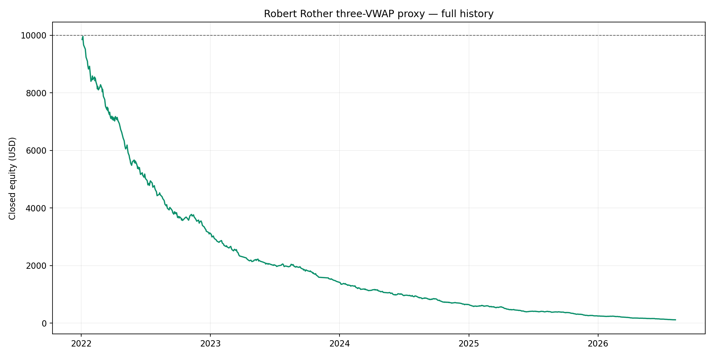
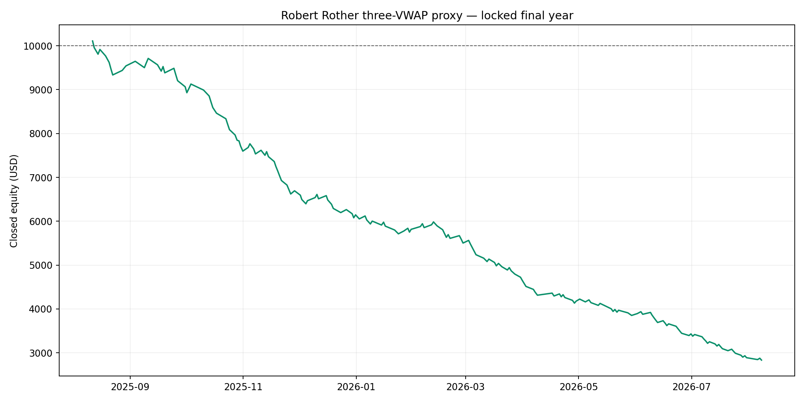

# Robert Rother three-VWAP scalper — validation

## Decision: REJECT

The strongest configuration chosen before the locked final year used **US RTH 09:30 NY VWAP**, required price to move **7.50 index points** away, used a **60-minute** trend/slope lookback, required **1.25x** 60-minute broker tick volume (0 means disabled), a **2.50-point stop (10 CME ES ticks)**, a **3.75-point target**, and a **30-minute** maximum hold.

| Period | Net return | PF | Win rate | DD* | Trades | Zero-cost return | Zero-cost PF |
|---|---:|---:|---:|---:|---:|---:|---:|
| development | -93.59% | 0.35 | 34.44% | 93.61% | 450 | -47.34% | 0.77 |
| validation | -37.05% | 0.50 | 41.51% | 39.08% | 106 | +2.62% | 1.04 |
| locked | -71.66% | 0.35 | 31.72% | 71.97% | 186 | -31.95% | 0.70 |
| full | -98.86% | 0.36 | 34.77% | 98.86% | 742 | -63.23% | 0.79 |

`DD*` is closed-equity drawdown. Risk is 1% of current equity per trade from a $10,000 initial balance.

## What was faithfully tested

- Three separately anchored tick-volume VWAPs: CME-style electronic day at 18:00 New York, London at 08:00 London, and US regular session at 09:30 New York. DST is handled by IANA time zones.
- Trend-continuation pullback: price and VWAP slope must agree, price first moves away by the configured distance, then a limit entry is modeled at the moving VWAP.
- First filled touch only per New York day. An order is cancelled after a 2–3 ES-tick near-miss reaction, matching the transcript.
- Exact 10 ES-tick stop and tested 10/12/15-tick targets. Entries stop at 15:30 New York and trades are flat no later than 15:55.
- Exness Zero US500 commission of $0.50/lot/side plus one ES tick of adverse slippage on stop/time exits. Same-minute target credit is forbidden because M1 OHLC cannot prove target occurred after the VWAP fill.

## What was not validated

- The Bookmap heatmap, live CME depth, 600-lot liquidity, spoof detection and queue position are absent. Historical candles cannot reconstruct them.
- Exness US500 is an OTC CFD with broker tick volume. It is not CME ES futures or centralized exchange volume.
- "Most respected VWAP", discretionary range/trend classification, anchored VWAPs from hand-selected swing points, VIX-based size changes and subjective early exits were not converted with hindsight. Fixed, auditable proxies were used instead.
- The 80% win-rate statement in the transcript is a claim, not independently documented performance.

## Research method

The grid contained 972 predeclared combinations across three VWAP anchors, four move-away distances, three trend lookbacks, three volume thresholds, three targets and three maximum holds. Development ended 2024-12-31; validation ran through 2025-08-10; 2025-08-11 through 2026-08-10 was locked until the rule was selected. The live BAT was not changed.

All 972 cost-aware configurations had negative return and profit factor below 1.00 in both development and validation. This was not a rejection caused by one unlucky locked-year result.

## Files

- `Results/development-validation-grid.csv`: all 972 configurations.
- `Results/selected-summary.csv`: development, validation, locked and full metrics.
- `Results/selected-full-trades.csv`: full selected trade ledger.
- `Results/selection.json`: chosen rule and data/cost assumptions.
- `research_rother_vwap_scalper.py`: reproducible research runner.
