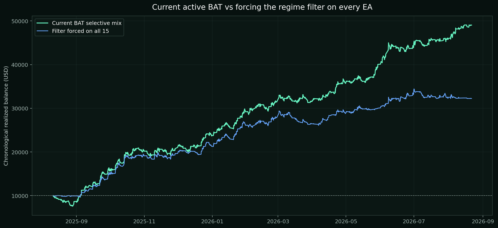

# Current BAT vs forcing the filter on every active EA

Both columns use the same 15-EA topology and the same $10,000 chronological closed-cash-flow method. XAU Markov is unchanged because it is already the regime model.

| Version | Return | Final | PF | Win rate | Realized DD | Trades |
| --- | ---: | ---: | ---: | ---: | ---: | ---: |
| Current BAT selective mix | +390.40% | $49,039.57 | 1.43 | 43.00% | 24.07% | 1,756 |
| Filter forced on all eligible EAs | +222.45% | $32,244.95 | 1.37 | 44.63% | 11.18% | 1,230 |
| Current minus all-filtered | +167.95 pp | $+16,794.62 | +0.06 | -1.64 pp | +12.89 pp | +526 |

The filter-everything version is a historical entry-veto overlay, not a simultaneous shared-margin MT5 run. The current selective curve uses native MT5 results for the three rebuilt filtered EAs. Floating-equity interaction and simultaneous margin contention are not represented in either curve.
