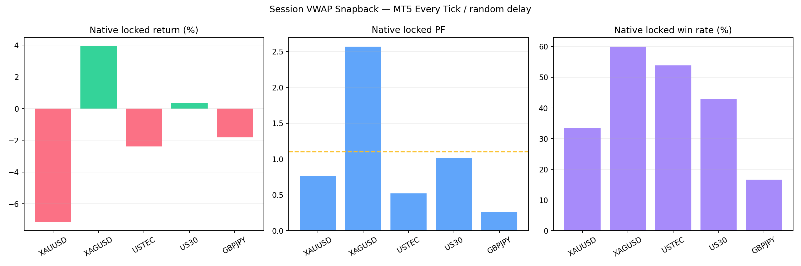
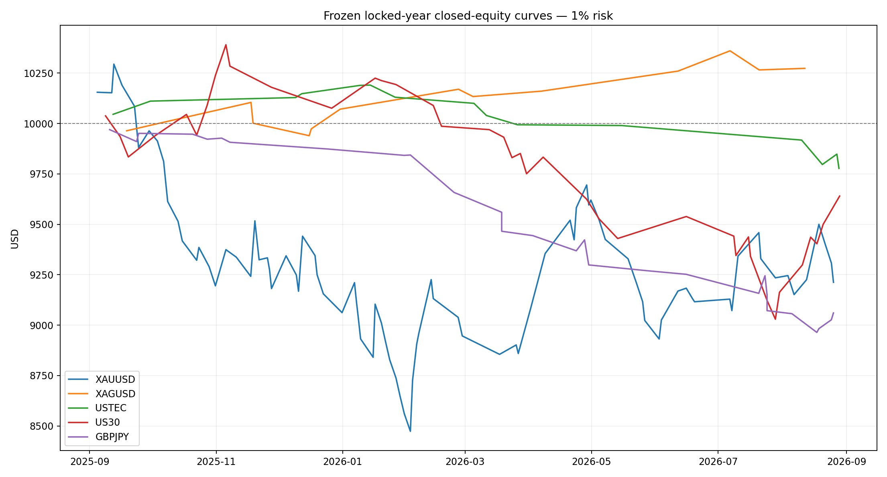
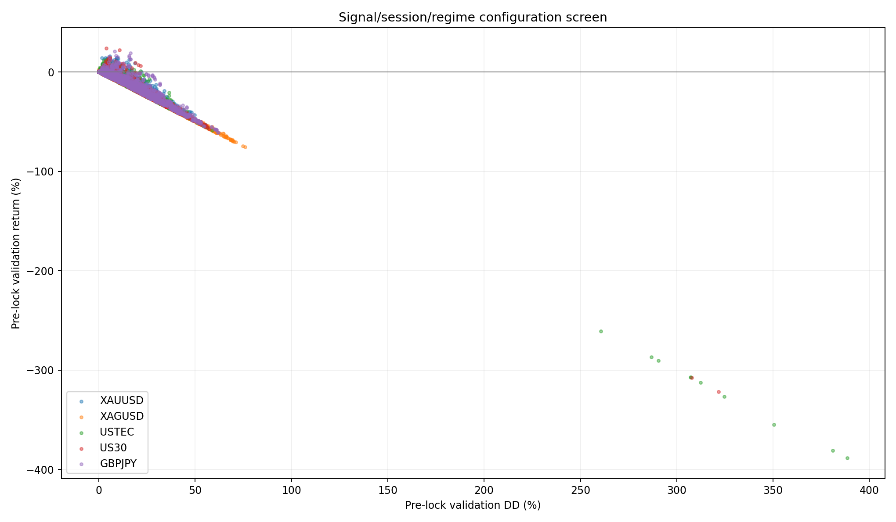
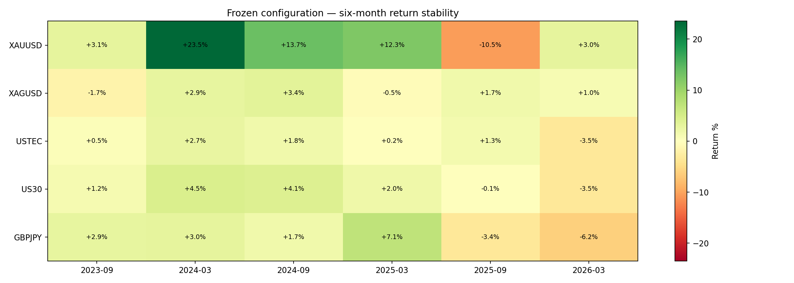
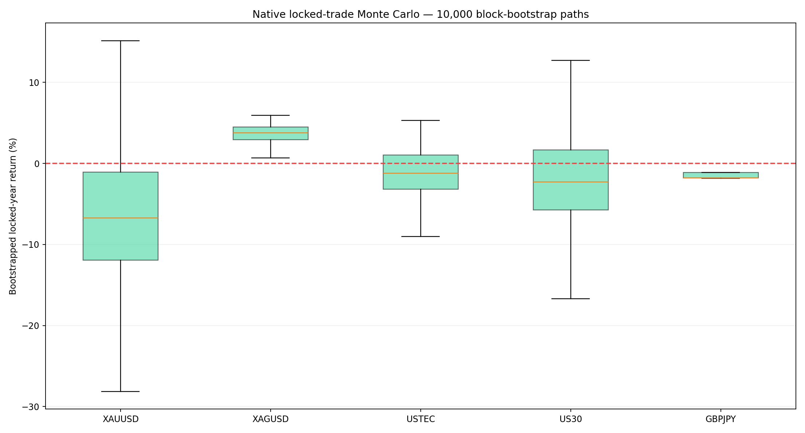
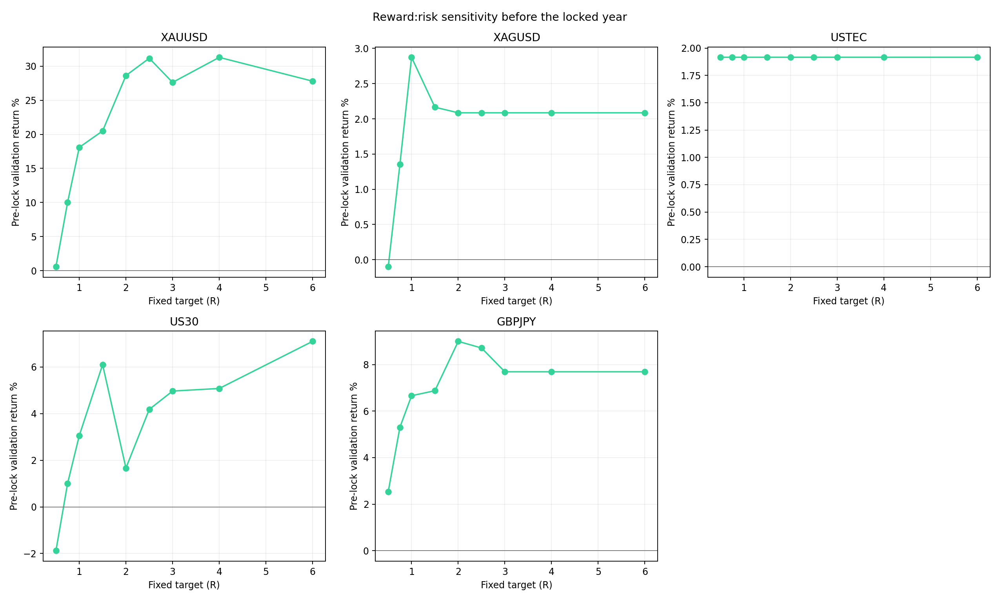
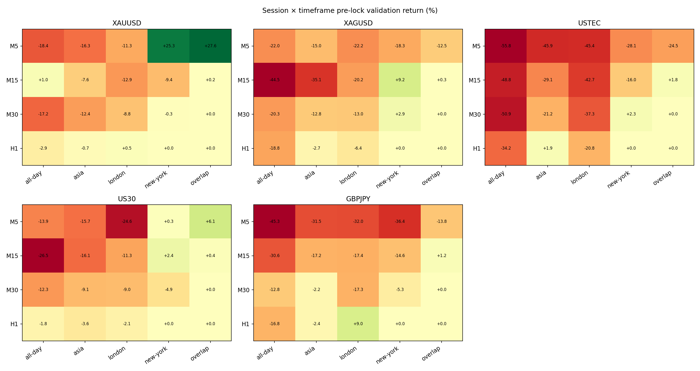

# Step 4 — Session VWAP Liquidity Snapback

> Deployment update (2026-09-06): after reviewing the completed research, the user explicitly promoted only the XAGUSD M30 New York preset as a fixed-1% demo-forward/watch allocation. This does not change the original statistical conclusion below: the locked sample contains only 15 trades and is not yet a mature core-system validation.

## Final decision: reject for the active system

None of the five markets passes the pre-declared locked-year gate. **No BAT, website listing, recommended portfolio, or live MT5 profile was changed.** XAGUSD is the only positive locked-year candidate, but 15 native trades are far below the 30-trade minimum and are not enough to establish an edge.

## Native MT5 locked-year evidence

Frozen settings, 2025-09-01 through 2026-09-01, generated Every Tick, random execution delay, broker spread, commission and swap, exactly 1% equity risk.

| Asset | Return | PF | Win rate | Max DD | Trades | Sharpe | Recovery |
|---|---:|---:|---:|---:|---:|---:|---:|
| XAUUSD | -7.14% | 0.76 | 33.33% | 15.15% | 57 | -5.00 | -0.47 |
| XAGUSD | +3.93% | 2.57 | 60.00% | 3.60% | 15 | 8.59 | 1.05 |
| USTEC | -2.38% | 0.52 | 53.85% | 4.42% | 13 | -5.00 | -0.53 |
| US30 | +0.35% | 1.02 | 42.86% | 8.29% | 35 | 0.98 | 0.04 |
| GBPJPY | -1.81% | 0.26 | 16.67% | 1.82% | 6 | -2.82 | -0.99 |

### US100 retest

US100 was re-tested from scratch under the new details. The selected H1 Asia / 2.5σ / ADX≤25 / 0.75 ATR stop / 0.5R version produced **-2.38%**, PF **0.52**, **53.85%** wins, **4.42%** DD and **13 trades**. A 0.5R target needs roughly 66.7% wins before costs; its native 53.85% was not enough. It remains rejected.

## Frozen configurations

| Asset | TF | Session | Band | Confirmation | Regime | Direction | Stop | Target | Management |
|---|---|---|---:|---|---|---|---|---|---|
| XAUUSD | M5 | overlap | 2σ | close-inside | adx20 | both | atr 1.5 | 3R | none |
| XAGUSD | M30 | new-york | 2.5σ | rejection-candle | adx20 | both | atr 1.25 | 1R | none |
| USTEC | H1 | asia | 2.5σ | rejection-candle | adx25 | both | atr 0.75 | 0.5R | none |
| US30 | M5 | overlap | 2σ | engulfing | adx25 | both | session-extreme 0.1 | 1.5R | none |
| GBPJPY | H1 | london | 1.5σ | close-inside | adx15 | both | session-extreme 0.1 | 2R | none |

Every setting above was selected from the two pre-lock years before the final year was read.

## Broad-screen locked year

The Python M5 screen includes recorded spread, conservative stop-first bar handling and an added 0.02R execution charge. Native MT5 evidence above is the final authority.

| Asset | Return | PF | Win rate | Max DD | Trades | Sharpe | Recovery |
|---|---:|---:|---:|---:|---:|---:|---:|
| XAUUSD | -7.88% | 0.85 | 34.07% | 18.57% | 91 | -0.48 | -0.42 |
| XAGUSD | +2.73% | 1.82 | 64.29% | 1.66% | 14 | 0.86 | 1.64 |
| USTEC | -2.23% | 0.52 | 46.67% | 4.06% | 15 | -0.87 | -0.55 |
| US30 | -3.60% | 0.83 | 41.03% | 13.68% | 39 | -0.40 | -0.26 |
| GBPJPY | -9.40% | 0.23 | 28.57% | 10.51% | 28 | -1.95 | -0.89 |

## Three-year native context — not independent validation

This interval contains the development sample, so it is descriptive only.

| Asset | Return | PF | Win rate | Max DD | Trades | Sharpe | Recovery |
|---|---:|---:|---:|---:|---:|---:|---:|
| XAUUSD | +10.33% | 1.11 | 42.08% | 16.36% | 183 | 3.56 | 0.52 |
| XAGUSD | +3.55% | 1.35 | 59.46% | 3.59% | 37 | 7.36 | 0.95 |
| USTEC | -0.81% | 0.94 | 64.44% | 4.54% | 45 | -3.13 | -0.17 |
| US30 | +13.68% | 1.30 | 48.39% | 7.88% | 93 | 11.23 | 1.49 |
| GBPJPY | +1.54% | 1.27 | 40.91% | 2.99% | 22 | 7.43 | 0.51 |

## Temporal stability

| Asset | Positive six-month periods | Worst period | Best period |
|---|---:|---:|---:|
| XAUUSD | 5/6 | -10.54% | +23.52% |
| XAGUSD | 4/6 | -1.70% | +3.41% |
| USTEC | 5/6 | -3.48% | +2.71% |
| US30 | 4/6 | -3.47% | +4.52% |
| GBPJPY | 4/6 | -6.19% | +7.14% |

## Monte Carlo

10,000 five-trade block-bootstrap paths use the exact native locked trade returns. With only 6–57 trades per market, these ranges are highly uncertain rather than forecasts.

| Asset | Profit probability | Return P5 | Median return | Return P95 | Median DD | DD P95 |
|---|---:|---:|---:|---:|---:|---:|
| XAUUSD | 21.45% | -18.57% | -6.72% | +8.13% | 11.81% | 20.40% |
| XAGUSD | 99.91% | +1.78% | +3.75% | +5.27% | 1.81% | 2.74% |
| USTEC | 35.77% | -6.28% | -1.23% | +3.35% | 2.68% | 6.89% |
| US30 | 34.53% | -10.07% | -2.29% | +7.70% | 6.79% | 11.96% |
| GBPJPY | 0.00% | -1.86% | -1.81% | -1.11% | 2.05% | 2.09% |

## RR, session, timeframe, stop and trailing tests

- Fixed targets tested: 0.5R, 0.75R, 1R, 1.5R, 2R, 2.5R, 3R, 4R and 6R, plus central-VWAP exit.
- Stops tested: rejection candle, four-bar swing, session extreme, and 0.75/1/1.25/1.5 ATR.
- Management tested: none, breakeven, 1.5 ATR trailing and the M15 50%-to-20% dynamic stop.
- Sessions tested: Asia, London, New York, London–New York overlap and UTC all-day.
- Timeframes tested: M5, M15, M30 and H1.
- Directions tested: both, long-only and short-only.

The surviving pre-lock configurations all selected **no trailing**. In this strategy, trailing and breakeven generally cut the intended return-to-VWAP path before it completed. Full comparison rows are saved in `rr-sensitivity.csv`, `session-timeframe-sensitivity.csv`, `stop-sensitivity.csv`, and `management-sensitivity.csv`.

## Regime and news handling

The regime layer tested no gate, ADX ceilings, normalized EMA-slope flatness, their intersection, and a causal 20-day three-state return filter. This last filter follows the regime skill's 20-bar / ±5% framework and was used only as a veto, never as an entry signal. The frozen winners chose ADX ceilings, but that did not hold in the locked year.

MT5's economic calendar is unavailable in Strategy Tester. The research EA includes an optional live high-impact USD-event block, but it is disabled in these tests so live and historical rules are not falsely presented as identical. No claim is made that a historical news filter was tested.

## Evidence and implementation notes

- 8,630 pre-lock configurations were evaluated across five assets.
- Native locked runs have 99–100% history quality; native three-year context runs have 98–100% quality.
- Exness CFDs provide broker tick activity, not centralized futures volume. USTEC/US30 should later be revalidated using NQ/YM exchange volume if migrated to NinjaTrader.
- The research EA compiles with 0 errors and 0 warnings and refuses live/demo-chart attachment by default (`InpTesterOnly=true`).
- Backtests and Monte Carlo are historical diagnostics, not expected future returns.

## Files

- `all-screen-results.csv`: all 8,630 pre-lock evaluations.
- `selection-lock.json`: configurations frozen before the locked year was read.
- `screen-final.json`: saved screen results and trades.
- `native-results.csv` / `Native/`: native reports, graphs and reconciled trade ledgers.
- `rolling-stability.csv`: frozen six-month slices.
- `EA/Calyx Session VWAP Snapback EA.mq5`: tester-only source.
