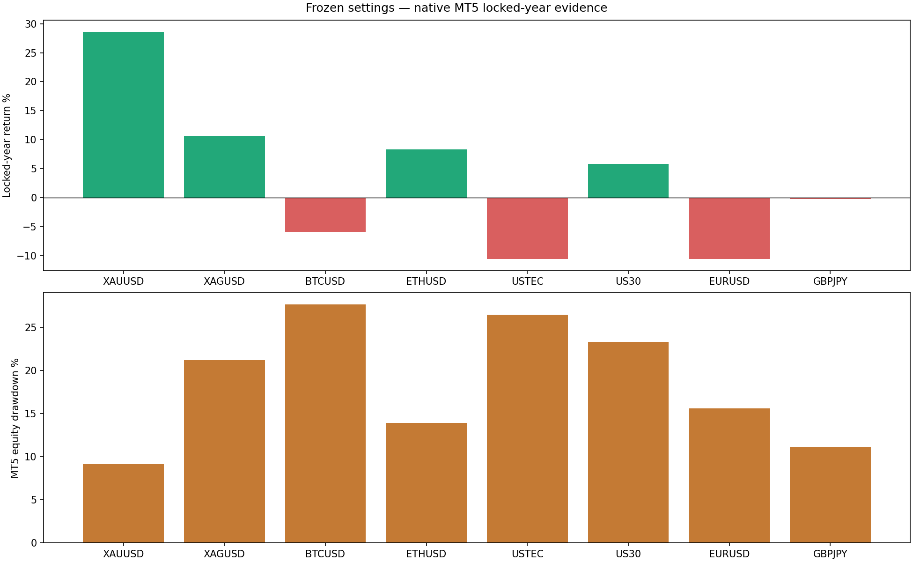
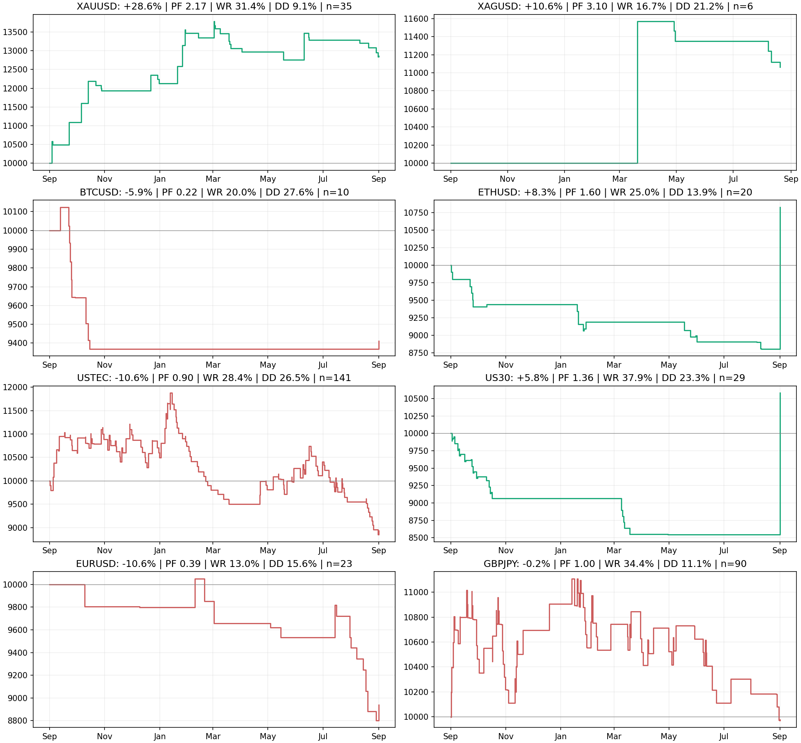
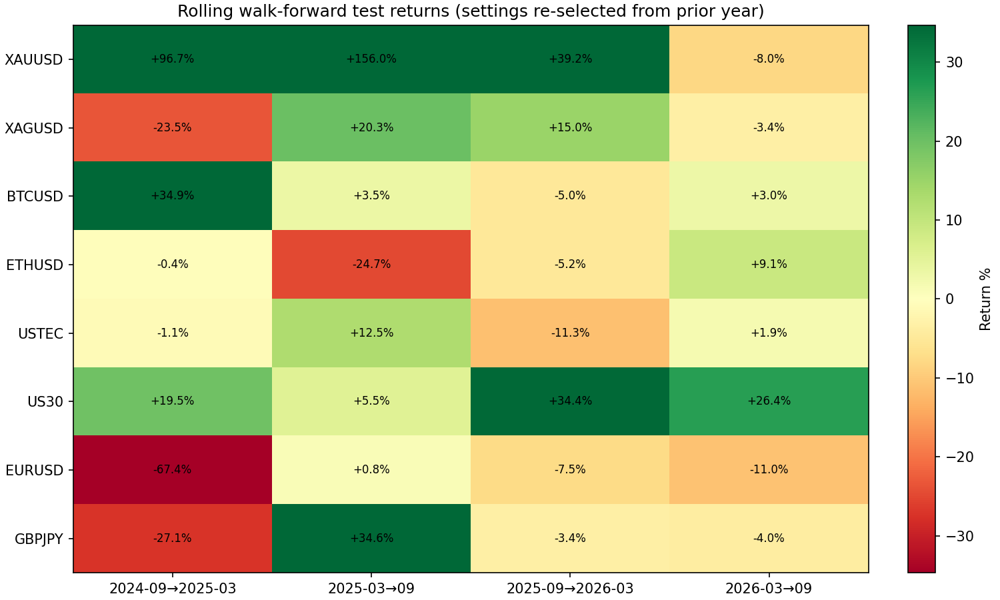
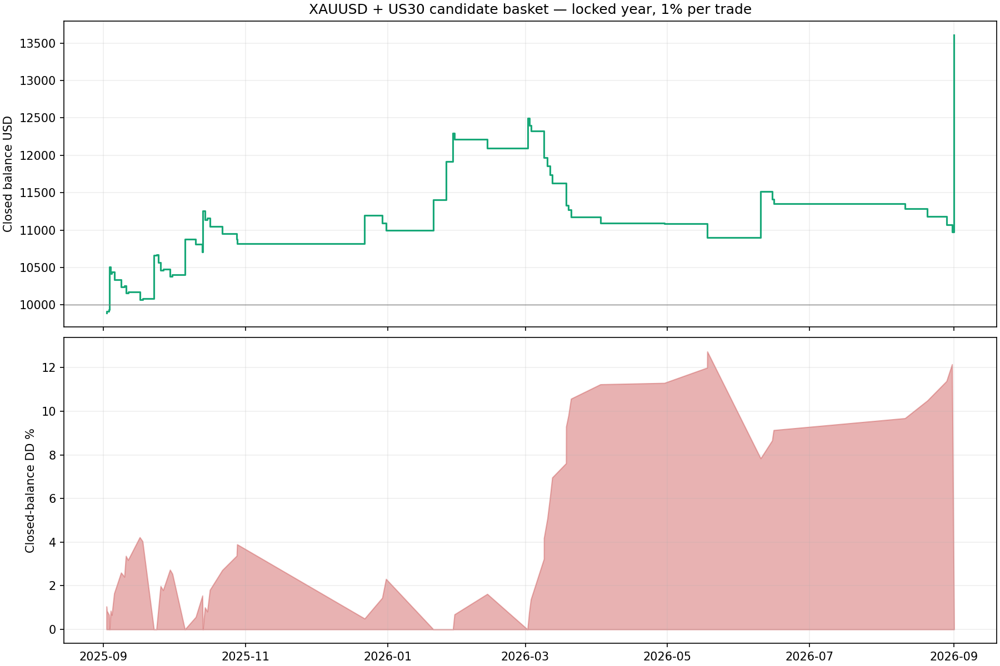
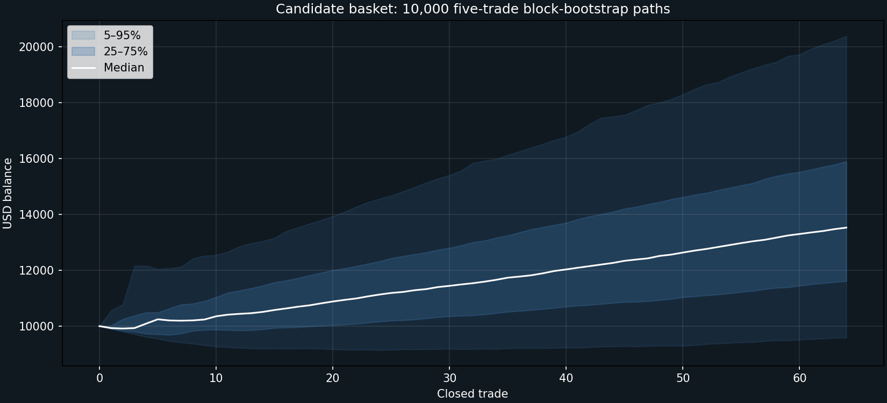
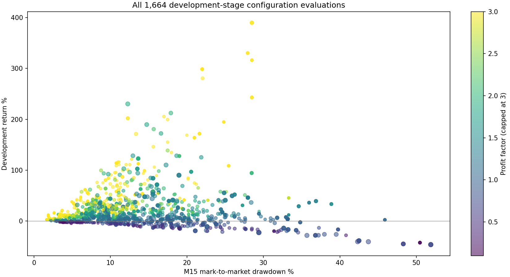

# Step 3 — Slow Multi-Asset Trend Basket

**Original audit decision: retain XAUUSD and US30 as demo-forward-test candidates only.** XAU has the cleanest locked result. US30 is weaker in its single locked year but is the only market with four positive rolling walk-forward folds. XAG is too sparse and suffers high open-equity drawdown; the other five markets fail robustness or the locked year.

**Promotion update — 2026-09-06:** after reviewing these results, the user approved XAUUSD alone for the recommended system. The production build uses the exact frozen H4/EMA100/1.5-ATR/6R/no-trailing configuration at hard-locked 1% risk. US30 and every rejected market remain outside the installer.

## Native MT5 locked-year results

Frozen settings were tested from 2025-09-01 through 2026-09-01 on the isolated Exness demo terminal using generated Every Tick, random execution delay, broker spread, commission and swap. Risk is hard-locked at 1% of current equity. History quality is 99–100%.

| Asset | Decision | Return | PF | Win rate | Equity DD | Trades | Sharpe | Recovery | WF positive folds |
|---|---|---:|---:|---:|---:|---:|---:|---:|---:|
| XAUUSD | Demo candidate | +28.62% | 2.17 | 31.43% | 9.12% | 35 | 2.23 | 2.24 | 3/4 |
| XAGUSD | Watch only: 6 trades / high DD | +10.63% | 3.10 | 16.67% | 21.19% | 6 | 0.05 | 0.36 | 2/4 |
| BTCUSD | Reject | -5.88% | 0.22 | 20.00% | 27.65% | 10 | -0.17 | -0.16 | 3/4 |
| ETHUSD | Reject: 1/4 positive WF folds | +8.28% | 1.60 | 25.00% | 13.93% | 20 | 0.72 | 0.59 | 1/4 |
| USTEC | Reject | -10.64% | 0.90 | 28.37% | 26.46% | 141 | -0.75 | -0.34 | 2/4 |
| US30 | Demo only: high DD at 1% | +5.81% | 1.36 | 37.93% | 23.33% | 29 | 0.19 | 0.22 | 4/4 |
| EURUSD | Reject | -10.61% | 0.39 | 13.04% | 15.61% | 23 | -0.88 | -0.65 | 1/4 |
| GBPJPY | Reject | -0.24% | 1.00 | 34.44% | 11.12% | 90 | -0.02 | -0.02 | 1/4 |

## Frozen configurations

| Asset | TF | Momentum | Trend | Direction | Entry | Stop | Exit | Management |
|---|---|---|---|---|---|---|---|---|
| XAUUSD | H4 | 1-3-6m | ema100 | both | all-day | ATR / 1.5 ATR floor | 6R | none |
| XAGUSD | D1 | 1-3-6m | ema200-rising | both | asia | swing / 1.5 ATR floor | signal reversal | none |
| BTCUSD | H4 | 1m | ema200 | long-only | london | chandelier / 1.5 ATR floor | signal reversal | none |
| ETHUSD | H4 | 3m | none | long-only | london | ATR / 1.5 ATR floor | signal reversal | none |
| USTEC | H4 | 1-3-6m | ema100 | long-only | all-day | chandelier / 1.5 ATR floor | 3R | ATR trail |
| US30 | H4 | 6m | ema200-rising | long-only | london | chandelier / 1.5 ATR floor | signal reversal | M15 50→20 dynamic stop |
| EURUSD | H4 | 1-3-6m | none | both | all-day | swing / 1.5 ATR floor | 60 days | none |
| GBPJPY | H4 | 1m | ema200-rising | both | all-day | chandelier / 1.5 ATR floor | 2R | none |

## Rolling walk-forward

Each fold re-selected a configuration using only the preceding one-year window, then traded the next six months. This is a stronger stability check than the single frozen split. The candidate grid was fixed in advance.

| Asset | Positive folds | Compounded four-fold return | Test trades |
|---|---:|---:|---:|
| XAUUSD | 3/4 | +545.04% | 129 |
| XAGUSD | 2/4 | +2.14% | 33 |
| BTCUSD | 3/4 | +36.60% | 42 |
| ETHUSD | 1/4 | -22.44% | 105 |
| USTEC | 2/4 | +0.58% | 148 |
| US30 | 4/4 | +114.42% | 63 |
| EURUSD | 1/4 | -72.99% | 67 |
| GBPJPY | 1/4 | -9.04% | 209 |

## Three-year native context (not out-of-sample)

These M1-OHLC native runs include the development sample. They describe behavior and costs but must not be presented as independent validation.

| Asset | Return | PF | Win rate | Equity DD | Trades |
|---|---:|---:|---:|---:|---:|
| XAUUSD | +135.62% | 1.95 | 25.55% | 9.20% | 137 |
| XAGUSD | +48.89% | 4.12 | 21.21% | 38.25% | 33 |
| BTCUSD | +200.97% | 2.72 | 26.76% | 27.78% | 71 |
| ETHUSD | +85.64% | 3.73 | 32.35% | 23.17% | 34 |
| USTEC | -21.59% | 0.93 | 29.04% | 32.20% | 427 |
| US30 | +16.50% | 1.85 | 48.78% | 29.71% | 41 |
| EURUSD | +13.59% | 1.22 | 15.71% | 17.12% | 70 |
| GBPJPY | -1.44% | 0.99 | 34.30% | 21.12% | 309 |

## Candidate basket: XAUUSD + US30

Applying the standalone net trade returns chronologically at 1% risk produced +36.10% closed-balance return, PF 1.88, 34.38% wins, 12.73% closed-balance DD, 64 trades, Sharpe 1.03 and recovery 2.83. This reconstructed portfolio DD excludes synchronized intratrade equity and should not replace the larger standalone MT5 equity-DD numbers above.

Monte Carlo (10,000 five-trade block bootstraps): median return +35.22%, P5 -4.09%, P95 +103.76%, median DD 9.72%, DD P95 18.60%, profitable paths 92.13%.

Adding 0.05% extra account cost to every trade changes the reconstructed return to +31.83% and PF to 1.75.

Risk sensitivity is included for research, but the EA and all reported primary tests remain fixed at 1%.

| Risk/trade | Return | PF | Win rate | Closed DD | Trades |
|---:|---:|---:|---:|---:|---:|
| 0.5% | +17.68% | 1.92 | 34.38% | 6.57% | 64 |
| 1.0% | +36.10% | 1.88 | 34.38% | 12.73% | 64 |
| 1.5% | +55.06% | 1.85 | 34.38% | 18.52% | 64 |

## Evidence limitations

- XAUUSD produced a real-tick comparison, but MT5 reported only 66% history quality. Its partial result (+32.49%, PF 2.21, 31.58% wins, 9.46% DD, 38 trades) is corroborative only—not the primary full-year result.
- XAGUSD and US30 real-tick synchronization did not finish within the five-minute safety bounds. ETH/BTC real ticks were already unavailable in the immediately preceding pairs study, so no fresh real-tick claim is made.
- The broad screen uses recorded M15 bid OHLC and spread floors plus conservative friction; native MT5 results supersede screen estimates.
- Session labels use the research terminal clock. They must be remapped if a broker uses a different server offset.
- The fixed 1% risk produced 23.33% native equity DD on US30. Because risk must remain at 1%, US30 stays in demo rather than weakening the risk rule to make it look safer.
- Backtests and Monte Carlo are not forecasts or guarantees.

## Files

- `native-summary.csv`: final per-market table.
- `all-screen-results.csv`: every development configuration result.
- `selection-lock.json`: frozen inputs selected before the corrected validation pass.
- `walk-forward.json`: fold-by-fold re-selection and tests.
- `portfolio-summary.json`: reconstructed basket trades, stress and Monte Carlo summary.
- `EA/Calyx Slow Trend EA.mq5`: promoted live/demo-capable EA; the active portfolio uses the separate locked SET with magic 969060311 and 1% risk.

