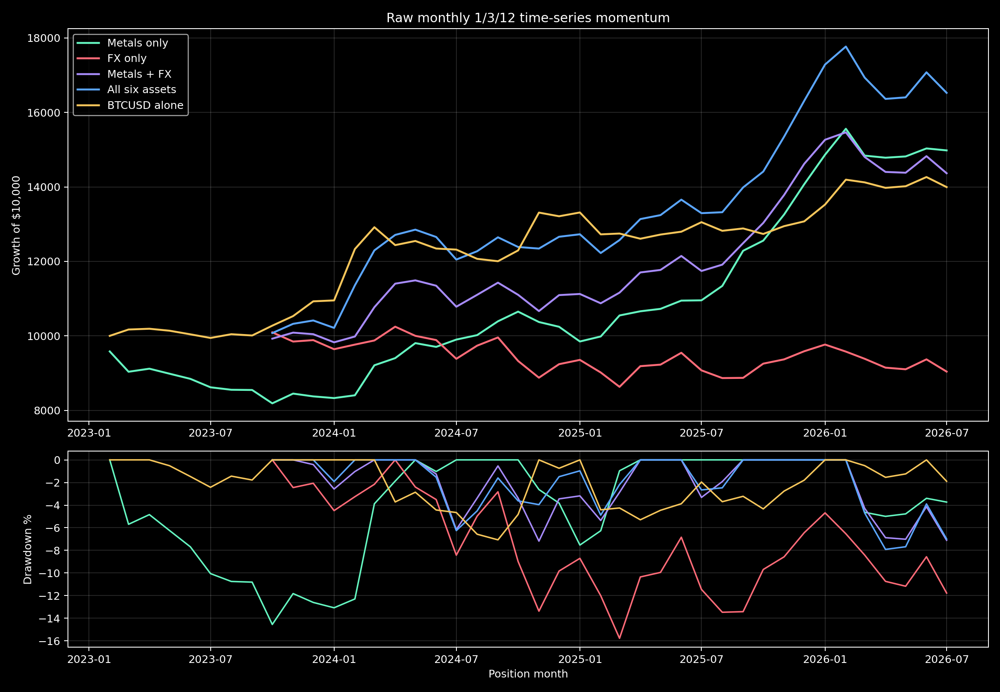

# Time-Series Momentum — raw monthly test

**Decision: RESEARCH ONLY. No EA, website, BAT or recommended portfolio was changed.**

The test uses the paper's unoptimized 1/3/12-month vote, trades both directions, rebalances monthly, equal-risks markets and targets 10% annualized portfolio volatility. It deliberately has no EMA, session, stop, target, trailing exit or direction filter.

## Portfolio results — observed spread

| Portfolio | Window | Return | Annualized | PF | Win months | Max DD | Sharpe | Months |
|---|---|---:|---:|---:|---:|---:|---:|---:|
| Metals only | Full common history | +49.82% | +12.24% | 2.19 | 59.52% | 18.12% | 1.03 | 42 |
| Metals only | Latest 12 months | +36.77% | +36.77% | 7.05 | 75.00% | 4.99% | 2.58 | 12 |
| FX only | Full common history | -9.60% | -3.50% | 0.83 | 52.94% | 15.77% | -0.27 | 34 |
| FX only | Latest 12 months | -0.37% | -0.37% | 1.00 | 50.00% | 7.44% | -0.00 | 12 |
| Metals + FX | Full common history | +43.68% | +13.64% | 2.19 | 61.76% | 7.18% | 1.14 | 34 |
| Metals + FX | Latest 12 months | +22.35% | +22.35% | 3.06 | 66.67% | 7.11% | 1.68 | 12 |
| All six assets | Full common history | +65.28% | +19.40% | 2.85 | 70.59% | 7.91% | 1.43 | 34 |
| All six assets | Latest 12 months | +24.31% | +24.31% | 3.02 | 75.00% | 7.91% | 1.64 | 12 |
| BTCUSD alone | Full common history | +39.96% | +10.08% | 2.51 | 59.52% | 7.07% | 0.99 | 42 |
| BTCUSD alone | Latest 12 months | +7.22% | +7.22% | 2.14 | 58.33% | 2.42% | 0.99 | 12 |

## Individual markets — full common history

Each market below is volatility-scaled to a 10% annualized target. These are monthly return observations, not ordinary SL/TP trades.

| Asset | Broker archive | Return | Annualized | PF | Win months | Max DD | Sharpe | Direction changes |
|---|---|---:|---:|---:|---:|---:|---:|---:|
| XAUUSD | Exness-MT5Trial16 | +57.34% | +13.83% | 3.18 | 61.90% | 8.03% | 1.36 | 9 |
| XAGUSD | Exness-MT5Trial16 | +26.90% | +7.04% | 1.85 | 42.86% | 13.21% | 0.70 | 15 |
| EURUSD | Exness-MT5Trial16 | -5.06% | -1.47% | 0.89 | 42.86% | 13.33% | -0.16 | 17 |
| GBPUSD | JustMarkets demo | -7.21% | -2.53% | 0.79 | 45.71% | 8.24% | -0.30 | 15 |
| USDJPY | JustMarkets demo | -10.77% | -3.83% | 0.72 | 48.57% | 16.66% | -0.39 | 8 |
| BTCUSD | Exness-MT5Trial16 | +39.96% | +10.08% | 2.51 | 59.52% | 7.07% | 0.99 | 11 |

## Evidence boundary

- The common portfolio test contains only 34 months after the required 12-month warm-up; this is a useful local transfer test, not proof of the century result.
- The paper uses futures and currency forwards. Spot CFD prices omit roll yield and forward carry.
- Historical overnight financing is unavailable. The BTC result is therefore displayed separately and is not deployable evidence.
- GBPUSD and USDJPY use the available JustMarkets archive; the other instruments use Exness. A single-broker native MT5 validation is required before promotion.
- A separate stress file adds five basis points per one-way unit of turnover on top of recorded spread.

## Next gate

Review the raw result first. Only if it is acceptable should we compile a native MT5 EA, obtain longer same-broker history, or run the normal optimization pipeline.
