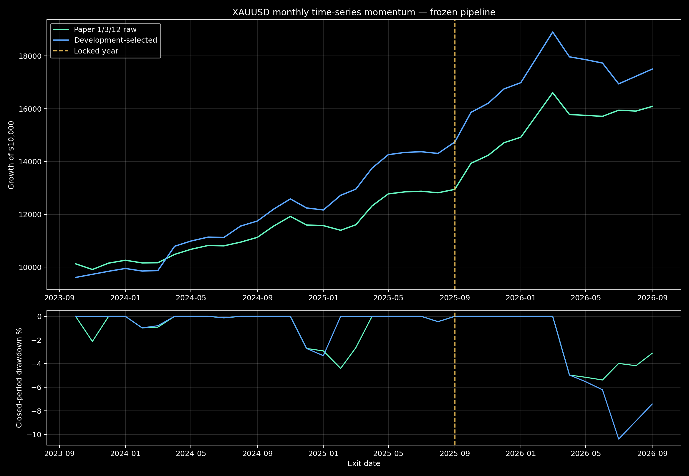
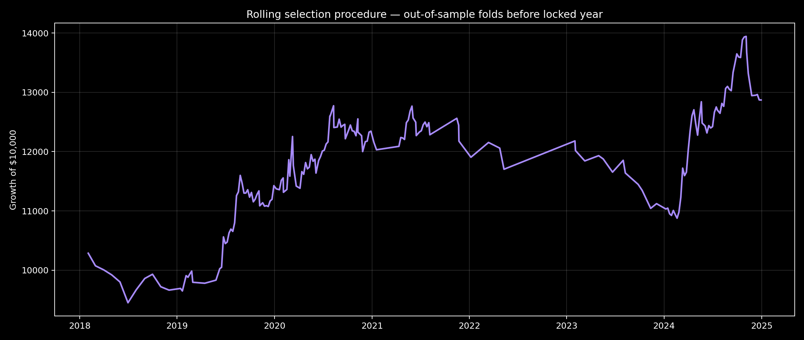

# XAUUSD Time-Series Momentum — focused pipeline

**Decision: REJECT / RESEARCH ONLY. No EA, website, BAT, recommended portfolio or live MT5 profile was changed.**

## Frozen result

The development-only screen evaluated **672** bounded configurations, selected `{"aggregation": "majority", "direction": "long-only", "frequency": "monthly", "horizons": [1, 6, 12], "management": "rebalance", "trend": "none"}`, wrote a cryptographic selection lock, and only then evaluated 2025-09-01 through 2026-09-01.

| Version | Sample | Return | PF | Win rate | Closed DD | Sharpe | Trades | Max win/loss streak |
|---|---|---:|---:|---:|---:|---:|---:|---:|
| Paper 1/3/12 raw | development | +7.54% | 1.11 | 50.00% | 22.75% | 0.13 | 126 | 5/5 |
| Paper 1/3/12 raw | locked | +24.25% | 5.01 | 66.67% | 5.39% | 1.95 | 12 | 6/3 |
| Paper 1/3/12 raw | three year context | +60.87% | 4.56 | 69.44% | 5.39% | 1.87 | 36 | 7/3 |
| Frozen selected | development | +91.28% | 1.95 | 53.57% | 14.11% | 0.73 | 84 | 6/4 |
| Frozen selected | locked | +18.74% | 2.69 | 63.64% | 10.39% | 1.35 | 11 | 6/4 |
| Frozen selected | three year context | +75.02% | 3.98 | 70.59% | 10.39% | 1.78 | 34 | 7/4 |

## Locked cost and execution stress

| Test | Return | PF | DD |
|---|---:|---:|---:|
| Recorded spread | +18.74% | 2.69 | 10.39% |
| +5 bp each way | +18.11% | 2.61 | 10.53% |
| Double recorded spread | +18.72% | 2.69 | 10.39% |

## Walk-forward procedure

The rolling optimization procedure produced **3/7 positive untouched annual folds** before the final locked year. Combined OOS return was +28.71%, PF 1.27, DD 14.84% and Sharpe 0.47.

## Monte Carlo and neighborhood

Locked 10,000-path block bootstrap: return P5 -8.41%, median +17.45%, P95 +49.22%; DD P95 16.89%; profitable paths 85.79%.
**100.00%** of the 14 one-parameter neighbors were profitable in the locked year.

## Existing XAU Slow Trend comparison

The current native XAU Slow Trend locked year remains +28.62% return, PF 2.17, 31.43% wins, 9.12% equity DD and 35 trades. Its three-year native context is +135.62%, PF 1.95 and 9.20% DD. This is not a clean return race: Slow Trend risks 1% to its stop, while this paper transfer targets 10% annualized volatility and is evaluated from Exness D1 bars.

## Gate

- FAIL: fewer than 5/7 positive walk-forward folds
- FAIL: locked Monte Carlo return P5 <= 0

## Evidence limits

- Historical swap and financing cash flows are unavailable and are not reconstructed.
- Daily bars cannot order an intraday stop and target; ambiguous candles are resolved stop-first.
- Drawdown is measured on completed rebalance-period returns and can understate intraperiod equity drawdown.
- The paper uses futures/forwards; this is an Exness spot-CFD transfer.
- The candidate family is bounded but still data-mined; the final locked year and walk-forward procedure are the decision evidence.
- No MQL5 EA or native Every Tick validation is created unless this gate passes and the user reviews it.

## Files

- `selection-lock.json`: frozen choice and hash.
- `pipeline-results.json`: complete metrics, folds, stresses and neighbors.
- `development-top-25.csv`: ranked development-only finalists.
- `selected-trades.csv` and `paper-baseline-trades.csv`: auditable period ledgers.
- `walk-forward-folds.csv`: pre-lock rolling-selection results.
