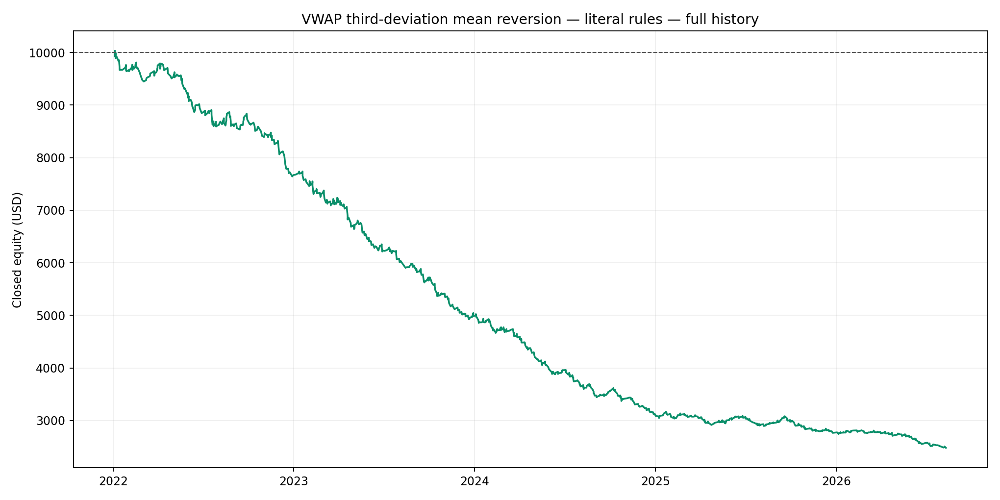
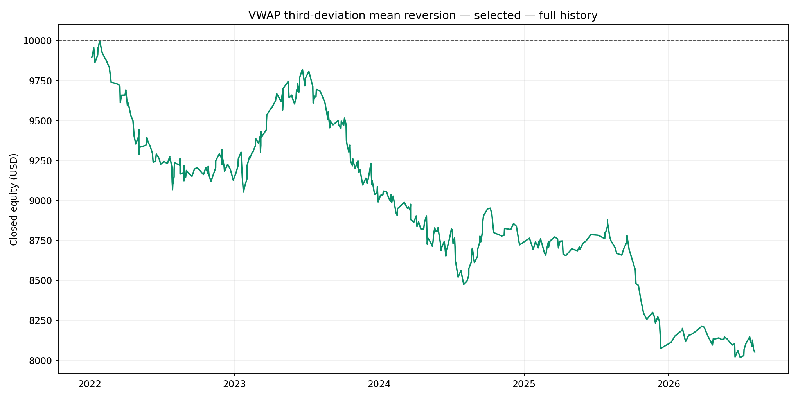
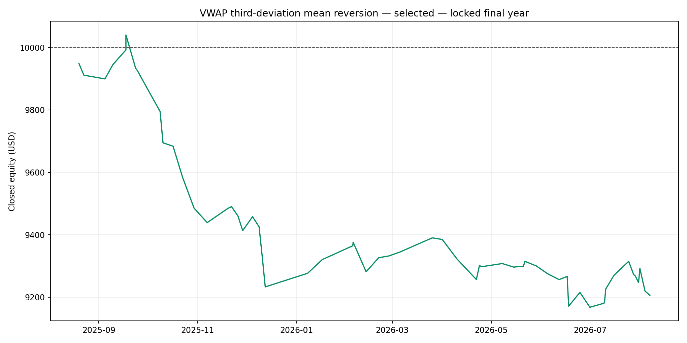

# VWAP third-standard-deviation mean-reversion validation

## Decision: REJECT

### Literal advertised rules

RTH VWAP beginning 09:30 New York, entry at the third volume-weighted standard-deviation band, moving central VWAP target, stop twice the initial target distance (0.50 reward-to-risk), and up to three separately rearmed touches per day.

| Period | Return | Annualized | PF | Win rate | Closed DD | Trades |
|---|---:|---:|---:|---:|---:|---:|
| development | -69.12% | -32.45% | 0.53 | 58.26% | 69.21% | 781 |
| validation | -6.07% | -9.79% | 0.84 | 66.07% | 8.29% | 168 |
| locked | -14.40% | -14.41% | 0.74 | 60.85% | 19.57% | 235 |
| full | -75.20% | -26.14% | 0.57 | 59.85% | 75.28% | 1183 |

For diagnosis only, with spread, commission and slippage all removed:

| Period | Return | Annualized | PF | Win rate | Closed DD | Trades |
|---|---:|---:|---:|---:|---:|---:|
| development | -28.42% | -10.56% | 0.85 | 64.25% | 29.03% | 884 |
| validation | +1.60% | +2.65% | 1.04 | 69.14% | 6.38% | 175 |
| locked | +6.15% | +6.15% | 1.11 | 67.31% | 5.96% | 260 |
| full | -22.79% | -5.46% | 0.91 | 65.50% | 30.44% | 1319 |

### Strongest configuration selected before the locked year

**Electronic day 18:00 NY**, **3.50σ** entry, **0.50 reward-to-risk**, **fixed entry-time VWAP**, maximum **3 trade(s) per day**.

| Period | Return | Annualized | PF | Win rate | Closed DD | Trades |
|---|---:|---:|---:|---:|---:|---:|
| development | -12.78% | -4.46% | 0.81 | 51.53% | 15.25% | 295 |
| validation | +0.26% | +0.43% | 1.04 | 50.00% | 1.49% | 38 |
| locked | -7.94% | -7.94% | 0.50 | 44.07% | 8.69% | 59 |
| full | -19.48% | -4.60% | 0.78 | 50.26% | 19.82% | 392 |

Across all 108 variations, 0 were profitable in development, 29 were profitable in validation, and 0 were profitable in both. Therefore no parameter set had repeatable positive pre-lock evidence.

## Method and execution assumptions

- Exness US500 M1 data from 2022-01-03 through 2026-08-10; New York daylight-saving changes are handled by the IANA timezone database.
- Volume-weighted session VWAP and population standard deviation use only completed prior minutes. Broker tick volume is used because an OTC CFD has no centralized exchange volume.
- A lower-band buy fills only when ask reaches the limit; an upper-band sell fills when bid reaches it. Actual recorded M1 spread is used, with the broker-history median substituted only where spread is recorded as zero.
- Exness Zero commission of $0.50/lot/side and 0.25 US500 point of adverse slippage on stop/time exits are included. No same-minute target is credited after an entry because M1 OHLC cannot prove event order.
- Initial balance is $10,000. Stop risk is 1% of current equity before costs, rounded down to the broker's 0.01 lot step and subject to its 0.14 minimum lot.
- Entries are permitted from 10:00 through 15:29 New York and all positions are closed by 15:55. A new touch requires price to re-enter the ±2σ area.
- Development ended 2024-12-31, validation ran through 2025-08-10, and 2025-08-11 through 2026-08-10 remained locked until selection.

## Files

- `Results/development-validation-grid.csv`: all 108 configurations.
- `Results/literal-summary.csv`, `Results/literal-zero-cost-summary.csv`, and `Results/selected-summary.csv`: period statistics.
- `Results/literal-full-trades.csv`, `Results/selected-full-trades.csv`, and `Results/selected-locked-trades.csv`: trade ledgers.
- `Results/selection.json`: selected rules and execution assumptions.
- `research_vwap_third_deviation.py`: reproducible research runner.

The active BAT installer was not changed.
