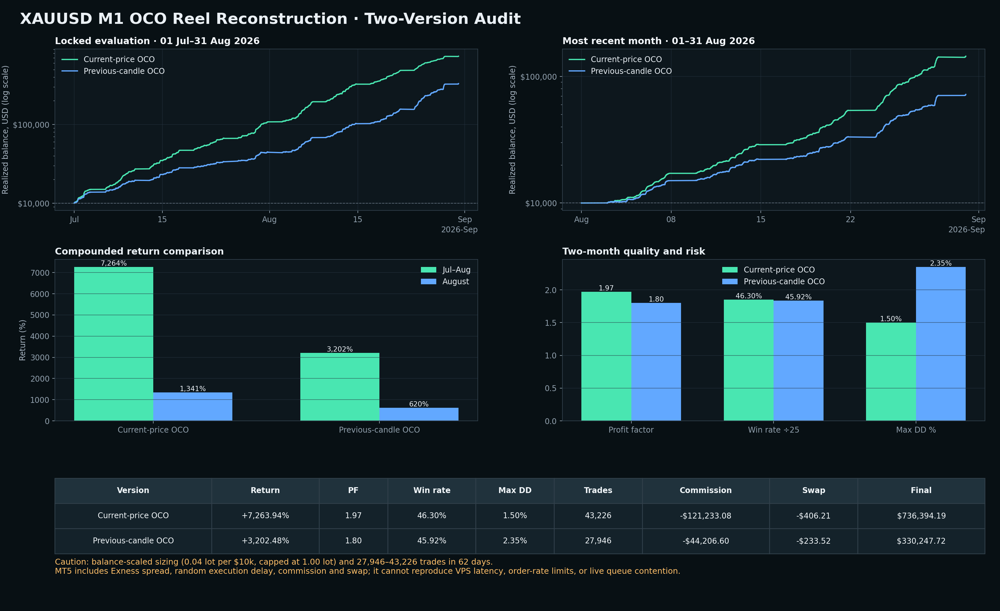

# XAUUSD M1 OCO reel reconstruction — two-version audit

## Decision

The **current-price OCO version wins the MT5 comparison** on return, profit factor and drawdown. It is not yet suitable for a real-money BAT deployment: it executed **43,226 trades in 62 calendar days** and charged -$121,233.08 in commission. That frequency makes the result unusually dependent on broker execution, VPS latency and order-rate tolerance.

If you want to trial one, use the current-price version **on demo only**. The previous-candle version is slower and cheaper, but it still executed 27,946 trades in two months.

## Locked 01 July–31 August 2026

| Version | Return | Final | PF | Win rate | Max equity DD | Wins / losses | Trades | Gross profit | Gross loss | Commission | Swap | Largest win | Largest loss | Average win | Average loss |
|---|---:|---:|---:|---:|---:|---:|---:|---:|---:|---:|---:|---:|---:|---:|---:|
| Current-price OCO | +7,263.94% | $736,394.19 | 1.97 | 46.30% | 1.50% | 20,012 / 23,214 | 43,226 | $1,478,085.16 | -$751,690.97 | -$121,233.08 | -$406.21 | $1,683.50 | -$1,611.05 | $73.86 | -$27.16 |
| Previous-candle OCO | +3,202.48% | $330,247.72 | 1.80 | 45.92% | 2.35% | 12,833 / 15,113 | 27,946 | $721,715.07 | -$401,467.35 | -$44,206.60 | -$233.52 | $1,726.10 | -$752.56 | $56.24 | -$23.64 |

## August 2026 alone

| Version | Return | Final | PF | Win rate | Max equity DD | Wins / losses | Trades | Gross profit | Gross loss | Commission | Swap | Largest win | Largest loss | Average win | Average loss |
|---|---:|---:|---:|---:|---:|---:|---:|---:|---:|---:|---:|---:|---:|---:|---:|
| Current-price OCO | +1,341.00% | $144,100.34 | 2.17 | 46.87% | 0.88% | 9,736 / 11,038 | 20,774 | $249,152.85 | -$115,052.51 | -$18,916.42 | -$72.17 | $824.91 | -$902.19 | $25.59 | -$8.71 |
| Previous-candle OCO | +619.54% | $71,953.61 | 1.89 | 46.94% | 1.38% | 6,311 / 7,135 | 13,446 | $131,886.48 | -$69,932.87 | -$7,812.62 | -$40.72 | $397.01 | -$157.79 | $20.90 | -$8.71 |

## Exact winning rules

### Version A — current-price OCO

- On every new M1 bar while flat, place a Buy Stop at ask + **$0.40** and a Sell Stop at bid − **$0.40**.
- When either entry fills, cancel its sibling immediately (one-cancels-other).
- Initial stop: **$0.50** from entry; no fixed take-profit.
- Start trailing after **$0.80** favorable movement; trail **$0.45** behind price.
- Refresh unfilled orders each new M1 bar, reject spread above **$0.50**, and force-close after 180 minutes.

### Version B — previous-candle OCO

- On every new M1 bar while flat, place stops **$0.05** beyond the completed M1 candle high and low, respecting the broker minimum distance.
- Initial stop: **$0.80**; no fixed take-profit.
- Start trailing after **$1.20** favorable movement; trail **$0.60** behind price.
- The same OCO, spread, refresh and maximum-hold rules apply.

### Dynamic lot sizing

`lot = 0.04 × current equity / $10,000`, normalized to the broker step and capped between **0.01 and 1.00 lot**. Thus the default is 0.04 lot on a $10,000 account and it scales up or down with equity.

## Method

- Broker/data: Exness XAUUSD, MT5 **Every Tick**, 100% reported history quality.
- Initial balance: $10,000; leverage 1:2000.
- Costs: broker spread, commission and swap; randomized execution delay enabled.
- Candidate selection: 01 April–30 June 2026 only.
- Untouched evaluation: 01 July–31 August 2026; August also reported separately.
- One open position maximum; no grid and no martingale.
- Custom curves show realized account balance from every deal. MT5 max equity drawdown statistics include floating equity.

## Development screen (not headline performance)

| Mode | Candidate | Return | PF | Win rate | Max equity DD | Trades |
|---|---|---:|---:|---:|---:|---:|
| Current-price OCO | literal-fixed | +26,377.66% | 2.36 | 50.24% | 0.80% | 66,763 |
| Current-price OCO | balanced-fixed | +18,055.21% | 1.82 | 47.27% | 2.53% | 52,242 |
| Current-price OCO | atr-liquid-session | +27.62% | 1.06 | 40.06% | 6.08% | 8,163 |
| Current-price OCO | atr-impulse-volume | +16.91% | 1.02 | 38.96% | 11.18% | 15,883 |
| Current-price OCO | atr-adaptive | +11.60% | 1.01 | 39.57% | 18.67% | 30,875 |
| Previous-candle OCO | fixed-dollar | +17,992.15% | 2.01 | 49.92% | 2.47% | 44,172 |
| Previous-candle OCO | candle-range-stop | +10,419.17% | 1.57 | 63.85% | 3.47% | 32,882 |
| Previous-candle OCO | atr-adaptive | +321.31% | 1.14 | 43.30% | 5.93% | 22,393 |
| Previous-candle OCO | atr-impulse-volume | +147.91% | 1.20 | 43.57% | 2.75% | 9,777 |
| Previous-candle OCO | atr-liquid-session | +67.87% | 1.16 | 42.83% | 5.07% | 5,949 |

The spectacular fixed-distance returns should not be read as a promise. They arise from a tiny stop/trail, very high transaction count, and dynamic compounding. MT5 captured historical spread, delay and account charges, but no backtest can reproduce live network latency, rejection bursts, server throttling or simultaneous OCO fills perfectly.

## Engineering references

- MQL5 requires checking the server result when deleting a pending order: [CTrade::OrderDelete](https://www.mql5.com/en/docs/standardlibrary/tradeclasses/ctrade/ctradeorderdelete).
- OCO cleanup is handled through trade-transaction events: [OnTradeTransaction](https://www.mql5.com/en/docs/event_handlers/ontradetransaction).
- Pending-order rules and broker distance constraints: [MQL5 pending orders](https://www.mql5.com/en/book/automation/experts/experts_pending).
- Opening-range evidence supports testing but does not validate this exact reel strategy: [Assessing profitability of intraday opening range breakout strategies](https://www.sciencedirect.com/science/article/pii/S1544612312000438).

## Deployment status

Research only. Neither EA was added to the active portfolio BAT or the website.
