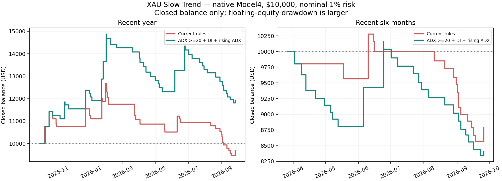

# XAU Slow Trend — account diagnosis and filter comparison

Research date: 29 September 2026. No live changes, installation, website update or orders.

## Outcome

The frozen selection was **ADX >=20 + DI + rising ADX**. Does not improve both recent windows. At least one recent window loses: not a deployment candidate.

This is a focused eleven-version filter/re-entry study, not the full optimization/Monte Carlo/promotion pipeline. Risk and exits were not optimized.

## What actually happened on the active account

- Connected normal MT5: Exness-MT5Trial15 **demo**, USD, account ending 7938; XAUUSD; magic 969060311, comment `Calyx slow trend`.
- Snapshot 2026-09-29T13:13:24.938080+00:00: **7 entries, 6 fully closed positions and 1 open** since the first available matching entry on 21 September. Closed net **$403.40**; all six closed positions involved manual desktop/mobile exits (one partial-close pair). These profits are from **bot entries plus your manual exits**, not unattended EA performance. The open position is excluded.
- On 23 September a short closed at **13:04:21 UTC** and another short opened at **13:04:23 UTC**. The preceding entry was on 22 September at 04:00:02, so more than 24 hours had already passed.
- Source permits one position but checks cooldown from **last entry**, not last close; its monthly momentum remains valid across many H4 candles. A manual close does not clear that signal or request a pause. Therefore an immediate replacement is permitted once the old entry is over 24h old. This is not evidence of multiple simultaneous positions or a new independent signal every time.
- The open trade's stop distance was 52.581 gold-price units, closed-H4 ATR14 was 35.053786, and target distance 315.484: consistent with **1.5ATR stop / 6R target**. All three momentum votes were bearish.

## Baseline identity and execution assumptions

Saved chart/SET specifies H4, 1/3/6-month momentum majority, EMA100 trading days (=600 H4 bars), ATR14 x1.5 stop, 6R TP, both directions, no trail, 1% current-equity risk rounded upward, minimum lot permitted, and original 24h entry-to-entry cooldown. Portfolio adaptation is off for the standalone test.

Saved chart still names XAUUSDr while actual trades are XAUUSD; Python MT5 cannot read active chart input values. Treat saved settings as an assumption, corroborated by the live trade geometry, not an exhaustive live configuration readout. Installed EX5 is older and its hash differs from repository EX5. We tested a copy of that installed binary: **all 38 trade records exactly matched the current-source research clone with filters off** on 2025-09-27 to 2026-09-27, Model1. That is bounded parity, not proof of identical code under every possible condition.

All new backtests: isolated **Exness-MT5Trial16**, XAUUSD CFD, USD10,000 starting balance, 1% nominal risk, 150ms delay, broker spread/swap/commission. The live account is Trial15: same broker but a different demo server/account, not exact live fills. Existing account deposits, other bots, interventions and account-wide risk are not replayed. Minimum-lot rounding can exceed nominal risk. End dates below are exclusive. Current six-month website screenshot ends 2026-09-05, so its -7.13% is not the same window as these new tests.

## Recent native confirmation — one year

2025-09-27 to 2026-09-27. Native Model4, real ticks where available and platform-generated fallback where not. Recent baseline was already seen in parity; this is **not an untouched holdout**.

| Version | Return | PF | Equity DD | Win rate | Trades / month / weekday | Max W / L streak |
|---|---:|---:|---:|---:|---:|---:|
| Current rules | -3.23% | 0.94 | 29.97% | 17.95% | 39 / 3.25 / 0.150 | 2 / 14 |
| ADX >=20 + DI + rising ADX | +19.10% | 1.31 | 22.17% | 22.22% | 45 / 3.75 / 0.173 | 3 / 15 |

## Recent native confirmation — six months

2026-03-27 to 2026-09-27. Native Model4; overlapping subset of the year, not independent validation.

| Version | Return | PF | Equity DD | Win rate | Trades / month / weekday | Max W / L streak |
|---|---:|---:|---:|---:|---:|---:|
| Current rules | -12.14% | 0.43 | 20.23% | 10.53% | 19 / 3.14 / 0.145 | 1 / 14 |
| ADX >=20 + DI + rising ADX | -15.92% | 0.47 | 18.52% | 11.54% | 26 / 4.30 / 0.198 | 2 / 15 |

## Development comparison — all eleven versions

2021-09-27 to 2024-09-27, native Model1 OHLC screen. Generated ticks; fast screening evidence, not real-tick execution proof. All thresholds and selection rules were fixed before the screen.

| Version | Return | PF | Equity DD | Win rate | Trades / month / weekday | Max W / L streak |
|---|---:|---:|---:|---:|---:|---:|
| Current rules | -1.02% | 0.99 | 34.23% | 17.53% | 154 / 4.28 / 0.196 | 2 / 22 |
| DI agreement | +20.94% | 1.15 | 29.94% | 18.92% | 148 / 4.11 / 0.189 | 2 / 28 |
| ADX >=20 | +9.53% | 1.07 | 27.60% | 18.49% | 146 / 4.05 / 0.186 | 4 / 21 |
| ADX >=25 | +8.49% | 1.07 | 26.34% | 18.44% | 141 / 3.92 / 0.180 | 3 / 20 |
| ADX >=20 + DI | +26.69% | 1.21 | 28.45% | 20.15% | 134 / 3.72 / 0.171 | 3 / 23 |
| ADX >=25 + DI | +28.63% | 1.25 | 17.50% | 20.51% | 117 / 3.25 / 0.149 | 3 / 14 |
| ADX >=20 + DI + rising ADX | +34.48% | 1.32 | 19.66% | 21.82% | 110 / 3.05 / 0.140 | 3 / 17 |
| Wait 24h after exit | +20.48% | 1.16 | 24.30% | 19.40% | 134 / 3.72 / 0.171 | 3 / 17 |
| Wait for fresh momentum signal | -1.98% | 0.96 | 21.18% | 16.33% | 49 / 1.36 / 0.062 | 3 / 12 |
| ADX >=20 + DI + wait 24h | +24.53% | 1.20 | 18.29% | 20.16% | 124 / 3.44 / 0.158 | 3 / 16 |
| ADX >=20 + DI + fresh signal | -4.36% | 0.89 | 22.71% | 15.91% | 44 / 1.22 / 0.056 | 3 / 10 |

## Separate validation — frozen finalists

2024-09-27 to 2025-09-27, native Model1. Best three eligible development return/DD ratios advanced; selection required >=10 validation trades, positive return and PF>=1.1, then ranked return/DD.

| Version | Return | PF | Equity DD | Win rate | Trades / month / weekday | Max W / L streak |
|---|---:|---:|---:|---:|---:|---:|
| ADX >=20 + DI + wait 24h | +23.99% | 1.85 | 7.40% | 29.03% | 31 / 2.59 / 0.119 | 2 / 5 |
| ADX >=20 + DI + rising ADX | +38.16% | 2.42 | 7.49% | 33.33% | 30 / 2.50 / 0.115 | 2 / 5 |
| ADX >=25 + DI | +33.70% | 1.93 | 9.33% | 28.21% | 39 / 3.25 / 0.149 | 2 / 6 |
| Current rules | +27.52% | 1.64 | 14.55% | 25.00% | 48 / 4.00 / 0.184 | 3 / 8 |

## Filter definitions and the manual-close problem

All indicator decisions use **closed H4 candles**. Native iADX(14): ADX strength >=20 or25; direction agreement is +DI>-DI for a buy and -DI>+DI for a sell. Rising means ADX[1]>ADX[2]. Original stop/target, direction and sizing do not change.

ADX/DI is an **entry-quality filter**, not a manual override. It can still permit a replacement immediately after a manual close. The targeted operational remedy is a persisted manual-close pause (e.g. block until the next H4 close, 24h after manual close, or explicit manual re-arm), identifying the bot by original position ID even when the closing deal has magic0. That remains a recommendation, not installed code.

The historical cooldown comparisons wait24h after **any full exit** (including SL/TP); the fresh-signal comparison waits until the original momentum signal changes after the exit. They are not the same as manual-only lockouts. We cannot assign a trustworthy profit improvement to a manual-only pause without specifying a reproducible manual-exit rule. Fresh-signal locking substantially reduced trade count but failed the development profit requirement.

Keep risk/exit research separate from entry filtering. The current 6R target and slow monthly signal can hold trades through large adverse moves; promising ADX results do not certify this stop/exit design or guarantee future profitability.

## Evidence checks and limits

- 21 completed native tests; 11 distinct parameter versions including baseline; installed-versus-source parity counted as a separate execution, not a new parameter choice.
- Every tested source/include hash stayed frozen. Clean research compile: zero errors/warnings. All reports checked for symbol, expert, dates and every input; all closed-deal cash totals reconcile. Independent ledger audit checks prices/contract-size P&L, no overlap, entry-to-entry minimum24h and post-exit24h where enabled.
- DD is native maximum relative **equity** drawdown, not a closed-balance proxy. Plot below is explicitly closed balance, so it omits floating excursions. Rates use calendar-month equivalents and Mon-Fri weekdays, not exact broker sessions. Win/loss streaks use cost-inclusive net cash.
- Trade counts are small, especially recent six-month results. Older strategy-development history has been used in previous research; even new filter splits do not erase that prior exposure. Selection across eleven versions inflates optimism; no Monte Carlo, multiple-testing-adjusted significance, independent-broker validation or forward test completed here.
- Each window starts flat with $10,000 and ends with tester liquidation of any remaining position; six-month results are a fresh simulation, not merely the last half of the yearly balance curve.
- Historical swaps are tester broker specifications, not a verified point-in-time schedule. Generated ticks and modeled150ms delay cannot reproduce all real slippage.
- Execution log flags: no invalid stops/volume, insufficient funds, stop-outs or market-closed errors detected.

Retained tick-coverage messages:

- XAUUSD : real ticks begin from 2026.01.01 00:00:00
- XAUUSD : real ticks begin from 2026.01.01 00:00:00
- XAUUSD : real ticks begin from 2026.01.01 00:00:00
- XAUUSD : real ticks begin from 2026.01.01 00:00:00
- XAUUSD : real ticks begin from 2026.01.01 00:00:00
- XAUUSD : real ticks begin from 2026.01.01 00:00:00
- XAUUSD : real ticks begin from 2026.01.01 00:00:00
- XAUUSD : real ticks begin from 2026.01.01 00:00:00

Sources: [official native ADX buffers](https://www.mql5.com/en/docs/indicators/iadx); [official deal reasons and position IDs](https://www.mql5.com/en/docs/constants/tradingconstants/dealproperties); [real/generated tick behavior](https://www.metatrader5.com/en/terminal/help/algotrading/tick_generation). Account diagnosis comes from the local deal ledger, not the webpage screenshot.

## Closed-balance comparison

Local evidence: `PROTOCOL.md`, `BUILD.json`, `PARITY.json`, `SELECTION.json`, `AUDIT.json`, `account-audit.json`, and per-case native reports/deal ledgers in `native/`. Private tester configurations and account deal files are not packaged or published. Normal MT5 and production packages were left untouched.
