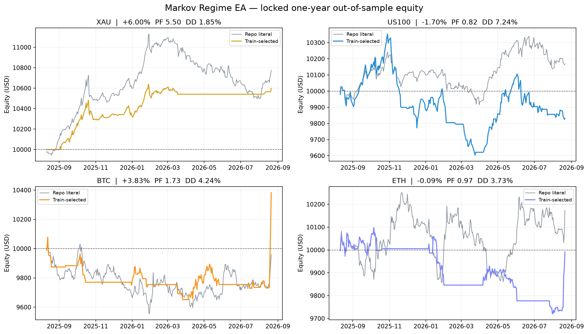
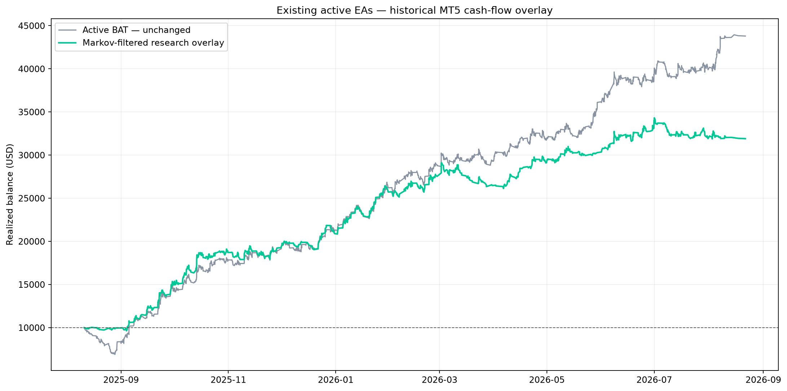

# Markov Regime EA — research and validation report

**Locked test:** 2025-08-11 to 2026-08-21  
**Initial balance:** $10,000 per standalone asset  
**Risk:** 1% of current balance per standalone trade  
**Selection rule:** parameters were selected only on the training period ending 2025-08-10.

## Standalone out-of-sample results

| Asset | Return | PF | Win rate | Max equity DD | Trades | Final |
|---|---:|---:|---:|---:|---:|---:|
| XAU | +6.00% | 5.50 | 70.00% | 1.85% | 10 | $10,599.63 |
| US100 | -1.70% | 0.82 | 33.33% | 7.24% | 30 | $9,830.22 |
| BTC | +3.83% | 1.73 | 40.00% | 4.24% | 20 | $10,382.79 |
| ETH | -0.09% | 0.97 | 26.67% | 3.73% | 15 | $9,991.01 |

### Repository-literal comparison

The supplied repository defines the regime forecast, but not a complete execution model. For a fair comparison, the literal version uses its default 20-day / 5% labels with the same 1% ATR execution shell.

| Asset | Return | PF | Win rate | Max equity DD | Trades | Final |
|---|---:|---:|---:|---:|---:|---:|
| XAU | +7.76% | 2.38 | 33.33% | 5.66% | 21 | $10,775.60 |
| US100 | +1.67% | 1.49 | 38.46% | 3.19% | 13 | $10,167.42 |
| BTC | -0.40% | 0.96 | 23.91% | 4.95% | 46 | $9,959.83 |
| ETH | +1.72% | 1.22 | 34.15% | 3.85% | 41 | $10,171.96 |

## Existing active EAs: regime-filter experiment

This experiment does **not** rewrite or enable anything in the active installer. It replays the existing MT5 reports and vetoes entries whose direction disagreed with the prior daily regime.

| Version | Return | PF | Win rate | Max realized DD | Trades | Final |
|---|---:|---:|---:|---:|---:|---:|
| Current active BAT | +338.03% | 1.31 | 41.38% | 31.04% | 2066 | $43,803.14 |
| Markov-filtered overlay | +219.07% | 1.35 | 44.49% | 10.19% | 1279 | $31,907.05 |

### Effect by EA

| EA | Symbol | Base return | Filtered return | Base PF | Filtered PF | Kept |
|---|---|---:|---:|---:|---:|---:|
| ATR Candle Breakout | XAUUSD | +30.39% | +11.06% | 1.39 | 1.45 | 31.9% |
| Asia Breakout | XAUUSD | +20.10% | +24.67% | 1.25 | 1.80 | 44.2% |
| BTC Top Down FVG Liquidity | BTCUSD | +12.74% | +4.10% | 1.93 | 1.49 | 53.9% |
| DmC | XAUUSD | +26.48% | +27.63% | 1.20 | 1.66 | 36.2% |
| EMA3 | XAUUSD | +16.94% | +11.24% | 2.30 | 2.21 | 69.2% |
| ETH Top Down FVG Liquidity | ETHUSD | +11.46% | +5.93% | 1.71 | 1.49 | 68.0% |
| Go Long | US30 | +16.96% | +16.78% | 1.20 | 1.21 | 94.9% |
| LTA Volume Profile | XAUUSD | +86.65% | +68.51% | 1.39 | 1.38 | 80.3% |
| Nasdaq 5M Open EMA ATR | USTEC | +5.61% | -3.31% | 1.04 | 0.95 | 47.1% |
| Nasdaq Overnight | USTEC | +7.76% | +6.37% | 1.81 | 1.93 | 81.9% |
| News Pulse | XAUUSD | +62.51% | +16.33% | 45.72 | 15.58 | 52.6% |
| ORB Volume Profile | XAUUSD | +9.70% | -0.64% | 1.67 | 0.93 | 44.9% |
| Turnaround Tuesday | USTEC | +3.29% | +0.68% | 1.20 | 1.07 | 63.3% |
| US100 Fabio ORB 1R | USTEC | +9.08% | +5.02% | 1.20 | 1.14 | 77.0% |
| US100 ORB 0.5R | USTEC | +1.99% | +0.99% | 999.00 | 999.00 | 50.0% |
| US100 ORB 2R | USTEC | +1.54% | -2.90% | 1.53 | 0.00 | 40.0% |
| US100 Weakness | USTEC | +3.34% | +3.85% | 1.16 | 1.39 | 51.4% |
| XAU Weakness | XAUUSD | +11.49% | +22.76% | 1.06 | 1.24 | 56.6% |

## Current regime snapshots

| Asset | State | Signal | Bull next | Sideways next | Bear next |
|---|---|---:|---:|---:|---:|
| XAU | Bull | +0.9209 | 92.09% | 7.91% | 0.00% |
| US100 | Bull | +0.8925 | 89.65% | 9.94% | 0.40% |
| BTC | Bull | +0.9221 | 93.87% | 4.48% | 1.66% |
| ETH | Bull | +0.9573 | 95.99% | 3.74% | 0.26% |
| US30 | Sideways | +0.0158 | 3.52% | 94.55% | 1.94% |

## Evidence limits

- Standalone tests use fresh Yahoo daily continuous-futures/spot proxies: GC=F, NQ=F, BTC-USD and ETH-USD.
- These are not MT5 tick tests and do not reproduce Exness symbol specifications, intraday spread spikes or slippage.
- Explicit conservative round-trip cost assumptions are included: XAU 5 bps, US100 3 bps, BTC 12 bps, ETH 15 bps.
- Existing-EA filtering uses the actual net trade cash flows in the saved MT5 reports, so their commission and swap remain included.
- A profitable backtest does not establish live profitability. Keep this research overlay out of the active BAT until it passes MT5 tick and forward validation.

## Reproducibility

Run `INSTALL.bat`, then `RUN BACKTEST.bat`. Exact downloaded bars, selected parameters, trades, CSVs and PNG graphs are retained in this folder.
