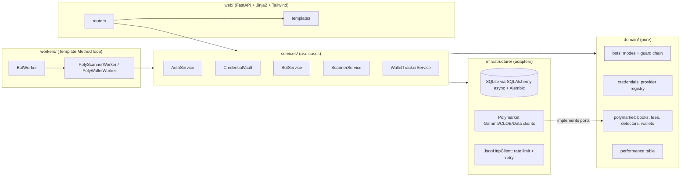

# Calyx Crypto Lab

Research-first bots for crypto and prediction markets, with a secure admin dashboard.

## Local paper setup — 29 September 2026

This installation now starts **all five workers with the dashboard**, with no separate worker terminals:

```powershell
uv run crypto-lab serve
```

Open **http://127.0.0.1:8090/paper** for the combined portfolio, **/activity** for actual scans, skipped trades,
errors and fills, and **/admin/bots** to stop/restart individual workers. Pages refresh every 10 seconds.
The process must remain running, and the PC must remain awake with internet access. Closing the browser alone
does not stop it. This is not a Windows boot-start service.

- **One shared 100 USDC starting balance**, persisted across restarts; not 100 per bot.
- **Maximum 10 USDC all-in entry commitment**, including modeled entry costs. This is unleveraged spot exposure,
  not a position sized to lose 10 USDC at a guaranteed stop. Gaps/illiquidity can bypass exit triggers.
- Available cash subtracts all open commitments across the original scanner ledger and the new worker ledger.
  SQLite write locks serialize spending; duplicate signal keys and per-worker leases prevent repeated fills.
- The local `.env` starts newly registered bots in PAPER. Existing OFF/kill choices persist across restarts.
  Applying PAPER clears that bot's kill flag; the supervisor starts it within about five seconds.
- Login is temporarily bypassed **only on this PC**, with loopback client/Host/Origin checks and CSRF tokens.
  Credentials/account-security pages are unavailable in bypass mode. Set `CRYPTOLAB_LOCAL_PAPER_ACCESS=false`
  and restart to restore the existing login. Never expose this development app through a proxy/tunnel.
- **Live trading remains disabled. No live order adapter, signing, fund transfer or wallet connection was added.**

### Paper strategy definitions (exploratory, not optimized or validated)

| Worker | What runs now |
|---|---|
| CEX spot arbitrage | Binance/OKX BTC-USDC public order books. Seeds one small OKX paper BTC inventory lot (about 9 USDC before lot rounding), then rotates owned inventory only when a matched spread exceeds fees, slippage and a 0.01 USDC edge after a 1.5-second recheck. Never naked-shorts BTC. Open inventory has directional BTC exposure; realized P/L is not pure arbitrage profit. |
| Polymarket scanner | Existing fee/depth-aware detectors, now limited to 10 USDC per opportunity and the shared wallet. Resolution baskets stay locked until every leg explicitly resolves; an end date alone never releases cash. |
| Wallet tracker | Public leaderboard and wallet history refresh hourly. Observer only: no positions or P/L of its own. |
| Wallet copy | Freeze up to three watchlisted wallets, or the first three ranked directional wallets with at least 50 recorded closed positions if no watchlist exists. Only post-selection source trades no older than three minutes; 2-second delay, 2% maximum entry-price deviation, depth and fee checks, three open assets max. Full follower exit on a recent source sale, -30%/+50% quote-based return, 24-hour hold, or confirmed resolution. No historical trades replayed as profits. Selection is frozen in `paper_state`; watchlist changes do not silently reselect it. |
| Solana rotation | Public Jupiter data for verified BONK/WIF/POPCAT candidates. Require disabled mint/freeze authorities, <=35% top-holder concentration, >=250k USD liquidity, pool age >=7 days, recent metadata; then >=2% hourly and positive 5-minute momentum with >=50k hourly volume. Require buy and sell routes; reject >1% quote impact or >5% modeled round-trip loss. One open position, at most one entry per token/30-minute bucket; -10%/+15% quote-based exits or one-hour hold. These basic checks do not guarantee a token is safe. |

Simulation assumptions: CEX 0.20% assumed taker fee plus 0.05% adverse-fill allowance per leg; Polymarket published
market fee schedules; Jupiter quote-included fees plus 0.50% adverse-fill haircut and 0.01 USDC network allowance
per swap. The shared paper cash pool is virtual, not actual pre-funded balances at each venue; live cash allocation,
rebalancing/transfer costs, partial fills, on-chain failures and queue priority are not validated. No API keys are
required for this current public-data setup. Rate limits/failures are shown; absent quotes never become fake fills.

Paper shows available cash, cost committed, realized P/L and net marked equity. A missing/stale mark renders equity
as unavailable, not zero. OFF/Kill pauses position management too; holdings stay in the ledger and are managed again
when PAPER resumes. Results begin now; the first few trades are not evidence of an edge.

Public adapter references: [Binance spot REST](https://developers.binance.com/docs/binance-spot-api-docs/rest-api/market-data-endpoints),
[OKX v5](https://www.okx.com/docs-v5/en/), [Polymarket](https://docs.polymarket.com/),
[Jupiter Swap v2](https://developers.jup.ag/docs/swap/order-and-execute).

The database was backed up before migration under `data/crypto_lab.before-paper-20260929-152347.sqlite`.
The sections below describe the original platform; this local-paper setup supersedes their manual worker startup
and planned-worker status notes.

The first module, **Model D (Polymarket)**, is working:

- a **fee-aware arbitrage scanner** that prices every opportunity at executable order-book depth, using each market's
  own taker-fee schedule;
- **latency-checked paper trading**: every detection is re-priced from a *second* order-book fetch before it counts;
- a **wallet tracker** with leaderboard ingest, trade history and descriptive statistics.

Everything is managed from a **FastAPI + Tailwind** dashboard styled like the Calyx website. The dashboard has an
encrypted **API-key vault**, bot mode switches (OFF → SHADOW → PAPER → LIVE), a kill switch and an audit log.
Storage is **SQLite**. Packages are managed with **uv**.

> **Not financial advice.** This is research software. Shadow and paper results are simulations, not forecasts.
> Live trading is **disabled** unless you explicitly enable it in configuration, and no LIVE execution adapter
> exists yet.

---

## Contents

- [Status and roadmap](#status-and-roadmap)
- [Quick start](#quick-start)
- [Configuration](#configuration)
- [The vault master key](#the-vault-master-key)
- [Using the dashboard](#using-the-dashboard)
- [Model D: how the Polymarket scanner works](#model-d-how-the-polymarket-scanner-works)
- [Model D: wallet tracker](#model-d-wallet-tracker)
- [Results table definitions](#results-table-definitions)
- [Architecture](#architecture)
- [Project layout](#project-layout)
- [Development](#development)
- [Extending the lab](#extending-the-lab)
- [Security model](#security-model)
- [Known limitations](#known-limitations)
- [License](#license)

---

## Status and roadmap

| Model | What it is | Status |
|---|---|---|
| **D: Polymarket** | Arbitrage scanner, latency-checked paper ledger, wallet tracker | **Working (shadow/paper)** |
| D: Polymarket copy engine | Forward-only frozen-wallet selection with size and deviation limits | Experimental paper worker |
| D4: Polymarket ↔ Kalshi | Same-event cross-venue arbitrage | Planned |
| A/B: CEX arbitrage | Binance/OKX BTC-USDC inventory rotation; lead-lag/Bybit still unimplemented | Experimental paper worker |
| E: Solana meme rotation | Basic risk filters, momentum selection and Jupiter quotes | Experimental paper worker |

Planning documents live next to this folder: `../CRYPTO_ARBITRAGE_MASTER_PLAN.md` and
`../POLYMARKET_COPY_AND_MEME_ROTATION_PLAN.md`. Step-by-step progress is logged in [`progress.md`](progress.md), and
architecture decisions are in [`docs/adr/`](docs/adr).

## Quick start

Requirements: [uv](https://docs.astral.sh/uv/) (it installs Python 3.12 for you) and internet access to Polymarket's
public APIs. **No API keys are needed** for Model D's scanner and wallet tracker.

```bash
uv sync                                   # create .venv and install locked dependencies
uv run crypto-lab create-admin <username> # prompts for a password (min 12 characters)
uv run crypto-lab serve                   # dashboard at http://127.0.0.1:8090
```

In a second terminal, run a worker. Each worker reads its mode from the dashboard every cycle:

```bash
uv run crypto-lab worker poly-scanner     # loops; idle while the bot is OFF
uv run crypto-lab worker poly-wallets     # hourly leaderboard + wallet refresh
```

Then open **Bots** in the dashboard and switch `poly-scanner` to **SHADOW** (detect only) or **PAPER** (detect and
simulate fills), and `poly-wallets` to **SHADOW**.

One-off runs, handy for testing. They ignore the dashboard mode:

```bash
uv run crypto-lab worker poly-scanner --once --mode shadow
uv run crypto-lab worker poly-scanner --once --mode paper
uv run crypto-lab worker poly-wallets --once
```

Other commands:

```bash
uv run crypto-lab migrate                 # apply database migrations (also done automatically on start)
uv run crypto-lab --help
```

On first start without a configured master key, the app creates a **development** key file at
`data/dev-master.key` (git-ignored). Use the OS keyring or an environment variable for anything beyond local
development (see below).

## Configuration

Settings come from environment variables with the `CRYPTOLAB_` prefix, or from a `.env` file. Copy
[`.env.example`](.env.example) to get started.

| Variable | Default | Meaning |
|---|---|---|
| `CRYPTOLAB_ENVIRONMENT` | `development` | `production` disables the development key file |
| `CRYPTOLAB_HOST` / `CRYPTOLAB_PORT` | `127.0.0.1` / `8090` | Dashboard bind address. Keep it on localhost, or put it behind a VPN/HTTPS proxy |
| `CRYPTOLAB_DATA_DIR` | `./data` | SQLite database, development key, local recordings |
| `CRYPTOLAB_DATABASE_URL` | `sqlite+aiosqlite:///<data_dir>/crypto_lab.sqlite` | Override the database location |
| `CRYPTOLAB_MASTER_KEY` | unset | Vault master key (32 bytes, urlsafe base64). The OS keyring is preferred |
| `CRYPTOLAB_COOKIE_SECURE` | `false` | Set `true` when served over HTTPS; also enables HSTS |
| `CRYPTOLAB_SESSION_TTL_MINUTES` | `720` | Admin session lifetime |
| `CRYPTOLAB_LOGIN_MAX_FAILURES` / `CRYPTOLAB_LOGIN_LOCKOUT_MINUTES` | `5` / `15` | Account lockout |
| `CRYPTOLAB_LOGIN_RATE_PER_MINUTE` | `10` | Login attempts per IP per minute |
| `CRYPTOLAB_LIVE_TRADING_ENABLED` | `false` | **Hard safety switch.** LIVE mode is refused while false |

Scanner and wallet-tracker tuning (events scanned, share sizes, minimum edge, paper latency, bankroll) lives in
`ScannerSettings`, `ScanConfig` and `WalletTrackerSettings` in `src/crypto_lab/services/polymarket/` and
`src/crypto_lab/domain/polymarket/arbitrage.py`.

## The vault master key

API keys are encrypted with **AES-256-GCM** under a 32-byte master key. The key is resolved in this order:

1. `CRYPTOLAB_MASTER_KEY` (environment or `.env`);
2. the **OS keyring** (Windows Credential Manager, macOS Keychain, Linux Secret Service), under service `crypto-lab`
   and user `master-key`;
3. `data/dev-master.key`: development only, created automatically, and never used when
   `CRYPTOLAB_ENVIRONMENT=production`.

To store a new key in the OS keyring:

```bash
uv run python -c "import keyring,secrets,base64; keyring.set_password('crypto-lab','master-key', base64.urlsafe_b64encode(secrets.token_bytes(32)).decode())"
```

> If you lose the master key, the stored API keys cannot be decrypted. Re-enter them after setting a new key.
> Moving from the development file to the keyring means re-entering credentials, or copying the development key's
> value into the keyring.

## Using the dashboard

| Page | What you can do |
|---|---|
| **Overview** | Bot cards with mode, heartbeat, paper-gate status and last error; recent audit events |
| **Scanner** | Active and historical arbitrage opportunities with legs, fees, net edge, edge %, lock-up and first/last seen. Also scan health: events, markets, books, stale books, near-miss sums and timing |
| **Paper** | The standard results table (below), a balance chart, and every paper trade: *settled*, *open* (held to resolution) or *missed* (edge gone after the latency re-check) |
| **Wallets** | Leaderboard and watch-listed wallets with computed stats; add or remove wallets from the watchlist; wallet detail with recent trades |
| **Bots** | Change mode (OFF/SHADOW/PAPER/LIVE) and trigger the kill switch |
| **API keys** | Add, rotate, enable/disable or delete credentials per provider. Secrets are **write-only** |
| **Audit** | Every login attempt and admin change (never secret values) |
| **Account** (your name, top right) | Turn on TOTP two-factor authentication (QR code) |

**LIVE mode** requires *all* of the following: `CRYPTOLAB_LIVE_TRADING_ENABLED=true`, the bot's paper gate marked as
passed, typing the bot id as confirmation, and a valid 2FA code. It can only be reached from PAPER.

## Model D: how the Polymarket scanner works

Each pass:

1. **Catalogue**: loads the most active open events from the Gamma API (sorted by 24-hour volume, filtered by a
   minimum volume), keeping only markets with an order book that accept orders.
2. **Books**: fetches CLOB order books in groups (`POST /books`) and judges each group's freshness immediately
   using the **local receive time**. The CLOB `timestamp` is the book's last *change*, so a quiet book can be minutes
   old and still current.
3. **Detection**: three strategies (`src/crypto_lab/domain/polymarket/arbitrage.py`):

   | Kind | Trade | Payout | Capital lock |
   |---|---|---|---|
   | `complement_buy_merge` | Buy YES and NO of one binary market | $1 per pair (merge back into USDC) | none (instant merge) |
   | `complement_split_sell` | Split $1 USDC into YES+NO, sell both into the bids | bid proceeds − fees | none |
   | `neg_risk_basket_buy` | Buy YES on **every** outcome of a mutually exclusive (neg-risk) event | $1 per set at resolution | until resolution |

   Each candidate is priced by **walking the book** for several share sizes (10/50/100/250/1000). The size with the
   largest positive net edge is kept. Sizes below a market's minimum order size are skipped.
   Neg-risk events flagged *augmented* (placeholder or "other" outcomes may be missing) are **never** treated as
   complete baskets.
4. **Fees**: taker fee = `shares × rate × (p × (1 − p))^exponent`, taken from each market's `feeSchedule` and charged
   **per matched level**. Makers pay 0 when `takerOnly`. Example: 100 crypto-market shares at 50¢ cost **$1.75**.
   So buying both sides at about 50¢ in a crypto market needs YES + NO below about **$0.965**.
5. **Feed**: opportunities are upserted by fingerprint (`kind:condition_or_event`). Repeated detections increase
   `seen_count` and update `last_seen`, which shows how long an edge survives. Opportunities no longer found are
   marked *gone*.
6. **Near-miss metrics**: each scan records the lowest top-of-book `YES ask + NO ask` and the highest
   `YES bid + NO bid`, so you can see how close the market came to a gross arbitrage even when nothing passes.

**Paper mode (honesty rule):** a new opportunity is **not** filled at the detected prices. The scanner waits
`paper_latency_ms` (default 1.5 s), fetches the books **again** and re-prices at the same size. It records a fill
only if the edge is still there and paper capital is available; otherwise it records a **missed** trade with the
reason. Merge and split trades settle immediately; basket trades stay *open* until resolution.

## Model D: wallet tracker

Every pass (default hourly):

- pulls the Data API **leaderboard** (default: top 50 by P/L, monthly), plus your **watchlist**;
- fetches each wallet's **closed positions** and recent **trades** (deduplicated on insert);
- computes descriptive stats: realised P/L, wins/losses, win rate and its **95% Wilson lower bound**, profit
  factor, trades per day, median trade size, average buy price and a **style** label:

| Style | Rule |
|---|---|
| `hedged` | ≥ 30% of traded markets bought on both sides (arbitrage or market making) |
| `favourite` | average buy price ≥ 0.85 |
| `longshot` | average buy price ≤ 0.20 |
| `directional` | otherwise |

These stats are **descriptive, not predictive**. Leaderboard wallets are selected *because* they did well (survivorship
bias). The planned copy engine must select wallets walk-forward: rank on a past window, then evaluate on the next.

## Results table definitions

Every results view uses the same standard table (`src/crypto_lab/domain/performance.py`):

| Metric | Definition |
|---|---|
| Trades, trades/month, trades/day | Closed trades; per month and day over the span first → last trade (minimum one day) |
| Return % | Net P/L ÷ starting balance |
| Profit factor | Gross wins ÷ gross losses (— when there are no losses) |
| Win rate | Wins ÷ trades with non-zero P/L |
| Consistency | Share of trading days that ended positive |
| Avg win / loss streak | Mean length of consecutive winning or losing runs |
| Sharpe | Mean ÷ standard deviation of daily P/L (as a fraction of starting balance) × √365 |
| Max balance DD | Largest peak-to-trough fall of the closed-trade balance, in % of the peak |
| Max equity DD | Needs mark-to-market of open positions; shown as **n/a** until available (missing ≠ zero) |

## Architecture

The code follows a **ports-and-adapters (hexagonal)** layout. Dependencies point inwards: the domain has no I/O and
no framework imports.



Design patterns in use:

| Pattern | Where | Why |
|---|---|---|
| Ports & adapters | `domain/polymarket/ports.py` ↔ `infrastructure/polymarket/clients.py` | Services are tested with fakes; venues can be swapped |
| Anti-corruption layer | `infrastructure/polymarket/mappers.py` | API quirks (JSON-in-strings, unsorted books) never reach the domain |
| Strategy | `ArbitrageDetector` implementations; `MasterKeyProvider` implementations | Add detectors or key sources without touching callers |
| Chain of Responsibility | `ModeTransitionPolicy` guards in `domain/bots.py` | Each LIVE safety rule is one small, testable object |
| Registry | `ProviderRegistry` (`domain/credentials.py`), worker registry (`workers/__init__.py`) | Forms and workers are data-driven |
| Repository + Unit of Work | `infrastructure/db/*repositories.py`, `session.unit_of_work` | All SQL lives in one place; transactions are explicit |
| Template Method | `workers/base.py::BotWorker.run_forever` | Control, heartbeat and error handling are written once |
| Composition root / DI | `container.py`, FastAPI `Annotated` dependencies in `web/deps.py` | One place wires everything; handlers stay thin |
| Value objects | `OrderBook`, `PriceLevel`, `Fill`, `Opportunity`, `FeeSchedule` (frozen dataclasses) | Exact `Decimal` maths with no hidden mutation |

Key decisions are recorded in [`docs/adr/`](docs/adr).

## Project layout

```text
crypto-lab/
├── pyproject.toml / uv.lock / .python-version   # uv-managed, Python 3.12
├── alembic.ini                                  # CLI migrations (the app migrates itself on start)
├── .env.example                                 # names only, never values
├── progress.md                                  # step-by-step development log
├── docs/adr/                                    # architecture decision records
├── src/crypto_lab/
│   ├── cli.py            config.py      container.py
│   ├── domain/           # pure logic: bots, credentials, performance, polymarket/{orderbook,fees,market,arbitrage,wallets,ports}
│   ├── security/         # argon2 passwords, AES-GCM vault crypto, TOTP, tokens, rate limiter
│   ├── infrastructure/
│   │   ├── http.py       # async JSON client with token bucket + retries
│   │   ├── db/           # models, repositories, session, migrations/
│   │   └── polymarket/   # Gamma / CLOB / Data API adapters + mappers
│   ├── services/         # auth, vault, bots, audit, polymarket/{scanner,wallet_tracker}
│   ├── workers/          # BotWorker loop + Polymarket workers
│   └── web/              # app factory, deps, middleware, routers/, templates/, static/
├── tests/                # unit/ and integration/ (no real network calls)
└── data/                 # git-ignored: SQLite DB, dev key, recordings
```

## Development

```bash
uv sync                               # install runtime + dev dependencies
uv run pytest                         # full suite (no network)
uv run pytest --cov                   # with coverage (greenlet-aware)
uv run ruff check src tests           # lint
uv run ruff format src tests          # format
uv run mypy                           # strict type checking
```

**Rebuild the CSS** after changing templates or `web/static/src/input.css`. This uses the Tailwind standalone CLI
through the `pytailwindcss` dev dependency, so no Node.js is needed:

```bash
uv run tailwindcss -i src/crypto_lab/web/static/src/input.css -o src/crypto_lab/web/static/css/app.css --minify
```

The committed `app.css` was built with Tailwind **v4.3.3**. Set `TAILWINDCSS_VERSION=v4.3.3` to pin the same binary.

**Database migrations** (Alembic, SQLite batch mode):

```bash
uv run alembic revision --autogenerate -m "describe change"   # after editing ORM models
uv run crypto-lab migrate                                       # or just start the app
```

## Extending the lab

- **New credential provider:** add a `ProviderSpec` in `domain/credentials.py`. The admin form, validation and
  masking follow automatically.
- **New arbitrage detector:** implement `ArbitrageDetector.detect(event, books, config, now)` in
  `domain/polymarket/arbitrage.py`, add it to `DEFAULT_DETECTORS` and give it a unique `OpportunityKind`. Paper
  re-pricing then works for it too.
- **New worker:** subclass `BotWorker`, implement `run_cycle(mode)`, register it in `workers/__init__.py`, and add a
  `BotDefinition` in `domain/bots.py` so it appears on the Bots page.
- **New venue:** define its ports in `domain/<venue>/ports.py`, implement the adapters in
  `infrastructure/<venue>/`, and keep API quirks inside a mapper module.

## Security model

- **Admin authentication:** Argon2id password hashes; optional TOTP 2FA (secret encrypted in the vault); generic
  login errors; account lockout plus a per-IP rate limit; server-side sessions (only a SHA-256 digest of the cookie
  token is stored); `HttpOnly` + `SameSite=Strict` cookies (`Secure` when configured).
- **CSRF:** a per-session token on every form, compared in constant time.
- **Headers:** strict CSP (no inline scripts), `X-Frame-Options: DENY`, `nosniff`, `no-referrer`,
  `Cache-Control: no-store` on admin pages, and HSTS when served over HTTPS.
- **Vault:** AES-256-GCM, with each ciphertext bound to its record id and provider (associated data), so copying a
  ciphertext between rows fails. Secrets are write-only in the UI, never logged and never written to the audit log.
  Only workers can decrypt (`CredentialVault.reveal_for_worker`).
- **Exposure:** binds to `127.0.0.1` by default. Put it behind a VPN (e.g. Tailscale) or an HTTPS reverse proxy with
  an IP allow-list if it must be remote. Never expose it publicly.
- **Keys you create at exchanges:** trading only, **withdrawals disabled**, IP allow-listed, on a dedicated
  sub-account where possible. Wallet keys only for dedicated **burner** wallets.

Report vulnerabilities privately to the maintainer rather than in public issues.

## Known limitations

- **No live execution yet.** LIVE mode can be unlocked, but no worker places real orders; they log that LIVE is not
  implemented and stay idle.
- **Paper ≠ live.** The latency re-check is a coarse model. Queue position, partial fills, other traders racing for
  the same edge, merge/split transaction costs and relayer limits are not modelled. `extra_cost_per_leg_usdc` lets
  you add a conservative allowance.
- **Basket settlement:** open neg-risk basket paper trades are not auto-settled at resolution yet.
- **Wallet sample size:** for some top wallets the closed-positions endpoint returned only a handful of rows
  (7–10 during testing), so their win rates rest on tiny samples. Rely on the Wilson lower bound, not the raw rate.
- **SQLite:** fine for one machine and these write rates. High-frequency order-book recording belongs in compressed
  files; this is not implemented yet.
- **Venue terms:** check that Polymarket and Kalshi are available in your jurisdiction and follow each API's
  terms and rate limits.

## License

No license has been chosen yet. Until one is added, all rights are reserved by the author. A permissive license
(e.g. MIT or Apache-2.0) is planned before the project is open-sourced.
