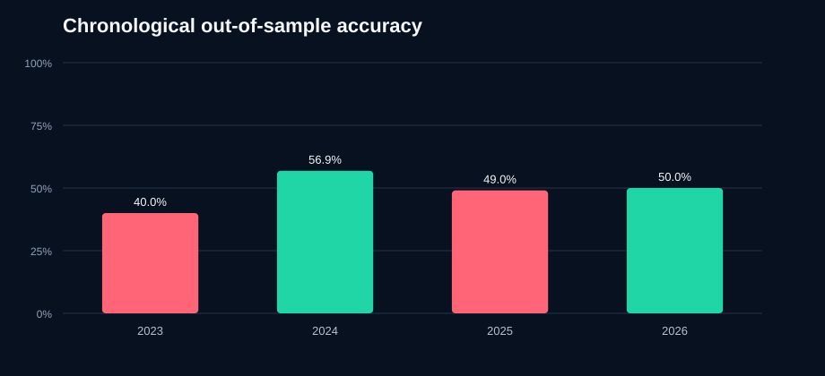

# Gold Weekend-Direction Model: Five-Year Validation

Data: `2021-08-16` through `2026-08-03` (241 completed weekends)  
Broker feed: `MEXAtlantic-Demo` / `XAUUSD..`  
Target: direction of the executable-midpoint change from the final Friday M1 close to the first weekly-reopen M1 open  
Decision time: five completed M1 bars before the broker's Friday close

**Deployment verdict: REJECTED.** The saved artifact remains available for reproducible research, but a rejected model is forced to `NO TRADE` in the predictor.

## Frozen unseen final year

| Measure | Selected model | Majority baseline |
|---|---:|---:|
| Samples | 52 | 52 |
| Direction accuracy | **46.15%** | 46.15% |
| 95% accuracy interval | 33.34%-59.50% | 33.34%-59.50% |
| Balanced accuracy | 43.15% | 50.00% |
| ROC AUC | 0.405 | 0.500 |
| Brier score (lower is better) | 0.2718 | 0.2768 |
| Friday 24h-momentum baseline | 57.69% | - |

## Confidence-gated result

The confidence threshold `0.625` was selected only from development walk-forward predictions.

| Actions | No trade | Coverage | Accuracy | 95% interval |
|---:|---:|---:|---:|---:|
| 19 | 33 | 36.54% | 47.37% | 27.33%-68.29% |

## Anti-overfit protocol

- Development: first `189` weekends (approximately four years).
- Selection: four expanding chronological folds with a one-week embargo.
- Compared only regularized logistic models and deliberately shallow random forests.
- Hyperparameters, feature set, and confidence threshold were fixed before opening the final year.
- Frozen test: final `52` weekends beginning `2025-08-04`.
- The saved live model was refit on all data only after the frozen score was recorded.

## Selected model

- `forest_gold_cross_history_d2_leaf12` using `gold_cross_history` features
- Development walk-forward accuracy: `57.89%`
- Development walk-forward ROC AUC: `0.588`
- Development walk-forward Brier: `0.2427`

## Rolling chronological diagnostic

This weekly retraining view begins after a 104-week warm-up. It is useful for stability checks, but only the frozen final year is a completely untouched test.

| Year | OOS weeks | Accuracy | AUC | High-confidence actions | Action accuracy |
|---:|---:|---:|---:|---:|---:|
| 2021 | warm-up | - | - | - | - |
| 2022 | warm-up | - | - | - | - |
| 2023 | 5 | 40.00% | 0.667 | 1 | 100.00% |
| 2024 | 51 | 56.86% | 0.638 | 12 | 75.00% |
| 2025 | 51 | 49.02% | 0.511 | 19 | 57.89% |
| 2026 | 30 | 50.00% | 0.495 | 7 | 57.14% |

## Interpretation

Accuracy must be compared with the majority baseline and its confidence interval. A score near 50%, an AUC near 0.50, or a Brier score no better than the baseline means the model has not demonstrated a dependable edge. In that case its correct operational output is `NO TRADE`, not forced certainty.

This is a direction classifier, not a trading backtest. It does not claim that a correct direction can be executed profitably after spread, slippage, gaps, or broker margin constraints.
