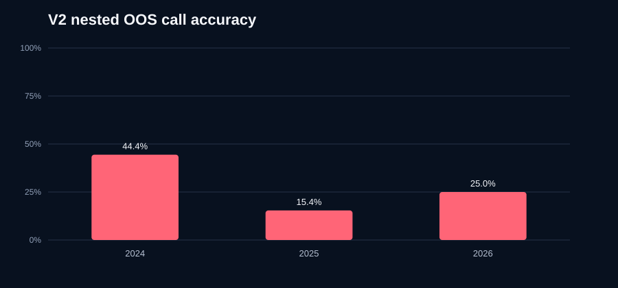

# Gold Weekend Direction V2

**Deployment verdict: REJECTED.** Rejected models are forced to `NO TRADE` by the predictor.

V2 predicts whether the weekly reopen gap will be meaningful, then predicts direction. The meaningful threshold is the rolling 70th percentile of the previous 26 absolute weekend gaps, so it adapts to gold's price and volatility without future data.

## Nested chronological out-of-sample result

| OOS weeks | Calls | Coverage | Fully correct calls | Call precision | 95% interval | Direction accuracy when meaningful | Signed gap per one unit |
|---:|---:|---:|---:|---:|---:|---:|---:|
| 111 | 30 | 27.03% | 8 | 26.67% | 14.18%-44.45% | 57.14% | $-47.23 |

A fully correct call must both identify a meaningful gap and predict its direction. A direction call on a small/noisy gap counts as incorrect.

## Momentum baseline

| Calls | Coverage | Call precision | Direction accuracy when meaningful | Signed gap per one unit |
|---:|---:|---:|---:|---:|
| 45 | 40.54% | 17.78% | 57.14% | $+233.50 |

## Year breakdown

| Year | OOS weeks | Calls | Call precision | Meaningful precision | Direction accuracy | Signed gap |
|---:|---:|---:|---:|---:|---:|---:|
| 2024 | 30 | 9 | 44.44% | 55.56% | 80.00% | $+23.82 |
| 2025 | 51 | 13 | 15.38% | 23.08% | 66.67% | $+2.40 |
| 2026 | 30 | 8 | 25.00% | 75.00% | 33.33% | $-73.45 |

## Inputs

- 20 compact MT5 market and lagged weekend-history features from completed bars.
- Nine lagged FRED macro features: broad USD, real yields, nominal yields, VIX, and breakevens.
- Four CFTC gold-positioning features, conservatively lagged one full week to avoid holiday publication leakage.
- No CVOL/options-skew history was available locally, so no options values were invented.

## Validation design

- The outer replay starts after 104 weeks and advances in 26-week unseen blocks.
- Each outer block independently selects regularization, feature set, and confidence gates using only nested training folds.
- Every inner and outer boundary uses a one-week embargo.
- V1's old final year was not used to choose a single global V2 configuration.
- Because V2 was designed after seeing V1 fail, this is rigorous nested OOS evidence but not a pristine future trial. New weekends remain the final confirmation.

Promotion requires at least 20 calls, at least 60% fully correct call precision, at least 60% direction accuracy on meaningful gaps, positive signed gap capture, and positive results in all but at most one tested calendar year. More tuning on these same OOS weeks would invalidate them as independent evidence.

This remains an informational direction model, not an executable P&L backtest. Signed-gap dollars show the midpoint direction captured by one unit and do not include order slippage, margin, or weekend execution constraints.
