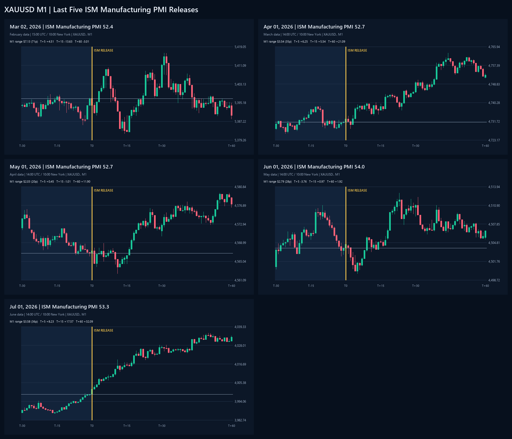

# XAUUSD M1 Around the Last Five ISM Manufacturing PMI Releases

Broker candle source: `XAUUSD..`. Window: T-30 through T+60. Gold pips use `0.1 = 1 pip`.

| Release | Actual | Pre-price | M1 range | T+5 | T+15 | T+60 | First-15 max up | First-15 max down |
|---|---:|---:|---:|---:|---:|---:|---:|---:|
| 2026-03-02 15:00 UTC | 52.4 | 5396.93 | $7.13 (71p) | +4.51 | -13.63 | -3.01 | +13.13 | -14.93 |
| 2026-04-01 14:00 UTC | 52.7 | 4731.27 | $3.54 (35p) | +6.25 | +5.54 | +21.09 | +9.18 | -2.98 |
| 2026-05-01 14:00 UTC | 52.7 | 4566.76 | $2.03 (20p) | +0.45 | -1.01 | +11.90 | +2.13 | -4.31 |
| 2026-06-01 14:00 UTC | 54.0 | 4503.94 | $2.79 (28p) | -3.76 | +0.97 | +1.92 | +2.74 | -4.17 |
| 2026-07-01 14:00 UTC | 53.3 | 3998.36 | $3.58 (36p) | +8.23 | +17.57 | +32.09 | +21.00 | -0.45 |

## Full-size charts

- `charts/ism-manufacturing-xauusd-m1/2026-03-02-ism-manufacturing-xauusd-m1.png`
- `charts/ism-manufacturing-xauusd-m1/2026-04-01-ism-manufacturing-xauusd-m1.png`
- `charts/ism-manufacturing-xauusd-m1/2026-05-01-ism-manufacturing-xauusd-m1.png`
- `charts/ism-manufacturing-xauusd-m1/2026-06-01-ism-manufacturing-xauusd-m1.png`
- `charts/ism-manufacturing-xauusd-m1/2026-07-01-ism-manufacturing-xauusd-m1.png`
