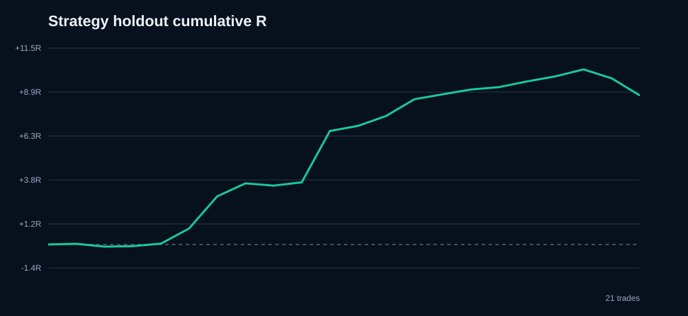

# Predicted-Direction XAUUSD Weekend Hold

**Strategy verdict: REJECTED.** The underlying V2 direction model remains rejected, so a passing execution result would still require forward confirmation before use.

Nested model-prediction period: 2024-06-10 through 2026-08-03 UTC. The first 70 prediction weeks select the strategy; the final 41 weeks are strategy holdout.

## Development-selected winner

- Direction policy: `v2_conf_60`
- Entry: market order `1` minute(s) before Friday close
- Stop: `range60_1.0`
- Reward/risk: `4.0:1`
- Maximum hold after weekly reopen: `720` market minutes (`0` exits at the reopening price)
- Historical spread is applied; weekend stop gaps exit at the Monday opening price; favorable TP gaps are capped at the target.

## Main results

| Sample | Trades | Win rate | Profit factor | Net | Average | Max DD | Gap stops | Timeouts |
|---|---:|---:|---:|---:|---:|---:|---:|---:|
| Development | 38 | 34.21% | 1.711 | +17.51R | +0.461R | 5.00R | 1 | 5 |
| Strategy holdout | 13 | 15.38% | 0.248 | -13.46R | -1.036R | 13.90R | 6 | 1 |
| All nested predictions | 51 | 29.41% | 1.095 | +4.05R | +0.079R | 16.75R | 7 | 6 |

## Best observed horizon-matched candidate

This candidate was locked from development within its RR family, but it is selected for presentation after comparing six RR families on the same holdout. Treat it as provisional and require new forward weekends before deployment.

- Signal: `momentum_gate` (strong Friday 24-hour momentum, direction follows the move)
- Entry: `4` minutes before Friday close
- Emergency stop/target: `fixed_30` at `3.0:1`
- Exit: weekly reopening price (`0` post-reopen minutes)

| Sample | Trades | Win rate | Profit factor | Net | Average | Max DD |
|---|---:|---:|---:|---:|---:|---:|
| Development | 24 | 41.67% | 1.411 | +0.54R | +0.023R | 0.61R |
| Strategy holdout | 21 | 80.95% | 5.780 | +8.69R | +0.414R | 1.52R |
| Full nested sample | 45 | 60.00% | 3.944 | +9.23R | +0.205R | 1.52R |

## Locked RR comparison

Each row independently selected its other parameters using development only.

| RR | Policy | Lead | Stop | Hold | Holdout trades | Win rate | PF | Net | Max DD | Verdict |
|---:|---|---:|---|---:|---:|---:|---:|---:|---:|---|
| 1.0 | v2_conf_60 | 2m | fixed_20 | 240m | 13 | 23.08% | 0.183 | -13.41R | 14.41R | FAIL |
| 1.5 | v2_conf_60 | 4m | fixed_15 | 240m | 13 | 15.38% | 0.152 | -16.73R | 18.23R | FAIL |
| 2.0 | v2_conf_60 | 5m | fixed_10 | 240m | 13 | 30.77% | 0.403 | -11.86R | 13.86R | FAIL |
| 2.5 | v2_conf_60 | 4m | fixed_10 | 240m | 13 | 15.38% | 0.185 | -22.10R | 24.60R | FAIL |
| 3.0 | momentum_gate | 4m | fixed_30 | 0m | 21 | 80.95% | 5.780 | +8.69R | 1.52R | PASS |
| 4.0 | v2_conf_60 | 1m | range60_1.0 | 720m | 13 | 15.38% | 0.248 | -13.46R | 13.90R | FAIL |

## Compounded scenarios

These are mathematical sequences, not forecasts. Gap slippage can make an individual loss larger than the nominal risk percentage.

| Sample | Nominal risk | Return | Max equity DD |
|---|---:|---:|---:|
| Holdout | 1% | +8.99% | 1.52% |
| Holdout | 3% | +28.82% | 4.52% |
| Holdout | 5% | +51.34% | 7.48% |
| Full | 1% | +9.57% | 1.52% |
| Full | 3% | +30.85% | 4.52% |
| Full | 5% | +55.21% | 7.48% |

## Holdout trades

| Reopen | Side | Entry | Stop | Target | Exit | Outcome | Result |
|---|---|---:|---:|---:|---:|---|---:|
| 2025-10-20 | SELL | 4246.92 | 4276.92 | 4156.92 | 4245.81 | REOPEN | +0.04R |
| 2025-11-17 | SELL | 4080.32 | 4110.32 | 3990.32 | 4085.23 | REOPEN | -0.16R |
| 2025-12-01 | BUY | 4220.80 | 4190.80 | 4310.80 | 4221.63 | REOPEN | +0.03R |
| 2025-12-29 | BUY | 4531.32 | 4501.32 | 4621.32 | 4535.64 | REOPEN | +0.14R |
| 2026-01-26 | BUY | 4982.72 | 4952.72 | 5072.72 | 5009.38 | REOPEN | +0.89R |
| 2026-02-02 | SELL | 4867.06 | 4897.06 | 4777.06 | 4810.83 | REOPEN | +1.87R |
| 2026-02-09 | BUY | 4960.97 | 4930.97 | 5050.97 | 4983.63 | REOPEN | +0.76R |
| 2026-02-16 | BUY | 5041.69 | 5011.69 | 5131.69 | 5037.75 | REOPEN | -0.13R |
| 2026-02-23 | BUY | 5104.10 | 5074.10 | 5194.10 | 5109.84 | REOPEN | +0.19R |
| 2026-03-02 | BUY | 5279.35 | 5249.35 | 5369.35 | 5369.35 | TP | +3.00R |
| 2026-03-09 | BUY | 5171.38 | 5141.38 | 5261.38 | 5180.27 | REOPEN | +0.30R |
| 2026-03-16 | SELL | 5017.68 | 5047.68 | 4927.68 | 5000.24 | REOPEN | +0.58R |
| 2026-03-23 | SELL | 4498.95 | 4528.95 | 4408.95 | 4469.74 | REOPEN | +0.97R |
| 2026-03-30 | BUY | 4497.92 | 4467.92 | 4587.92 | 4506.45 | REOPEN | +0.28R |
| 2026-05-18 | SELL | 4537.83 | 4567.83 | 4447.83 | 4529.42 | REOPEN | +0.28R |
| 2026-06-08 | SELL | 4327.91 | 4357.91 | 4237.91 | 4323.74 | REOPEN | +0.14R |
| 2026-06-22 | SELL | 4152.88 | 4182.88 | 4062.88 | 4142.92 | REOPEN | +0.33R |
| 2026-06-29 | BUY | 4073.85 | 4043.85 | 4163.85 | 4082.61 | REOPEN | +0.29R |
| 2026-07-06 | BUY | 4175.91 | 4145.91 | 4265.91 | 4188.24 | REOPEN | +0.41R |
| 2026-07-20 | BUY | 4017.31 | 3987.31 | 4107.31 | 4001.62 | REOPEN | -0.52R |
| 2026-08-03 | SELL | 4051.85 | 4081.85 | 3961.85 | 4081.85 | SL | -1.00R |

## Interpretation

The prediction probabilities are nested out-of-sample, but this strategy layer is a later research iteration. The global development winner failed its holdout. The 3R immediate-reopen candidate passed its individual gates, but choosing it after comparing six RR families creates selection bias; new forward weekends are required. M1 bars cannot reveal the path when both stop and target occur inside one candle, so the backtest assumes the stop happened first. Swap, commission, margin constraints, and broker-specific weekend execution rules are not present in the historical bar cache.
