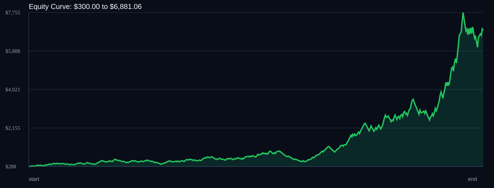

# RSI Divergence Backtest

- Run time: 2026-07-14T03:01:15
- Lookback days: 60
- Starting balance: $300.0
- Risk per trade idea: 4.0%
- Combined result: $300.0 -> $6881.06 (2193.69%)
- Combined trades: 474
- Combined win rate: 55.91%
- Combined max drawdown: 49.36%

## Per Symbol

| Symbol | Broker | TF | Mode | Trades | Win % | Return % | Final | DD % | PF | Avg R |
|---|---:|---:|---:|---:|---:|---:|---:|---:|---:|---:|
| AUDUSD | AUDUSDm | M1 | TREND | 146 | 55.48 | 137.68 | $713.03 | 28.42 | 1.4 | 0.173 |
| XAGUSD | XAGUSDm | M1 | OFF | 85 | 55.29 | 125.27 | $675.81 | 19.27 | 1.61 | 0.266 |
| XAUUSD | XAUUSDm | M5 | EMA | 108 | 55.56 | 67.62 | $502.85 | 26.3 | 1.31 | 0.142 |
| GBPCHF | GBPCHFm | M5 | OFF | 83 | 60.24 | 65.21 | $495.62 | 27.69 | 1.38 | 0.174 |
| AUDCAD | AUDCADm | M1 | RSI_EXTREME | 52 | 51.92 | 54.72 | $464.15 | 20.44 | 1.59 | 0.237 |