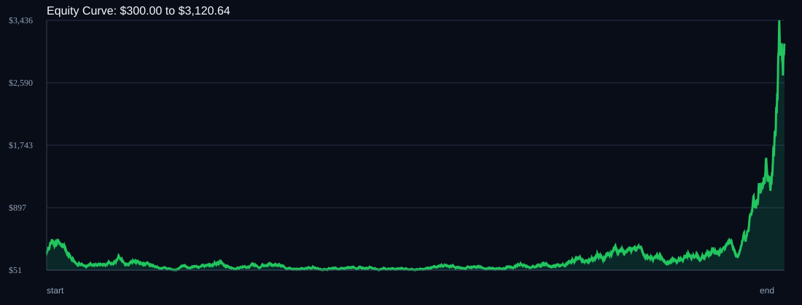

# RSI Divergence Backtest

- Run time: 2026-07-14T03:02:03
- Lookback days: 365
- Starting balance: $300.0
- Risk per trade idea: 4.0%
- Combined result: $300.0 -> $3120.64 (940.21%)
- Combined trades: 2940
- Combined win rate: 51.53%
- Combined max drawdown: 89.1%

## Per Symbol

| Symbol | Broker | TF | Mode | Trades | Win % | Return % | Final | DD % | PF | Avg R |
|---|---:|---:|---:|---:|---:|---:|---:|---:|---:|---:|
| XAGUSD | XAGUSDm | M1 | OFF | 575 | 51.48 | 120.56 | $661.67 | 68.18 | 1.15 | 0.056 |
| GBPCHF | GBPCHFm | M5 | OFF | 502 | 54.78 | 102.81 | $608.44 | 58.64 | 1.06 | 0.056 |
| AUDUSD | AUDUSDm | M1 | TREND | 891 | 49.83 | 41.68 | $425.03 | 81.34 | 1.04 | 0.033 |
| AUDCAD | AUDCADm | M1 | RSI_EXTREME | 310 | 50.97 | 33.55 | $400.66 | 62.17 | 1.07 | 0.046 |
| XAUUSD | XAUUSDm | M5 | EMA | 662 | 51.66 | 22.96 | $368.89 | 57.46 | 1.02 | 0.029 |