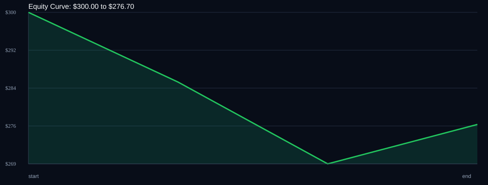

# RSI Divergence Backtest

- Run time: 2026-07-14T03:06:38
- Lookback days: 3
- Starting balance: $300.0
- Risk per trade idea: 4.0%
- Sizing mode: FIXED_LOT
- Combined result: $300.0 -> $276.7 (-7.77%)
- Combined trades: 3
- Combined win rate: 33.33%
- Combined max drawdown: 10.5%

## Per Symbol

| Symbol | Broker | TF | Mode | Trades | Win % | Return % | Final | DD % | PF | Avg R | Avg Lot | Avg Risk |
|---|---:|---:|---:|---:|---:|---:|---:|---:|---:|---:|---:|---:|
| XAUUSD | XAUUSDm | M5 | EMA | 3 | 33.33 | -7.77 | $276.7 | 10.5 | 0.26 | -0.544 | 0.01 | $17.94 |