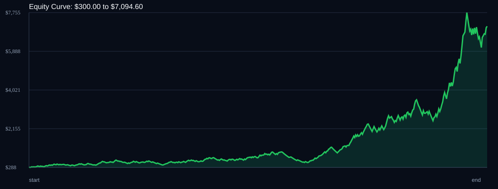

# RSI Divergence Backtest

- Run time: 2026-07-14T03:06:56
- Lookback days: 60
- Starting balance: $300.0
- Risk per trade idea: 4.0%
- Sizing mode: RISK_PERCENT
- Combined result: $300.0 -> $7094.6 (2264.87%)
- Combined trades: 474
- Combined win rate: 56.12%
- Combined max drawdown: 49.36%

## Per Symbol

| Symbol | Broker | TF | Mode | Trades | Win % | Return % | Final | DD % | PF | Avg R | Avg Lot | Avg Risk |
|---|---:|---:|---:|---:|---:|---:|---:|---:|---:|---:|---:|---:|
| AUDUSD | AUDUSDm | M1 | TREND | 146 | 55.48 | 135.29 | $705.88 | 28.0 | 1.4 | 0.173 | 0.498 | $15.94 |
| XAUUSD | XAUUSDm | M5 | EMA | 108 | 55.56 | 91.3 | $573.91 | 28.5 | 1.32 | 0.143 | 0.01 | $18.64 |
| XAGUSD | XAGUSDm | M1 | OFF | 85 | 55.29 | 90.74 | $572.23 | 32.43 | 1.38 | 0.266 | 0.011 | $20.5 |
| GBPCHF | GBPCHFm | M5 | OFF | 83 | 61.45 | 63.13 | $489.38 | 27.0 | 1.39 | 0.18 | 0.175 | $15.05 |
| AUDCAD | AUDCADm | M1 | RSI_EXTREME | 52 | 51.92 | 54.84 | $464.52 | 19.9 | 1.61 | 0.241 | 0.389 | $12.91 |