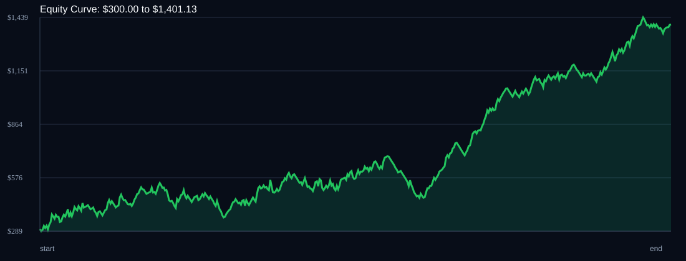

# RSI Divergence Backtest

- Run time: 2026-07-14T03:07:20
- Lookback days: 60
- Starting balance: $300.0
- Risk per trade idea: 4.0%
- Sizing mode: USD_RISK_CAP
- Combined result: $300.0 -> $1401.13 (367.04%)
- Combined trades: 474
- Combined win rate: 56.33%
- Combined max drawdown: 33.79%

## Per Symbol

| Symbol | Broker | TF | Mode | Trades | Win % | Return % | Final | DD % | PF | Avg R | Avg Lot | Avg Risk |
|---|---:|---:|---:|---:|---:|---:|---:|---:|---:|---:|---:|---:|
| AUDUSD | AUDUSDm | M1 | TREND | 146 | 55.48 | 95.11 | $585.34 | 23.75 | 1.4 | 0.173 | 0.338 | $11.3 |
| XAUUSD | XAUUSDm | M5 | EMA | 108 | 55.56 | 87.54 | $562.61 | 28.1 | 1.31 | 0.143 | 0.01 | $18.38 |
| XAGUSD | XAGUSDm | M1 | OFF | 85 | 55.29 | 82.17 | $546.5 | 34.57 | 1.35 | 0.266 | 0.01 | $19.95 |
| GBPCHF | GBPCHFm | M5 | OFF | 83 | 61.45 | 54.73 | $464.2 | 19.25 | 1.48 | 0.18 | 0.126 | $10.89 |
| AUDCAD | AUDCADm | M1 | RSI_EXTREME | 52 | 53.85 | 47.5 | $442.51 | 19.92 | 1.62 | 0.242 | 0.324 | $11.31 |