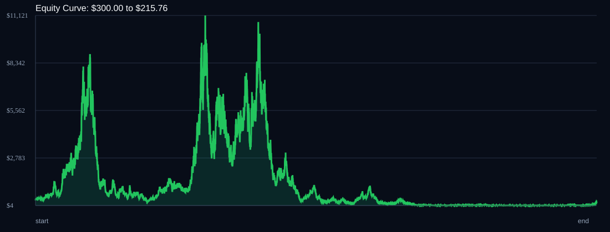

# RSI Divergence Backtest

- Run time: 2026-07-14T03:12:10
- Lookback days: 1825
- Starting balance: $300.0
- Risk per trade idea: 4.0%
- Sizing mode: RISK_PERCENT
- Combined result: $300.0 -> $215.76 (-28.08%)
- Combined trades: 14833
- Combined win rate: 50.55%
- Combined max drawdown: 99.97%

## Per Symbol

| Symbol | Broker | TF | Mode | Trades | Win % | Return % | Final | DD % | PF | Avg R | Avg Lot | Avg Risk |
|---|---:|---:|---:|---:|---:|---:|---:|---:|---:|---:|---:|---:|
| XAGUSD | XAGUSDm | M1 | OFF | 3107 | 51.05 | 1231.85 | $3995.56 | 86.45 | 1.05 | 0.043 | 0.19 | $50.82 |
| AUDCAD | AUDCADm | M1 | RSI_EXTREME | 1524 | 51.18 | 152.39 | $757.16 | 80.86 | 1.02 | 0.038 | 0.849 | $29.07 |
| AUDUSD | AUDUSDm | M1 | TREND | 4397 | 50.06 | 31.56 | $394.67 | 97.06 | 1.0 | 0.024 | 0.666 | $28.06 |
| GBPCHF | GBPCHFm | M5 | OFF | 2437 | 51.66 | -7.3 | $278.11 | 81.29 | 1.0 | 0.017 | 0.057 | $7.97 |
| XAUUSD | XAUUSDm | M5 | EMA | 3368 | 49.64 | -170.85 | $-212.56 | 253.64 | 0.96 | -0.006 | 0.015 | $9.16 |