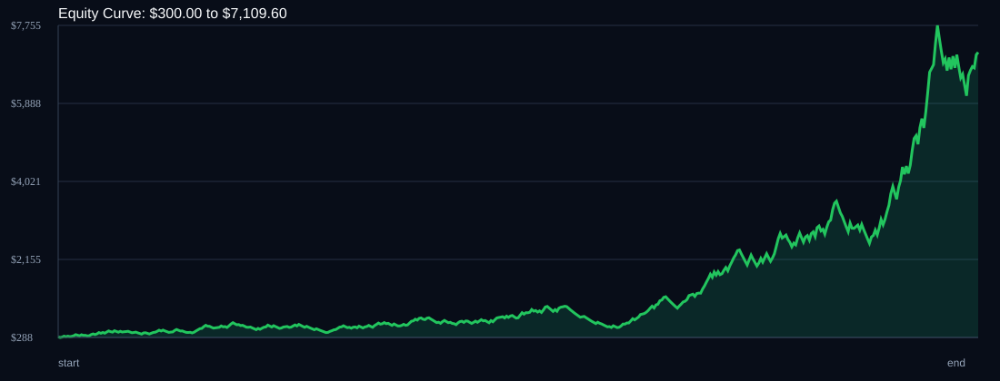

# RSI Divergence Backtest

- Run time: 2026-07-14T03:14:04
- Lookback days: 60
- Starting balance: $300.0
- Risk per trade idea: 4.0%
- Sizing mode: RISK_PERCENT
- Combined result: $300.0 -> $7109.6 (2269.87%)
- Combined trades: 474
- Combined win rate: 56.12%
- Combined max drawdown: 49.36%

## Per Symbol

| Symbol | Broker | TF | Mode | Trades | Win % | Return % | Final | DD % | PF | Avg R | Avg Lot | Avg Risk |
|---|---:|---:|---:|---:|---:|---:|---:|---:|---:|---:|---:|---:|
| AUDUSD | AUDUSDm | M1 | TREND | 146 | 55.48 | 137.68 | $713.03 | 28.42 | 1.4 | 0.173 | 0 | $0 |
| XAGUSD | XAGUSDm | M1 | OFF | 85 | 55.29 | 125.27 | $675.81 | 19.27 | 1.61 | 0.266 | 0 | $0 |
| XAUUSD | XAUUSDm | M5 | EMA | 108 | 55.56 | 68.82 | $506.45 | 26.3 | 1.31 | 0.144 | 0 | $0 |
| GBPCHF | GBPCHFm | M5 | OFF | 83 | 61.45 | 68.38 | $505.15 | 27.69 | 1.4 | 0.18 | 0 | $0 |
| AUDCAD | AUDCADm | M1 | RSI_EXTREME | 52 | 51.92 | 55.72 | $467.17 | 20.44 | 1.61 | 0.24 | 0 | $0 |