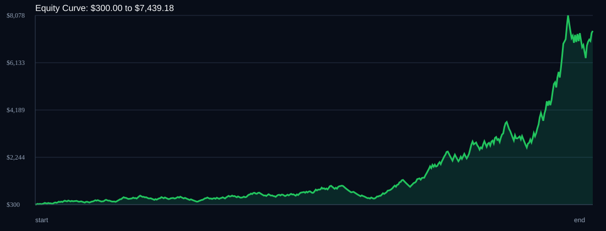

# RSI Divergence Backtest

- Run time: 2026-07-14T03:14:08
- Lookback days: 60
- Starting balance: $300.0
- Risk per trade idea: 4.0%
- Sizing mode: RISK_PERCENT
- Combined result: $300.0 -> $7439.18 (2379.73%)
- Combined trades: 473
- Combined win rate: 56.24%
- Combined max drawdown: 49.36%

## Per Symbol

| Symbol | Broker | TF | Mode | Trades | Win % | Return % | Final | DD % | PF | Avg R | Avg Lot | Avg Risk |
|---|---:|---:|---:|---:|---:|---:|---:|---:|---:|---:|---:|---:|
| AUDUSD | AUDUSDm | M1 | TREND | 146 | 55.48 | 135.29 | $705.88 | 28.0 | 1.4 | 0.173 | 0.498 | $15.94 |
| XAUUSD | XAUUSDm | M5 | EMA | 108 | 55.56 | 93.18 | $579.53 | 28.5 | 1.33 | 0.145 | 0.01 | $18.64 |
| XAGUSD | XAGUSDm | M1 | OFF | 85 | 55.29 | 90.74 | $572.23 | 32.43 | 1.38 | 0.266 | 0.011 | $20.5 |
| GBPCHF | GBPCHFm | M5 | OFF | 82 | 62.2 | 69.78 | $509.33 | 27.06 | 1.43 | 0.195 | 0.182 | $15.58 |
| AUDCAD | AUDCADm | M1 | RSI_EXTREME | 52 | 51.92 | 54.06 | $462.17 | 19.91 | 1.6 | 0.238 | 0.389 | $12.9 |