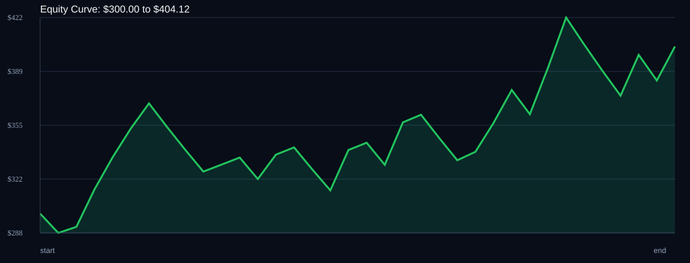

# RSI Divergence Backtest

- Run time: 2026-07-23T13:21:54
- Lookback days: 60
- Starting balance: $300.0
- Risk per trade idea: 4.0%
- Sizing mode: RISK_PERCENT
- Combined result: $300.0 -> $404.12 (34.71%)
- Combined trades: 35
- Combined win rate: 57.14%
- Combined max drawdown: 14.7%

## Per Symbol

| Symbol | Broker | TF | Mode | Trades | Win % | Return % | Final | DD % | PF | Avg R | Avg Lot | Avg Risk |
|---|---:|---:|---:|---:|---:|---:|---:|---:|---:|---:|---:|---:|
| EURJPY | EURJPY.. | M5 | EMA | 35 | 57.14 | 33.44 | $400.32 | 14.26 | 1.48 | 0.241 | 0.15 | $13.38 |