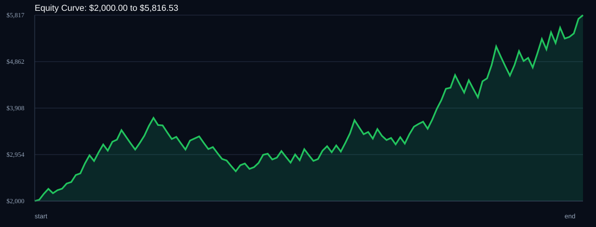

# RSI Divergence Backtest

- Run time: 2026-07-23T13:26:24
- Lookback days: 60
- Starting balance: $2000.0
- Risk per trade idea: 4.0%
- Sizing mode: RISK_PERCENT
- Combined result: $2000.0 -> $5816.53 (190.83%)
- Combined trades: 120
- Combined win rate: 60.0%
- Combined max drawdown: 29.57%

## Per Symbol

| Symbol | Broker | TF | Mode | Trades | Win % | Return % | Final | DD % | PF | Avg R | Avg Lot | Avg Risk |
|---|---:|---:|---:|---:|---:|---:|---:|---:|---:|---:|---:|---:|
| USDSGD | USDSGD.. | M5 | EMA | 85 | 61.18 | 115.04 | $4300.73 | 21.47 | 1.62 | 0.249 | 2.007 | $118.09 |
| EURJPY | EURJPY.. | M5 | EMA | 35 | 57.14 | 34.5 | $2689.98 | 14.63 | 1.48 | 0.241 | 1.03 | $92.3 |