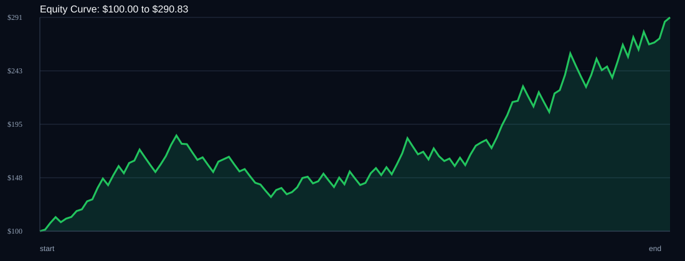

# RSI Divergence Backtest

- Run time: 2026-07-23T13:32:08
- Lookback days: 60
- Starting balance: $100.0
- Risk per trade idea: 4.0%
- Sizing mode: RISK_PERCENT
- Combined result: $100.0 -> $290.83 (190.83%)
- Combined trades: 120
- Combined win rate: 60.0%
- Combined max drawdown: 29.57%

## Per Symbol

| Symbol | Broker | TF | Mode | Trades | Win % | Return % | Final | DD % | PF | Avg R | Avg Lot | Avg Risk |
|---|---:|---:|---:|---:|---:|---:|---:|---:|---:|---:|---:|---:|
| USDSGD | USDSGD.. | M5 | EMA | 85 | 61.18 | 105.14 | $205.14 | 19.56 | 1.61 | 0.249 | 0.093 | $5.38 |
| EURJPY | EURJPY.. | M5 | EMA | 35 | 57.14 | 30.89 | $130.89 | 13.48 | 1.49 | 0.241 | 0.045 | $3.96 |