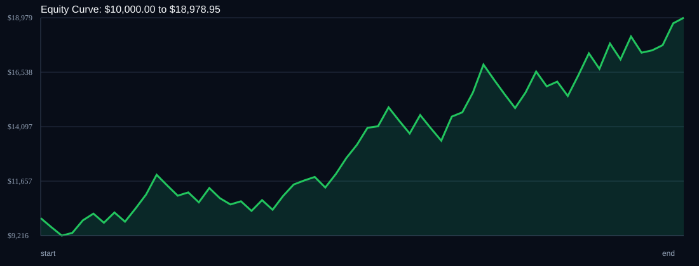

# RSI Divergence Backtest

- Run time: 2026-07-23T13:38:32
- Lookback days: 30
- Starting balance: $10000.0
- Risk per trade idea: 4.0%
- Sizing mode: RISK_PERCENT
- Combined result: $10000.0 -> $18978.95 (89.79%)
- Combined trades: 61
- Combined win rate: 60.66%
- Combined max drawdown: 13.55%

## Per Symbol

| Symbol | Broker | TF | Mode | Trades | Win % | Return % | Final | DD % | PF | Avg R | Avg Lot | Avg Risk |
|---|---:|---:|---:|---:|---:|---:|---:|---:|---:|---:|---:|---:|
| USDSGD | USDSGD.. | M5 | EMA | 43 | 62.79 | 59.45 | $15945.35 | 8.77 | 1.79 | 0.296 | 8.595 | $485.43 |
| EURJPY | EURJPY.. | M5 | EMA | 18 | 55.56 | 18.94 | $11894.12 | 11.51 | 1.53 | 0.273 | 4.853 | $431.79 |